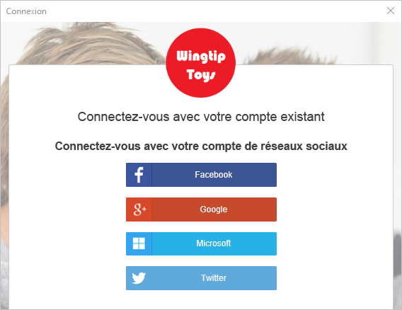
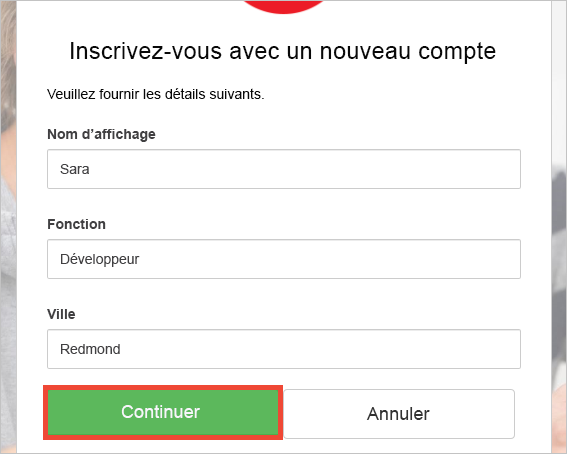

# <a name="quickstart-test-drive-an-azure-ad-b2c-enabled-desktop-app"></a>Démarrage rapide : Évaluer une application de bureau activée pour Azure AD B2C

Azure Active Directory (Azure AD) B2C assure la gestion des identités de cloud pour protéger votre application, votre entreprise et vos clients. Azure AD B2C permet à vos applications de s’authentifier auprès de comptes des réseaux sociaux et de comptes d’entreprise à l’aide de protocoles standard ouverts.

Dans ce démarrage rapide, vous utilisez un exemple d’application de bureau Windows Presentation Foundation (WPF) activée pour Azure AD B2C pour vous connecter à l’aide d’un fournisseur d’identité sociale et appeler une API web protégée par Azure AD B2C.

[!INCLUDE [quickstarts-free-trial-note](../../includes/quickstarts-free-trial-note.md)]

## <a name="prerequisites"></a>Prérequis

* [Visual Studio 2017](https://www.visualstudio.com/downloads/) avec la charge de travail **Développement ASP.NET et web**. 
* Un compte de réseau social Facebook, Google, Microsoft ou Twitter.

## <a name="download-the-sample"></a>Téléchargez l’exemple

[Téléchargez un fichier zip ](https://github.com/Azure-Samples/active-directory-b2c-dotnet-desktop/archive/master.zip) ou clonez l’exemple d’application web à partir de GitHub.

```
git clone https://github.com/Azure-Samples/active-directory-b2c-dotnet-desktop.git
```

## <a name="run-the-app-in-visual-studio"></a>Exécuter l’application dans Visual Studio

Dans l’exemple de dossier de projet de l’application, ouvrez la solution `active-directory-b2c-wpf.sln` dans Visual Studio.

Appuyez sur **F5** pour déboguer l’application.

## <a name="create-an-account"></a>Créer un compte

Cliquez sur **Se connecter** pour démarrer le flux de travail **Inscription ou connexion** basé sur une stratégie Azure AD B2C.


L’exemple prend en charge plusieurs options d’inscription, notamment l’utilisation d’un fournisseur d’identité sociale ou la création d’un compte local à l’aide d’une adresse e-mail. Pour ce démarrage rapide, utilisez un compte de fournisseur d’identité sociale provenant de Facebook, Google, Microsoft ou Twitter. 

### <a name="sign-up-using-a-social-identity-provider"></a>S’inscrire au moyen d’un fournisseur d’identité sociale

Azure AD B2C présente une page de connexion personnalisée d’une marque fictive appelée Wingtip Toys pour l’exemple d’application web. 

1. Pour vous inscrire au moyen d’un fournisseur d’identité sociale, cliquez sur le bouton en regard du fournisseur d’identité que vous souhaitez utiliser. 

    

    Vous vous authentifiez (vous connectez) avec les informations d’identification de votre compte de réseau social et autoriser l’application à lire les informations de votre compte de réseau social. En accordant l’accès, l’application peut extraire des informations de profil du compte de réseau social, telles que votre nom et votre ville. 

2. Terminez le processus de connexion pour le fournisseur d’identité. Par exemple, si vous choisissez Twitter, entrez vos informations d’identification Twitter et cliquez sur **Connexion**.

    

    Les détails du profil de votre nouveau compte sont préremplis avec les informations de votre compte de réseau social. 

3. Modifier les détails si vous le souhaitez, puis cliquez sur **Continuer**. Les valeurs que vous entrez sont utilisées pour le profil de votre compte d’utilisateur Azure AD B2C.

    

    Vous venez de créer un compte d’utilisateur Azure AD B2C qui utilise un fournisseur d’identité. Après la connexion, le jeton d’accès apparaît dans la zone de texte *Informations sur le jeton*. Le jeton d’accès est utilisé lors de l’accès à la ressource de l’API.

## <a name="edit-your-profile"></a>Modifier votre profil

Azure Active Directory B2C fournit des fonctionnalités permettant aux utilisateurs de mettre à jour leurs profils.  L’exemple d’application web utilise une stratégie de modification du profil Azure AD B2C pour le flux de travail. 

1. Cliquez sur **Modifier le profil** pour modifier le profil que vous avez créé.

    

2. Choisissez le fournisseur d’identité associé au compte que vous avez créé. Par exemple, si vous avez utilisé Twitter comme fournisseur d’identité lors de la création de votre compte, choisissez Twitter pour modifier les informations du profil associé.

3. Modifiez votre **Nom d’affichage** ou votre **Ville**, puis cliquez sur **Continuer**.

    Un nouveau jeton d’accès apparaît dans la zone de texte *Informations sur le jeton*. Si vous souhaitez vérifier les modifications apportées à votre profil, copiez et collez le jeton d’accès dans le décodeur de jeton https://jwt.ms.

## <a name="access-a-protected-web-api-resource"></a>Accéder à une ressource de l’API web protégée

Cliquez sur **Appeler l’API** pour envoyer une requête à la ressource protégée par Azure AD B2C https://fabrikamb2chello.azurewebsites.net/hello. 


L’application inclut le jeton d’accès Azure AD dans la requête envoyée à la ressource de l’API web protégée. L’API web renvoie le nom d’affichage contenu dans le jeton d’accès.

Vous avez utilisé votre compte d’utilisateur Azure AD B2C pour effectuer un appel autorisé à une API web protégée par Azure AD B2C.

## <a name="clean-up-resources"></a>Supprimer des ressources

Vous pouvez utiliser votre locataire Azure AD B2C si vous envisagez d’effectuer d’autres didacticiels ou démarrages rapides Azure AD B2C. Si vous n’en avez plus besoin, vous pouvez [supprimer votre client Azure AD B2C](active-directory-b2c-faqs.md#how-do-i-delete-my-azure-ad-b2c-tenant).

## <a name="next-steps"></a>étapes suivantes

L’étape suivante consiste à créer votre propre locataire Azure AD B2C et à configurer l’exemple pour qu’il s’exécute avec votre locataire. 

> [!div class="nextstepaction"]
> [Créer un locataire Azure Active Directory B2C dans le portail Azure](active-directory-b2c-get-started.md)
