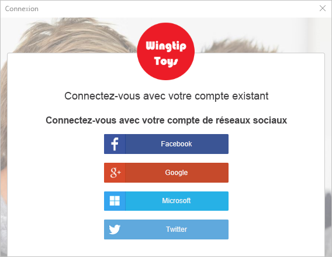
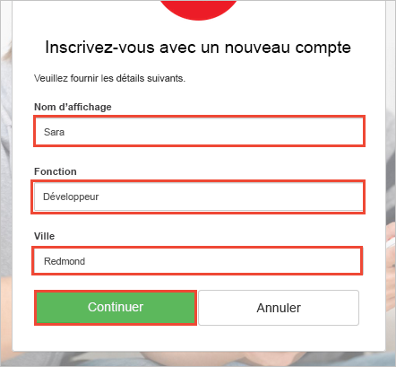
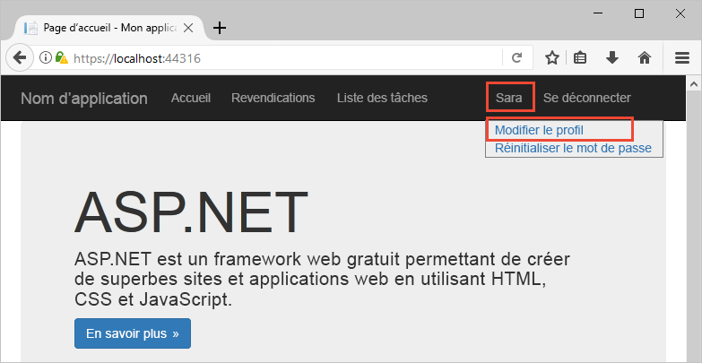

# <a name="quickstart-test-drive-an-azure-ad-b2c-enabled-web-app"></a>Démarrage rapide : Évaluer une application web activée pour Azure AD B2C

Azure Active Directory (Azure AD) B2C assure la gestion des identités de cloud pour protéger votre application, votre entreprise et vos clients. Azure AD B2C permet à vos applications de s’authentifier auprès de comptes des réseaux sociaux et de comptes d’entreprise à l’aide de protocoles standard ouverts.

Dans ce démarrage rapide, vous utilisez un exemple d’application ASP.NET activée pour Azure AD B2C pour vous connecter à l’aide d’un fournisseur d’identité sociale et appeler une API web protégée par Azure AD B2C.

[!INCLUDE [quickstarts-free-trial-note](../../includes/quickstarts-free-trial-note.md)]

## <a name="prerequisites"></a>Prérequis

* [Visual Studio 2017](https://www.visualstudio.com/downloads/) avec la charge de travail **Développement ASP.NET et web**. 
* Un compte de réseau social Facebook, Google, Microsoft ou Twitter.

## <a name="download-the-sample"></a>Téléchargez l’exemple

[Téléchargez un fichier zip ](https://github.com/Azure-Samples/active-directory-b2c-dotnet-webapp-and-webapi/archive/master.zip) ou clonez l’exemple d’application web à partir de GitHub.

```
git clone https://github.com/Azure-Samples/active-directory-b2c-dotnet-webapp-and-webapi.git
```

## <a name="run-the-app-in-visual-studio"></a>Exécuter l’application dans Visual Studio

Dans l’exemple de dossier de projet de l’application, ouvrez la solution `B2C-WebAPI-DotNet.sln` dans Visual Studio.

L’exemple de solution contient deux projets :

**Exemple d’application web (TaskWebApp) :** application web permettant de créer et de modifier une liste des tâches. L’application web utilise la stratégie **Inscription ou connexion** pour inscrire ou connecter des utilisateurs.

**Exemple d’application d’API web (TaskService) :** API web qui prend en charge les fonctionnalités de la liste des tâches de création, de lecture, de mise à jour et de suppression. L’API web est protégée par Azure AD B2C et appelée par l’application web.

Pour ce guide de démarrage rapide, vous exécutez les projets `TaskWebApp` et `TaskService` simultanément. 

1. Sélectionnez la solution `B2C-WebAPI-DotNet` dans l’Explorateur de solutions.
2. Dans le menu Visual Studio, sélectionnez **Projet > Définir les projets de démarrage...**. 
3. Sélectionnez la case d’option **Plusieurs projets de démarrage**.
4. Pour les deux projets, définissez le paramètre **Action** sur **Démarrer**. Cliquez sur **OK**.

Appuyez sur la touche **F5** pour déboguer les deux applications. Chaque application s’ouvre dans son propre onglet de navigateur :

`https://localhost:44316/` : cette page correspond à l’application web ASP.NET. Dans ce démarrage rapide, vous allez interagir directement avec cette application.
`https://localhost:44332/` : cette page correspond à l’API web appelée par l’application web ASP.NET.

## <a name="create-an-account"></a>Créer un compte

Cliquez sur le lien **S’inscrire/Se connecter** dans l’application web ASP.NET pour démarrer le flux de travail **Inscription ou connexion** basé sur une stratégie Azure AD B2C.


L’exemple prend en charge plusieurs options d’inscription, notamment l’utilisation d’un fournisseur d’identité sociale ou la création d’un compte local à l’aide d’une adresse e-mail. Pour ce démarrage rapide, utilisez un compte de fournisseur d’identité sociale provenant de Facebook, Google, Microsoft ou Twitter. 

### <a name="sign-up-using-a-social-identity-provider"></a>S’inscrire au moyen d’un fournisseur d’identité sociale

Azure AD B2C présente une page de connexion personnalisée d’une marque fictive appelée Wingtip Toys pour l’exemple d’application web. 

1. Pour vous inscrire au moyen d’un fournisseur d’identité sociale, cliquez sur le bouton en regard du fournisseur d’identité que vous souhaitez utiliser.

    

    Vous vous authentifiez (vous connectez) avec les informations d’identification de votre compte de réseau social et autoriser l’application à lire les informations de votre compte de réseau social. En accordant l’accès, l’application peut extraire des informations de profil du compte de réseau social, telles que votre nom et votre ville. 

2. Terminez le processus de connexion pour le fournisseur d’identité. Par exemple, si vous choisissez Twitter, entrez vos informations d’identification Twitter et cliquez sur **Connexion**.

    

    Les détails du profil de votre nouveau compte Azure AD B2C sont préremplis avec les informations de votre compte de réseau social.

3. Mettez à jour les champs Nom d’affichage, Poste et Ville, puis cliquez sur **Continuer**.  Les valeurs que vous entrez sont utilisées pour le profil de votre compte d’utilisateur Azure AD B2C.

    

    Vous avez utilisé avec succès l’exemple d’application web qui applique une stratégie Azure AD B2C pour s’authentifier à l’aide d’un fournisseur d’identité et créer un compte d’utilisateur Azure AD B2C. 

## <a name="edit-your-profile"></a>Modifier votre profil

Azure Active Directory B2C fournit des fonctionnalités permettant aux utilisateurs de mettre à jour leurs profils. L’exemple d’application web utilise une stratégie de modification du profil Azure AD B2C pour le flux de travail. 

1. Dans la barre de menus de l’application web, cliquez sur le nom de votre profil et sélectionnez **Modifier le profil** pour modifier le profil que vous avez créé.

    

2. Modifiez votre **Nom d’affichage** et votre **Ville**.  
3. Cliquez sur **Continuer** pour mettre à jour votre profil. Le nouveau nom d’affichage s’affiche dans la partie supérieure droite de la page d’accueil de l’application web.

## <a name="access-a-protected-web-api-resource"></a>Accéder à une ressource de l’API web protégée

1. Cliquez sur **Liste de tâches** pour entrer et modifier des éléments de votre liste des tâches. 

2. Entrez du texte dans la zone de texte **Nouvel élément**. Cliquez sur **Ajouter** pour appeler l’API web protégée par Azure AD B2C qui ajoute un élément de liste des tâches.

    

    L’application web ASP.NET inclut un jeton d’accès Azure AD dans la requête envoyée à la ressource de l’API web protégée pour effectuer des opérations sur les éléments de la liste des tâches de l’utilisateur.

Vous avez utilisé votre compte d’utilisateur Azure AD B2C pour effectuer un appel autorisé à une API web protégée par Azure AD B2C.

## <a name="clean-up-resources"></a>Supprimer des ressources

Vous pouvez utiliser votre locataire Azure AD B2C si vous envisagez d’effectuer d’autres didacticiels ou démarrages rapides Azure AD B2C. Si vous n’en avez plus besoin, vous pouvez [supprimer votre client Azure AD B2C](active-directory-b2c-faqs.md#how-do-i-delete-my-azure-ad-b2c-tenant).

## <a name="next-steps"></a>Étapes suivantes

Dans ce démarrage rapide, vous avez utilisé un exemple d’application ASP.NET activée pour Azure AD B2C pour vous connecter avec une page de connexion personnalisée, vous connecter avec un fournisseur d’identité sociale, créer un compte Azure AD B2C et appeler une API web protégée par Azure AD B2C. 

Passez au didacticiel pour découvrir comment configurer l’exemple d’application ASP.NET pour utiliser votre propre locataire Azure AD B2C.

> [!div class="nextstepaction"]
> [Didacticiel : Authentifier les utilisateurs avec Azure Active Directory B2C dans une application web ASP.NET](active-directory-b2c-tutorials-web-app.md)