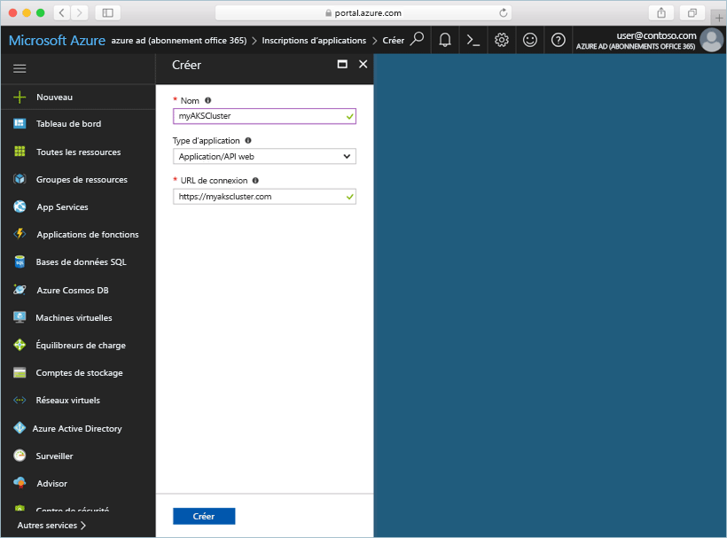
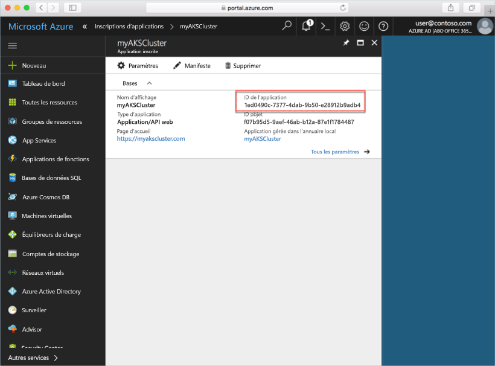
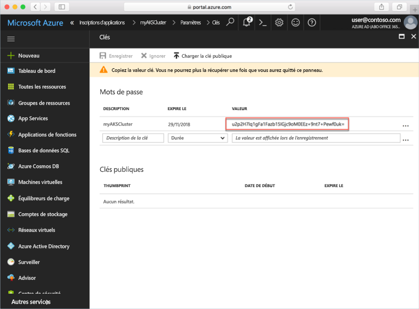

---
title: "Guide de démarrage rapide - Création de cluster Kubernetes dans le portail Azure"
description: "Découvrez rapidement comment créer un cluster Kubernetes pour des conteneurs Linux dans ACS avec le portail Azure."
services: container-service
author: neilpeterson
manager: timlt
ms.service: container-service
ms.topic: quickstart
ms.date: 02/24/2018
ms.author: nepeters
ms.custom: mvc
ms.openlocfilehash: 35886217328d35229a59b9713f5bb4bf0244569a
ms.sourcegitcommit: 088a8788d69a63a8e1333ad272d4a299cb19316e
ms.translationtype: HT
ms.contentlocale: fr-FR
ms.lasthandoff: 02/27/2018
---
# <a name="deploy-an-azure-container-service-aks-cluster"></a>Déployer un cluster Azure Container Service (AKS)

Dans ce guide de démarrage rapide, vous allez déployer un cluster AKS à l’aide du portail Azure. Une application de plusieurs conteneurs composée d’un serveur web frontal et d’une instance Redis est alors exécutée sur le cluster. Ceci fait, l’application est accessible via internet.


Ce guide de démarrage rapide suppose une compréhension élémentaire des concepts liés à Kubernetes. Pour plus d’informations sur Kubernetes, consultez la [documentation de Kubernetes][kubernetes-documentation].

## <a name="sign-in-to-azure"></a>Connexion à Azure

Connectez-vous au portail Azure à l’adresse http://portal.azure.com.

## <a name="create-service-principal"></a>Créer un principal du service

Avant de créer le cluster AKS dans le portail Azure, vous devez créer un principal du service. Azure utilise ce principal du service pour gérer l’infrastructure associée au cluster AKS.

Sélectionnez **Azure Active Directory** > **Inscriptions des applications** > **Nouvelle inscription d’application**.

Entrez un nom pour l’application (n’importe quelle valeur). Pour le type d’application, sélectionnez **Application web/API**. Entrez une valeur pour **URL de connexion**. Il peut s’agir de n’importe quelle valeur dans un format URL valide, mais elle ne doit pas obligatoirement être un point de terminaison réel.

Lorsque vous avez terminé, sélectionnez **Créer**.



Sélectionnez l’inscription d’application nouvellement créée et notez l’ID d’application. Cette valeur est nécessaire lors de la création du cluster AKS.



Ensuite, vous devez créer un mot de passe pour le principal du service. Sélectionnez **Tous les paramètres** > **Clés**, puis entrez une valeur pour la description de la clé. Sélectionnez une durée, qui correspond à la durée pendant laquelle le principal du service est valide.

Cliquez sur **Enregistrer** et notez la valeur du mot de passe. Le mot de passe est nécessaire lors de la création d’un cluster AKS.



## <a name="create-aks-cluster"></a>Créer un cluster ACS

Sélectionnez **Créer une ressource** > **Conteneurs** > **Azure Container Service - AKS (préversion)**.

Spécifiez un nom de cluster, un préfixe DNS, un nom de groupe de ressources, un emplacement et la version de Kubernetes pour le cluster. Prenez note du nom du cluster et du nom du groupe ressources. Vous en aurez besoin lors de la connexion au cluster.

Sélectionnez **OK** quand vous avez terminé.


Dans le formulaire de configuration, entrez ce qui suit :

- Nom d’utilisateur - nom donné aux comptes d’administration sur les nœuds de cluster.
- Clé publique SSH : associée à la clé qui servira à accéder aux nœuds de cluster.
- ID client du principal du service : ID d’application du principal du service que vous avez créé précédemment dans ce document.
- Clé secrète client du principal du service : mot de passe du principal du service que vous avez créé précédemment dans ce document.
- Nombre de nœuds : nombre de nœuds AKS à créer.
- Taille de machine virtuelle de nœud : taille de machine virtuelle pour les nœuds AKS
- Taille du disque du système d’exploitation : taille du disque du système d’exploitation des nœuds AKS.

Sélectionnez **OK** quand vous avez terminé, puis à nouveau **OK** une fois la validation terminée.


Après un court délai, le cluster AKS est déployé et prêt à être utilisé.

## <a name="connect-to-the-cluster"></a>Connexion au cluster

Pour gérer un cluster Kubernetes, utilisez [kubectl][kubectl], le client de ligne de commande Kubernetes. Le client kubectl est préinstallé dans Azure Cloud Shell.

Ouvrez Cloud Shell à l’aide du bouton situé dans le coin supérieur droit du portail Azure.


Exécutez la commande [az aks get-credentials][az-aks-get-credentials] pour configurer kubectl afin qu’il se connecte à votre cluster Kubernetes.

Copiez et collez la commande suivante dans Cloud Shell. Modifiez le nom du cluster et du groupe de ressources si nécessaire.

```azurecli-interactive
az aks get-credentials --resource-group myAKSCluster --name myAKSCluster
```

Pour vérifier la connexion à votre cluster, utilisez la commande [kubectl get][kubectl-get] pour retourner une liste des nœuds du cluster.

```azurecli-interactive
kubectl get nodes
```

Output:

```
NAME                       STATUS    ROLES     AGE       VERSION
aks-agentpool-14693408-0   Ready     agent     6m        v1.8.1
aks-agentpool-14693408-1   Ready     agent     6m        v1.8.1
aks-agentpool-14693408-2   Ready     agent     7m        v1.8.1
```

## <a name="run-the-application"></a>Exécution de l'application

Un fichier manifeste Kubernetes définit un état souhaité pour le cluster, notamment les images conteneur à exécuter. Dans cet exemple, vous utilisez un manifeste afin de créer tous les objets nécessaires pour exécuter l’application Azure Vote.

Créez un fichier nommé `azure-vote.yaml` et copiez-y le code YAML suivant. Si vous travaillez dans Azure Cloud Shell, vous pouvez créer ce fichier à l’aide de vi ou de Nano, comme si vous travailliez sur un système virtuel ou physique.

```yaml
apiVersion: apps/v1beta1
kind: Deployment
metadata:
  name: azure-vote-back
spec:
  replicas: 1
  template:
    metadata:
      labels:
        app: azure-vote-back
    spec:
      containers:
      - name: azure-vote-back
        image: redis
        ports:
        - containerPort: 6379
          name: redis
---
apiVersion: v1
kind: Service
metadata:
  name: azure-vote-back
spec:
  ports:
  - port: 6379
  selector:
    app: azure-vote-back
---
apiVersion: apps/v1beta1
kind: Deployment
metadata:
  name: azure-vote-front
spec:
  replicas: 1
  template:
    metadata:
      labels:
        app: azure-vote-front
    spec:
      containers:
      - name: azure-vote-front
        image: microsoft/azure-vote-front:v1
        ports:
        - containerPort: 80
        env:
        - name: REDIS
          value: "azure-vote-back"
---
apiVersion: v1
kind: Service
metadata:
  name: azure-vote-front
spec:
  type: LoadBalancer
  ports:
  - port: 80
  selector:
    app: azure-vote-front
```

Utilisez la commande [kubectl create][kubectl-create] pour exécuter l’application.

```azurecli-interactive
kubectl create -f azure-vote.yaml
```

Output:

```
deployment "azure-vote-back" created
service "azure-vote-back" created
deployment "azure-vote-front" created
service "azure-vote-front" created
```

## <a name="test-the-application"></a>Test de l'application

Lorsque l’application est exécutée, un [service Kubernetes][kubernetes-service] est créé, qui expose le serveur frontal de l’application à Internet. L’exécution de ce processus peut prendre plusieurs minutes.

Pour surveiller la progression, utilisez la commande [kubectl get service][kubectl-get] avec l’argument `--watch`.

```azurecli-interactive
kubectl get service azure-vote-front --watch
```

Au début, *EXTERNAL-IP* apparaît comme étant *en attente* pour le service *azure-vote-front*.

```
NAME               TYPE           CLUSTER-IP   EXTERNAL-IP   PORT(S)        AGE
azure-vote-front   LoadBalancer   10.0.37.27   <pending>     80:30572/TCP   6s
```

Une fois que l’adresse *EXTERNAL-IP* est passée du statut *En attente* à *Adresse IP*, utilisez `CTRL-C` pour arrêter le processus de surveillance kubectl.

```
azure-vote-front   LoadBalancer   10.0.37.27   52.179.23.131   80:30572/TCP   2m
```

Vous pouvez désormais accéder à l’adresse IP externe pour voir l’application Azure Vote.


## <a name="delete-cluster"></a>Supprimer un cluster

Quand le cluster n’est plus nécessaire, vous pouvez supprimer le groupe de ressources de cluster, ce qui supprime toutes les ressources associées. Vous pouvez effectuer cette opération dans le portail Azure en sélectionnant le groupe de ressources et en cliquant sur le bouton Supprimer. Vous pouvez aussi exécuter la commande [az group delete][az-group-delete] dans Cloud Shell.

```azurecli-interactive
az group delete --name myAKSCluster --no-wait
```

## <a name="get-the-code"></a>Obtenir le code

Dans ce guide de démarrage rapide, les images de conteneur, créées au préalable, ont été utilisées pour créer un déploiement Kubernetes. Le code de l’application associé, Dockerfile, et le fichier manifeste Kubernetes sont disponibles sur GitHub.

[https://github.com/Azure-Samples/azure-voting-app-redis][azure-vote-app]

## <a name="next-steps"></a>Étapes suivantes

Dans ce guide de démarrage rapide, vous avez déployé un cluster Kubernetes et vous y avez déployé une application de plusieurs conteneurs.

Pour en savoir plus sur ACS et parcourir le code complet de l’exemple de déploiement, passez au didacticiel sur le cluster Kubernetes.

> [!div class="nextstepaction"]
> [Didacticiel ACS][aks-tutorial]

<!-- LINKS - external -->
[azure-vote-app]: https://github.com/Azure-Samples/azure-voting-app-redis.git
[kubectl]: https://kubernetes.io/docs/user-guide/kubectl/
[kubectl-create]: https://kubernetes.io/docs/reference/generated/kubectl/kubectl-commands#create
[kubectl-get]: https://kubernetes.io/docs/reference/generated/kubectl/kubectl-commands#get
[kubernetes-documentation]: https://kubernetes.io/docs/home/
[kubernetes-service]: https://kubernetes.io/docs/concepts/services-networking/service/

<!-- LINKS - internal -->
[az-aks-get-credentials]: /cli/azure/aks?view=azure-cli-latest#az_aks_get_credentials
[az-group-delete]: /cli/azure/group#delete
[aks-tutorial]: ./tutorial-kubernetes-prepare-app.md


