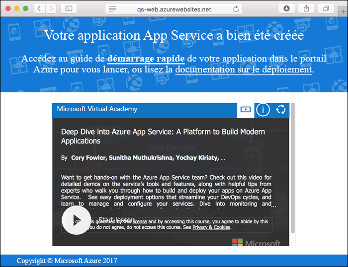
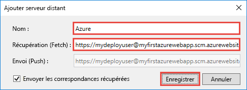
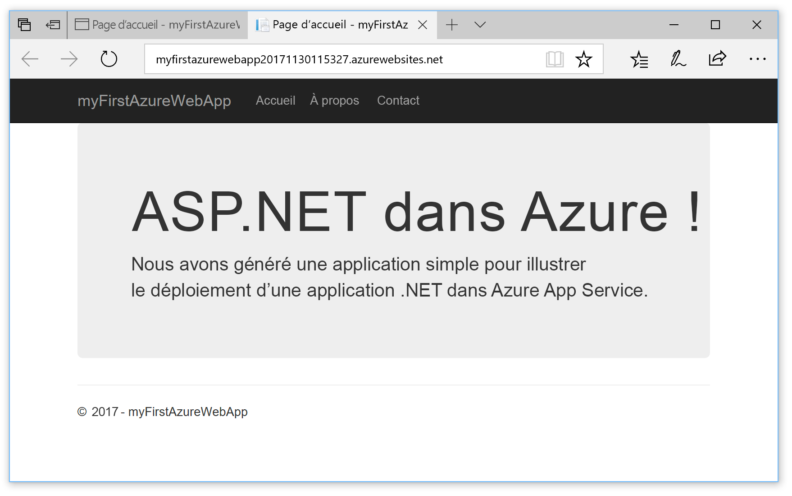

# <a name="create-an-aspnet-core-web-app-in-azure"></a>Créer une application web ASP.NET Core dans Azure

> [!NOTE]
> Cet article explique comment déployer une application sur App Service sous Windows. Pour déployer une application App Service sur _Linux_, consultez [Créer et déployer une application web .NET Core sur App Service sur Linux](./containers/quickstart-dotnetcore.md).
>
> Si vous recherchez des étapes pour une application ASP.NET Framework, consultez [Créer une application web ASP.NET Framework dans Azure](app-service-web-get-started-dotnet-framework.md). 
>

[Azure Web Apps](app-service-web-overview.md) offre un service d’hébergement web hautement évolutif appliquant des mises à jour correctives automatiques.  Ce guide de démarrage rapide montre comment déployer votre première application web ASP.NET Core sur Azure Web Apps. Lorsque vous aurez terminé, vous disposerez d’un groupe de ressources constitué d’un plan App Service et d’une application web Azure avec une application web déployée.

[!INCLUDE [quickstarts-free-trial-note](../../includes/quickstarts-free-trial-note.md)]

## <a name="prerequisites"></a>Prérequis

Pour suivre ce didacticiel :

* Installez <a href="https://www.visualstudio.com/downloads/" target="_blank">Visual Studio 2017</a> avec les charges de travail suivantes :
    - **Développement web et ASP.NET**
    - **Développement Azure**

    

## <a name="create-an-aspnet-core-web-app"></a>Créez une application web ASP.NET Core

Dans Visual Studio, créez un projet en sélectionnant **Fichier > Nouveau > Projet**. 

Dans la boîte de dialogue **Nouveau projet**, sélectionnez **Visual C# > Web > Application web ASP.NET Core**.

Nommez l’application _myFirstAzureWebApp_, puis sélectionnez **Créer un nouveau référentiel Git**, et sélectionnez **OK**.
   


Vous pouvez déployer n’importe quel type d’application web ASP.NET Core dans Azure. Pour ce guide de démarrage rapide, sélectionnez le modèle **Application Web** et vérifiez que l’authentification est définie sur **Aucune authentification**.
      
Sélectionnez **OK**.


Une fois le projet ASP.NET Core créé, la page d’accueil ASP.NET Core s’affiche et fournit de nombreux liens vers des ressources pour vous aider à commencer. 


Dans le menu, sélectionnez **Déboguer > Exécuter sans débogage** pour exécuter l’application web localement.


[!INCLUDE [cloud-shell-try-it.md](../../includes/cloud-shell-try-it.md)]

[!INCLUDE [Configure deployment user](../../includes/configure-deployment-user.md)] 

[!INCLUDE [Create resource group](../../includes/app-service-web-create-resource-group.md)] 

[!INCLUDE [Create app service plan](../../includes/app-service-web-create-app-service-plan.md)] 

[!INCLUDE [Create web app](../../includes/app-service-web-create-web-app.md)] 



## <a name="push-to-azure-from-visual-studio"></a>Envoyer vers Azure à partir de Visual Studio

De retour dans Visual Studio, à partir du menu **Vue**, cliquez sur **Team Explorer**. **Team Explorer** s’affiche.

Dans la vue **Accueil**, cliquez sur **Paramètres** > **Paramètres du référentiel**.


Dans la section **Distants** des **Paramètres du référentiel**, sélectionnez **Ajouter**. La boîte de dialogue **Ajouter un élément distant** s’affiche.

Configurez le champ **Nom** sur _Azure_, puis insérez l’URL enregistrée lors de la procédure [Créer une application web](#create-a-web-app) dans le champ **Récupération (fetch)**. Cliquez sur **Enregistrer**.



Ce paramètre équivaut à la commande Git `git remote add Azure <URL>`.

Cliquez sur le bouton **Accueil** en haut.

Sélectionnez **Paramètres** > **Paramètres globaux**. Vérifiez que le nom et l’adresse e-mail sont définis. Sélectionnez **Mettre à jour** si nécessaire.

Visual Studio a déjà validé tous les fichiers dans le référentiel Git lors de la création du projet. Vous devez maintenant envoyer les fichiers vers Azure.

Cliquez sur le bouton **Accueil** en haut. Sélectionnez **Synchronisation** > **Actions** > **Ouvrir l’invite de commandes**. 

Entrez la commande suivante dans la fenêtre de commande et entrez le mot de passe de déploiement lorsqu’il vous est demandé :

```
git push Azure master
```

L’exécution de cette commande peut prendre quelques minutes. Pendant son exécution, des informations semblables à ce qui suit s’affichent :

```
Counting objects: 4, done.
Delta compression using up to 8 threads.
Compressing objects: 100% (4/4), done.
Writing objects: 100% (4/4), 349 bytes | 349.00 KiB/s, done.
Total 4 (delta 3), reused 0 (delta 0)
remote: Updating branch 'master'.
remote: Updating submodules.
remote: Preparing deployment for commit id '9e20345e9c'.
remote: Generating deployment script.
remote: Project file path: .\myFirstAzureWebApp\myFirstAzureWebApp.csproj
remote: Solution file path: .\myFirstAzureWebApp.sln
remote: Generated deployment script files
remote: Running deployment command...
remote: Handling ASP.NET Core Web Application deployment.
remote:   Restoring packages for D:\home\site\repository\myFirstAzureWebApp\myFirstAzureWebApp.csproj...
remote:   Restoring packages for D:\home\site\repository\myFirstAzureWebApp\myFirstAzureWebApp.csproj...
...
remote: Finished successfully.
remote: Running post deployment command(s)...
remote: Deployment successful.
To https://<app_name>.scm.azurewebsites.net/<app_name>.git
 * [new branch]      master -> master
```

## <a name="browse-to-the-app"></a>Accéder à l’application

Dans un navigateur, accédez à l’URL de l’application web Azure : `http://<app_name>.azurewebsites.net`.

La page s’exécute comme une application web Azure App Service.


Félicitations, votre application web ASP.NET Core s’exécute en temps réel dans Azure App Service.

## <a name="update-the-app-and-redeploy"></a>Mise à jour de l’application et redéploiement

Dans **l’Explorateur de solutions**, ouvrez _Pages/Index.cshtml_.

Recherchez la balise HTML `<div id="myCarousel" class="carousel slide" data-ride="carousel" data-interval="6000">` vers le début, puis remplacez la totalité de l’élément par le code suivant :

```HTML
<div class="jumbotron">
    <h1>ASP.NET in Azure!</h1>
    <p class="lead">This is a simple app that we’ve built that demonstrates how to deploy a .NET app to Azure App Service.</p>
</div>
```

À partir de l’**Explorateur de solutions**, faites un clic droit sur _Pages/Index.cshtml_ et cliquez sur **Valider**. Entrez un message de validation pour vos modifications et cliquez sur **Valider tout**.

De retour dans la fenêtre d’invite de commandes, envoyez les modifications de code à Azure.

```bash
git push Azure master
```

Une fois le déploiement terminé, accédez de nouveau à `http://<app_name>.azurewebsites.net`.



## <a name="manage-the-azure-web-app"></a>Gérer l’application web Azure

Accédez au <a href="https://portal.azure.com" target="_blank">Portail Azure</a> pour gérer l’application web.

Dans le menu de gauche, sélectionnez **App Services**, puis sélectionnez le nom de votre application web Azure.


Vous voyez apparaître la page Vue d’ensemble de votre application web. Ici, vous pouvez également des tâches de gestion de base (parcourir, arrêter, démarrer, redémarrer et supprimer des éléments, par exemple). 


Le menu de gauche fournit différentes pages vous permettant de configurer votre application. 

[!INCLUDE [Clean-up section](../../includes/clean-up-section-portal.md)]

## <a name="next-steps"></a>étapes suivantes

> [!div class="nextstepaction"]
> [Build a .NET Core and SQL Database web app in Azure App Service](app-service-web-tutorial-dotnetcore-sqldb.md) (Créer une application web .NET Core et SQL Database dans Azure App Service)
