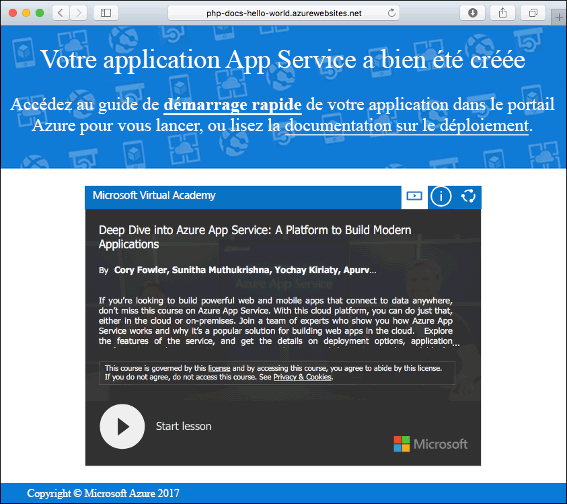
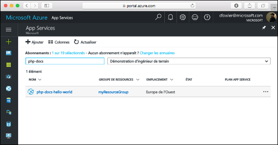
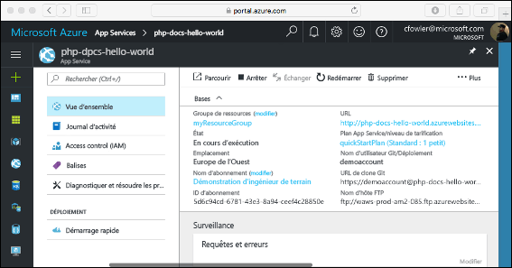

# <a name="create-a-php-web-app-in-azure"></a>Créer une application web PHP dans Azure

> [!NOTE]
> Cet article explique comment déployer une application sur App Service sous Windows. Pour déployer une application App Service sur _Linux_, consultez [Créer et déployer une application web PHP sur App Service sur Linux](./containers/quickstart-php.md).
>

[Azure Web Apps](app-service-web-overview.md) offre un service d’hébergement web hautement évolutif appliquant des mises à jour correctives automatiques.  Ce guide de démarrage rapide vous indique comment déployer une application PHP dans Azure Web Apps. Vous créez l’application web dans Cloud Shell grâce à l’interface [Azure CLI](https://docs.microsoft.com/cli/azure/get-started-with-azure-cli), et vous utilisez un [fichier ZIP](app-service-deploy-zip.md) pour déployer l’exemple de code PHP dans l’application web.

![Exemple d’application s’exécutant dans Azure]](media/app-service-web-get-started-php/hello-world-in-browser.png)

Vous pouvez suivre ces étapes en utilisant un ordinateur Mac, Windows ou Linux. Une fois les composants requis installés, l’exécution de cette procédure prend environ cinq minutes.

[!INCLUDE [quickstarts-free-trial-note](../../includes/quickstarts-free-trial-note.md)]

## <a name="prerequisites"></a>Prérequis

Pour effectuer ce démarrage rapide :

* <a href="https://php.net" target="_blank">Installez PHP</a>

## <a name="download-the-sample-locally"></a>Téléchargez l’exemple localement

Téléchargez l’exemple de projet PHP à partir de [https://github.com/Azure-Samples/php-docs-hello-world/archive/master.zip](https://github.com/Azure-Samples/php-docs-hello-world/archive/master.zip) et procédez à l’extraction de l’archive ZIP.

Dans une fenêtre de terminal, accédez au répertoire racine de l’exemple de projet PHP (celui qui contient _index.php_).

## <a name="run-the-app-locally"></a>Exécutez l’application localement.

Exécutez l’application localement en ouvrant une fenêtre de terminal et en utilisant la commande `php` pour lancer le serveur web PHP intégré.

```bash
php -S localhost:8080
```

Ouvrez un navigateur web et accédez à l’application exemple à l’adresse `http://localhost:8080`.

Vous voyez apparaître sur la page le message **Hello World !** de l’exemple d’application.


Dans la fenêtre de terminal, appuyez sur **Ctrl + C** pour quitter le serveur web.

[!INCLUDE [Create ZIP file](../../includes/app-service-web-create-zip.md)]

[!INCLUDE [cloud-shell-try-it.md](../../includes/cloud-shell-try-it.md)]

[!INCLUDE [Create resource group](../../includes/app-service-web-create-resource-group.md)]

[!INCLUDE [Create app service plan](../../includes/app-service-web-create-app-service-plan.md)]

## <a name="create-a-web-app"></a>Créer une application web

Dans Cloud Shell, créez une application web dans le plan App Service `myAppServicePlan` avec la commande [`az webapp create`](/cli/azure/webapp?view=azure-cli-latest#az_webapp_create). 

Dans l’exemple suivant, remplacez `<app_name>` par un nom d’application unique (les caractères autorisés sont `a-z`, `0-9` et `-`). Le runtime est défini sur `PHP|7.0`. Pour voir tous les runtimes, exécutez [`az webapp list-runtimes`](/cli/azure/webapp?view=azure-cli-latest#az_webapp_list_runtimes). 

```azurecli-interactive
az webapp create --resource-group myResourceGroup --plan myAppServicePlan --name <app_name> --runtime "PHP|7.0"
```

Une fois l’application web créée, Azure CLI affiche une sortie similaire à l’exemple suivant :

```json
{
  "availabilityState": "Normal",
  "clientAffinityEnabled": true,
  "clientCertEnabled": false,
  "cloningInfo": null,
  "containerSize": 0,
  "dailyMemoryTimeQuota": 0,
  "defaultHostName": "<app_name>.azurewebsites.net",
  "enabled": true,
  < JSON data removed for brevity. >
}
```

Accédez à votre nouvelle application web. Remplacez _&lt;app name>_ par un nom d’application unique.

```bash
http://<app name>.azurewebsites.net
```

Voici à quoi doit ressembler votre nouvelle application web :



[!INCLUDE [Deploy ZIP file](../../includes/app-service-web-deploy-zip.md)]

## <a name="browse-to-the-app"></a>Accéder à l’application

Accédez à l’application déployée à l’aide de votre navigateur web.

```
http://<app_name>.azurewebsites.net
```

L’exemple de code PHP s’exécute dans une application web Azure App Service.


**Félicitations !** Vous avez déployé votre première application en PHP dans App Service.

## <a name="update-locally-and-redeploy-the-code"></a>Mettre à jour localement et redéployer le code

À l’aide d’un éditeur de texte local, ouvrez le fichier `index.php` dans l’application PHP et modifiez une petite partie du texte contenu dans la chaîne en regard de l’élément `echo` :

```php
echo "Hello Azure!";
```

Dans la fenêtre de terminal en local, accédez au répertoire racine de votre application, créez un nouveau fichier ZIP pour votre projet mis à jour.

```
# Bash
zip -r myUpdatedAppFiles.zip .

# PowerShell
Compress-Archive -Path * -DestinationPath myUpdatedAppFiles.zip
``` 

Déployez ce nouveau fichier ZIP dans App Service, en utilisant la même procédure qu’à l’étape [Charger le fichier ZIP](#upload-the-zip-file).

Revenez à la fenêtre du navigateur que vous avez ouverte à l’étape **Accéder à l’application**, puis actualisez la page.


## <a name="manage-your-new-azure-web-app"></a>Gérer votre nouvelle application web Azure

Accédez au <a href="https://portal.azure.com" target="_blank">Portail Azure</a> pour gérer l’application web que vous avez créée.

Dans le menu de gauche, cliquez sur **App Services**, puis cliquez sur le nom de votre application web Azure.



Vous voyez apparaître la page Vue d’ensemble de votre application web. Ici, vous pouvez également des tâches de gestion de base (parcourir, arrêter, démarrer, redémarrer et supprimer des éléments, par exemple).



Le menu de gauche fournit différentes pages vous permettant de configurer votre application. 

[!INCLUDE [cli-samples-clean-up](../../includes/cli-samples-clean-up.md)]

## <a name="next-steps"></a>Étapes suivantes

> [!div class="nextstepaction"]
> [PHP avec MySQL](app-service-web-tutorial-php-mysql.md)
