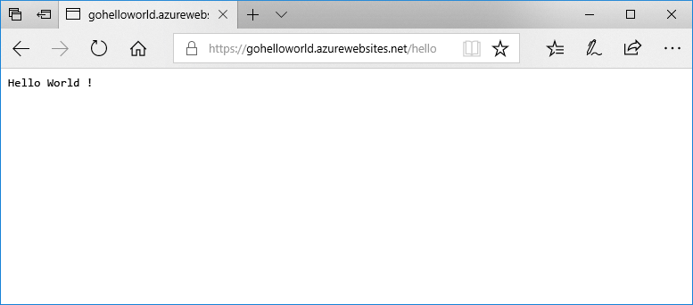

# <a name="deploy-a-dockergo-web-app-in-web-app-for-containers"></a>Déployer une application Docker/Go dans Web App pour conteneurs

[App Service Linux](app-service-linux-intro.md) fournit des piles d’applications prédéfinies sur Linux avec la prise en charge de langages comme .NET, PHP, Node.js, etc. Vous pouvez également utiliser une image Docker personnalisée pour exécuter votre application web sur une pile d’applications qui n’est pas encore définie dans Azure. Ce guide de démarrage rapide vous montre comment créer une application web et déployer une image Go depuis Docker Hub. Vous allez créer l’application web à l’aide d’[Azure CLI](https://docs.microsoft.com/cli/azure/get-started-with-azure-cli).



[!INCLUDE [quickstarts-free-trial-note](../../../includes/quickstarts-free-trial-note.md)]

[!INCLUDE [cloud-shell-try-it.md](../../../includes/cloud-shell-try-it.md)]

[!INCLUDE [Configure deployment user](../../../includes/configure-deployment-user.md)]

[!INCLUDE [Create resource group](../../../includes/app-service-web-create-resource-group.md)]

[!INCLUDE [Create app service plan](../../../includes/app-service-web-create-app-service-plan-linux.md)]

## <a name="create-a-web-app"></a>Créer une application web

Créez une [application web](../app-service-web-overview.md) dans le plan App Service `myAppServicePlan` avec la commande [az webapp create](/cli/azure/webapp?view=azure-cli-latest#az_webapp_create). N’oubliez pas de remplacer `<app name>` par un nom d’application globalement unique.

```azurecli-interactive
az webapp create --resource-group myResourceGroup --plan myAppServicePlan --name <app name> --deployment-container-image-name microsoft/azure-appservices-go-quickstart
```

Dans la commande précédente, `--deployment-container-image-name` pointe vers l’image publique Docker Hub [microsoft/azure-appservices-go-quickstart](https://hub.docker.com/r/microsoft/azure-appservices-go-quickstart/).

Une fois l’application web créée, Azure CLI affiche une sortie similaire à l’exemple suivant :

```json
{
  "availabilityState": "Normal",
  "clientAffinityEnabled": true,
  "clientCertEnabled": false,
  "cloningInfo": null,
  "containerSize": 0,
  "dailyMemoryTimeQuota": 0,
  "defaultHostName": "<app name>.azurewebsites.net",
  "deploymentLocalGitUrl": "https://<username>@<app name>.scm.azurewebsites.net/<app name>.git",
  "enabled": true,
  < JSON data removed for brevity. >
}
```

## <a name="browse-to-the-app"></a>Accéder à l’application

```bash
http://<app_name>.azurewebsites.net/hello
```


**Félicitations !** Vous avez déployé une image Docker personnalisée exécutant une application Go dans Web App pour conteneurs.

[!INCLUDE [Clean-up section](../../../includes/cli-script-clean-up.md)]

## <a name="next-steps"></a>Étapes suivantes

> [!div class="nextstepaction"]
> [Utiliser une image Docker personnalisée](tutorial-custom-docker-image.md)
