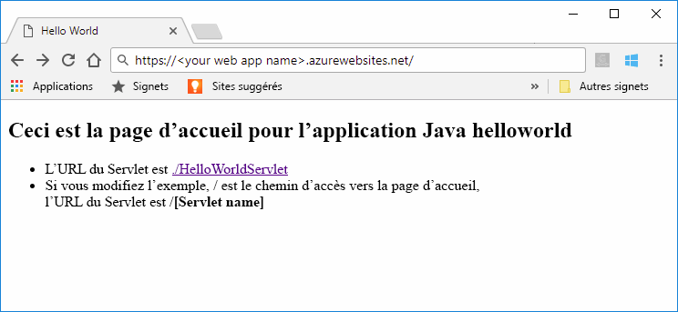
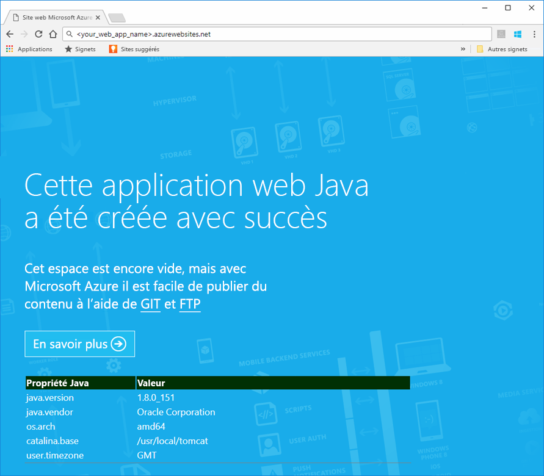
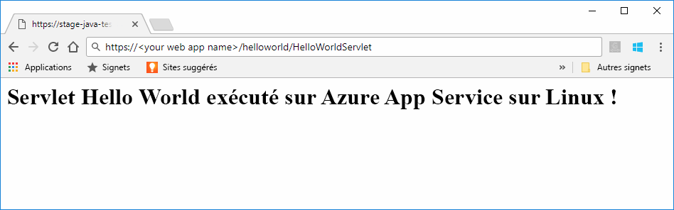

# <a name="preview-create-a-java-web-app-in-app-service-on-linux"></a>Aperçu : créer une application web Java dans App Service sur Linux

App Service sur Linux fournit actuellement une fonctionnalité d’évaluation pour prendre en charge les applications web Java. Pour plus d’informations sur les préversions, veuillez consulter les [Conditions d’Utilisation Supplémentaires relatives aux Évaluations Microsoft Azure](https://azure.microsoft.com/support/legal/preview-supplemental-terms/). [Le déploiement d’applications web Java sur un conteneur Linux dans le cloud à l’aide du kit de ressources Azure pour IntelliJ](https://docs.microsoft.com/java/azure/intellij/azure-toolkit-for-intellij-hello-world-web-app-linux) est une autre approche pour déployer votre application Java sur votre propre conteneur.

> [!NOTE]
> Cet article explique comment déployer une application web Java sur App Service sur Linux.
>

[App Service sur Linux](app-service-linux-intro.md) fournit un service d’hébergement web hautement scalable appliquant des mises à jour correctives automatiques à l’aide du système d’exploitation Linux. Ce démarrage rapide montre comment déployer une application Java sur App Service sur Linux à l’aide d’une image intégrée. Vous allez créer l’application web avec une image intégrée à l’aide [d’Azure CLI](https://docs.microsoft.com/cli/azure/get-started-with-azure-cli) et déployer l’application Java sur l’application web.



[!INCLUDE [quickstarts-free-trial-note](../../../includes/quickstarts-free-trial-note.md)]


## <a name="prerequisites"></a>Prérequis


Pour effectuer ce démarrage rapide : 

* Vous devez avoir un abonnement Azure. Si vous n’avez pas d’abonnement Azure, créez un [compte gratuit](https://azure.microsoft.com/free/?ref=microsoft.com&utm_source=microsoft.com&utm_medium=docs&utm_campaign=visualstudio) avant de commencer.
* [Installer Git](https://git-scm.com/).
* Installez [Eclipse](https://www.eclipse.org/downloads/).


[!INCLUDE [cloud-shell-try-it.md](../../../includes/cloud-shell-try-it.md)]

[!INCLUDE [Configure deployment user](../../../includes/configure-deployment-user.md)]


## <a name="create-a-resource-group"></a>Créer un groupe de ressources

Dans Cloud Shell, créez un groupe de ressources avec la commande [`az group create`](/cli/azure/group?view=azure-cli-latest#az_group_create). L’exemple suivant crée un groupe de ressources nommé *myResourceGroup* à l’emplacement *Europe de l’Ouest*. Pour afficher tous les emplacements pris en charge pour App Service, exécutez la commande [`az appservice list-locations`](/cli/azure/appservice?view=azure-cli-latest#az_appservice_list_locations).

```azurecli-interactive
az group create --name myResourceGroup --location "West US"
```

Vous créez généralement votre groupe de ressources et les ressources dans une région proche de chez vous. 

Une fois la commande terminée, une sortie JSON affiche les propriétés du groupe de ressources.


[!INCLUDE [Create app service plan](../../../includes/app-service-web-create-app-service-plan-linux.md)]


## <a name="create-a-web-app"></a>Créer une application web

Dans Cloud Shell, créez une [application web](../app-service-web-overview.md) dans le plan App Service `myAppServicePlan`. Pour ce faire, utilisez la commande [`az webapp create`](/cli/azure/webapp?view=azure-cli-latest#az_webapp_create). Dans l’exemple suivant, remplacez *\<app_name>* par un nom d’application unique (les caractères autorisés sont `a-z`, `0-9` et `-`). 

```azurecli-interactive
az webapp create --name <app_name> --resource-group myResourceGroup --plan myAppServicePlan --runtime "TOMCAT|8.5-jre8"
```

Pour le paramètre **runtime**, utilisez un des runtimes suivants :
 * TOMCAT | 8.5-jre8
 * TOMCAT | 9.0-jre8


Une fois l’application web créée, Azure CLI affiche des informations similaires à celles de l’exemple suivant :

```json
{
  "additionalProperties": {},
  "availabilityState": "Normal",
  "clientAffinityEnabled": true,
  "clientCertEnabled": false,
  "cloningInfo": null,
  "containerSize": 0,
  "dailyMemoryTimeQuota": 0,
  "defaultHostName": "<your web app name>.azurewebsites.net",
  "enabled": true,
  "enabledHostNames": [
    "<your web app name>.azurewebsites.net",
    "<your web app name>.scm.azurewebsites.net"
  ],
  "ftpPublishingUrl": "ftp://<your ftp URL>",  
  < JSON data removed for brevity. >
}
```

Copiez la valeur de **ftpPublishingUrl**. Vous allez l’utiliser ultérieurement si vous choisissez le déploiement FTP.

Accédez à la nouvelle application web.

```
http://<app_name>.azurewebsites.net
```

Si l’application web est opérationnelle, vous devriez obtenir un écran par défaut similaire à l’image suivante :




## <a name="download-the-sample-java-app"></a>Télécharger l’exemple d’application Java

Dans une fenêtre de terminal sur votre machine, exécutez la commande ci-après pour cloner le dépôt de l’exemple d’application sur votre machine locale. Vous allez déployer cet exemple d’application dans une étape ultérieure.

```bash
git clone https://github.com/Azure-Samples/java-docs-hello-world
```


## <a name="deploying-the-java-app-to-app-service-on-linux"></a>Déploiement de l’application Java sur App Service sur Linux

Ouvrez l’exemple de projet dans [Eclipse](https://www.eclipse.org/downloads/), puis [exportez l’application Java vers un fichier d’archive Web (WAR)](http://help.eclipse.org/kepler/index.jsp?topic=%2Forg.eclipse.wst.webtools.doc.user%2Ftopics%2Ftwcrewar.html) nommé `helloworld.war`.

Pour déployer le fichier WAR d’application Java, vous pouvez utiliser WarDeploy (actuellement en [préversion](https://azure.microsoft.com/support/legal/preview-supplemental-terms/)), ou FTP.

Selon la méthode de déploiement que vous utilisez, le chemin d’accès relatif pour accéder à votre application web Java sera légèrement différent.

### <a name="deploy-with-wardeploy"></a>Déployer avec WarDeploy 

Pour déployer votre fichier WAR avec WarDeploy, utilisez l’exemple de ligne de commande cURL suivant pour envoyer une requête POST à *https://<your app name>.scm.azurewebsites.net/api/wardeploy*. La requête POST doit contenir le fichier .war dans le corps du message. Les informations d’identification de déploiement pour votre application sont fournies dans la demande avec l’authentification de base HTTP. Pour plus d’informations sur WarDeploy, consultez [Déployer votre application sur Azure App Service avec un fichier ZIP ou WAR](../app-service-deploy-zip.md).

```bash
curl -X POST -u <username> --data-binary @"<war_file_path>" https://<app_name>.scm.azurewebsites.net/api/wardeploy
```

Mettez à jour les éléments suivants :

* `username` - Utilisez le nom d’utilisateur d’identification de déploiement que vous avez créé précédemment.
* `war_file_path` - Utilisez le chemin d’accès local du fichier WAR.
* `app_name` - Utilisez le nom de l’application que vous avez créé précédemment.

Exécutez la commande. Lorsque vous y êtes invité par cURL, tapez le mot de passe pour obtenir vos informations d’identification de déploiement.

Accédez à l’application déployée à l’aide de l’URL suivante dans votre navigateur web.

```bash
http://<app_name>.azurewebsites.net
```

L’exemple de code Java s’exécute dans une application web avec une image intégrée.


Accédez au servlet à l’aide de votre navigateur web.

```bash
http://<app_name>.azurewebsites.net/HelloWorldServlet
```

Le servlet s’exécute dans une application web avec une image intégrée.


**Félicitations !** Vous avez déployé votre première application Java sur App Service sur Linux.


### <a name="ftp-deployment"></a>Déploiement FTP

Sinon, vous pouvez également utiliser FTP pour déployer le fichier WAR. 

Téléchargez en FTP le fichier vers le répertoire */home/site/wwwroot/webapps* de votre application web. L’exemple de ligne de commande suivant utilise cURL :

```bash
curl -T war_file_path -u "app_name\username" ftp://webappFTPURL/site/wwwroot/webapps/
```

Mettez à jour les éléments suivants :

* `war_file_path` - Utilisez le chemin d’accès local du fichier WAR.
* `app_name` - Utilisez le nom de l’application que vous avez créé précédemment.
* `username` - Utilisez le nom d’utilisateur d’identification de déploiement que vous avez créé précédemment.
* `webappFTPURL` - Utilisez la valeur **Nom d’hôte FTP** pour l’application web que vous avez copiée précédemment. Le nom d’hôte FTP est également répertorié dans le panneau **Vue d’ensemble** de votre application web dans le [portail Azure](https://portal.azure.com/).

Exécutez la commande. Lorsque vous y êtes invité par cURL, tapez le mot de passe pour obtenir vos informations d’identification de déploiement.


Accédez à l’application déployée à l’aide de l’URL suivante dans votre navigateur web.

```bash
http://<app_name>.azurewebsites.net/helloworld
```

L’exemple de code Java s’exécute dans une application web avec une image intégrée.


Accédez au servlet à l’aide de votre navigateur web.

```bash
http://<app_name>.azurewebsites.net/helloworld/HelloWorldServlet
```

L’exemple de code Java s’exécute dans une application web avec une image intégrée.




**Félicitations !** Vous avez déployé votre première application Java sur App Service sur Linux.


[!INCLUDE [cli-samples-clean-up](../../../includes/cli-samples-clean-up.md)]


## <a name="next-steps"></a>Étapes suivantes

Pour plus d’informations sur l’utilisation de Java avec Azure, consultez les liens suivants :

* [Azure pour les développeurs Java](https://docs.microsoft.com/java/azure/)
* [Déployer une application web Hello World sur un conteneur Linux dans le cloud à l’aide du kit de ressources Azure pour IntelliJ](https://docs.microsoft.com/java/azure/intellij/azure-toolkit-for-intellij-hello-world-web-app-linux)
* [Outils Java pour Visual Studio Team Services](https://java.visualstudio.com/)
