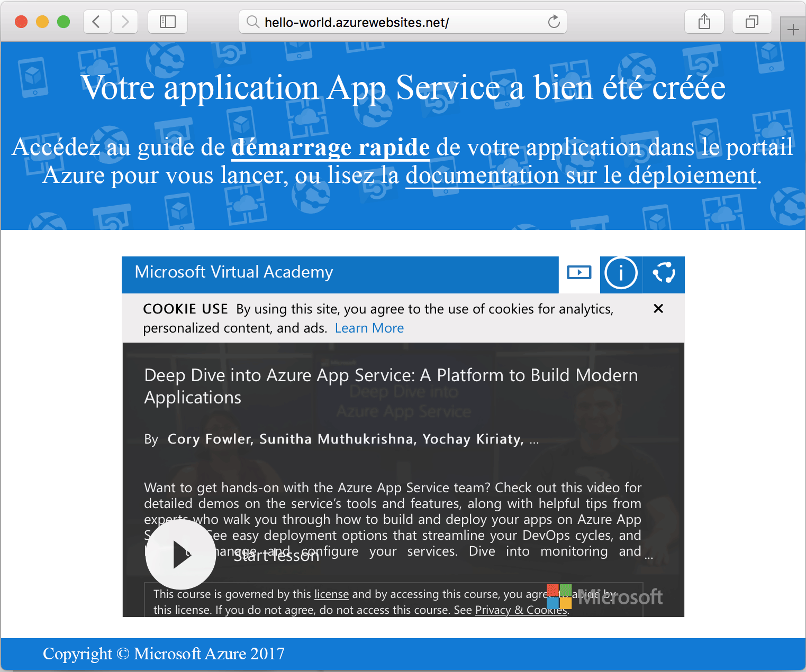

# <a name="create-a-ruby-app-in-app-service-on-linux"></a>Créer une application Ruby dans App Service sur Linux

[App Service sur Linux](app-service-linux-intro.md) offre un service d’hébergement web hautement évolutif appliquant des mises à jour correctives automatiques. Ce guide de démarrage rapide vous montre comment créer une application Ruby on Rails de base puis la déployer dans Azure Web App sur Linux.


[!INCLUDE [quickstarts-free-trial-note](../../../includes/quickstarts-free-trial-note.md)]

## <a name="prerequisites"></a>Prérequis


* <a href="https://www.ruby-lang.org/en/documentation/installation/#rubyinstaller" target="_blank">Installez Ruby 2.4.1 ou version ultérieure</a>
* <a href="https://git-scm.com/" target="_blank">Installez Git</a>

## <a name="download-the-sample"></a>Téléchargez l’exemple

Dans une fenêtre de terminal, exécutez la commande ci-après pour cloner le référentiel de l’exemple d’application sur votre ordinateur local :

```bash
git clone https://github.com/Azure-Samples/ruby-docs-hello-world
```

## <a name="run-the-application-locally"></a>Exécuter l’application localement

Exécutez le serveur Rails afin que l’application fonctionne. Passez au répertoire *hello-world* et démarrez le serveur avec la commande `rails server`.

```bash
cd hello-world\bin
rails server
```

À l’aide de votre navigateur web, accédez à `http://localhost:3000` pour tester l’application en local.


## <a name="modify-app-to-display-welcome-message"></a>Modification de l’application pour afficher un message d’accueil

Modifiez l’application afin qu’elle affiche un message d’accueil. Tout d’abord, vous devez configurer un itinéraire en modifiant le fichier *~/workspace/ruby-docs-hello-world/config/routes.rb* pour qu’il inclue un itinéraire nommé `hello`.

  ```ruby
  Rails.application.routes.draw do
      #For details on the DSL available within this file, see http://guides.rubyonrails.org/routing.html
      root 'application#hello'
  end
  ```

Modifiez le contrôleur de l’application de sorte pour qu’il renvoie le message au format HTML au navigateur. 

Ouvrez *~/workspace/hello-world/app/controllers/application_controller.rb* pour le modifier. Modifiez la classe `ApplicationController` pour qu’elle ressemble à l’exemple de code suivant :

  ```ruby
  class ApplicationController > ActionController :: base
    protect_from_forgery with: :exception
    def hello
      render html: "Hello, world from Azure Web App on Linux!"
    end
  end
  ```

Votre application est désormais configurée. À l’aide de votre navigateur web, accédez à `http://localhost:3000` pour vérifier la page d’accueil racine.


[!INCLUDE [Try Cloud Shell](../../../includes/cloud-shell-try-it.md)]

[!INCLUDE [Configure deployment user](../../../includes/configure-deployment-user.md)]

[!INCLUDE [Create resource group](../../../includes/app-service-web-create-resource-group-linux.md)]

[!INCLUDE [Create app service plan](../../../includes/app-service-web-create-app-service-plan-linux.md)]

## <a name="create-a-web-app"></a>Créer une application web

[!INCLUDE [Create web app](../../../includes/app-service-web-create-web-app-ruby-linux-no-h.md)] 

Accédez au site pour voir votre nouvelle application web avec une image intégrée. Remplacez _&lt;nom de l’application>_ par le nom de votre application web.

```bash
http://<app_name>.azurewebsites.net
```

Voici à quoi doit ressembler votre nouvelle application web :



## <a name="deploy-your-application"></a>Déployer votre application

Exécutez les commandes suivantes pour déployer l’application locale sur votre site web Azure :

```bash
git remote add azure <Git deployment URL from above>
git add -A
git commit -m "Initial deployment commit"
git push azure master
```

Vérifiez que les opérations de déploiement à distance réussissent. Les commandes produisent une sortie semblable au texte suivant :

```bash
remote: Using sass-rails 5.0.6
remote: Updating files in vendor/cache
remote: Bundle gems are installed into ./vendor/bundle
remote: Updating files in vendor/cache
remote: ~site/repository
remote: Finished successfully.
remote: Running post deployment command(s)...
remote: Deployment successful.
To https://<your web app name>.scm.azurewebsites.net/<your web app name>.git
  579ccb....2ca5f31  master -> master
myuser@ubuntu1234:~workspace/<app name>$
```

Une fois le déploiement terminé, redémarrez votre application web pour que le déploiement prenne effet en utilisant la commande [`az webapp restart`](/cli/azure/webapp?view=azure-cli-latest#az_webapp_restart), comme présenté ici :

```azurecli-interactive
az webapp restart --name <app name> --resource-group myResourceGroup
```

Accédez à votre site et vérifiez les résultats.

```bash
http://<app name>.azurewebsites.net
```


> [!NOTE]
> Si vous tentez de parcourir les résultats du site pendant que l’application redémarre, vous recevrez une erreur HTTP `Error 503 Server unavailable`. Le redémarrage complet peut prendre quelques minutes.
>

[!INCLUDE [Clean-up section](../../../includes/cli-script-clean-up.md)]

## <a name="next-steps"></a>Étapes suivantes

> [!div class="nextstepaction"]
> [Build a Ruby and MySQL web app in Azure App Service on Linux](tutorial-ruby-mysql-app.md) (Créer une application web Ruby et MySQL dans Azure App Service sur Linux)
