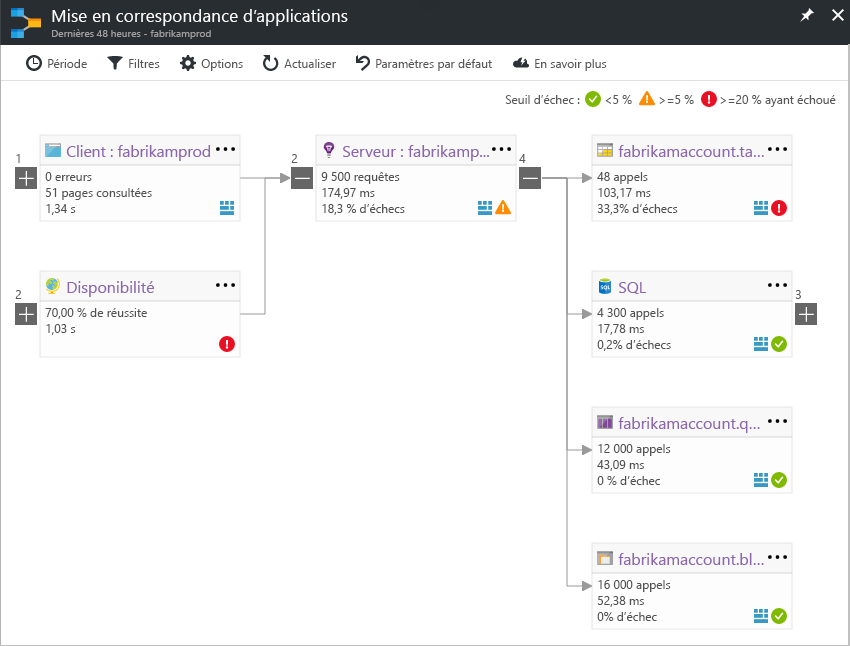

# Mise en correspondance d’applications : trier des applications distribuées
La mise en correspondance d’applications vous permet d’identifier les baisses de performances ou les défaillances sur l’ensemble des composants de votre application distribuée. Chaque nœud de cette mise en correspondance représente un composant d’application ou ses dépendances, avec des indicateurs de performance clés d’intégrité et l’état des alertes. Vous pouvez cliquer sur n’importe quel composant pour obtenir des diagnostics plus détaillés, par exemple des événements Application Insights. Si votre application utilise les services Azure, vous pouvez également accéder aux diagnostics Azure, et notamment aux recommandations de SQL Database Advisor.

## Qu’est un composant ?

Les composants sont des parties pouvant être déployées de manière indépendante de votre application distribuée/de microservices. Les développeurs et équipes d’opérations disposent d’une visibilité au niveau du code ou d’un accès à la télémétrie générée par ces composants d’application. 

* Les composants sont différents des dépendances externes « observées » telles que SQL, EventHub, etc., auxquelles votre équipe/organisation peut ne pas avoir accès (code ou télémétrie).
* Les composants s’exécutent sur un nombre quelconque d’instances de serveur/rôle/conteneur.
* Les composants peuvent être des clés d’instrumentation Application Insights distinctes (même si les abonnements sont différents) ou des rôles différents rapportant à une clé d’instrumentation Application Insights unique. L’aperçu de mise en correspondance montre les composants, quelle que soit leur configuration.

## Composite Application Map (Cartographie d'application composite) (préversion)
*Il s’agit d’une préversion qui sera enrichie d’autres fonctionnalités. Nous aimerions connaître votre opinion sur cette nouvelle interface. Vous pouvez facilement basculer de la préversion à la version classique.*

Activez « Composite Application Map » (Cartographie d'application composite) dans la [liste des préversions](app-insights-previews.md), ou cliquez sur « Preview map » (Aperçu de la carte) dans le contrôle de basculement dans l’angle supérieur droit. Vous pouvez utiliser ce bouton pour revenir à la version classique.

>[!Note]
Cette préversion remplace la préversion précédente, « Mise en correspondance d’application multirôle ». À ce stade, utilisez-la pour afficher la topologie complète sur plusieurs niveaux de dépendances des composants d’application. Envoyez-nous vos commentaires : nous ajouterons d’autres fonctionnalités similaires à celles prises en charge par la mise en correspondance classique.

Vous pouvez afficher la topologie complète des applications sur plusieurs niveaux des composants d’application associés. Les composants peuvent représenter différentes ressources Application Insights, ou différents rôles d’une seule ressource. La mise en correspondance d’applications trouve les composants en suivant les appels de dépendance HTTP effectués entre les serveurs sur lesquels le kit SDK Application Insights est installé. 

Cette expérience démarre la découverte progressive des composants. Lorsque vous chargez la préversion pour la première fois, un ensemble de requêtes est déclenché pour découvrir les composants liés à ce composant. Un bouton dans le coin supérieur gauche permet de mettre à jour le nombre de composants de votre application dès qu’ils sont détectés. 

Lorsque vous cliquez sur « Update map components » (Mettre à jour les composants de cartographie), la carte est actualisée avec tous les composants détectés.

Si tous les composants sont des rôles au sein d’une seule ressource Application Insights, cette étape de découverte n’est pas requise. La charge initiale pour une telle application aura tous ses composants.

Un des principaux objectifs de la nouvelle expérience est de pouvoir visualiser des topologies complexes avec des centaines de composants. La nouvelle expérience prend en charge le zoom et permet d’afficher d’autres détails à mesure que vous effectuez un zoom avant. Vous pouvez effectuer un zoom arrière pour afficher d’un coup d’œil plus de composants, tout en identifiant ceux dont les taux de défaillance sont les plus élevés. 

Cliquez sur n’importe quel composant pour afficher des informations connexes ainsi que les performances et l’expérience de triage de défaillance de ce composant.

## Cartographie d’application classique

La mise en correspondance affiche les éléments suivants :

* Tests de disponibilité
* Composant côté client (surveillé avec le Kit de développement logiciel (SDK) JavaScript)
* Composant côté serveur
* Dépendances des composants client et serveur

Vous pouvez développer et réduire les groupes de liens de dépendance :

Si vous avez de nombreuses dépendances d’un type (SQL, HTTP, etc.), elles peuvent apparaître groupées. 

## Détecter les problèmes
Chaque nœud possède des indicateurs de performance pertinents, tels que les taux de charge, de performances et de défaillances de ce composant. 

Les icônes d’avertissement mettent en évidence les problèmes éventuels. Un avertissement orange signifie qu’il existe des défaillances dans les requêtes, les vues de page ou les appels de dépendance. Un avertissement rouge signifie un taux de défaillance de plus de 5 %. Si vous souhaitez ajuster ces seuils, ouvrez Options.

En outre, des alertes actives s’affichent : 

Si vous utilisez SQL Azure, une icône vous indique des recommandations éventuelles sur la façon dont vous pouvez améliorer les performances. 

Cliquez sur une icône pour obtenir plus de détails :

## Clics pour le diagnostic
Chacun des nœuds sur la mise en correspondance offre des clics ciblés pour le diagnostic. Les options varient selon le type du nœud.

Pour les composants qui sont hébergés dans Azure, les options incluent des liens directs.

## Filtres et période
Par défaut, la mise en correspondance récapitule toutes les données disponibles pour la période choisie. Toutefois, vous pouvez filtrer pour inclure uniquement les noms ou les dépendances d’opérations spécifiques.

* Nom de l’opération : cela inclut les vues de pages et les types de demandes côté serveur. Avec cette option, la mise en correspondance affiche l’indicateur de performance clé sur le nœud côté serveur/client pour les opérations sélectionnées uniquement. Elle montre les dépendances appelées dans le contexte de ces opérations spécifiques.
* Nom de base de la dépendance : cela inclut les dépendances du navigateur AJAX et les dépendances côté serveur. Si vous créez un rapport de télémétrie d’une dépendance personnalisée avec l’API TrackDependency, elles s’affichent également ici. Vous pouvez sélectionner les dépendances à afficher sur la mise en correspondance. Actuellement, cette sélection ne filtre pas les demandes côté serveur ou les vues de pages côté client.

## Enregistrer les filtres
Pour enregistrer les filtres que vous avez appliqués, épinglez la vue filtrée sur un [tableau de bord](app-insights-dashboards.md).

## Volet d’erreur
Lorsque vous cliquez sur un nœud de la mise en correspondance, un volet d’erreur résumant les échecs de ce nœud s’affiche sur le côté droit. Les échecs sont tout d’abord regroupés par ID d’opération, puis par ID de problème.

Cliquez sur un échec pour accéder à l’instance la plus récente de ce dernier.

## Intégrité des ressources
Pour certains types de ressources, l’intégrité des ressources est indiquée en haut du volet d’erreur. Par exemple, l’intégrité de la base de données et les alertes survenues s’affichent lorsque vous cliquez sur un nœud SQL.

Vous pouvez cliquer sur le nom de la ressource pour afficher les indicateurs de performances de la vue d’ensemble standard de cette ressource.

## Vidéo

> [!VIDEO https://channel9.msdn.com/events/Connect/2016/112/player] 

## Commentaires
Merci d’envoyer des commentaires via l’option de commentaires du portail.

## Étapes suivantes

* [Portail Azure](https://portal.azure.com)
