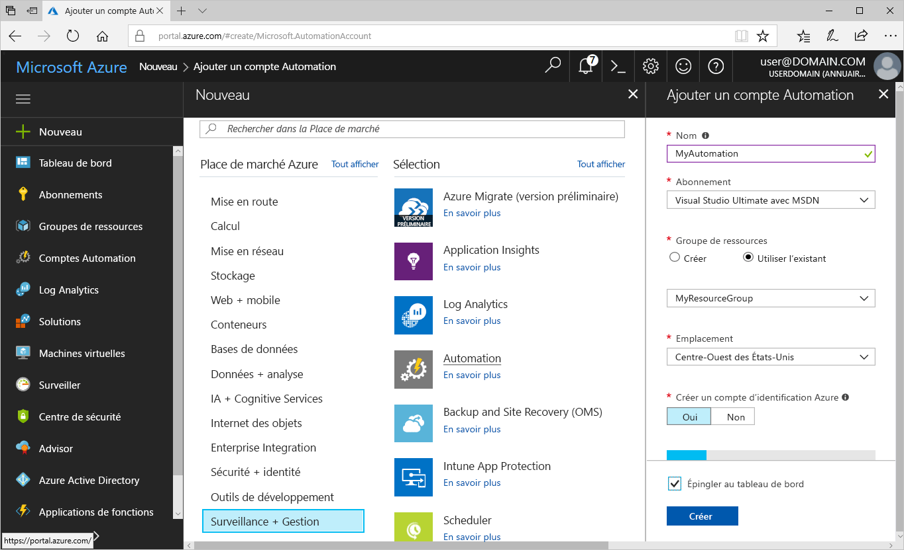
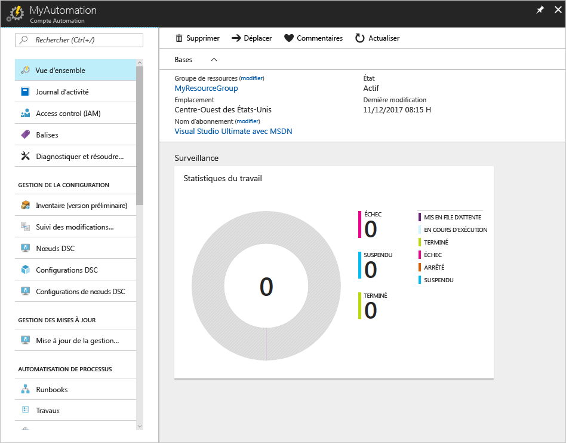
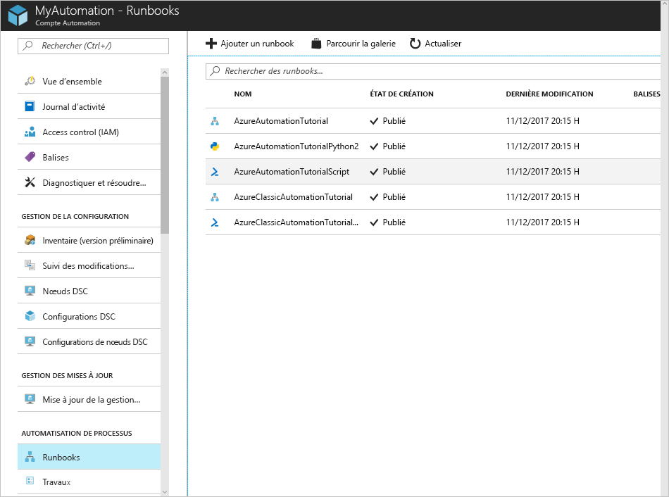
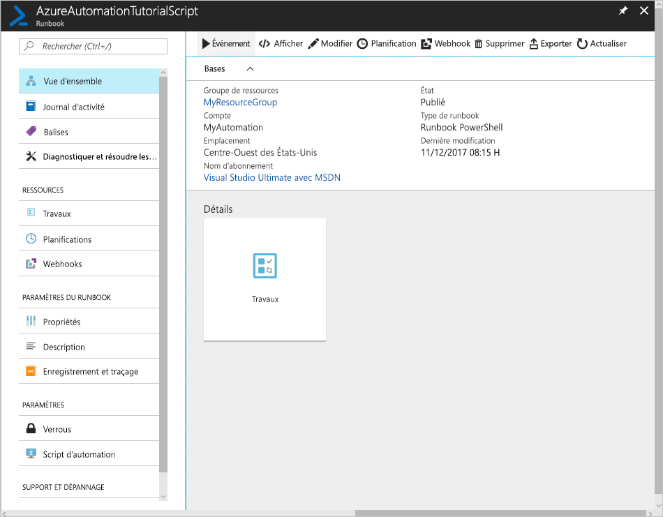
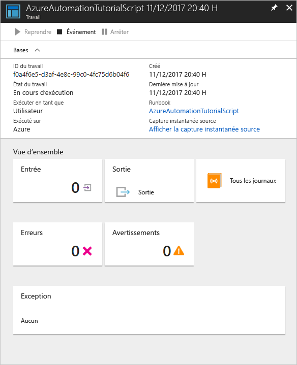

---
title: "Démarrage rapide Azure - Créer un compte Azure Automation | Microsoft Docs"
description: "Apprendre à créer un compte Azure Automation et exécuter un runbook"
services: automation
author: csand-msft
ms.author: csand
ms.date: 12/13/2017
ms.topic: quickstart
ms.service: automation
ms.custom: mvc
ms.openlocfilehash: 1ac5da8950f2aa5504c2e1e4c80e8cf5cc5d5be8
ms.sourcegitcommit: d87b039e13a5f8df1ee9d82a727e6bc04715c341
ms.translationtype: HT
ms.contentlocale: fr-FR
ms.lasthandoff: 02/21/2018
---
# Créer un compte Azure Automation

Les comptes Azure Automation peuvent être créés via Azure. Cette méthode fournit une interface utilisateur basée sur navigateur pour créer et configurer des comptes Automation et les ressources liées. Ces étapes de démarrage rapide permettent la création d’un compte Automation et l’exécution d’un runbook dans le compte.

Si vous n’avez pas d’abonnement Azure, créez un [compte Azure gratuit](https://azure.microsoft.com/free/?WT.mc_id=A261C142F) avant de commencer.

## Connexion à Azure

Connectez-vous à Azure à l’adresse https://portal.azure.com

## Créer un compte Automation

1. Cliquez sur le bouton **Créer une ressource** dans le coin supérieur gauche d’Azure.

1. Sélectionnez **Surveillance + gestion**, puis sélectionnez **Automation**.

1. Saisissez les informations du compte. Pour **Créer un compte d’identification Azure**, choisissez **Oui** afin que les artefacts simplifiant l’authentification à Azure soient automatiquement activés. Lorsque vous avez terminé, cliquez sur **Créer** pour démarrer le déploiement du compte Automation.

      

1. Le compte Automation est épinglé au tableau de bord Azure. Une fois le déploiement terminé, la vue d’ensemble du compte Automation s’ouvre automatiquement.

    

## Exécuter un runbook

Exécutez l’un des runbooks de didacticiel.

1. Cliquez sur **Runbooks** sous **AUTOMATISATION DE PROCESSUS**. La liste des runbooks s’affiche. Par défaut, plusieurs runbooks de didacticiel sont activés dans le compte.

    

1. Sélectionnez le runbook **AzureAutomationTutorialScript**. Cette action ouvre la page de vue d’ensemble du runbook.

    

1. Cliquez sur **Démarrer**, puis, dans la page **Démarrer le Runbook**, cliquez sur **OK** pour démarrer le runbook.

    

1. Lorsque **l’état du travail** passe à **En cours d’exécution**, cliquez sur **Sortie** ou **Tous les journaux** pour afficher la sortie du travail de runbook. Pour ce runbook de didacticiel, la sortie est une liste de vos ressources Azure.

## Supprimer des ressources

Lorsque vous n’en avez plus besoin, supprimez le groupe de ressources, le compte Automation et toutes les ressources associées. Pour ce faire, sélectionnez le groupe de ressources pour le compte Automation, puis cliquez sur **Supprimer**.

## Étapes suivantes

Dans ce démarrage rapide, vous avez déployé un compte Automation, démarré un travail de runbook et affiché les résultats du travail. Pour en savoir plus sur Azure Automation, continuez en faisant le démarrage rapide pour créer votre premier runbook.

> [!div class="nextstepaction"]
> [Démarrage rapide de Automation - Créer un runbook](./automation-quickstart-create-runbook.md)
