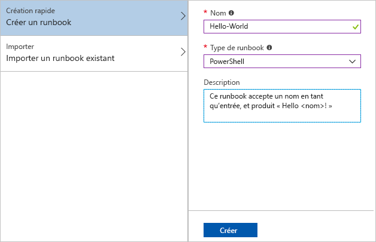
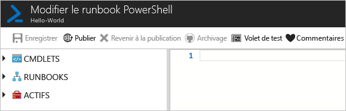
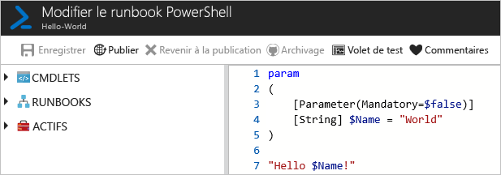
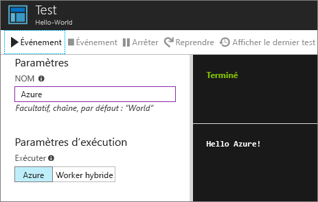
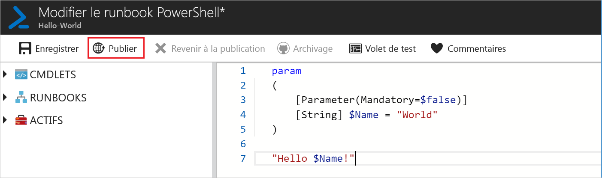
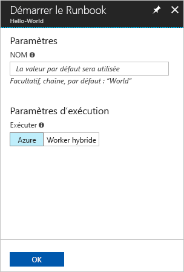
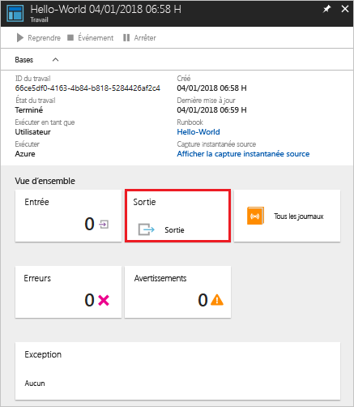
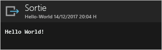

# <a name="create-an-azure-automation-runbook"></a>Créer un runbook Azure Automation

Les runbooks Azure Automation peuvent être créés via Azure. Cette méthode fournit une interface utilisateur basée sur un navigateur pour créer des runbooks Automation. Dans ce démarrage rapide, vous passez au travers de la création, de la modification, du test et de la publication d’un runbook Automation PowerShell.

Si vous n’avez pas d’abonnement Azure, créez un [compte Azure gratuit](https://azure.microsoft.com/free/?WT.mc_id=A261C142F) avant de commencer.

## <a name="log-in-to-azure"></a>Connexion à Azure

Connectez-vous à Azure à l’adresse https://portal.azure.com

## <a name="create-runbook"></a>Créer un runbook

Tout d’abord, créez un runbook. L’exemple de runbook créé dans ce démarrage rapide génère `Hello World` par défaut.

1. Ouvrez votre compte Automation.

1. Cliquez sur **Runbooks** sous **AUTOMATISATION DE PROCESSUS**. La liste des runbooks s’affiche.

1. Cliquez sur le bouton **Ajouter un runbook** situé en haut de la liste. Sur la page **Ajouter des runbooks**, sélectionnez **Création rapide**.

1. Saisissez « Hello World » comme **nom** de runbook, puis sélectionnez **PowerShell** comme **type de runbook**. Cliquez sur **Créer**.

   

1. Le runbook est créé et la page **Modifier le runbook PowerShell** s’ouvre.

    

1. Saisissez ou bien copiez et collez le code suivant dans le volet d’édition. Il crée un paramètre d’entrée facultatif nommé « Nom » avec « World » comme valeur par défaut et il génère une chaîne qui utilise cette valeur d’entrée :
   
   ```powershell-interactive
   param
   (
       [Parameter(Mandatory=$false)]
       [String] $Name = "World"
   )

   "Hello $Name!"
   ```

1. Cliquez sur **Enregistrer** pour enregistrer un brouillon du runbook.

    

## <a name="test-the-runbook"></a>Tester le Runbook

Une fois le runbook créé, vous testez le runbook pour vérifier qu’il fonctionne.

1. Cliquez sur **Volet de test** pour ouvrir la page **Test**.

1. Saisissez une valeur comme **nom**, puis cliquez sur **Démarrer**. Le travail de test démarre et l’état du travail ainsi que la sortie s’affichent.

    

1. Fermez la page **Test** en cliquant sur le symbole **X** dans le coin supérieur droit. Sélectionnez **OK** dans le menu contextuel qui s’affiche.

1. Sur la page **Modifier un runbook PowerShell**, cliquez sur **Publier** pour publier le runbook en tant que version officielle du runbook au sein du compte.

   

## <a name="run-the-runbook"></a>Exécuter le runbook

Une fois le runbook publié, la page de vue d’ensemble apparaît.

1. Dans la page de vue d’ensemble de runbook, cliquez sur **Démarrer** pour ouvrir la page de configuration **Démarrer le Runbook** pour ce runbook.

   

1. Laissez le **nom** vide afin que la valeur par défaut soit utilisée, puis cliquez sur **OK**. Le travail de runbook est soumis et la page du travail s’affiche.

   

1. Lorsque **l’état du travail** est **En cours d’exécution** ou **Terminé**, cliquez sur **Sortie** pour ouvrir le volet **Sortie** et afficher la sortie du runbook.

   

## <a name="clean-up-resources"></a>Supprimer des ressources

Lorsqu’il n’est plus nécessaire, supprimez le runbook. Pour le faire, sélectionnez le runbook dans la liste de runbooks, puis cliquez sur **Supprimer**.

## <a name="next-steps"></a>Étapes suivantes

Dans ce démarrage rapide, vous avez créé, modifié, testé et publié un runbook et vous avez démarré un travail de runbook. Pour en savoir plus sur les runbooks Automation, consultez l’article traitant des différents types de runbooks que vous pouvez créer et utiliser dans Automation.

> [!div class="nextstepaction"]
> [Procédures Automation - Types de runbooks](./automation-runbook-types.md)
