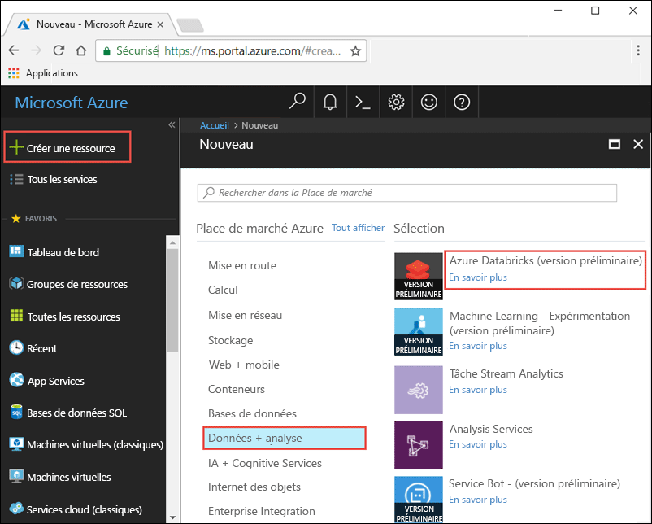
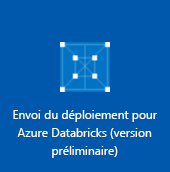
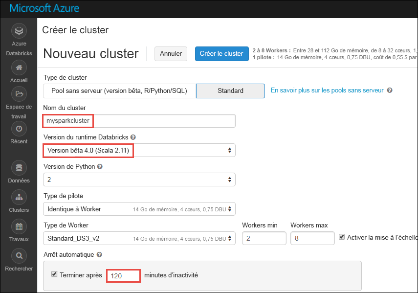

# Didacticiel : Analyse d’opinions sur les données de streaming à l’aide d’Azure Databricks

Dans ce didacticiel, vous allez apprendre à exécuter des analyses d’opinions sur un flux de données en temps réel à l’aide d’Azure Databricks. Vous allez configurer le système d’ingestion des données en temps réel avec Azure Event Hubs. Vous allez lire des messages à partir d’Event Hubs dans Azure Databricks à l’aide du connecteur Spark Event Hubs. Enfin, vous allez utiliser les API Microsoft Cognitive Services pour exécuter des analyses d’opinions sur les données diffusées. 

À la fin de ce didacticiel, vous disposerez de tweets diffusés de Twitter comprenant le terme « Azure » et qui exécuterez des analyses d’opinions sur les tweets.

L’illustration suivante montre le flux d’application :

Ce didacticiel décrit les tâches suivantes : 

> [!div class="checklist"]
> * Créer un espace de travail Azure Databricks
> * Créer un cluster Spark dans Azure Databricks
> * Créer une application Twitter pour accéder aux données en temps réel
> * Créer des notebooks dans Azure Databricks
> * Joindre des bibliothèques pour les API Event Hubs et Twitter
> * Créer un compte Microsoft Cognitive Services et récupérer la clé d’accès
> * Envoyer des tweets vers Event Hubs
> * Lire des tweets à partir d’Event Hubs
> * Exécuter des analyses d’opinions sur des tweets

Si vous ne disposez pas d’abonnement Azure, créez un [compte gratuit](https://azure.microsoft.com/free/) avant de commencer.

## Prérequis

Avant de commencer le didacticiel, veillez à disposer des éléments suivants :
- Un espace de noms Azure Event Hubs.
- Un concentrateur d’événements au sein de l’espace de noms.
- Une chaîne de connexion pour accéder à l’espace de noms Event Hubs. La chaîne de connexion suit un format similaire à `Endpoint=sb://<namespace>.servicebus.windows.net/;SharedAccessKeyName=<key name>;SharedAccessKey=<key value>”`.
- Un nom de stratégie d’accès partagé et une clé de stratégie pour Event Hubs.

Vous pouvez obtenir tous ces éléments en terminant les étapes de l’article [Créer un nom d’espaces et un concentrateur d’événements Azure Event Hubs](../event-hubs/event-hubs-create.md).

## Connectez-vous au portail Azure.

Connectez-vous au [portail Azure](https://portal.azure.com/).

## Créer un espace de travail Azure Databricks

Dans cette section, vous créez un espace de travail Azure Databricks en utilisant le portail Azure. 

1. Dans le portail Azure, sélectionnez **Créer une ressource** > **Données + Analytique** > **Azure Databricks (préversion)**.

    

2. Sous **Azure Databricks (Préversion)**, sélectionnez **Créer**.

3. Sous **Service Azure Databricks**, renseignez les valeurs pour créer un espace de travail Databricks.

    

    Renseignez les valeurs suivantes : 
     
    |Propriété  |Description  |
    |---------|---------|
    |**Nom de l’espace de travail**     | Renseignez un nom pour votre espace de travail Databricks.        |
    |**Abonnement**     | Sélectionnez votre abonnement Azure dans la liste déroulante.        |
    |**Groupe de ressources**     | Indiquez si vous souhaitez créer un groupe de ressources Azure ou utiliser un groupe existant. Un groupe de ressources est un conteneur réunissant les ressources associées d’une solution Azure. Pour plus d’informations, consultez [Présentation des groupes de ressources Azure](../azure-resource-manager/resource-group-overview.md). |
    |**Lieu**     | Sélectionnez **Est des États-Unis 2**. Pour les autres régions disponibles, consultez [Disponibilité des services Azure par région](https://azure.microsoft.com/regions/services/).        |
    |**Niveau tarifaire**     |  Choisissez entre **Standard** ou **Premium**. Pour plus d’informations sur ces niveaux, consultez la [page de tarification Databricks](https://azure.microsoft.com/pricing/details/databricks/).       |

    Sélectionnez **Épingler au tableau de bord**, puis sélectionnez **Créer**.

4. La création du compte prend quelques minutes. Lors de la création d’un compte, le portail affiche la vignette **Envoi du déploiement pour Azure Databricks** sur le côté droit. Vous devrez peut-être faire défiler votre tableau de bord vers la droite pour voir la vignette. Il existe également une barre de progression en haut de l’écran. Vous pouvez surveiller la progression de la zone souhaitée.

    

## Créer un cluster Spark dans Databricks

1. Dans le portail Azure, accédez à l’espace de travail Databricks que vous avez créé, puis sélectionnez **Initialiser l’espace de travail**.

2. Vous êtes redirigé vers le portail Azure Databricks. Dans le portail, sélectionnez **Cluster**.

    

3. Dans la page **Nouveau cluster**, renseignez les valeurs pour créer un cluster.

    

    Acceptez toutes les valeurs par défaut autres que les suivantes :

    * Entrez un nom pour le cluster.
    * Pour cet article, créez un cluster avec le runtime **4.0 (bêta)**. 
    * Veillez à cocher la case **Arrêter après ___ minutes d’inactivité**. Spécifiez une durée (en minutes) pour arrêter le cluster, si le cluster n’est pas utilisé.

    Sélectionnez **Créer un cluster**. Une fois que le cluster est en cours d’exécution, vous pouvez y attacher des notebooks et exécuter des travaux Spark.

## Création d'une application Twitter

Pour recevoir un flux de tweets en temps réel, vous devez créer une application dans Twitter. Suivez les étapes pour créer une application Twitter et enregistrez les valeurs dont vous avez besoin pour terminer ce didacticiel.

1. À partir d’un navigateur web, accédez à [Gestion des applications Twitter](http://twitter.com/app), et sélectionnez **Créer une application**.

    

2. Sur la page **Créer une application**, renseignez les informations de la nouvelle application, puis sélectionnez **Créer votre application Twitter**.

    

3. Sur la page de l’application, sélectionnez l’onglet **Clés et jetons d’accès** et copiez les valeurs de **Clé de consommation** et **Secret de consommation**. Sélectionnez aussi **Créer mon jeton d’accès** pour générer des jetons d’accès. Copiez les valeurs de **Jeton d’accès** et **Secret du jeton d’accès**.

    

Enregistrez les valeurs que vous avez récupérées pour l’application Twitter. Vous aurez besoin de ces valeurs plus loin dans le didacticiel.

## Joindre des bibliothèques au cluster Spark

Dans ce didacticiel, vous allez utiliser les API Twitter pour envoyer des tweets à Event Hubs. Vous allez aussi utiliser le [connecteur Apache Spark Event Hubs](https://github.com/Azure/azure-event-hubs-spark) pour lire et écrire des données dans Azure Event Hubs. Pour utiliser ces API au sein de votre cluster, ajoutez-les en tant que bibliothèques à Azure Databricks puis associez-les à votre cluster Spark. Les instructions suivantes expliquent comment ajouter la bibliothèque au dossier **Partagé** dans votre espace de travail.

1.  Dans l’espace de travail Azure Databricks, sélectionnez **Espace de travail**, puis cliquez avec le bouton droit sur **Partagé**. Dans le menu contextuel, sélectionnez **Créer** > **Bibliothèque**.

    

2. Sur la page Nouvelle bibliothèque, sélectionnez **Coordonnées Maven** comme **Source**. Pour **Coordonnées**, saisissez les coordonnées du package que vous voulez ajouter. Voici les coordonnées Maven des bibliothèques utilisées dans ce didacticiel :

    * Connecteur Spark Event Hubs : `com.microsoft.azure:azure-eventhubs-spark_2.11:2.3.0`
    * API Twitter : `org.twitter4j:twitter4j-core:4.0.6`

    

3. Sélectionnez **Créer une bibliothèque**.

4. Sélectionnez le dossier dans lequel vous avez ajouté la bibliothèque, puis sélectionnez le nom de la bibliothèque.

    

5. Sur la page de la bibliothèque, sélectionnez le cluster dans lequel vous voulez utiliser la bibliothèque. Une fois que vous avez associé la bibliothèque au cluster, le statut change immédiatement en **Jointe**.

    

6. Répétez ces étapes pour le package Twitter, `twitter4j-core:4.0.6`.

## Obtenir une clé d’accès Cognitive Services

Dans ce didacticiel, vous allez utiliser les [API Analyse de texte de Microsoft Cognitive Services](../cognitive-services/text-analytics/overview.md) pour exécuter des analyses d’opinions sur un flux de données en temps réel. Avant d’utiliser les API, vous devez créer un compte Microsoft Cognitive Services sur Azure et récupérez une clé d’accès pour utiliser les API Analyse de texte.

1. Connectez-vous au [Portail Azure](https://portal.azure.com/).

2. Sélectionnez **+ Créer une ressource**.
 
3. Dans la place de marché Azure, sélectionnez **IA + Cognitive Services** > **API Analyse de texte**.

    

4. Dans la boîte de dialogue **Créer**, saisissez les valeurs suivantes :

    

    - Saisissez un nom pour le compte Cognitive Services.
    - Sélectionnez un abonnement sous lequel est créé le compte.
    - Sélectionnez un emplacement Azure.
    - Sélectionnez un niveau tarifaire pour le service. Pour en savoir plus sur la tarification de Cognitive Services, consultez la [page sur la tarification](https://azure.microsoft.com/pricing/details/cognitive-services/).
    - Indiquez si vous souhaitez créer un groupe de ressources Azure ou sélectionner un groupe existant.

    Sélectionnez **Créer**.

5. Une fois le compte créé, sélectionnez **Afficher les clés d’accès** dans l’onglet **Vue d’ensemble**.

    

    Aussi, copiez une partie de l’URL du point de terminaison, comme montré par la capture d’écran. Il vous faut cette URL dans ce didacticiel.

6. Sous **Gérer les clés**, sélectionnez l’icône de copie sur la clé que vous souhaitez utiliser.

    

7. Enregistrez les valeurs de l’URL du point de terminaison et de la clé d’accès que vous avez récupérées à cette étape. Vous en aurez besoin ultérieurement dans ce didacticiel.

## Créer des notebooks dans Databricks

Dans cette section, vous allez créer deux notebooks dans l’espace de travail Databricks avec les noms suivants

- **SendTweetsToEventHub** : un notebook producteur à utiliser pour obtenir des tweets de Twitter et les diffuser dans Event Hubs.
- **AnalyzeTweetsFromEventHub** : un notebook consommateur à utiliser pour lire les tweets à partir d’Event Hubs et pour exécuter des analyses d’opinions.

1. Dans le volet gauche, sélectionnez **Espace de travail**. Dans la liste déroulante **Espace de travail**, sélectionnez **Créer** et **Notebook**.

    

2. Dans la boîte de dialogue **Créer un notebook**, entrez **SendTweetsToEventHub**, sélectionnez **Scala** comme langage, puis sélectionnez le cluster Spark que vous avez créé précédemment.

    

    Sélectionnez **Créer**.

3. Répétez les étapes pour créer le notebook **AnalyzeTweetsFromEventHub**.

## Envoyer des tweets vers Event Hubs

Dans le notebook **SendTweetsToEventHub**, collez le code suivant, et remplacez l’espace réservé par les valeurs de votre espace de noms Event Hubs et de l’application Twitter que vous avez créés précédemment. Ce notebook diffuse les tweets avec le mot-clé « Azure » dans Event Hubs en temps réel.

    import java.util._
    import scala.collection.JavaConverters._
    import com.microsoft.azure.eventhubs._
    import java.util.concurrent._
    
    val namespaceName = "<EVENT HUBS NAMESPACE>"
    val eventHubName = "<EVENT HUB NAME>"
    val sasKeyName = "<POLICY NAME>"
    val sasKey = "<POLICY KEY>"
    val connStr = new ConnectionStringBuilder()
                .setNamespaceName(namespaceName)
                .setEventHubName(eventHubName)
                .setSasKeyName(sasKeyName)
                .setSasKey(sasKey)
    
    val pool = Executors.newFixedThreadPool(1)
    val eventHubClient = EventHubClient.create(connStr.toString(), pool)
    
    def sendEvent(message: String) = {
      val messageData = EventData.create(message.getBytes("UTF-8"))
      eventHubClient.get().send(messageData) 
      System.out.println("Sent event: " + message + "\n")
    }
    
    import twitter4j._
    import twitter4j.TwitterFactory
    import twitter4j.Twitter
    import twitter4j.conf.ConfigurationBuilder
    
    // Twitter configuration!
    // Replace values below with yours
    
    val twitterConsumerKey = "<CONSUMER KEY>"
    val twitterConsumerSecret = "<CONSUMER SECRET>"
    val twitterOauthAccessToken = "<ACCESS TOKEN>"
    val twitterOauthTokenSecret = "<TOKEN SECRET>"
    
    val cb = new ConfigurationBuilder()
      cb.setDebugEnabled(true)
      .setOAuthConsumerKey(twitterConsumerKey)
      .setOAuthConsumerSecret(twitterConsumerSecret)
      .setOAuthAccessToken(twitterOauthAccessToken)
      .setOAuthAccessTokenSecret(twitterOauthTokenSecret)
    
    val twitterFactory = new TwitterFactory(cb.build())
    val twitter = twitterFactory.getInstance()
    
    // Getting tweets with keyword "Azure" and sending them to the Event Hub in realtime!
    
    val query = new Query(" #Azure ")
    query.setCount(100)
    query.lang("en")
    var finished = false
    while (!finished) {
      val result = twitter.search(query) 
      val statuses = result.getTweets()
      var lowestStatusId = Long.MaxValue
      for (status <- statuses.asScala) {
        if(!status.isRetweet()){ 
          sendEvent(status.getText())
        }
        lowestStatusId = Math.min(status.getId(), lowestStatusId)
        Thread.sleep(2000)
      }
      query.setMaxId(lowestStatusId - 1)
    }
    
    // Closing connection to the Event Hub
    eventHubClient.get().close()

Appuyez sur **Maj+Entrée** pour exécuter le notebook. Vous verrez alors une sortie, comme montré dans l’extrait de code suivant. Chaque événement de la sortie représente un tweet en temps réel ingéré par Event Hubs. 

    Sent event: @Microsoft and @Esri launch Geospatial AI on Azure https://t.co/VmLUCiPm6q via @geoworldmedia #geoai #azure #gis #ArtificialIntelligence

    Sent event: Public preview of Java on App Service, built-in support for Tomcat and OpenJDK
    https://t.co/7vs7cKtvah 
    #cloudcomputing #Azure
    
    Sent event: 4 Killer #Azure Features for #Data #Performance https://t.co/kpIb7hFO2j by @RedPixie
    
    Sent event: Migrate your databases to a fully managed service with Azure SQL Database Managed Instance | #Azure | #Cloud https://t.co/sJHXN4trDk
    
    Sent event: Top 10 Tricks to #Save Money with #Azure Virtual Machines https://t.co/F2wshBXdoz #Cloud
    
    ...
    ...

## Lire des tweets à partir d’Event Hubs

Dans le notebook **AnalyzeTweetsFromEventHub**, collez le code suivant, et remplacez l’espace réservé par les valeurs du concentrateur d’événements Azure Event Hubs que vous avez créé précédemment. Ce notebook lit les tweets que vous avez diffusés précédemment dans Event Hubs à l’aide du notebook **SendTweetsToEventHub**.

    import org.apache.spark.eventhubs._

    // Build connection string with the above information 
    val connectionString = ConnectionStringBuilder("<EVENT HUBS CONNECTION STRING>")
      .setEventHubName("<EVENT HUB NAME>")
      .build
    
    val customEventhubParameters = 
      EventHubsConf(connectionString)
      .setMaxEventsPerTrigger(5)
    
    val incomingStream = spark.readStream.format("eventhubs").options(customEventhubParameters.toMap).load()
    
    incomingStream.printSchema
    
    // Sending the incoming stream into the console.
    // Data comes in batches!
    incomingStream.writeStream.outputMode("append").format("console").option("truncate", false).start().awaitTermination()

Vous obtenez la sortie suivante :

  
    root
     |-- body: binary (nullable = true)
     |-- offset: long (nullable = true)
     |-- seqNumber: long (nullable = true)
     |-- enqueuedTime: long (nullable = true)
     |-- publisher: string (nullable = true)
     |-- partitionKey: string (nullable = true)
   
    -------------------------------------------
    Batch: 0
    -------------------------------------------
    +------+------+--------------+---------------+---------+------------+
    |body  |offset|sequenceNumber|enqueuedTime   |publisher|partitionKey|
    +------+------+--------------+---------------+---------+------------+
    |[50 75 62 6C 69 63 20 70 72 65 76 69 65 77 20 6F 66 20 4A 61 76 61 20 6F 6E 20 41 70 70 20 53 65 72 76 69 63 65 2C 20 62 75 69 6C 74 2D 69 6E 20 73 75 70 70 6F 72 74 20 66 6F 72 20 54 6F 6D 63 61 74 20 61 6E 64 20 4F 70 65 6E 4A 44 4B 0A 68 74 74 70 73 3A 2F 2F 74 2E 63 6F 2F 37 76 73 37 63 4B 74 76 61 68 20 0A 23 63 6C 6F 75 64 63 6F 6D 70 75 74 69 6E 67 20 23 41 7A 75 72 65]                              |0     |0             |2018-03-09 05:49:08.86 |null     |null        |
    |[4D 69 67 72 61 74 65 20 79 6F 75 72 20 64 61 74 61 62 61 73 65 73 20 74 6F 20 61 20 66 75 6C 6C 79 20 6D 61 6E 61 67 65 64 20 73 65 72 76 69 63 65 20 77 69 74 68 20 41 7A 75 72 65 20 53 51 4C 20 44 61 74 61 62 61 73 65 20 4D 61 6E 61 67 65 64 20 49 6E 73 74 61 6E 63 65 20 7C 20 23 41 7A 75 72 65 20 7C 20 23 43 6C 6F 75 64 20 68 74 74 70 73 3A 2F 2F 74 2E 63 6F 2F 73 4A 48 58 4E 34 74 72 44 6B]            |168   |1             |2018-03-09 05:49:24.752|null     |null        | 
    +------+------+--------------+---------------+---------+------------+
    
    -------------------------------------------
    Batch: 1
    -------------------------------------------
    ...
    ...

Étant donné que la sortie est en mode binaire, utilisez l’extrait de code suivant pour la convertir en chaîne.

    import org.apache.spark.sql.types._
    import org.apache.spark.sql.functions._
    
    // Event Hub message format is JSON and contains "body" field
    // Body is binary, so we cast it to string to see the actual content of the message
    val messages = 
      incomingStream
      .withColumn("Offset", $"offset".cast(LongType))
      .withColumn("Time (readable)", $"enqueuedTime".cast(TimestampType))
      .withColumn("Timestamp", $"enqueuedTime".cast(LongType))
      .withColumn("Body", $"body".cast(StringType))
      .select("Offset", "Time (readable)", "Timestamp", "Body")
    
    messages.printSchema
    
    messages.writeStream.outputMode("append").format("console").option("truncate", false).start().awaitTermination()

La sortie ressemble maintenant à l’extrait de code suivant :

    root
     |-- Offset: long (nullable = true)
     |-- Time (readable): timestamp (nullable = true)
     |-- Timestamp: long (nullable = true)
     |-- Body: string (nullable = true)
    
    -------------------------------------------
    Batch: 0
    -------------------------------------------
    +------+-----------------+----------+-------+
    |Offset|Time (readable)  |Timestamp |Body
    +------+-----------------+----------+-------+
    |0     |2018-03-09 05:49:08.86 |1520574548|Public preview of Java on App Service, built-in support for Tomcat and OpenJDK
    https://t.co/7vs7cKtvah 
    #cloudcomputing #Azure          |
    |168   |2018-03-09 05:49:24.752|1520574564|Migrate your databases to a fully managed service with Azure SQL Database Managed Instance | #Azure | #Cloud https://t.co/sJHXN4trDk    |
    |0     |2018-03-09 05:49:02.936|1520574542|@Microsoft and @Esri launch Geospatial AI on Azure https://t.co/VmLUCiPm6q via @geoworldmedia #geoai #azure #gis #ArtificialIntelligence|
    |176   |2018-03-09 05:49:20.801|1520574560|4 Killer #Azure Features for #Data #Performance https://t.co/kpIb7hFO2j by @RedPixie                                                    |
    +------+-----------------+----------+-------+
    -------------------------------------------
    Batch: 1
    -------------------------------------------
    ...
    ...

## Exécuter des analyses d’opinions sur des tweets

Dans cette section, vous allez exécuter des analyses d’opinions sur les tweets reçus à l’aide de l’API Twitter. Dans cette section, vous allez ajouter les extraits de code au même notebook **AnalyzeTweetsFromEventHub**.

Commencez par ajouter une nouvelle cellule de code dans le notebook et collez l’extrait de code fourni ci-dessous. Cet extrait de code définit les types de données à utiliser avec l’API d’opinion et de langage.

    import java.io._
    import java.net._
    import java.util._    

    class Document(var id: String, var text: String, var language: String = "", var sentiment: Double = 0.0) extends Serializable 

    class Documents(var documents: List[Document] = new ArrayList[Document]()) extends Serializable {
    
        def add(id: String, text: String, language: String = "") {
            documents.add (new Document(id, text, language))
        }
        def add(doc: Document) {
            documents.add (doc)
        }
    }

Ajoutez une nouvelle cellule de code et collez l’extrait de code fourni ci-dessous. Cet extrait de code est nécessaire pour analyser des chaînes JSON.

    class CC[T] extends Serializable { def unapply(a:Any):Option[T] = Some(a.asInstanceOf[T]) }
    object M extends CC[scala.collection.immutable.Map[String, Any]]
    object L extends CC[scala.collection.immutable.List[Any]]
    object S extends CC[String]
    object D extends CC[Double]

Ajoutez une nouvelle cellule de code et collez l’extrait de code fourni ci-dessous. Cet extrait de code définit un objet qui contient des fonctions pour appeler l’API Analyse de texte à exécuter la détection de langage et l’analyse d’opinions. Veillez à remplacer les espaces réservés, `<PROVIDE ACCESS KEY HERE>` et `<PROVIDE HOST HERE>`, par les valeurs que vous avez récupérées pour votre compte Cognitive Services.

    import javax.net.ssl.HttpsURLConnection
    import com.google.gson.Gson
    import com.google.gson.GsonBuilder
    import com.google.gson.JsonObject
    import com.google.gson.JsonParser
    import scala.util.parsing.json._
    
    object SentimentDetector extends Serializable {
      
      // Cognitive Services API connection settings
      val accessKey = "<PROVIDE ACCESS KEY HERE>"
      val host = "<PROVIDE HOST HERE>"
      val languagesPath = "/text/analytics/v2.0/languages"
      val sentimentPath = "/text/analytics/v2.0/sentiment"
      val languagesUrl = new URL(host+languagesPath)
      val sentimenUrl = new URL(host+sentimentPath)
      
      def getConnection(path: URL): HttpsURLConnection = {
        val connection = path.openConnection().asInstanceOf[HttpsURLConnection]
        connection.setRequestMethod("POST")
        connection.setRequestProperty("Content-Type", "text/json")
        connection.setRequestProperty("Ocp-Apim-Subscription-Key", accessKey)
        connection.setDoOutput(true)
        return connection
      }
      
      def prettify (json_text: String): String = {
        val parser = new JsonParser()
        val json = parser.parse(json_text).getAsJsonObject()
        val gson = new GsonBuilder().setPrettyPrinting().create()
        return gson.toJson(json)
      }
      
      // Handles the call to Cognitive Services API.
      // Expects Documents as parameters and the address of the API to call.
      // Returns an instance of Documents in response.
      def processUsingApi(inputDocs: Documents, path: URL): String = {
        val docText = new Gson().toJson(inputDocs)
        val encoded_text = docText.getBytes("UTF-8")
        val connection = getConnection(path)
        val wr = new DataOutputStream(connection.getOutputStream())
        wr.write(encoded_text, 0, encoded_text.length)
        wr.flush()
        wr.close()
    
        val response = new StringBuilder()
        val in = new BufferedReader(new InputStreamReader(connection.getInputStream()))
        var line = in.readLine()
        while (line != null) {
            response.append(line)
            line = in.readLine()
        }
        in.close()
        return response.toString()
      }
      
      // Calls the language API for specified documents.
      // Returns a documents with language field set.
      def getLanguage (inputDocs: Documents): Documents = { 
        try {
          val response = processUsingApi(inputDocs, languagesUrl)
          // In case we need to log the json response somewhere
          val niceResponse = prettify(response)
          val docs = new Documents()
          val result = for {
                // Deserializing the JSON response from the API into Scala types
                Some(M(map)) <- scala.collection.immutable.List(JSON.parseFull(niceResponse))
                L(documents) = map("documents")
                M(document) <- documents
                S(id) = document("id")
                L(detectedLanguages) = document("detectedLanguages")
                M(detectedLanguage) <- detectedLanguages
                S(language) = detectedLanguage("iso6391Name")
          } yield {
                docs.add(new Document(id = id, text = id, language = language))
          }
          return docs
        } catch {
              case e: Exception => return new Documents()
        }
      }
      
      // Calls the sentiment API for specified documents. Needs a language field to be set for each of them.
      // Returns documents with sentiment field set, taking a value in the range from 0 to 1.
      def getSentiment (inputDocs: Documents): Documents = {
        try {
          val response = processUsingApi(inputDocs, sentimenUrl)
          val niceResponse = prettify(response)
          val docs = new Documents()
          val result = for {
                // Deserializing the JSON response from the API into Scala types
                Some(M(map)) <- scala.collection.immutable.List(JSON.parseFull(niceResponse))
                L(documents) = map("documents")
                M(document) <- documents
                S(id) = document("id")
                D(sentiment) = document("score")
          } yield {
                docs.add(new Document(id = id, text = id, sentiment = sentiment))
          }
          return docs
        } catch {
            case e: Exception => return new Documents()
        }
      }
    }
    
    // User Defined Function for processing content of messages to return their sentiment.
    val toSentiment = udf((textContent: String) => {
      val inputDocs = new Documents()
      inputDocs.add (textContent, textContent)
      val docsWithLanguage = SentimentDetector.getLanguage(inputDocs)
      val docsWithSentiment = SentimentDetector.getSentiment(docsWithLanguage)
      if (docsWithLanguage.documents.isEmpty) {
        // Placeholder value to display for no score returned by the sentiment API
        (-1).toDouble
      } else {
        docsWithSentiment.documents.get(0).sentiment.toDouble
      }
    })

Ajoutez une dernière cellule de code pour préparer une trame de données avec le contenu du tweet et de l’opinion associés au tweet.

    // Prepare a dataframe with Content and Sentiment columns
    val streamingDataFrame = incomingStream.selectExpr("cast (body as string) AS Content").withColumn("Sentiment", toSentiment($"Content"))
    
    // Display the streaming data with the sentiment
    streamingDataFrame.writeStream.outputMode("append").format("console").option("truncate", false).start().awaitTermination()

Un résultat similaire à l’extrait de code suivant doit s’afficher :

    -------------------------------------------
    Batch: 0
    -------------------------------------------
    +--------------------------------+------------------+
    |Content                         |Sentiment         |
    +--------------------------------+------------------+
    |Public preview of Java on App Service, built-in support for Tomcat and OpenJDK
    https://t.co/7vs7cKtvah   #cloudcomputing #Azure          |0.7761918306350708|
    |Migrate your databases to a fully managed service with Azure SQL Database Managed Instance | #Azure | #Cloud https://t.co/sJHXN4trDk    |0.8558163642883301|
    |@Microsoft and @Esri launch Geospatial AI on Azure https://t.co/VmLUCiPm6q via @geoworldmedia #geoai #azure #gis #ArtificialIntelligence|0.5               |
    |4 Killer #Azure Features for #Data #Performance https://t.co/kpIb7hFO2j by @RedPixie                                                    |0.5               |
    +--------------------------------+------------------+ 

Une valeur plus proche de **1** dans la colonne **Opinion** suggère une excellente expérience avec Azure. Une valeur plus proche de **0** suggère des problèmes rencontrés par des utilisateurs lors de l’utilisation de Microsoft Azure. 

Et voilà ! À l’aide d’Azure Databricks, vous avez réussi à diffuser en temps réel des données dans Azure Event Hubs, vous avez consommé les données diffusées avec le connecteur Event Hubs et exécuté des analyses d’opinions sur les données.

## Supprimer des ressources

Une fois le didacticiel terminé, vous pouvez arrêter le cluster. Pour cela, dans l’espace de travail Azure Databricks, dans le volet gauche, sélectionnez **Clusters**. Pour le cluster que vous voulez arrêter, déplacez le curseur sur les points de suspension dans la colonne **Actions**, puis sélectionnez l’icône **Arrêter**.

Si vous n’arrêtez pas le cluster manuellement, il s’arrêtera automatiquement, à condition d’avoir coché **Arrêter après __ minutes d’inactivité** lors de la création du cluster. Dans ce cas, le cluster s’arrête automatiquement s’il a été inactif pendant la période renseignée.

## Étapes suivantes 
Dans ce didacticiel, vous avez appris à utiliser Azure Databricks pour diffuser des données dans Azure Event Hubs et à lire ces données depuis Event Hubs en temps réel. Vous avez appris à effectuer les actions suivantes :
> [!div class="checklist"]
> * Créer un espace de travail Azure Databricks
> * Créer un cluster Spark dans Azure Databricks
> * Créer une application Twitter pour accéder aux données en temps réel
> * Créer des notebooks dans Azure Databricks
> * Ajouter et joindre des bibliothèques pour les API Event Hubs et Twitter
> * Créer un compte Microsoft Cognitive Services et récupérer la clé d’accès
> * Envoyer des tweets vers Event Hubs
> * Lire des tweets à partir d’Event Hubs
> * Exécuter des analyses d’opinions sur des tweets

Passer au didacticiel suivant pour apprendre à réaliser des tâches de machine learning avec Azure Databricks.

> [!div class="nextstepaction"]
>[Machine Learning avec Azure Databricks ](https://docs.azuredatabricks.net/spark/latest/mllib/decision-trees.html)
