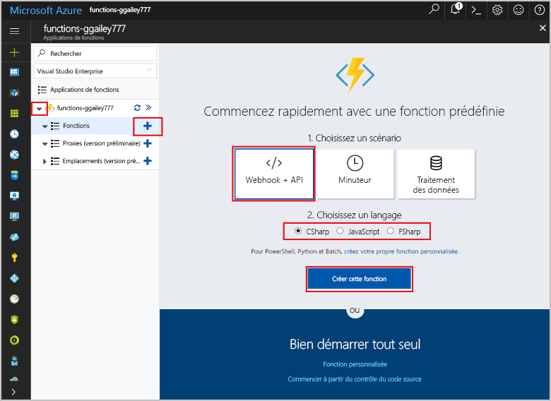
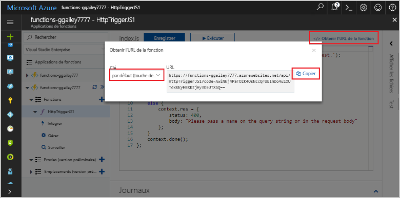
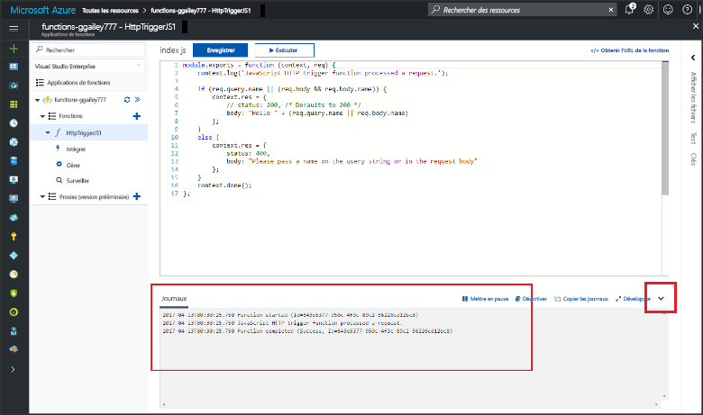

# Créer votre première fonction à l’aide du Portail Azure

Azure Functions vous permet d’exécuter votre code dans un environnement [sans serveur](https://azure.microsoft.com/overview/serverless-computing/) et sans avoir à créer une machine virtuelle ou à publier une application web au préalable. Dans cette rubrique, vous allez découvrir comment utiliser Functions pour créer une fonction « hello world » dans le portail Azure.

[!INCLUDE [quickstarts-free-trial-note](../../includes/quickstarts-free-trial-note.md)]

## Connexion à Azure

Connectez-vous au portail Azure à <http://portal.azure.com/> avec votre compte Azure.

## Créer une application de fonction

Vous devez disposer d’une Function App pour héberger l’exécution de vos fonctions. Une Function App vous permet de regrouper les fonctions en une unité logique pour faciliter la gestion, le déploiement et le partage des ressources. 

[!INCLUDE [Create function app Azure portal](../../includes/functions-create-function-app-portal-experiment.md)]

Créez ensuite une fonction dans la nouvelle Function App.

## Créer une fonction déclenchée via HTTP

1. Développez votre nouvelle Function App, puis cliquez sur le bouton **+** en regard de **Fonctions**.

2.  Sur la page **Commencez rapidement**, sélectionnez **WebHook + API**, **choisissez le langage** de votre fonction, puis cliquez sur **Créer cette fonction**. 
   
    

Une fonction est créée dans le langage que vous avez choisi à l’aide du modèle de fonction déclenchée via HTTP. Cette rubrique montre une fonction de script C# dans le portail, mais vous pouvez créer une fonction dans tout [langage pris en charge](supported-languages.md). 

Vous pouvez maintenant exécuter la nouvelle fonction en envoyant une requête HTTP.

## Tester la fonction

1. Dans votre nouvelle fonction, cliquez sur **</> Obtenir l’URL de la fonction** en haut à droite, sélectionnez **par défaut (touche de fonction)**, puis cliquez sur **Copier**. 

    

2. Collez l’URL de fonction dans la barre d’adresse de votre navigateur. Ajoutez la valeur de la chaîne de requête `&name=<yourname>` à la fin de cette URL et appuyez sur la touche `Enter` de votre clavier pour exécuter la requête. Vous devez voir la réponse renvoyée par la fonction affichée dans le navigateur.  

    L’exemple suivant montre la réponse dans le navigateur Edge (d’autres navigateurs peuvent inclure du XML affiché) :

    

    L’URL de demande inclut une clé qui est requise, par défaut, pour accéder à votre fonction sur HTTP.   

3. Lorsque votre fonction s’exécute, des informations de suivi sont écrites dans les journaux. Pour afficher la sortie de suivi de l’exécution précédente, revenez à votre fonction dans le portail et cliquez sur la flèche figurant en bas de l’écran pour développer **Journaux**. 

   

## Supprimer des ressources

[!INCLUDE [Clean-up resources](../../includes/functions-quickstart-cleanup.md)]

## Étapes suivantes

Vous avez créé une Function App avec une simple fonction déclenchée via HTTP.  

[!INCLUDE [Next steps note](../../includes/functions-quickstart-next-steps.md)]

Pour plus d’informations, consultez [Liaisons HTTP et webhook Azure Functions](functions-bindings-http-webhook.md).

