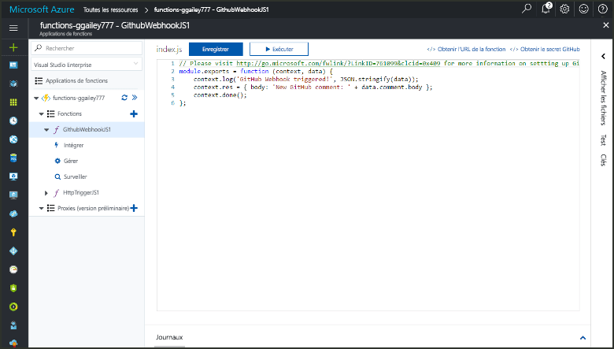
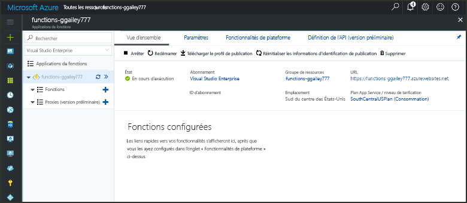
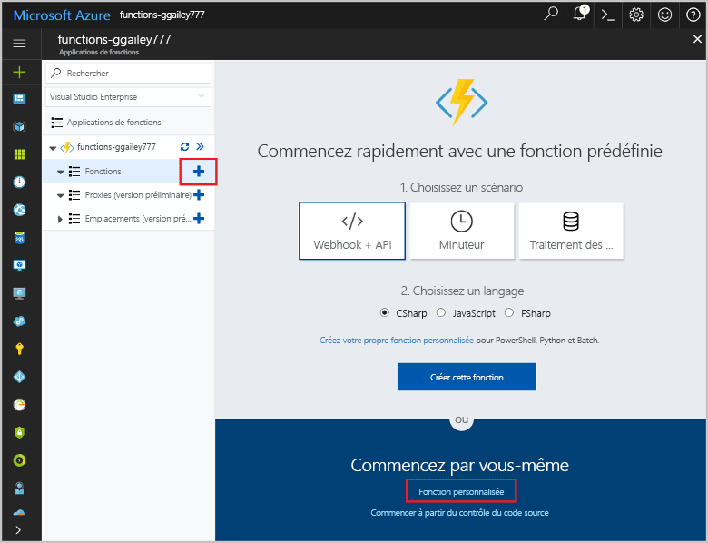
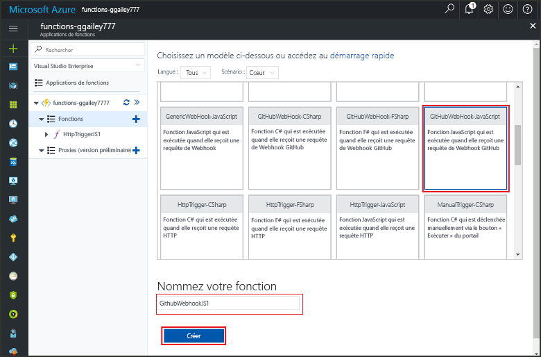
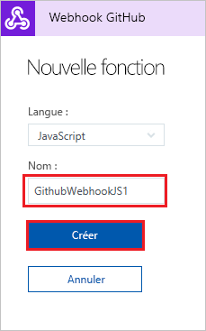
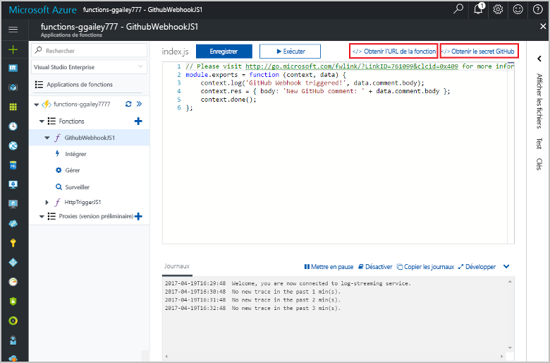
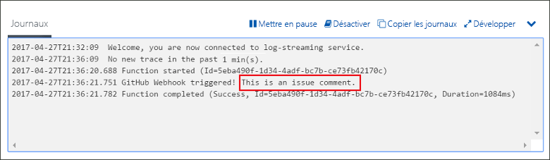

# Créer une fonction déclenchée par un webhook GitHub

Apprenez à créer une fonction qui est déclenchée par une demande webhook HTTP avec une charge utile GitHub.

## Prérequis

+ Un compte GitHub avec au moins un projet.
+ Un abonnement Azure. Si vous n’en avez pas, créez un [compte gratuit](https://azure.microsoft.com/free/?WT.mc_id=A261C142F) avant de commencer.

## Création d’une application Azure Function

[!INCLUDE [Create function app Azure portal](../../includes/functions-create-function-app-portal.md)]

Créez ensuite une fonction dans la nouvelle Function App.

## Créer une fonction de déclenchement de webhook GitHub

1. Développez votre Function App, puis cliquez sur le bouton **+** en regard de **Fonctions**. S’il s’agit de la première fonction de votre Function App, sélectionnez **Fonction personnalisée**. Cela affiche l’ensemble complet des modèles de fonction.

    

2. Dans la zone de recherche, saisissez `github`, puis sélectionnez la langue souhaitée pour le modèle déclencheur Webhook GitHub 

      

2. Saisissez un **Nom** pour votre fonction, puis sélectionnez **Créer**. 

      

3. Dans votre nouvelle fonction, cliquez sur **</> Obtenir l’URL de fonction**, puis copiez et enregistrez les valeurs. Faite la même chose pour **</> Obtenir le secret GitHub**. Vous avez besoin de ces valeurs pour configurer le webhook dans GitHub.

    

Ensuite, vous créez le webhook dans votre référentiel GitHub.

## Configurer le webhook

1. Dans GitHub, accédez à un référentiel que vous possédez. Vous pouvez également utiliser l’un des référentiels que vous avez dupliqués. Si vous avez besoin de dupliquer un référentiel, utilisez <https://github.com/Azure-Samples/functions-quickstart>.

2. Choisissez **Paramètres** > **Options** et assurez-vous que l’option **Problèmes** est activée sous **Fonctionnalités**.

   

1. Dans **Paramètres**, choisissez **Webhooks** > **Ajouter un Webhook**.

    

1. Utilisez les paramètres spécifiés dans la table suivante, puis cliquez sur **Ajouter un Webhook** :

    

| Paramètre | Valeur suggérée | Description |
|---|---|---|
| **URL de charge utile** | Valeur copiée | Utilisez la valeur retournée par **<>/ Obtenir une fonction URL**. |
| **Type de contenu** | application/json | La fonction attend une charge utile JSON. |
| **Secret**   | Valeur copiée | Utilisez la valeur retournée par **<>/ Obtenir un secret GitHub**. |
| Déclencheurs d’événement | Je vais sélectionner les événements individuels | Nous voulons seulement déclencher des événements de problème sous forme de commentaire.  |
| | Problème sous forme de commentaire |  |

À ce stade, le webhook est configuré pour déclencher la fonction au moment de l’ajout d’un nouveau problème sous forme de commentaire.

## Tester la fonction

1. Dans votre référentiel GitHub, ouvrez l’onglet **Problèmes** dans une nouvelle fenêtre de navigateur.

1. Dans la nouvelle fenêtre, cliquez sur **Nouveau problème**, saisissez un titre, puis cliquez sur **Envoyer nouveau problème**.

1. Dans le problème, entrez un commentaire et cliquez sur **Commentaire**.

    

1. Revenez au portail et afficher les journaux. Vous devez voir une entrée de suivi avec le nouveau commentaire textuel.

     

## Supprimer des ressources

[!INCLUDE [Next steps note](../../includes/functions-quickstart-cleanup.md)]

## Étapes suivantes

Vous avez créé une fonction qui est déclenchée lorsqu’une requête est reçue à partir d’un webhook GitHub.

[!INCLUDE [Next steps note](../../includes/functions-quickstart-next-steps.md)]

Pour en savoir plus sur les déclencheurs webhook, consultez la page [Liaisons HTTP et webhook d’Azure Functions](functions-bindings-http-webhook.md).
