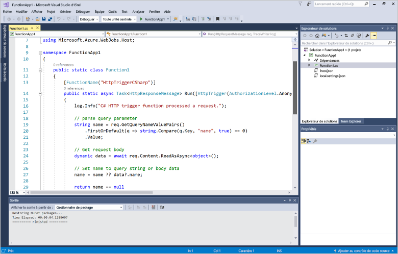
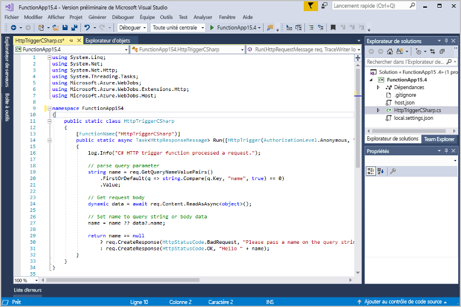
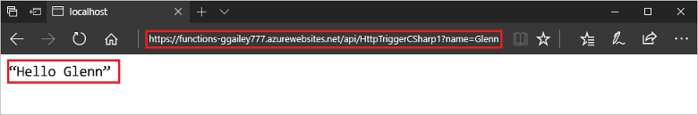

# Créer votre première fonction à l’aide de Visual Studio

Azure Functions vous permet d’exécuter votre code dans un environnement [sans serveur](https://azure.microsoft.com/overview/serverless-computing/) et sans avoir à créer une machine virtuelle ou à publier une application web au préalable.

Dans cet article, vous allez découvrir comment utiliser les outils Visual Studio 2017 pour Azure Functions afin de créer et de tester en local une fonction « Hello World ». Vous allez ensuite publier le code de la fonction dans Azure. Ces outils sont disponibles dans le cadre de la charge de travail de développement Azure dans Visual Studio 2017.

Cette rubrique inclut [une vidéo](#watch-the-video) qui présente les mêmes étapes de base.

## Prérequis

Pour suivre ce didacticiel :

* Installez [Visual Studio 2017 version 15.4](https://www.visualstudio.com/vs/) ou une version ultérieure comprenant la charge de travail **Développement Azure**.

    

* Assurez-vous d’avoir procédé à la mise à jour vers la version la plus récente d’Azure Functions et de WebJobs Tools. Effectuez cette vérification dans **Mises à jour** > **Visual Studio Marketplace** dans **Extensions et mises à jour**.
    
[!INCLUDE [quickstarts-free-trial-note](../../includes/quickstarts-free-trial-note.md)] 

## Créer un projet d’application de fonction

[!INCLUDE [Create a project using the Azure Functions template](../../includes/functions-vstools-create.md)]

Visual Studio crée un projet qui contient une classe qui présente un code réutilisable pour le type de fonction sélectionné. L’attribut **FunctionName** de la méthode définit le nom de la fonction. L’attribut **HttpTrigger** spécifie que la fonction est déclenchée par une requête HTTP. Le code réutilisable envoie une réponse HTTP qui inclut une valeur de la chaîne de requête ou du corps de requête. Vous pouvez ajouter des liaisons d’entrée et de sortie à une fonction en appliquant les attributs appropriés à la méthode. Pour plus d’informations, voir la section [Déclencheurs et liaisons](functions-dotnet-class-library.md#triggers-and-bindings) de l’article [Informations de référence pour les développeurs C# sur Azure Functions](functions-dotnet-class-library.md).

Maintenant que vous avez créé un projet de fonction et une fonction déclenchée via HTTP, vous pouvez la tester sur votre ordinateur local.

## Tester la fonction en local

Azure Functions Core Tools vous permet d’exécuter un projet Azure Functions sur votre ordinateur de développement local. Vous êtes invité à installer ces outils la première fois que vous démarrez une fonction dans Visual Studio.  

1. Pour tester votre fonction, appuyez sur F5. Si vous y êtes invité, acceptez la requête dans Visual Studio pour télécharger et installer Azure Functions Core (CLI) Tools. Vous devrez peut-être activer une exception de pare-feu afin de permettre aux outils de prendre en charge les requêtes HTTP.

2. Copiez l’URL de votre fonction à partir de la sortie runtime Azure Functions.  

    

3. Collez l’URL de la demande HTTP dans la barre d’adresses de votre navigateur. Ajoutez la chaîne de requête `?name=<yourname>` à cette URL et exécutez la demande. La capture d’écran suivante du navigateur montre la requête renvoyée par la fonction suite à la demande locale GET : 

    

4. Pour arrêter le débogage, appuyez sur MAJ + F5.

Après avoir vérifié que la fonction s’exécute correctement sur votre ordinateur local, il est temps de publier le projet sur Azure.

## Publication du projet sur Azure

Vous devez disposer d’une application de fonction dans votre abonnement Azure avant de pouvoir publier votre projet. Vous pouvez créer une application de fonction directement à partir de Visual Studio.

[!INCLUDE [Publish the project to Azure](../../includes/functions-vstools-publish.md)]

## Tester votre fonction dans Azure

1. Copiez l’URL de base de l’application de fonction à partir de la page de profil de publication. Remplacez la partie `localhost:port` de l’URL que vous avez utilisée lors du test en local de la fonction par la nouvelle URL de base. Comme auparavant, assurez-vous d’ajouter la chaîne de requête `?name=<yourname>` à cette URL et exécutez la demande.

    L’URL qui appelle la fonction déclenchée via HTTP doit être au format suivant :

        http://<functionappname>.azurewebsites.net/api/<functionname>?name=<yourname> 

2. Collez cette nouvelle URL de requête HTTP dans la barre d’adresse de votre navigateur. La capture d’écran suivante du navigateur montre la requête renvoyée par la fonction suite à la demande distante GET : 

    

## Regarder la vidéo

> [!VIDEO https://www.youtube-nocookie.com/embed/DrhG-Rdm80k]

## étapes suivantes

Vous avez utilisé Visual Studio pour créer et publier une application de fonction C# à l’aide d’une fonction HTTP déclenchée simple. 

+ Pour savoir comment configurer votre projet de façon qu’il prenne en charge d’autres types de déclencheurs et liaisons, consultez la section [Configurer le projet pour un développement local](functions-develop-vs.md#configure-the-project-for-local-development) de [Azure Functions Tools pour Visual Studio](functions-develop-vs.md).
+ Pour en savoir plus sur le test et le débogage local à l’aide d’Azure Functions Core Tools, consultez la page [Procédure locale de codage et de test d’Azure Functions](functions-run-local.md). 
+ Pour en savoir plus sur le développement de fonctions en tant que bibliothèques de classes .NET, consultez [Utilisation de bibliothèques de classes .NET avec Azure Functions](functions-dotnet-class-library.md). 

