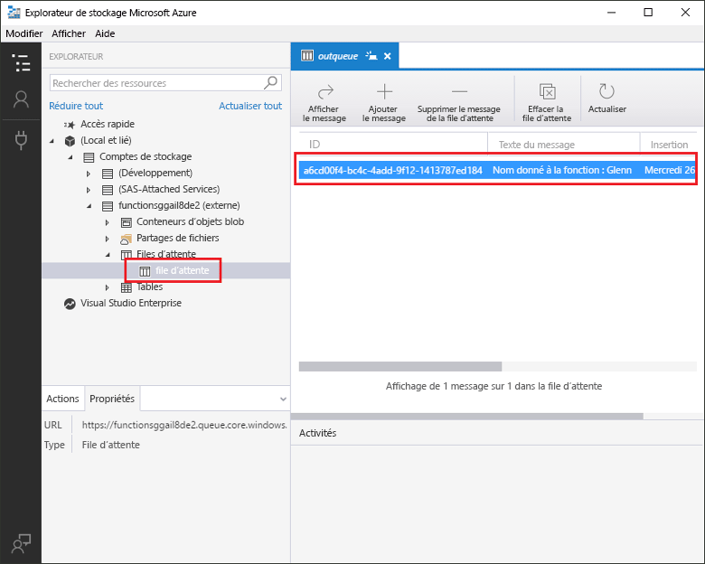
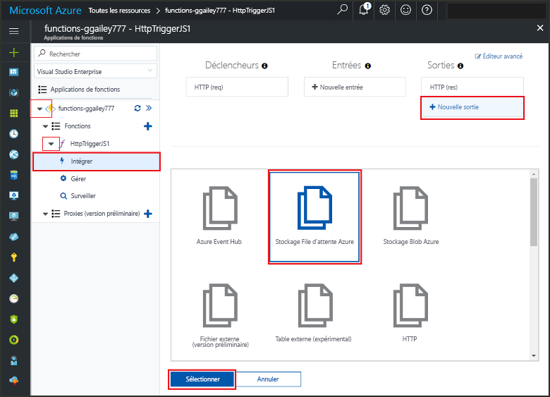
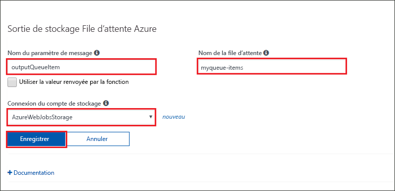
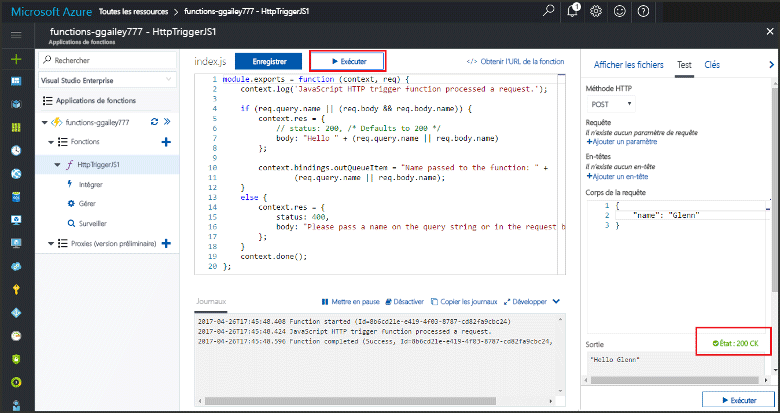
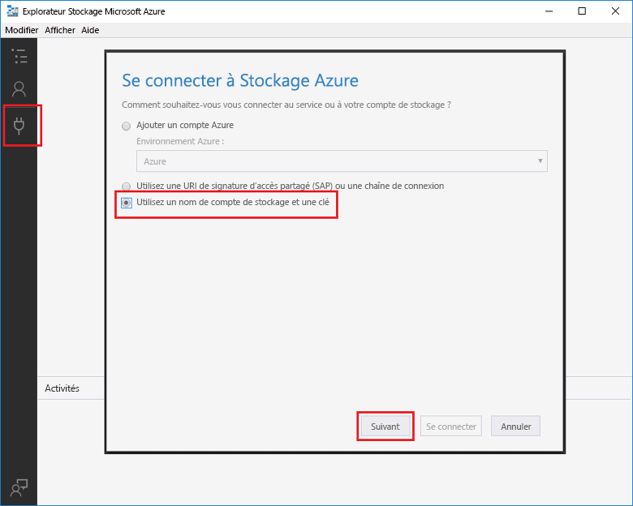
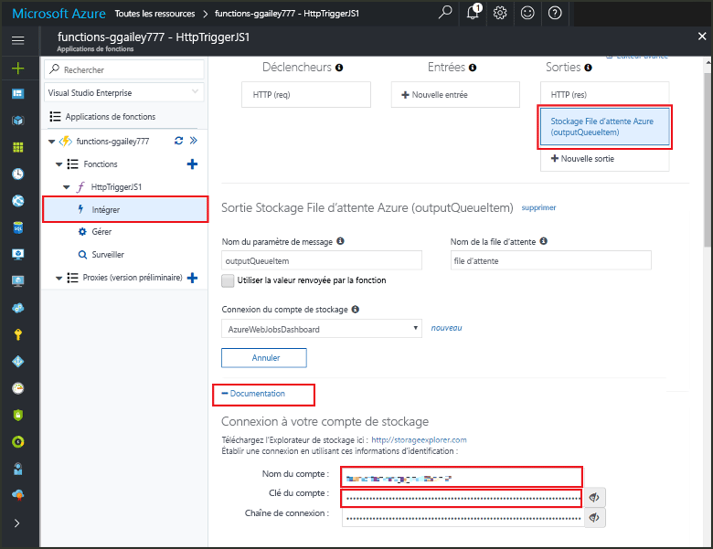
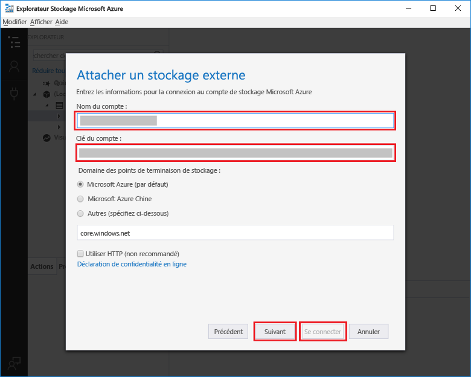

# <a name="add-messages-to-an-azure-storage-queue-using-functions"></a>Ajouter des messages au stockage de files d’attente Azure, à l’aide de Functions

Dans Azure Functions, les liaisons d’entrée et de sortie fournissent une méthode déclarative pour rendre disponibles les données des services externes pour votre code. Dans ce démarrage rapide, vous utilisez une liaison de sortie pour créer un message dans une file d’attente lorsqu’une fonction est déclenchée par une requête HTTP. Vous utilisez l’Explorateur Stockage Azure pour afficher les messages de file d’attente créés par votre fonction :



## <a name="prerequisites"></a>configuration requise 

Pour effectuer ce démarrage rapide :

* Suivez les instructions de [Créer votre première fonction à l’aide du Portail Azure](functions-create-first-azure-function.md) en ignorant l’étape **Supprimer des ressources**. Ce démarrage rapide crée l’application de fonction, ainsi que la fonction que vous utilisez ici.

* Installez [l’Explorateur Stockage Microsoft Azure](http://storageexplorer.com/). Il s’agit d’un outil que vous allez utiliser pour examiner les messages en file d’attente créés par votre liaison de sortie.

## <a name="add-binding"></a>Ajoutez une liaison de sortie

Dans cette section, l’interface utilisateur du portail vous permet d’ajouter une liaison de sortie de stockage de file d’attente à la fonction que vous avez créée précédemment. Cette liaison permettra d’écrire un minimum de code pour créer un message dans une file d’attente. Vous n’êtes pas obligé d’écrire du code pour des tâches telles que l’ouverture d’une connexion de stockage, la création d’une file d’attente ou l’obtention d’une référence à une file d’attente. La liaison de sortie de file d’attente et le runtime Azure Functions se chargent de ces tâches.

1. Dans le portail Azure, ouvrez la page d’application de fonction correspondant à l’application de fonction que vous avez créée dans [Créer votre première fonction à l’aide du Portail Azure](functions-create-first-azure-function.md). Pour ce faire, sélectionnez **Tous les services > Applications de fonction**, puis sélectionnez votre application de fonction.

2. Sélectionnez la fonction que vous avez créée dans ce démarrage rapide précédent.

1. Sélectionnez **Intégrer > Nouvelle sortie > Stockage File d’attente Azure**.

1. Cliquez sur **Sélectionner**.
    
    

3. Sous **Azure Queue Storage output** (Sortie de Stockage File d’attente Azure), utilisez les paramètres indiqués dans le tableau qui suit cette capture d’écran : 

    

    | Paramètre      |  Valeur suggérée   | Description                              |
    | ------------ |  ------- | -------------------------------------------------- |
    | **Nom de message de paramètre** | outputQueueItem | Le nom du paramètre de liaison de sortie. | 
    | **Connexion au compte de stockage** | AzureWebJobsStorage | Vous pouvez utiliser la connexion de compte de stockage qui est déjà utilisée par votre application de fonction, ou créez-en une.  |
    | **Nom de la file d’attente**   | outqueue    | Le nom de la file d’attente à connecter à votre compte de stockage. |

4. Cliquez sur **Enregistrer** pour ajouter la liaison.
 
Maintenant que vous avez défini une liaison de sortie, vous devez mettre à jour le code afin d’utiliser la liaison pour ajouter des messages à une file d’attente.  

## <a name="add-code-that-uses-the-output-binding"></a>Ajouter le code qui utilise la liaison de sortie

Dans cette section, vous ajoutez le code qui écrit un message dans la file d’attente de sortie. Le message contient la valeur qui est transmise au déclencheur HTTP dans la chaîne de requête. Par exemple, si la chaîne de requête inclut `name=Azure`, le message de la file d’attente sera *Nom transmis à la fonction : Azure*.

1. Sélectionnez la fonction pour afficher le code de fonction dans l’éditeur. 

2. Pour une fonction C#, ajoutez un paramètre de méthode pour la liaison et écrivez du code pour l’utiliser :

   Ajoutez un paramètre **outputQueueItem** à la signature de méthode, comme indiqué dans l’exemple suivant. Le nom du paramètre est celui que vous avez entré pour **Nom du paramètre de message** lors de la création de la liaison.

   ```cs   
   public static async Task<HttpResponseMessage> Run(HttpRequestMessage req, 
       ICollector<string> outputQueueItem, TraceWriter log)
   {
       ...
   }
   ```

   Dans le corps de la fonction C# juste avant l’instruction `return`, ajoutez le code qui utilise le paramètre pour créer un message de file d’attente.

   ```cs
   outputQueueItem.Add("Name passed to the function: " + name);     
   ```

3. Pour une fonction JavaScript, ajoutez le code qui utilise la liaison de sortie sur l’objet `context.bindings` pour créer un message de file d’attente. Ajoutez ce code avant l’instruction `context.done`.

   ```javascript
   context.bindings.outputQueueItem = "Name passed to the function: " + 
               (req.query.name || req.body.name);
   ```

4. Sélectionnez **Enregistrer** pour enregistrer les modifications.
 
## <a name="test-the-function"></a>Tester la fonction 

1. Après avoir enregistré les modifications de code, sélectionnez **Exécuter**. 

    

   Notez que **Corps de la demande** contient la valeur `name` *Azure*. Cette valeur s’affiche dans le message de file d’attente qui est créé lorsque la fonction est appelée.

   Plutôt que de sélectionner **Exécuter** ici, vous pouvez appeler la fonction en entrant une URL dans un navigateur et en spécifiant la valeur `name` dans la chaîne de requête. La méthode du navigateur est affichée dans le [démarrage rapide précédent](functions-create-first-azure-function.md#test-the-function).

2. Vérifiez les journaux pour vous assurer que la fonction a réussi. 

Une nouvelle file d’attente nommée **outqueue** est créée dans votre compte de stockage, par le runtime des fonctions, lorsque la liaison de sortie est utilisée pour la première fois. Vous allez utiliser l’Explorateur Stockage pour vérifier que la file d’attente et un message dans celle-ci ont bien été créés.

### <a name="connect-storage-explorer-to-your-account"></a>Connecter l’Explorateur Stockage à votre compte

Ignorez cette section si vous avez déjà installé et connecté l’Explorateur Stockage au compte de stockage que vous utilisez dans ce démarrage rapide.

2. Exécutez [l’Explorateur de stockage Microsoft Azure](http://storageexplorer.com/), sélectionnez l’icône de connexion située sur la gauche, choisissez **Utiliser un nom et une clé de compte de stockage**, puis sélectionnez **Suivant**.

    

1. Dans le portail Azure, sur la page d’application de fonction, sélectionnez votre fonction, puis **Intégrer**.

1. Sélectionnez la liaison de sortie **Stockage File d’attente Azure** que vous avez ajoutée lors d’une étape précédente.

1. Développez la section **Documentation** en bas de la page. 

   Le portail affiche des informations d’identification que vous pouvez utiliser dans l’Explorateur Stockage pour vous connecter au compte de stockage.

   

1. Copiez la valeur de **Nom du compte** à partir du portail, puis collez-la dans le champ **Nom du compte** de l’Explorateur Stockage.
 
1. Cliquez sur l’icône d’affichage/de masquage en regard de **Clé du compte** pour afficher la valeur, puis copiez la valeur de **Clé du compte** et collez-la dans le champ **Clé du compte** de l’Explorateur Stockage.
  
3. Sélectionnez **Suivant > Connecter**.

   

### <a name="examine-the-output-queue"></a>Analyser la file d’attente de sortie

4. Dans l’Explorateur Stockage, sélectionnez le compte de stockage que vous utilisez pour ce démarrage rapide.

1. Développez le nœud **Files d’attente**, puis sélectionnez la file d’attente nommée **outqueue**. 

   La file d’attente contient le message que la liaison de sortie de file d’attente a créé lors de l’exécution de la fonction déclenchée via HTTP. Si vous avez appelé la fonction avec la valeur `name` par défaut de *Azure*, le message de la file d’attente est *Nom transmis à la fonction : Azure*.

    

2. Exécutez de nouveau la fonction, et vous verrez un nouveau message s’afficher dans la file d’attente.  

## <a name="clean-up-resources"></a>Supprimer des ressources

[!INCLUDE [Clean up resources](../../includes/functions-quickstart-cleanup.md)]

## <a name="next-steps"></a>Étapes suivantes

Dans ce démarrage rapide, vous avez ajouté une liaison de sortie à une fonction existante. Pour en savoir plus sur la liaison vers le stockage de files d’attente, consultez la page [Liaisons de file d’attente de stockage Azure Functions](functions-bindings-storage-queue.md). 

[!INCLUDE [Next steps note](../../includes/functions-quickstart-next-steps.md)]
