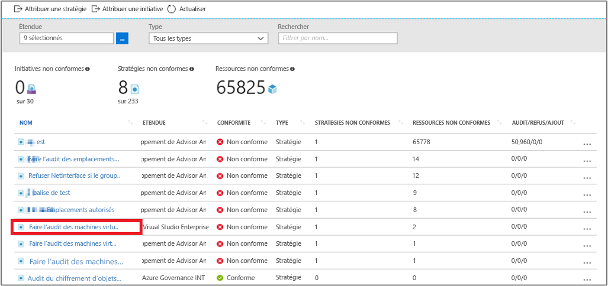

# <a name="create-a-policy-assignment-to-identify-non-compliant-resources-in-your-azure-environment-with-the-azure-cli"></a>Créer une affectation de stratégie pour identifier les ressources non conformes dans votre environnement Azure en utilisant l’interface de ligne de commande Azure

La première étape pour comprendre la conformité dans Azure consiste à identifier l’état de vos ressources. Ce démarrage rapide vous guide pas à pas dans le processus de création d’une affectation de stratégie pour identifier les machines virtuelles qui n’utilisent pas de disques gérés.

À la fin de ce processus, vous aurez identifié correctement les machines virtuelles qui n’utilisent pas de disques gérés. Elles sont *non conformes* avec l’affectation de stratégie.

Si vous n’avez pas d’abonnement Azure, créez un compte [gratuit](https://azure.microsoft.com/free/) avant de commencer.

[!INCLUDE [cloud-shell-try-it.md](../../includes/cloud-shell-try-it.md)]

Ce démarrage rapide nécessite que vous exécutiez la version 2.0.4 minimum d’Azure CLI pour installer et utiliser l’interface de ligne de commande en local. Exécutez `az --version` pour trouver la version. Si vous devez installer ou mettre à niveau, consultez [Installation d’Azure CLI 2.0]( /cli/azure/install-azure-cli).

## <a name="create-a-policy-assignment"></a>Créer une affectation de stratégie

Dans ce guide de démarrage rapide, nous créons une affectation de stratégie et attribuons la définition Audit Virtual Machines without Managed Disks (Auditer des machines virtuelles sans disques gérés). Cette définition de stratégie identifie les ressources qui ne sont pas conformes aux conditions définies dans la définition de stratégie.

Suivez cette procédure pour créer une affectation de stratégie :

1. Inscrivez le fournisseur de ressources Policy Insights pour vous assurer que votre abonnement fonctionne avec le fournisseur de ressources. Pour inscrire un fournisseur de ressources, vous devez être autorisé à effectuer l’opération d’inscription pour le fournisseur de ressources. Cette opération est incluse dans les rôles de contributeur et de propriétaire.

    Inscrivez le fournisseur de ressources en exécutant la commande suivante :

    ```azurecli
    az provider register --namespace Microsoft.PolicyInsights
    ```

    La commande retourne un message indiquant que l’inscription est en cours.

    Vous ne pouvez pas annuler l’inscription d’un fournisseur de ressources en ayant des types de ressources de ce fournisseur de ressources dans votre abonnement. Pour plus d’informations sur l’inscription et l’affichage des fournisseurs de ressources, consultez [Fournisseurs et types de ressources](../azure-resource-manager/resource-manager-supported-services.md).

2. Affichez toutes les définitions de stratégie et recherchez la définition de stratégie *Audit Virtual Machines without Managed Disks* (Auditer des machines virtuelles sans disques gérés) :

    ```azurecli
az policy definition list
```

    Azure Policy est fourni avec des définitions de stratégie intégrées que vous pouvez utiliser. Vous voyez des définitions de stratégie intégrées comme :

    - Imposer une étiquette et sa valeur
    - Apply tag and its value
    - Nécessitent SQL Server version 12.0

3. Fournissez ensuite les informations suivantes et exécutez la commande suivante pour affecter la définition de stratégie :

    - **Nom** d’affichage pour l’affectation de stratégie. Dans ce cas, nous allons utiliser *Audit Virtual Machines without Managed Disks (Auditer des machines virtuelles sans disques gérés)*.
    - **Stratégie** : c’est la définition de stratégie, que vous utilisez comme base pour créer l’affectation. Dans ce cas, il s’agit de la définition de stratégie *Audit Virtual Machines without Managed Disks (Auditer des machines virtuelles sans disques gérés)*.
    - Une **étendue** : une étendue détermine les ressources ou le regroupement de ressources sur lequel la stratégie est appliquée. Elle va d’un abonnement à des groupes de ressources.

    Utilisez l’abonnement (ou le groupe de ressources) précédemment enregistré. Dans cet exemple, nous utilisons l’ID d’abonnement**bc75htn-a0fhsi-349b-56gh-4fghti-f84852** et le nom de groupe de ressources : **FabrikamOMS**. Veillez à remplacer ces paramètres par l’ID d’abonnement et le nom du groupe de ressources que vous utilisez.

    La commande doit ressembler à :

    ```azurecli
az policy assignment create --name Audit Virtual Machines without Managed Disks Assignment --policy Audit Virtual Machines without Managed Disks --scope /subscriptions/
bc75htn-a0fhsi-349b-56gh-4fghti-f84852/resourceGroups/FabrikamOMS
```

Une affectation de stratégie est une stratégie qui a été affectée pour être appliquée dans une étendue spécifique. Cette étendue peut également aller d’un groupe d’administration à un groupe de ressources.

## <a name="identify-non-compliant-resources"></a>Identifier les ressources non conformes

Pour afficher les ressources qui ne sont pas conformes à cette nouvelle affectation :

1. Revenez à la page Stratégie Azure.
2. Sélectionnez **Conformité** dans le volet gauche, puis recherchez **l’affectation de stratégie** que vous avez créée.

   

   Toute ressource existante non conforme à cette nouvelle affectation apparaît sous l’onglet **Ressources non conformes**. L’image précédente affiche des exemples de ressources non conformes.

## <a name="clean-up-resources"></a>Supprimer des ressources

D’autres guides de cette collection sont basés sur ce démarrage rapide. Si vous prévoyez de continuer avec les didacticiels suivants, ne nettoyez pas les ressources créées dans ce démarrage rapide. Dans le cas contraire, supprimez l’affectation que vous avez créée en exécutant cette commande :

```azurecli
az policy assignment delete –name  Assignment --scope /subscriptions/ bc75htn-a0fhsi-349b-56gh-4fghti-f84852 resourceGroups/ FabrikamOMS
```

## <a name="next-steps"></a>Étapes suivantes

Dans ce démarrage rapide, vous avez affecté une définition de stratégie pour identifier les ressources non conformes de votre environnement Azure.

Pour plus d’informations sur l’affectation de stratégies et garantir que les ressources que vous créerez **à l’avenir** sont conformes, continuez avec le didacticiel pour :

> [!div class="nextstepaction"]
> [Création et gestion des stratégies](./create-manage-policy.md)
