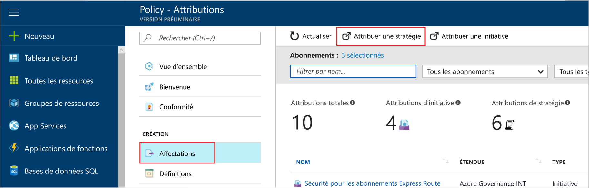
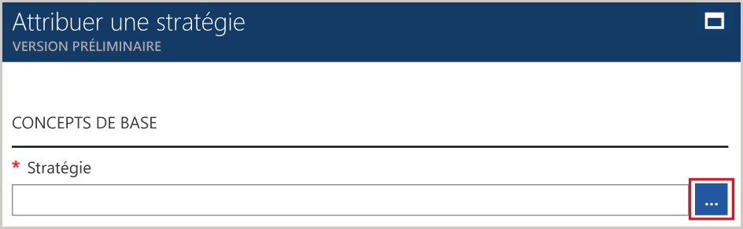
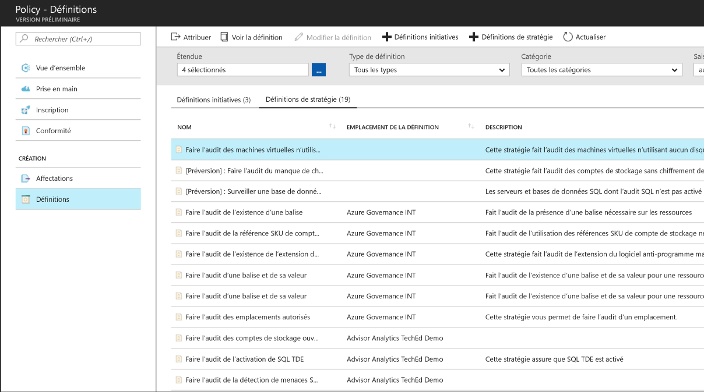
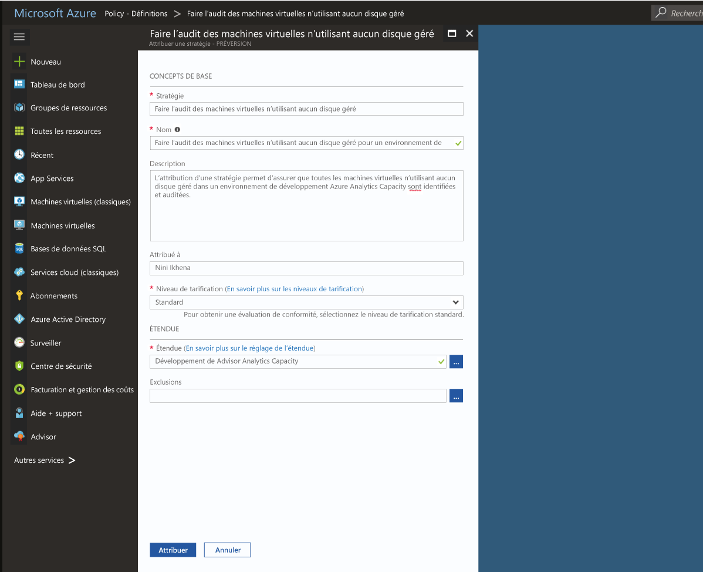
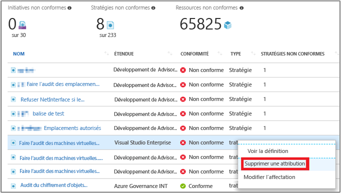

# Créer une affectation de stratégie pour identifier les ressources non conformes dans votre environnement Azure
La première étape pour comprendre la conformité dans Azure consiste à identifier l’état de vos ressources. Ce démarrage rapide vous guide pas à pas dans le processus de création d’une affectation de stratégie pour identifier les machines virtuelles qui n’utilisent pas de disques gérés.

À la fin de ce processus, vous aurez identifié correctement les machines virtuelles qui n’utilisent pas de disques gérés. Elles sont *non conformes* avec l’affectation de stratégie.

Si vous n’avez pas d’abonnement Azure, créez un [compte gratuit](https://azure.microsoft.com/free/?WT.mc_id=A261C142F) avant de commencer.

## Créer une affectation de stratégie

Dans ce guide de démarrage rapide, vous créez une affectation de stratégie et attribuez la définition de stratégie *Audit Virtual Machines without Managed Disks* (Auditer des machines virtuelles sans disques gérés).

1. Sélectionnez **Attributions** dans le volet gauche de la page Azure Policy.
2. Sélectionnez **Assigner une stratégie** en haut du volet **Affectations**.

   

3. Dans la page **Assigner une stratégie**, cliquez sur le  situé en regard du champ **Stratégie** pour afficher la liste des définitions disponibles.

   

   Azure Policy est fourni avec des définitions de stratégie intégrées que vous pouvez utiliser. Vous y trouverez des définitions de stratégie intégrées comme :

   - Enforce tag and its value
   - Apply tag and its value
   - Require SQL Server version 12.0

    Pour obtenir une liste complète de toutes les stratégies intégrées disponibles, consultez [Modèles pour Azure Policy](json-samples.md).

4. Parcourez vos définitions de stratégie pour rechercher la définition *Audit VMs that do not use managed disks (Auditer des machines virtuelles qui n’utilisent pas de disques gérés)*. Cliquez sur cette stratégie, puis sur **Sélectionner**.

   

5. Attribuez un **Nom** d’affichage à l’affectation de stratégie. Dans ce cas, nous allons utiliser la définition *Audit VMs that do not use managed disks (Auditer des machines virtuelles qui n’utilisent pas de disques gérés)*. Vous pouvez également ajouter une **Description** (facultatif). La description fournit des détails sur la façon dont l’affectation de stratégie identifie toutes les machines virtuelles qui n’utilisent pas de disques gérés.
6. Définissez le niveau tarifaire sur **Standard** pour vous assurer que la stratégie soit appliquée aux ressources existantes.

   Il existe deux niveaux tarifaires dans Azure Policy : *Gratuit* et *Standard*. Avec le niveau Gratuit, vous pouvez uniquement appliquer des stratégies à des ressources futures, alors qu’avec le niveau Standard, vous pouvez également les appliquer à des ressources existantes pour mieux comprendre votre état de conformité. Pour en savoir plus sur les prix, consultez [Tarification Azure Policy](https://azure.microsoft.com/pricing/details/azure-policy/).

7. Sélectionnez l’**étendue** d’application souhaitée de la stratégie.  Une étendue détermine les ressources ou le regroupement de ressources sur lequel la stratégie est appliquée. Elle va d’un abonnement à des groupes de ressources.
8. Sélectionnez l’abonnement (ou le groupe de ressources) précédemment enregistré. Dans cet exemple, l’abonnement **Azure Analytics Capacity Dev** est utilisé, mais vos options peuvent différer. Cliquez sur **Sélectionner**.

   

9. Laissez **Exclusions** vide pour l’instant, puis cliquez sur **Affecter**.

Vous êtes maintenant prêt à identifier les ressources non conformes pour comprendre l’état de conformité de votre environnement.

## Identifier les ressources non conformes

Sélectionnez **Conformité** dans le volet gauche, puis recherchez l’affectation de stratégie que vous avez créée.

Si des ressources existantes ne sont pas conformes à cette nouvelle affectation, elles apparaissent sous **Ressources non conformes**.

Si une condition est évaluée par rapport à vos ressources existantes et génère la valeur true, ces ressources sont marquées comme non conformes à la stratégie. L’image de l’exemple précédent affiche les ressources non conformes. Le tableau suivant montre comment différentes actions de stratégie fonctionnent avec l’évaluation des conditions pour l’état de conformité qui en résulte. Même si vous ne voyez pas la logique d’évaluation dans le portail Azure, les résultats d’état de conformité sont affichés. Le résultat d’état de conformité est soit conforme, soit non conforme.

|Ressource  |Si la condition dans la stratégie a la valeur  |Action dans la stratégie   |État de conformité  |
|-----------|---------|---------|---------|
|Exists     |True     |Deny     |Non conforme |
|Exists     |False    |Deny     |Conforme     |
|Exists     |True     |Append   |Non conforme |
|Exists     |False    |Append   |Conforme     |
|Exists     |True     |Audit    |Non conforme |
|Exists     |False    |Audit    |Non conforme |

## Supprimer des ressources

D’autres guides de cette collection sont basés sur ce démarrage rapide. Si vous prévoyez de continuer avec les didacticiels suivants, ne nettoyez pas les ressources créées dans ce démarrage rapide. Sinon, procédez comme suit pour supprimer toutes les ressources créées au cours de ce démarrage rapide dans le portail Azure.
1. Sélectionnez **Attributions** dans le volet gauche.
2. Recherchez l’affectation que vous avez créée, puis cliquez avec le bouton droit dessus.

   

3.  Sélectionnez **Supprimer l’affectation**.

## Étapes suivantes

Dans ce démarrage rapide, vous avez affecté une définition de stratégie à une étendue. La définition de stratégie permet de s’assurer que toutes les ressources dans l’étendue sont conformes, ainsi que d’identifier celles qui ne le sont pas.

Pour plus d’informations sur l’affectation de stratégies et garantir que les ressources **futures** qui sont créées sont conformes, continuez avec le didacticiel suivant :

> [!div class="nextstepaction"]
> [Création et gestion des stratégies](./create-manage-policy.md)
