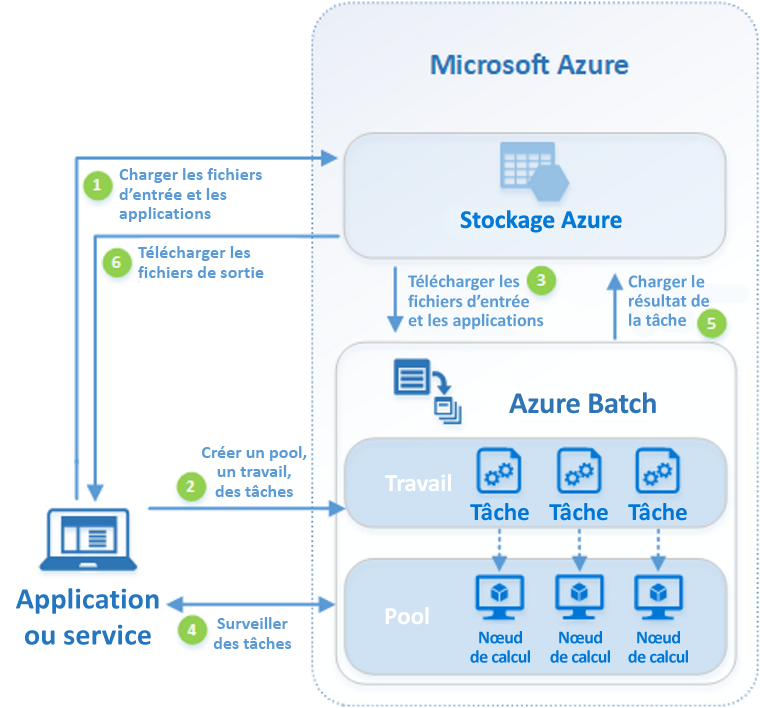

# Présentation d’Azure Batch

Utilisez Azure Batch pour exécuter des programmes de traitement par lots de calcul haute performance (HPC) en parallèle, efficacement et à grande échelle dans Azure. Azure Batch crée et gère un pool de nœuds de calcul (machines virtuelles), installe les applications que vous souhaitez exécuter, et planifie les travaux à exécuter sur les nœuds. Il n’y a aucun logiciel de planificateur de travail ou de cluster à installer, gérer ou mettre à l’échelle. Au lieu de cela, vous utilisez des [outils et des API Batch](batch-apis-tools.md), des scripts de ligne de commande, ou le portail Azure pour configurer, gérer et surveiller vos travaux. 

Les développeurs peuvent utiliser Azure Batch en tant que service de plateforme pour générer des applications SaaS ou des applications clientes où l’exécution à grande échelle est requise. Par exemple, créez un service avec Batch pour exécuter une simulation de risque Monte Carlo pour une société de services financiers, ou un service pour traiter de nombreuses images.

L’utilisation d’Azure Batch n’engendre pas de frais supplémentaires. Vous payez uniquement pour les ressources sous-jacentes consommées, telles que les machines virtuelles, le stockage et la mise en réseau.

Pour obtenir une comparaison entre Batch et d’autres solutions HPC utilisées dans Azure, consultez [HPC, Batch, and Big Compute solutions using Azure VMs](../virtual-machines/linux/high-performance-computing.md) (Solutions HPC, Batch et Big Compute utilisant des machines virtuelles Azure).

## Exécuter des charges de travail parallèles
Le service Batch fonctionne parfaitement avec les charges de travail intrinsèquement parallèles (ou « massivement parallèles »). Les charges de travail intrinsèquement parallèles sont celles où les applications peuvent s’exécuter indépendamment et chaque instance termine une partie du travail. Lorsque les applications sont en cours d’exécution, elles peuvent accéder à certaines données communes, mais elles ne communiquent pas avec d’autres instances de l’application. Les charges de travail intrinsèquement parallèles peuvent donc être exécutées à grande échelle, déterminée par la quantité de ressources de calcul disponibles pour exécuter simultanément des applications.

Voici quelques exemples de charges de travail intrinsèquement parallèles que vous pouvez utiliser dans Azure Batch :

* Modélisation de risques financiers à l’aide de simulations Monte Carlo
* Rendu d’image VFX et 3D
* Analyse et traitement d’images
* Transcodage multimédia
* Analyse de séquence génétique
* Reconnaissance optique de caractères (OCR)
* Ingestion de données, traitement et opérations ETL
* Exécution de tests logiciels

Vous pouvez également utiliser Azure Batch pour [exécuter des charges de travail fortement couplées](batch-mpi.md) ; dans ces charges de travail, les applications que vous exécutez doivent communiquer entre elles, et non s’exécuter indépendamment. Les applications fortement couplées utilisent normalement l’API d’interface MPI (Message Passing Interface). Vous pouvez exécuter vos charges de travail fortement couplées avec Azure Batch à l’aide de [Microsoft MPI](https://msdn.microsoft.com/library/bb524831(v=vs.85).aspx) ou Intel MPI. Améliorez les performances de l’application avec les tailles de machine virtuelle spécialisées [HPC](../virtual-machines/linux/sizes-hpc.md) et [Optimisé pour le GPU](../virtual-machines/linux/sizes-gpu.md).

Voici quelques exemples de charges de travail fortement couplées :
* Analyse des éléments finis
* Dynamique des fluides
* Formation d’intelligence artificielle à nœuds multiples

De nombreux travaux fortement couplés peuvent être exécutés en parallèle à l’aide d’Azure Batch. Par exemple, effectuez plusieurs simulations de liquide transitant via un canal avec des largeurs de canal différentes.

## Fonctionnalités supplémentaires d’Azure Batch

Des fonctionnalités de niveau supérieur, spécifiques à la charge de travail sont également disponibles pour Azure Batch :
* Azure Batch prend en charge les [charges de travail de rendu](batch-rendering-service.md) à grande échelle avec les outils de rendu notamment Autodesk Maya, 3ds Max, Arnold et V-Ray. 
* Les utilisateurs R peuvent installer le [package doAzureParallel R](https://github.com/Azure/doAzureParallel) pour augmenter facilement la taille de l’exécution d’algorithmes R sur les pools Batch.

Vous pouvez également exécuter des travaux Batch dans le cadre d’un plus grand flux de travail Azure pour transformer des données, gérées par des outils comme [Azure Data Factory](../data-factory/v1/data-factory-data-processing-using-batch.md).

## Fonctionnement
Un scénario courant pour Azure Batch suppose une montée en charge de travaux intrinsèquement parallèles, par exemple, le rendu d’images pour les scènes 3D, sur un pool de nœuds de calcul. Ce pool de nœuds de calcul peut être une « ferme de rendu » qui fournit des dizaines, des centaines voire des milliers de cœurs à votre travail de rendu.

Le schéma suivant illustre les étapes d’un flux de travail Batch courant, dans lequel une application cliente ou un service hébergé utilise Batch pour exécuter une charge de travail parallèle.

|Étape  |Description  |
|---------|---------|
|1.  Charger les **fichiers d’entrée** et les **applications** nécessaires pour le traitement des fichiers dans votre compte Stockage Azure.     |Les fichiers d’entrée peuvent correspondre à des données que votre application traite (par exemple, des données de modélisation financière ou des fichiers vidéo à transcoder). Les fichiers d’application peuvent inclure des scripts ou applications qui traitent les données, comme un transcodeur média.|
|2.  Créer un **pool** Batch de nœuds de calcul dans votre compte Batch, un **travail** pour exécuter la charge de travail sur le pool et des **tâches** dans le travail.     | Les nœuds de pool sont les machines virtuelles qui exécutent vos tâches. Spécifiez des propriétés telles que le nombre et la taille des nœuds, une image de machine virtuelle Windows ou Linux et une application à installer lorsque les nœuds rejoignent le pool. Gérez le coût et la taille du pool à l’aide de [machines virtuelles de faible priorité](batch-low-pri-vms.md) ou en [mettant à l’échelle automatiquement](batch-automatic-scaling.md) le nombre de nœuds durant que la charge de travail change.   Lorsque vous ajoutez des tâches à un travail, le service Batch planifie automatiquement l’exécution des tâches sur les nœuds de calcul du pool. Chaque tâche utilise l’application que vous avez téléchargée pour traiter les fichiers d’entrée. |
|3.  Télécharger des **fichiers d’entrée** et des **applications** vers Azure Batch     |Avant son exécution, chaque tâche peut charger les données d’entrée qu’elle devra traiter dans le nœud de calcul assigné. Si l’application n’a pas déjà été installée sur les nœuds du pool, vous pouvez la télécharger à cet emplacement. Lorsque les téléchargements depuis Stockage Azure se terminent, la tâche s’exécute sur le nœud assigné.|
|4.  Surveiller l’**exécution d’une tâche**     |Au cours de l’exécution des tâches, interrogez le service Batch pour surveiller la progression du travail et des tâches associées. Votre application cliente ou le service communique avec le service Batch par le biais de HTTPS. Étant donné que vous surveillez peut-être des milliers de tâches qui s’exécutent sur des milliers de nœuds de calcul, veillez à [interroger le service Batch efficacement](batch-efficient-list-queries.md).|
|5.  Charger les **sorties des tâches**     |Une fois les tâches exécutées, elles peuvent chargent leurs données de sortie dans Azure Storage. Vous pouvez également extraire des fichiers directement du système de fichiers ou d’un nœud de calcul.|
|6.  Télécharger les **fichiers de sortie**     |Lorsque votre analyse détecte la fin de l’exécution des tâches de votre travail, votre application cliente ou votre service peut télécharger les données de sortie afin de les traiter.|

N’oubliez pas qu’il ne s’agit ici que d’une des nombreuses façons d’utiliser Azure Batch et que ce scénario ne décrit que quelques-unes de ses fonctionnalités. Par exemple, vous pouvez exécuter [plusieurs tâches en parallèle](batch-parallel-node-tasks.md) sur chaque nœud de calcul. Ou, utiliser des [Tâches d’achèvement et de préparation des travaux](batch-job-prep-release.md) pour préparer les nœuds pour vos travaux, puis nettoyer par la suite. 

Consultez la [Présentation des fonctionnalités du service Batch pour les développeurs](batch-api-basics.md) pour des informations plus détaillées sur les pools, les nœuds, les travaux et les tâches, ainsi que sur les nombreuses fonctionnalités d’API que vous pouvez utiliser lors de la création de votre application Batch. 

## Étapes suivantes

Bien démarrer avec Azure Batch grâce à l’un de ces guides de démarrage rapide :
* [Exécutez votre premier travail Batch avec l’interface de ligne de commande Azure](quick-create-cli.md)
* [Exécutez votre premier travail Batch avec le portail Azure](quick-create-portal.md)
* [Exécutez votre premier travail Batch avec l’API .NET](quick-run-dotnet.md)
* [Exécutez votre premier travail Batch avec l’API Python](quick-run-python.md)

