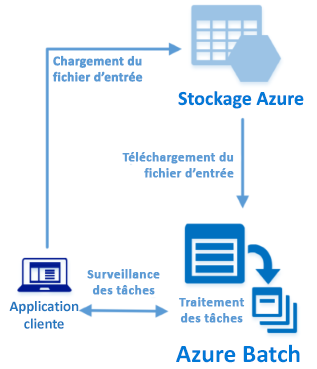

# <a name="quickstart-run-your-first-batch-job-with-the-python-api"></a>Démarrage rapide : exécution de votre premier travail Batch avec l’API Python

Ce démarrage rapide exécute un travail Azure Batch à partir d’une application basée sur l’API Python Azure Batch. L’application télécharge plusieurs fichiers de données d’entrée vers Stockage Azure, puis crée un *pool* de nœuds de calcul Azure Batch (machines virtuelles). Ensuite, elle crée un exemple de *travail* qui exécute des *tâches* pour traiter chaque fichier d’entrée sur le pool à l’aide d’une commande de base. À l’issue de ce démarrage rapide, vous maîtriserez les concepts clés du service Batch et serez prêt à essayer Azure Batch avec des charges de travail plus réalistes à plus grande échelle.
 


[!INCLUDE [quickstarts-free-trial-note.md](../../includes/quickstarts-free-trial-note.md)]

## <a name="prerequisites"></a>Prérequis

* [Python 2.7 ou 3.3 ou version ultérieure](https://www.python.org/downloads/)

* Gestionnaire de package [pip](https://pip.pypa.io/en/stable/installing/)

* Un compte Azure Batch et un compte Stockage Azure lié à usage général. Pour créer ces comptes, consultez les démarrages rapides Azure Batch à l’aide du [portail Azure](quick-create-portal.md) ou de l’[interface de ligne de commande Azure](quick-create-cli.md). 

## <a name="sign-in-to-azure"></a>Connexion à Azure

Connectez-vous au portail Azure sur [https://portal.azure.com](https://portal.azure.com).

[!INCLUDE [batch-common-credentials](../../includes/batch-common-credentials.md)]

## <a name="download-the-sample"></a>Téléchargez l’exemple

[Téléchargez ou clonez l’exemple d’application](https://github.com/Azure-Samples/batch-python-quickstart) à partir de GitHub. Pour cloner le référentiel d’exemple d’application avec un client Git, utilisez la commande suivante :

```
git clone https://github.com/Azure-Samples/batch-python-quickstart.git
```

Accédez au répertoire qui contient le script Python `python_quickstart_client.py`.

Dans votre environnement de développement Python, installez les packages requis à l’aide de `pip`.

```bash
pip install -r requirements.txt
```

Ouvrez le fichier `python_quickstart_client.py`. Mettez à jour les chaînes d’identification de compte Batch et de stockage avec les valeurs obtenues pour vos comptes. Par exemple : 


```Python
_BATCH_ACCOUNT_NAME = 'mybatchaccount'
_BATCH_ACCOUNT_KEY = 'xxxxxxxxxxxxxxxxE+yXrRvJAqT9BlXwwo1CwF+SwAYOxxxxxxxxxxxxxxxx43pXi/gdiATkvbpLRl3x14pcEQ=='
_BATCH_ACCOUNT_URL = 'https://mybatchaccount.mybatchregion.batch.azure.com'
_STORAGE_ACCOUNT_NAME = 'mystorageaccount'
_STORAGE_ACCOUNT_KEY = 'xxxxxxxxxxxxxxxxy4/xxxxxxxxxxxxxxxxfwpbIC5aAWA8wDu+AFXZB827Mt9lybZB1nUcQbQiUrkPtilK5BQ=='
```

## <a name="run-the-app"></a>Exécution de l'application

Pour afficher le flux de travail Azure Batch en action, exécutez le script :

```
python python_quickstart_client.py
```

Après avoir exécuté le script, passez en revue le code pour savoir ce que fait chaque partie de l’application. 

Lorsque vous exécutez l’exemple d’application, la sortie de la console est identique à ce qui suit. Pendant l’exécution, l’étape `Monitoring all tasks for 'Completed' state, timeout in 00:30:00...` fait l’objet d’une pause correspondant au démarrage des nœuds de calcul du pool. Les tâches sont mises en file d’attente pour s’exécuter dès que le premier nœud de calcul est en cours d’exécution. Accédez à votre compte Batch dans le [portail Azure](https://portal.azure.com) pour surveiller le pool, les nœuds de calcul, les travaux et les tâches dans votre compte Batch.

```
Sample start: 12/4/2017 4:02:54 PM

Container [input] created.
Uploading file taskdata0.txt to container [input]...
Uploading file taskdata1.txt to container [input]...
Uploading file taskdata2.txt to container [input]...
Creating pool [PythonQuickstartPool]...
Creating job [PythonQuickstartJob]...
Adding 3 tasks to job [PythonQuickstartJob]...
Monitoring all tasks for 'Completed' state, timeout in 00:30:00...
```

Une fois que les tâches sont terminées, vous devez obtenir un résultat similaire à ce qui suit pour chaque tâche :

```
Printing task output...
Task: Task0
Node: tvm-2850684224_3-20171205t000401z
Standard out:
Batch processing began with mainframe computers and punch cards. Today it still plays a central role in business, engineering, science, and other pursuits that require running lots of automated tasks....
...
```

Le temps d’exécution standard de l’application est d’environ 3 minutes lorsque l’application fonctionne dans sa configuration par défaut. La configuration du pool initial prend le plus de temps.

## <a name="review-the-code"></a>Vérifier le code

L’application Python dans ce démarrage rapide effectue les opérations suivantes :

* Chargement de trois petits fichiers texte dans un conteneur blob sur votre compte de stockage Azure. Ces fichiers sont des entrées pour le traitement par les tâches Batch.
* Création d’un pool de deux nœuds de calcul exécutant Ubuntu 16.04 LTS.
* Création d’un travail et de trois tâches à exécuter sur les nœuds. Chaque tâche traite l’un des fichiers d’entrée à l’aide d’une ligne de commande d’interpréteur de commandes Bash.
* Affichage de fichiers retournés par les tâches.

Consultez le fichier `python_quickstart_client.py` et les sections suivantes pour plus de détails. 

### <a name="preliminaries"></a>Étapes préalables

Pour interagir avec un compte de stockage, l’application utilise le package [azure-storage-blob](https://pypi.python.org/pypi/azure-storage-blob) pour créer un objet [BlockBlobService](/python/api/azure.storage.blob.blockblobservice.blockblobservice).

```python
blob_client = azureblob.BlockBlobService(
    account_name=_STORAGE_ACCOUNT_NAME,
    account_key=_STORAGE_ACCOUNT_KEY)
```

L’application utilise la référence `blob_client` pour créer un conteneur dans le compte de stockage ainsi que pour charger des fichiers de données vers le conteneur. Les fichiers de stockage sont définis en tant qu’objets Batch [ResourceFile](/python/api/azure.batch.models.resourcefile) que Batch peut télécharger ultérieurement sur les nœuds de calcul.

```python
input_file_paths = [os.path.realpath('./data/taskdata0.txt'),
                    os.path.realpath('./data/taskdata1.txt'),
                    os.path.realpath('./data/taskdata2.txt')]
input_files = [
    upload_file_to_container(blob_client, input_container_name, file_path)
    for file_path in input_file_paths]
```

L’application crée un objet [BatchServiceClient](/python/api/azure.batch.batchserviceclient) pour créer et gérer des pools, des travaux et des tâches dans le service Batch. Le client Batch dans l’exemple utilise l’authentification de la clé partagée. Batch prend également en charge l’authentification Azure Active Directory.

```python
credentials = batchauth.SharedKeyCredentials(_BATCH_ACCOUNT_NAME,
    BATCH_ACCOUNT_KEY)

batch_client = batch.BatchServiceClient(
    credentials,
    base_url=_BATCH_ACCOUNT_URL)
```


### <a name="create-a-pool-of-compute-nodes"></a>Création d’un pool de nœuds de calcul

Pour créer un pool Batch, l’application utilise la classe [PoolAddParameter](/python/api/azure.batch.models.pooladdparameter) pour définir le nombre de nœuds, la taille de machine virtuelle et une configuration de pool. Ici, un objet [VirtualMachineConfiguration](/python/api/azure.batch.models.virtualmachineconfiguration) spécifie une référence [ImageReference](/python/api/azure.batch.models.imagereference) à une image Ubuntu Server 16.04 LTS publiée dans la Place de marché Microsoft Azure. Azure Batch prend en charge une large plage d’images Linux et Windows Server dans la Place de marché Microsoft Azure, ainsi que des images de machines virtuelles personnalisées.

Le nombre de nœuds (`_POOL_NODE_COUNT`) et la taille de machine virtuelle (`_POOL_VM_SIZE`) sont des constantes définies. L’exemple par défaut crée un pool de 2 nœuds de taille *Standard_A1_v2*. La taille suggérée offre un bon compromis entre performances et coûts pour cet exemple rapide.

La méthode [pool.add](/python/api/azure.batch.operations.pooloperations#azure_batch_operations_PoolOperations_add) soumet le pool au service Batch.

```python
new_pool = batch.models.PoolAddParameter(
    id=pool_id,
    virtual_machine_configuration=batchmodels.VirtualMachineConfiguration(
        image_reference=batchmodels.ImageReference(
            publisher="Canonical",
            offer="UbuntuServer",
            sku="16.04.0-LTS",
            version="latest"
            ),
        node_agent_sku_id="batch.node.ubuntu 16.04"),
    vm_size=_POOL_VM_SIZE,
    target_dedicated_nodes=_POOL_NODE_COUNT
)
batch_service_client.pool.add(new_pool)
```

### <a name="create-a-batch-job"></a>Création d’un travail Batch

Un travail Batch est un regroupement logique d’une ou de plusieurs tâches. Un travail inclut les paramètres communs aux tâches, tels que la priorité et le pool pour exécuter des tâches. L’application utilise la classe [JobAddParameter](/python/api/azure.batch.models.jobaddparameter) pour créer un travail sur votre pool. La méthode [job.add](/python/api/azure.batch.operations.joboperations#azure_batch_operations_JobOperations_add) soumet le pool au service Batch. Dans un premier temps, le travail n’a aucune tâche.

```python
job = batch.models.JobAddParameter(
    job_id,
    batch.models.PoolInformation(pool_id=pool_id))
batch_service_client.job.add(job)
```

### <a name="create-tasks"></a>Création de tâches

L’application crée une liste d’objets de tâches à l’aide de la classe [TaskAddParameter](/python/api/azure.batch.models.taskaddparameter). Chaque tâche traite un objet d’entrée `resource_files` à l’aide d’un paramètre `command_line`. Dans l’exemple, la ligne de commande exécute la commande `cat` de l’interpréteur de commandes Bash afin d’afficher le fichier texte. Cette commande est un exemple simple à des fins de démonstration. Lorsque vous utilisez Azure Batch, la ligne de commande se trouve là où vous spécifiez votre application ou votre script. Azure Batch fournit plusieurs façons de déployer des applications et des scripts sur des nœuds de calcul.

Ensuite, l’application ajoute des tâches au travail avec la méthode [task.add_collection](/python/api/azure.batch.operations.taskoperations#azure_batch_operations_TaskOperations_add_collection), qui les met en file d’attente afin de les exécuter sur les nœuds de calcul. 

```python
tasks = list()

for idx, input_file in enumerate(input_files): 
    command = "/bin/bash -c \"cat {}\"".format(input_file.file_path)
    tasks.append(batch.models.TaskAddParameter(
        id='Task{}'.format(idx),
        command_line=command,
        resource_files=[input_file]
    )
)
batch_service_client.task.add_collection(job_id, tasks)
```

### <a name="view-task-output"></a>Afficher les sorties des tâches

L’application surveille l’état de la tâche pour s’assurer que les tâches s’achèvent. Ensuite, l’application affiche le fichier `stdout.txt` généré par chaque tâche terminée. Lorsque la tâche s’exécute avec succès, la sortie de la commande de tâche est écrite dans `stdout.txt` :

```python
tasks = batch_service_client.task.list(job_id)

for task in tasks:
    
    node_id = batch_service_client.task.get(job_id, task.id).node_info.node_id
    print("Task: {}".format(task.id))
    print("Node: {}".format(node_id))

    stream = batch_service_client.file.get_from_task(job_id, task.id, _STANDARD_OUT_FILE_NAME)

    file_text = _read_stream_as_string(
        stream,
        encoding)
    print("Standard output:")
    print(file_text)
```

## <a name="clean-up-resources"></a>Supprimer des ressources

L’application supprime automatiquement le conteneur de stockage créé et vous donne la possibilité de supprimer le travail et le pool Azure Batch. Vous êtes facturé pour le pool pendant que les nœuds sont en cours d’exécution, même si aucun travail n’est planifié. Lorsque vous n’avez plus besoin du pool, supprimez-le. Lorsque vous supprimez le pool, toutes les sorties de tâche sur les nœuds sont supprimées. 

Lorsque vous n’en avez plus besoin, supprimez le groupe de ressources, le compte Batch et le compte de stockage. Pour ce faire, dans le portail Azure, sélectionnez le groupe de ressources pour le compte Batch, puis cliquez sur **Supprimer le groupe de ressources**.

## <a name="next-steps"></a>Étapes suivantes

Dans ce guide de démarrage rapide, vous avez exécuté une petite application générée à l’aide de l’API Python Batch pour créer un pool et un travail Batch. Le travail a exécuté des tâches d’exemple et téléchargé des sorties créées sur les nœuds. Maintenant que vous maîtriserez les concepts clés du service Batch, vous êtres prêt à essayer Azure Batch avec des charges de travail plus réalistes à plus grande échelle. Pour en savoir plus sur Azure Batch et parcourir une charge de travail parallèle avec une application réelle, accédez au didacticiel Python Batch.

> [!div class="nextstepaction"]
> [Traitement d’une charge de travail parallèle avec Python](tutorial-parallel-python.md)
