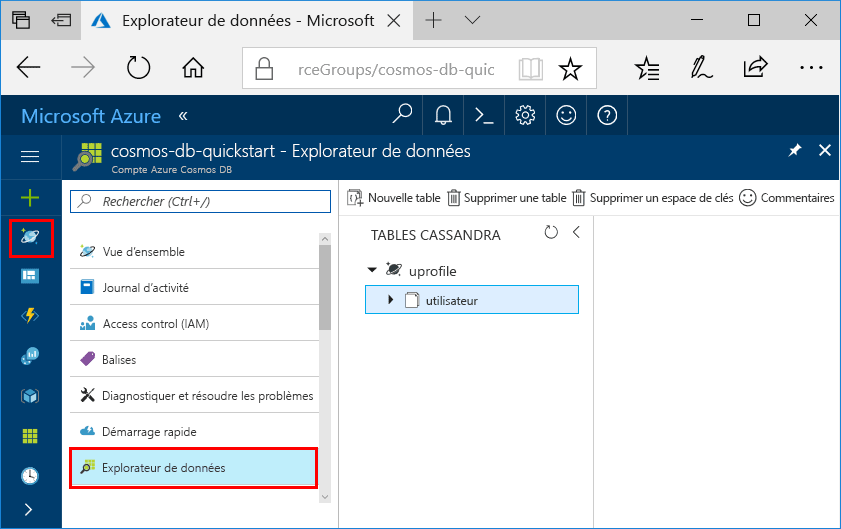

# <a name="quickstart-build-a-cassandra-app-with-net-and-azure-cosmos-db"></a>Démarrage rapide : Créer une application Cassandra avec .NET et Azure Cosmos DB

Ce guide de démarrage rapide montre comment utiliser .NET et [l’API Cassandra](cassandra-introduction.md) Azure Cosmos DB pour créer une application de profil en clonant un exemple de GitHub. Ce guide de démarrage rapide vous montre également comment créer un compte Azure Cosmos DB en utilisant le portail web Azure.   

Azure Cosmos DB est le service de base de données multi-modèle de Microsoft distribué à l’échelle mondiale. Vous pouvez rapidement créer et interroger des bases de données de documents, de tables, de paires clé/valeur et de graphes, lesquelles bénéficient toutes des fonctionnalités de distribution mondiale et de mise à l’échelle horizontale d’Azure Cosmos DB. 

## <a name="prerequisites"></a>Composants requis

[!INCLUDE [quickstarts-free-trial-note](../../includes/quickstarts-free-trial-note.md)] Vous pouvez également [essayer Azure Cosmos DB gratuitement](https://azure.microsoft.com/try/cosmosdb/) sans abonnement Azure, ni frais ni engagement.

Accédez au programme d’évaluation de l’API Cassandra Azure Cosmos DB. Si vous n’avez pas encore demandé l’accès, [inscrivez-vous maintenant](cassandra-introduction.md#sign-up-now).

Par ailleurs : 
* Si vous n’avez pas encore installé Visual Studio 2017, vous pouvez télécharger et utiliser la version **gratuite** [Visual Studio 2017 Community Edition](https://www.visualstudio.com/downloads/). Veillez à activer **le développement Azure** lors de l’installation de Visual Studio.
* Installez [Git](https://www.git-scm.com/) pour cloner l’exemple.

<a id="create-account"></a>
## <a name="create-a-database-account"></a>Création d'un compte de base de données

[!INCLUDE [cosmos-db-create-dbaccount-cassandra](../../includes/cosmos-db-create-dbaccount-cassandra.md)]


## <a name="clone-the-sample-application"></a>Clonage de l’exemple d’application

À présent, travaillons sur le code. Nous allons cloner une application API Cassandra à partir de GitHub, configurer la chaîne de connexion et l’exécuter. Vous verrez combien il est facile de travailler par programmation avec des données. 

1. Ouvrez une fenêtre de terminal git comme Git Bash et utilisez la commande `cd` pour accéder à un dossier d’installation pour l’exemple d’application. 

    ```bash
    cd "C:\git-samples"
    ```

2. Exécutez la commande suivante pour cloner l’exemple de référentiel : Cette commande crée une copie de l’exemple d’application sur votre ordinateur.

    ```bash
    git clone https://github.com/Azure-Samples/azure-cosmos-db-cassandra-dotnet-getting-started.git
    ```

3. Ouvrez ensuite le fichier solution CassandraQuickStartSample dans Visual Studio. 

## <a name="review-the-code"></a>Examiner le code

Cette étape est facultative. Pour savoir comment les ressources de base de données sont créées dans le code, vous pouvez examiner les extraits de code suivants. Les extraits de code sont tirés du fichier `Program.cs` enregistré dans le dossier C:\git-samples\azure-cosmos-db-cassandra-dotnet-getting-started\CassandraQuickStartSample. Sinon, vous pouvez passer à l’étape [Mise à jour de votre chaîne de connexion](#update-your-connection-string).

* Initialisez la session en vous connectant à un point de terminaison de cluster Cassandra. L’API Cassandra sur la base de données Azure Cosmos prend en charge uniquement TLS 1.2. 

  ```csharp
   var options = new Cassandra.SSLOptions(SslProtocols.Tls12, true, ValidateServerCertificate);
   options.SetHostNameResolver((ipAddress) => CassandraContactPoint);
   Cluster cluster = Cluster.Builder().WithCredentials(UserName, Password).WithPort(CassandraPort).AddContactPoint(CassandraContactPoint).WithSSL(options).Build();
   ISession session = cluster.Connect();
   ```

* Créez un espace de clé.

    ```csharp
    session.Execute("CREATE KEYSPACE uprofile WITH REPLICATION = { 'class' : 'NetworkTopologyStrategy', 'datacenter1' : 1 };"); 
    ```

* Créez une table.

   ```csharp
  session.Execute("CREATE TABLE IF NOT EXISTS uprofile.user (user_id int PRIMARY KEY, user_name text, user_bcity text)");
   ```

* Insérez des entités utilisateur à l’aide de l’objet IMapper avec une nouvelle session qui se connecte à l’espace de clés uprofile.

    ```csharp
    mapper.Insert<User>(new User(1, "LyubovK", "Dubai"));
    ```
    
* Faites une requête pour obtenir les informations de tous les utilisateurs.

    ```csharp
   foreach (User user in mapper.Fetch<User>("Select * from user"))
   {
      Console.WriteLine(user);
   }
    ```
    
 * Faites une requête pour obtenir les informations d’un seul utilisateur.

    ```csharp
    mapper.FirstOrDefault<User>("Select * from user where user_id = ?", 3);
    ```

## <a name="update-your-connection-string"></a>Mise à jour de votre chaîne de connexion

Maintenant, retournez dans le portail Azure afin d’obtenir les informations de votre chaîne de connexion et de les copier dans l’application. Les informations de la chaîne de connexion permettent à votre application de communiquer avec votre base de données hébergée.

1. Dans le [portail Azure](http://portal.azure.com/), cliquez sur **Chaîne de connexion**. 

    Utilisez le  à droite de l’écran pour copier la valeur NOM D'UTILISATEUR.

    

2. Dans Visual Studio 2017, ouvrez le fichier Program.cs. 

3. Collez la valeur NOM D’UTILISATEUR à partir du portail sur `<FILLME>` à la ligne 13.

    La ligne 13 du fichier Program.cs doit maintenant ressembler à la ligne suivante : 

    `private const string UserName = "cosmos-db-quickstart";`

3. Revenez au portail et copiez la valeur MOT DE PASSE. Collez la valeur MOT DE PASSE à partir du portail sur `<FILLME>` à la ligne 14.

    La ligne 14 du fichier Program.cs doit maintenant ressembler à la ligne suivante : 

    `private const string Password = "2Ggkr662ifxz2Mg...==";`

4. Revenez au portail et copiez la valeur POINT DE CONTACT. Collez la valeur POINT DE CONTACT à partir du portail sur `<FILLME>` à la ligne 15.

    La ligne 15 du fichier Program.cs doit maintenant ressembler à la ligne suivante : 

    `private const string CassandraContactPoint = "cosmos-db-quickstarts.documents.azure.com"; //  DnsName`

5. Enregistrez le fichier Program.cs.
    
## <a name="run-the-app"></a>Exécution de l'application

1. Dans Visual Studio, cliquez sur **Outils** > **Gestionnaire de package NuGet** > **Console du gestionnaire de package**.

2. À l’invite de commandes, utilisez la commande suivante pour installer le package NuGet du pilote .NET. 

    ```cmd
    Install-Package CassandraCSharpDriver
    ```
3. Appuyez sur Ctrl + F5 pour exécuter l’application. Votre application s’affiche dans la fenêtre de votre console. 

    

    Appuyez sur CTRL + C pour arrêter l’exécution du programme et fermer la fenêtre de console. 
    
    Vous pouvez maintenant ouvrir l’Explorateur de données dans le portail Azure pour voir la requête, modifier ces nouvelles données et les utiliser. 

    

## <a name="review-slas-in-the-azure-portal"></a>Vérification des contrats SLA dans le portail Azure

[!INCLUDE [cosmosdb-tutorial-review-slas](../../includes/cosmos-db-tutorial-review-slas.md)]

## <a name="clean-up-resources"></a>Supprimer des ressources

[!INCLUDE [cosmosdb-delete-resource-group](../../includes/cosmos-db-delete-resource-group.md)]

## <a name="next-steps"></a>Étapes suivantes

Dans ce guide de démarrage rapide, vous avez appris à créer un compte Azure Cosmos DB, à créer une collection à l’aide de l’Explorateur de données et à exécuter une application web. Vous pouvez maintenant importer des données supplémentaires à votre compte Cosmos DB. 

> [!div class="nextstepaction"]
> [Importer des données Cassandra dans Azure Cosmos DB](cassandra-import-data.md)
