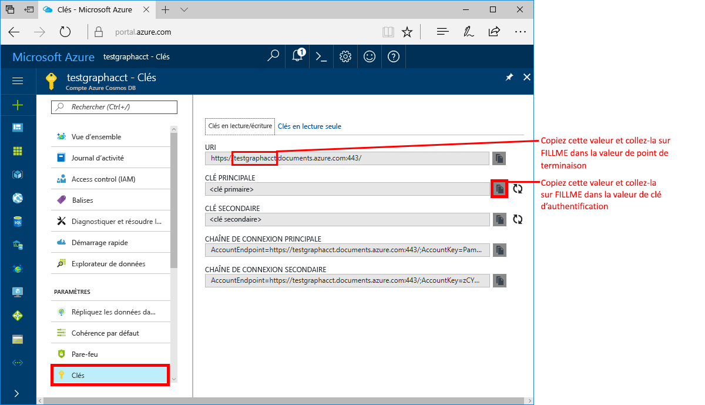
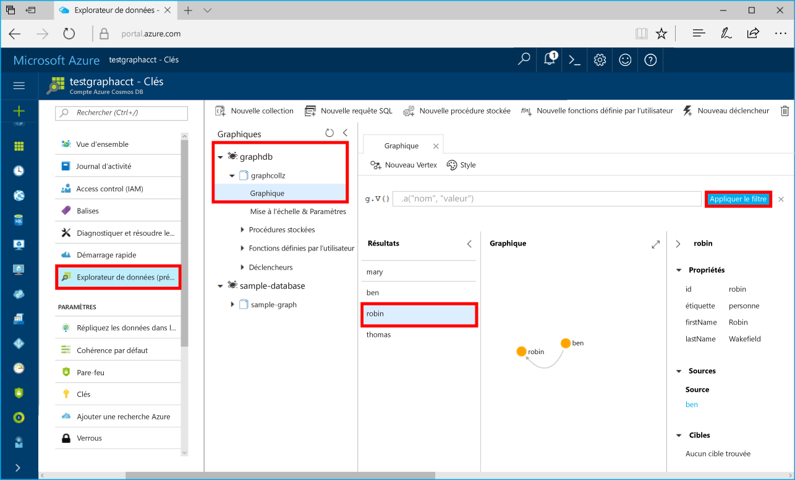

# <a name="azure-cosmos-db-build-a-net-framework-or-core-application-using-the-graph-api"></a>Azure Cosmos DB : Créer une application .NET Framework ou Core à l’aide de l’API Graph

Azure Cosmos DB est le service de base de données multi-modèle de Microsoft distribué à l’échelle mondiale. Rapidement, vous avez la possibilité de créer et d’interroger des documents, des paires clé/valeur, et des bases de données orientées graphe, profitant tous de la distribution à l’échelle mondiale et des capacités de mise à l’échelle horizontale au cœur d’Azure Cosmos DB. 

Ce guide de démarrage rapide explique comment créer un compte, une base de données et un graphique (conteneur) Azure Cosmos DB à l’aide du portail Azure. Par la suite, vous allez créer et exécuter une application console en utilisant le pilote [Gremlin.Net](http://tinkerpop.apache.org/docs/3.2.7/reference/#gremlin-DotNet) open-source.  

## <a name="prerequisites"></a>Prérequis

Si vous n’avez pas encore installé Visual Studio 2017, vous pouvez télécharger et utiliser la version **gratuite** [Visual Studio 2017 Community Edition](https://www.visualstudio.com/downloads/). Veillez à activer **le développement Azure** lors de l’installation de Visual Studio.

Si Visual Studio 2017 est déjà installé, assurez-vous de disposer de [Visual Studio 2017 Update 3](https://www.visualstudio.com/en-us/news/releasenotes/vs2017-relnotes).

[!INCLUDE [quickstarts-free-trial-note](../../includes/quickstarts-free-trial-note.md)]

## <a name="create-a-database-account"></a>Création d'un compte de base de données

[!INCLUDE [cosmos-db-create-dbaccount-graph](../../includes/cosmos-db-create-dbaccount-graph.md)]

## <a name="add-a-graph"></a>Ajout d’un graphique

[!INCLUDE [cosmos-db-create-graph](../../includes/cosmos-db-create-graph.md)]

## <a name="clone-the-sample-application"></a>Clonage de l’exemple d’application

À présent, nous allons cloner une application API Graph à partir de GitHub, configurer la chaîne de connexion et l’exécuter. Vous verrez combien il est facile de travailler par programmation avec des données. 

1. Ouvrez une fenêtre de terminal git, comme git bash, et accédez à votre répertoire de travail à l’aide de la commande `cd`.  

2. Exécutez la commande suivante pour cloner l’exemple de référentiel : 

    ```bash
    git clone https://github.com/Azure-Samples/azure-cosmos-db-graph-gremlindotnet-getting-started.git
    ```

3. Ouvrez ensuite Visual Studio et le fichier de solution.

4. Restaurez les packages NuGet dans le projet. Sont concernés ici le pilote Gremlin.Net et le package Newtonsoft.Json.

5. Vous pouvez également installer le pilote Gremlin.Net manuellement, sous sa version 3.2.7, à l’aide du gestionnaire de package Nuget ou de l’[utilitaire de ligne de commande nuget](https://docs.microsoft.com/en-us/nuget/install-nuget-client-tools) : 

    ```bash
    nuget install Gremlin.Net -Version 3.2.7
    ```

## <a name="review-the-code"></a>Vérifier le code

Passons rapidement en revue ce qu’il se passe dans l’application. Ouvrez le fichier Program.cs ; vous pouvez constater que ces lignes de code créent les ressources Azure Cosmos DB. 

* Définissez vos paramètres de connexion en fonction du compte créé ci-dessus (ligne 19) : 

    ```csharp
    private static string hostname = "your-endpoint.gremlin.cosmosdb.azure.com";
    private static int port = 443;
    private static string authKey = "your-authentication-key";
    private static string database = "your-database";
    private static string collection = "your-collection-or-graph";
    ```

* Les commandes Gremlin à exécuter sont répertoriées dans un dictionnaire (ligne 26) :

    ```csharp
    private static Dictionary<string, string> gremlinQueries = new Dictionary<string, string>
    {
        { "Cleanup",        "g.V().drop()" },
        { "AddVertex 1",    "g.addV('person').property('id', 'thomas').property('firstName', 'Thomas').property('age', 44)" },
        { "AddVertex 2",    "g.addV('person').property('id', 'mary').property('firstName', 'Mary').property('lastName', 'Andersen').property('age', 39)" },
        { "AddVertex 3",    "g.addV('person').property('id', 'ben').property('firstName', 'Ben').property('lastName', 'Miller')" },
        { "AddVertex 4",    "g.addV('person').property('id', 'robin').property('firstName', 'Robin').property('lastName', 'Wakefield')" },
        { "AddEdge 1",      "g.V('thomas').addE('knows').to(g.V('mary'))" },
        { "AddEdge 2",      "g.V('thomas').addE('knows').to(g.V('ben'))" },
        { "AddEdge 3",      "g.V('ben').addE('knows').to(g.V('robin'))" },
        { "UpdateVertex",   "g.V('thomas').property('age', 44)" },
        { "CountVertices",  "g.V().count()" },
        { "Filter Range",   "g.V().hasLabel('person').has('age', gt(40))" },
        { "Project",        "g.V().hasLabel('person').values('firstName')" },
        { "Sort",           "g.V().hasLabel('person').order().by('firstName', decr)" },
        { "Traverse",       "g.V('thomas').out('knows').hasLabel('person')" },
        { "Traverse 2x",    "g.V('thomas').out('knows').hasLabel('person').out('knows').hasLabel('person')" },
        { "Loop",           "g.V('thomas').repeat(out()).until(has('id', 'robin')).path()" },
        { "DropEdge",       "g.V('thomas').outE('knows').where(inV().has('id', 'mary')).drop()" },
        { "CountEdges",     "g.E().count()" },
        { "DropVertex",     "g.V('thomas').drop()" },
    };
    ```


* Créez un objet de connexion `GremlinServer` à l’aide des paramètres fournis ci-dessus (ligne 52) :

    ```csharp
    var gremlinServer = new GremlinServer(hostname, port, enableSsl: true, 
                                                    username: "/dbs/" + database + "/colls/" + collection, 
                                                    password: authKey);
    ```

* Créez un nouvel objet `GremlinClient` (ligne 56) :

    ```csharp
    var gremlinClient = new GremlinClient(gremlinServer);
    ```

* Exécutez chaque requête Gremlin à l’aide de l’objet `GremlinClient` avec une tâche asynchrone (ligne 63). Les requêtes Gremlin seront lues à partir du dictionnaire défini ci-dessus (ligne 26) :

    ```csharp
    var task = gremlinClient.SubmitAsync<dynamic>(query.Value);
    task.Wait();
    ```

* Récupérez le résultat et lisez les valeurs, qui sont formatées sous forme de dictionnaire, à l’aide de la classe `JsonSerializer` de Newtonsoft.Json :

    ```csharp
    foreach (var result in task.Result)
    {
        // The vertex results are formed as dictionaries with a nested dictionary for their properties
        string output = JsonConvert.SerializeObject(result);
        Console.WriteLine(String.Format("\tResult:\n\t{0}", output));
    }
    ```

## <a name="update-your-connection-string"></a>Mise à jour de votre chaîne de connexion

Maintenant, retournez dans le portail Azure afin d’obtenir les informations de votre chaîne de connexion et de les copier dans l’application.

1. Dans le [portail Azure](http://portal.azure.com/), cliquez sur **Clés**. 

    Copiez la première partie de la valeur de l’URI.

    

2. Dans Program.cs, collez les valeurs sur `your-endpoint` dans la variable `hostname` de la ligne 19. 

    `"private static string hostname = "your-endpoint.gremlin.cosmosdb.azure.com";`

    La valeur de point de terminaison doit maintenant ressembler à ceci :

    `"private static string hostname = "testgraphacct.gremlin.cosmosdb.azure.com";`

3. Copiez votre valeur de **clé primaire** du portail, puis collez-la dans la variable `authkey`, en remplaçant l’espace réservé `"your-authentication-key"` dans la ligne 21. 

    `private static string authKey = "your-authentication-key";`

4. En vous appuyant sur les informations de la base de données créée ci-dessus, collez le nom de la base de données dans la variable `database` de la ligne 22. 

    `private static string database = "your-database";`

5. De la même manière, en vous appuyant sur les informations de la collection créée ci-dessus, collez la collection (qui est également le nom du graphique) dans la variable `collection` de la ligne 23. 

    `private static string collection = "your-collection-or-graph";`

6. Enregistrez le fichier Program.cs. 

Vous venez de mettre à jour votre application avec toutes les informations nécessaires pour communiquer avec Azure Cosmos DB. 

## <a name="run-the-console-app"></a>Exécution de l’application console

Appuyez sur Ctrl + F5 pour exécuter l’application. L’application imprime les commandes de requête Gremlin et les résultats dans la console.

   La fenêtre de console affiche les sommets et les bords ajoutés au graphique. Lorsque le script se termine, appuyez sur ENTRÉE pour fermer la fenêtre de console.

## <a name="browse-using-the-data-explorer"></a>Navigation à l’aide de l’Explorateur de données

Vous pouvez maintenant retourner à l’Explorateur de données dans le Portail Azure pour parcourir et interroger vos nouvelles données graphiques.

1. Dans l’Explorateur de données, la nouvelle base de données apparaît dans le volet Graphique. Développez la base de données et les nœuds de collection, puis cliquez sur **Graphique**.

2. Cliquez sur le bouton **Appliquer un filtre** pour utiliser la requête par défaut et afficher tous les vertex dans le graphique. Les données générées par l’exemple d’application s’affichent dans le volet Graphiques.

    Vous pouvez agrandir et réduire le graphique, développer l’espace d’affichage du graphique, ajouter des vertex et déplacer des vertex sur la surface d’affichage.

    

## <a name="review-slas-in-the-azure-portal"></a>Vérification des contrats SLA dans le portail Azure

[!INCLUDE [cosmosdb-tutorial-review-slas](../../includes/cosmos-db-tutorial-review-slas.md)]

## <a name="clean-up-resources"></a>Supprimer des ressources

Si vous ne pensez pas continuer à utiliser cette application, supprimez toutes les ressources créées durant ce guide de démarrage rapide dans le Portail Azure en procédant de la façon suivante : 

1. Dans le menu de gauche du portail Azure, cliquez sur **Groupes de ressources**, puis sur le nom de la ressource que vous avez créée. 
2. Sur la page de votre groupe de ressources, cliquez sur **Supprimer**, tapez le nom de la ressource à supprimer dans la zone de texte, puis cliquez sur **Supprimer**.

## <a name="next-steps"></a>Étapes suivantes

Dans ce guide de démarrage rapide, vous avez appris à créer un compte Azure Cosmos D, à créer un graphique à l’aide de l’Explorateur de données et à exécuter une application. Vous pouvez maintenant générer des requêtes plus complexes et implémenter une logique de traversée de graphique puissante, à l’aide de Gremlin. 

> [!div class="nextstepaction"]
> [Interroger à l’aide de Gremlin](tutorial-query-graph.md)

