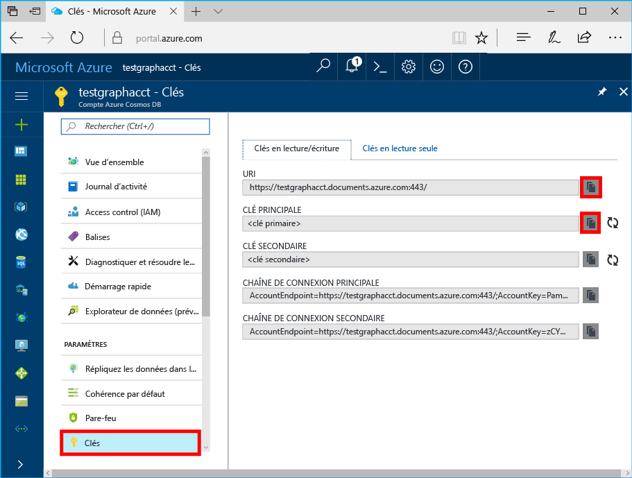

# <a name="azure-cosmos-db-build-a-nodejs-application-by-using-graph-api"></a>Azure Cosmos DB : Créer une application Node.js à l’aide de l’API Graph

Azure Cosmos DB est le service de base de données multi-modèle distribué mondialement de Microsoft. Rapidement, vous avez la possibilité de créer et d’interroger des documents, des paires clé/valeur, et des bases de données orientées graphe, profitant tous de la distribution à l’échelle mondiale et des capacités de mise à l’échelle horizontale au cœur d’Azure Cosmos DB. 

Ce guide de démarrage rapide explique comment créer un compte, une base de données et un graphique [API Graph](graph-introduction.md) Azure Cosmos DB à l’aide du portail Azure. Par la suite, vous allez créer et exécuter une application console en utilisant le pilote [Gremlin Node.js](https://www.npmjs.com/package/gremlin) open-source.

## <a name="prerequisites"></a>Prérequis


Avant de pouvoir exécuter cet exemple, vous devez posséder les composants requis suivants :
* [Node.js](https://nodejs.org/en/) version 0.10.29 ou supérieure
* [Git](http://git-scm.com/)

[!INCLUDE [quickstarts-free-trial-note](../../includes/quickstarts-free-trial-note.md)]

## <a name="create-a-database-account"></a>Création d'un compte de base de données

[!INCLUDE [cosmos-db-create-dbaccount-graph](../../includes/cosmos-db-create-dbaccount-graph.md)]

## <a name="add-a-graph"></a>Ajout d’un graphique

[!INCLUDE [cosmos-db-create-graph](../../includes/cosmos-db-create-graph.md)]

## <a name="clone-the-sample-application"></a>Clonage de l’exemple d’application

À présent, nous allons cloner une application API Graph à partir de GitHub, configurer la chaîne de connexion et l’exécuter. Vous verrez combien il est facile de travailler par programmation avec des données. 

1. Ouvrez une fenêtre de terminal git, comme git bash, et indiquez un répertoire de travail (à l’aide de la commande `cd`).

2. Exécutez la commande suivante pour cloner l’exemple de dépôt : 

    ```bash
    git clone https://github.com/Azure-Samples/azure-cosmos-db-graph-nodejs-getting-started.git
    ```

3. Ouvrez le fichier de solution dans Visual Studio. 

## <a name="review-the-code"></a>Vérifier le code

Passons rapidement en revue ce qu’il se passe dans l’application. Ouvrez le fichier `app.js`. Les lignes de code suivantes doivent s’afficher. 

* Le client Gremlin est créé.

    ```nodejs
    const client = Gremlin.createClient(
        443, 
        config.endpoint, 
        { 
            "session": false, 
            "ssl": true, 
            "user": `/dbs/${config.database}/colls/${config.collection}`,
            "password": config.primaryKey
        });
    ```

  Les configurations sont toutes dans `config.js`, que nous allons modifier dans la [section suivante](#update-your-connection-string).

* Plusieurs fonctions sont définies pour exécuter différentes opérations Gremlin. Voici l’une d’entre elles :

    ```nodejs
    function addVertex1(callback)
    {
        console.log('Running Add Vertex1'); 
        client.execute("g.addV('person').property('id', 'thomas').property('firstName', 'Thomas').property('age', 44).property('userid', 1)", { }, (err, results) => {
          if (err) callback(console.error(err));
          console.log("Result: %s\n", JSON.stringify(results));
          callback(null)
        });
    }
    ```

* Chaque fonction exécute une méthode `client.execute` avec un paramètre de chaîne de requête Gremlin. Voici un exemple d’exécution de `g.V().count()` :

    ```nodejs
    console.log('Running Count'); 
    client.execute("g.V().count()", { }, (err, results) => {
        if (err) return console.error(err);
        console.log(JSON.stringify(results));
        console.log();
    });
    ```

* À la fin du fichier, toutes les méthodes sont appelées à l’aide de la méthode `async.waterfall()`. Le code suivant va les exécuter les unes après les autres :

    ```nodejs
    try{
        async.waterfall([
            dropGraph,
            addVertex1,
            addVertex2,
            addEdge,
            countVertices
            ], finish);
    } catch(err) {
        console.log(err)
    }
    ```


## <a name="update-your-connection-string"></a>Mise à jour de votre chaîne de connexion

1. Ouvrez le fichier config.js. 

2. Dans le fichier config.js, renseignez la clé `config.endpoint` avec la valeur **URI Gremlin** dans la page **Vue d’ensemble** du portail Azure. 

    `config.endpoint = "GRAPHENDPOINT";`

    

   Si la valeur de **Gremlin URI** est vide, vous pouvez générer cette valeur à partir de la page **Clés** du portail. Utilisez la valeur de **URI**, supprimez https:// et remplacez documents par gremlin.cosmosdb. Si votre compte de graphiques a été créé avant le 20 décembre 2017, remplacez documents par graphs. 

   Le point de terminaison Gremlin doit correspondre uniquement au nom d’hôte, sans protocole/numéro de port comme `mygraphdb.gremlin.cosmosdb.azure.com` (et non `https://mygraphdb.gremlin.cosmosdb.azure.com` ou `mygraphdb.gremlin.cosmosdb.azure.com:433`).

3. Dans le fichier config.js, renseignez la valeur config.primaryKey avec la valeur de la **Clé primaire** à partir de la page **Clés** du portail Azure. 

    `config.primaryKey = "PRIMARYKEY";`

   

4. Entrez le nom de la base de données et le nom du graphique (conteneur) pour la valeur de config.database et de config.collection. 

Voici un exemple de ce à quoi votre fichier config.js terminé doit ressembler :

```nodejs
var config = {}

// Note that this must not have HTTPS or the port number
config.endpoint = "testgraphacct.gremlin.cosmosdb.azure.com";
config.primaryKey = "Pams6e7LEUS7LJ2Qk0fjZf3eGo65JdMWHmyn65i52w8ozPX2oxY3iP0yu05t9v1WymAHNcMwPIqNAEv3XDFsEg==";
config.database = "graphdb"
config.collection = "Persons"

module.exports = config;
```

## <a name="run-the-console-app"></a>Exécution de l’application console

1. Ouvrez une fenêtre de terminal et remplacez l’élément par le répertoire d’installation pour le fichier package.json inclus dans le projet (via la commande `cd`).

2. Exécutez `npm install` pour installer les modules npm requis, y compris `gremlin`.

3. Exécutez `node app.js` sur un terminal pour démarrer votre application Node.

## <a name="browse-with-data-explorer"></a>Navigation avec l’Explorateur de données

Vous pouvez maintenant revenir à l’Explorateur de données, dans le portail Azure, pour afficher, modifier, interroger et manipuler vos nouvelles données graphiques.

Dans l’Explorateur de données, la nouvelle base de données apparaît dans le volet **Graphique**. Développez la base de données, suivie de la collection, puis sélectionnez **Graphe**.

Les données générées par l’exemple d’application s’affichent dans le volet suivant de l’onglet **Graphe** lorsque vous sélectionnez **Appliquer un filtre**.

Essayez de renseigner `g.V()` avec `.has('firstName', 'Thomas')` pour tester le filtre. Notez que la valeur respecte la casse.

## <a name="review-slas-in-the-azure-portal"></a>Vérification des contrats SLA dans le portail Azure

[!INCLUDE [cosmosdb-tutorial-review-slas](../../includes/cosmos-db-tutorial-review-slas.md)]

## <a name="clean-up-your-resources"></a>Nettoyage des ressources

Si vous n’envisagez pas de continuer à utiliser cette application, supprimez toutes les ressources que vous avez créées dans cet article en procédant comme suit : 

1. Dans le menu de navigation gauche du portail Azure, sélectionnez **Groupes de ressources**. Sélectionnez ensuite le nom de la ressource que vous avez créée. 

2. Dans la page de votre groupe de ressources, sélectionnez **Supprimer**. Tapez le nom de la ressource à supprimer, puis sélectionnez **Supprimer**.

## <a name="next-steps"></a>Étapes suivantes

Dans cet article, vous avez appris à créer un compte Azure Cosmos DB, à créer un graphe à l’aide de l’Explorateur de données et à exécuter une application. Vous pouvez maintenant générer des requêtes plus complexes et implémenter une logique de traversée de graphique puissante, à l’aide de Gremlin. 

> [!div class="nextstepaction"]
> [Interroger à l’aide de Gremlin](tutorial-query-graph.md)
