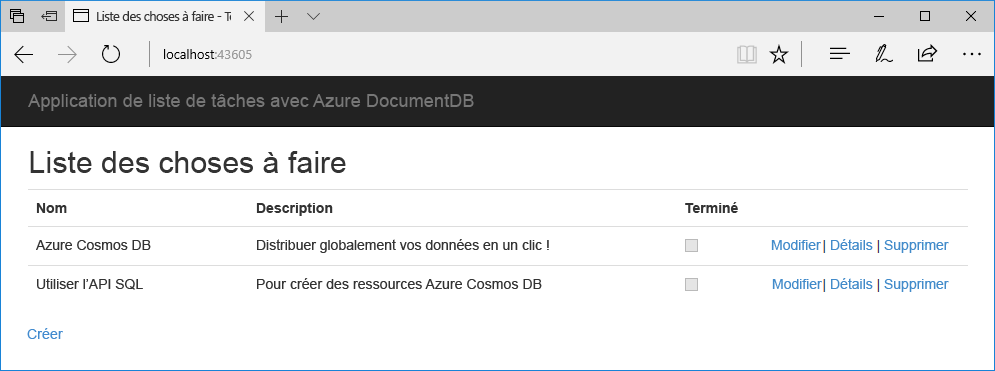

# <a name="quickstart-build-a-net-web-app-with-azure-cosmos-db-using-the-sql-api-and-the-azure-portal"></a>Démarrage rapide : Développer une application web .NET avec Azure Cosmos DB à l’aide de l’API SQL et du portail Azure

[!INCLUDE [cosmos-db-sql-api](../../includes/cosmos-db-sql-api.md)] 

Azure Cosmos DB est le service de base de données multi-modèle de Microsoft distribué à l’échelle mondiale. Rapidement, vous avez la possibilité de créer et d’interroger des documents, des paires clé/valeur, et des bases de données orientées graphe, profitant tous de la distribution à l’échelle mondiale et des capacités de mise à l’échelle horizontale au cœur d’Azure Cosmos DB. 

Ce guide de démarrage rapide explique comment créer, à l’aide du portail Azure, un compte Azure Cosmos DB, une base de données de documents, ainsi qu’une collection. Vous allez ensuite développer et déployer une application web de liste de tâches, basée sur [l’API .NET SQL](sql-api-sdk-dotnet.md), comme illustré par la capture d’écran suivante. 



## <a name="prerequisites"></a>Prérequis


Si vous n’avez pas encore installé Visual Studio 2017, vous pouvez télécharger et utiliser la version **gratuite** [Visual Studio 2017 Community Edition](https://www.visualstudio.com/downloads/). Veillez à activer **le développement Azure** lors de l’installation de Visual Studio.

[!INCLUDE [quickstarts-free-trial-note](../../includes/quickstarts-free-trial-note.md)] 
[!INCLUDE [cosmos-db-emulator-docdb-api](../../includes/cosmos-db-emulator-docdb-api.md)]  

<a id="create-account"></a>
## <a name="create-a-database-account"></a>Création d'un compte de base de données

[!INCLUDE [cosmos-db-create-dbaccount](../../includes/cosmos-db-create-dbaccount.md)]

<a id="create-collection"></a>
## <a name="add-a-collection"></a>Ajouter une collection

[!INCLUDE [cosmos-db-create-collection](../../includes/cosmos-db-create-collection.md)]

<a id="add-sample-data"></a>
## <a name="add-sample-data"></a>Ajouter un exemple de données

Vous pouvez maintenant ajouter des données à votre nouvelle collection grâce à l’Explorateur de données.

1. Dans l’Explorateur de données, la nouvelle base de données apparaît dans le volet Collections. Développez la base de données **Tâches**, développez la collection **Éléments**, cliquez sur **Documents**, puis cliquez sur **Nouveaux documents**. 

   
  
2. À présent, ajoutez un document à la collection avec la structure suivante.

     ```json
     {
         "id": "1",
         "category": "personal",
         "name": "groceries",
         "description": "Pick up apples and strawberries.",
         "isComplete": false
     }
     ```

3. Une fois le fichier json ajouté à l’onglet **Documents**, cliquez sur **Enregistrer**.

    

4.  Créez et enregistrez un document supplémentaire dans lequel vous insérez une valeur unique pour la propriété `id` et modifiez les autres propriétés selon vos besoins. Vos nouveaux documents peuvent avoir la structure de votre choix car Azure Cosmos DB n’impose aucun schéma pour vos données.

     Vous pouvez désormais utiliser des requêtes dans l’Explorateur de données pour récupérer vos données. Par défaut, l’Explorateur de données utilise `SELECT * FROM c` pour récupérer tous les documents dans la collection, mais vous pouvez remplacer cette requête par une autre [requête SQL](sql-api-sql-query.md), telle que `SELECT * FROM c ORDER BY c._ts DESC`, pour obtenir tous les documents dans l’ordre décroissant en fonction de leur horodateur.
 
     Vous pouvez également utiliser l’Explorateur de données pour créer des procédures stockées, des fonctions définies par l'utilisateur et des déclencheurs afin d’exécuter la logique métier côté serveur ainsi que la mise à l’échelle du débit. L’Explorateur de données affiche tous les accès aux données par programmation intégrés disponibles dans l’API, mais permet d’accéder facilement à vos données dans le portail Azure.

## <a name="clone-the-sample-application"></a>Clonage de l’exemple d’application

À présent, travaillons sur le code. Nous allons cloner une application API SQL à partir de GitHub, configurer la chaîne de connexion et l’exécuter. Vous verrez combien il est facile de travailler par programmation avec des données. 

1. Ouvrez une fenêtre de terminal git, comme git bash, et accédez à un répertoire de travail à l’aide de la commande `CD`.  

2. Exécutez la commande suivante pour cloner l’exemple de référentiel : 

    ```bash
    git clone https://github.com/Azure-Samples/documentdb-dotnet-todo-app.git
    ```

3. Ouvrez le fichier de solution todo dans Visual Studio. 

## <a name="review-the-code"></a>Vérifier le code

Passons rapidement en revue ce qu’il se passe dans l’application. Ouvrez le fichier DocumentDBRepository.cs, et vous découvrirez que ces lignes de code créent les ressources Azure Cosmos DB. 

* Le DocumentClient est initialisé à la ligne 76.

    ```csharp
    client = new DocumentClient(new Uri(ConfigurationManager.AppSettings["endpoint"]), ConfigurationManager.AppSettings["authKey"]);
    ```

* Une nouvelle base de données est créée à la ligne 91.

    ```csharp
    await client.CreateDatabaseAsync(new Database { Id = DatabaseId });
    ```

* Une nouvelle collection est créée à la ligne 110.

    ```csharp
    await client.CreateDocumentCollectionAsync(
        UriFactory.CreateDatabaseUri(DatabaseId),
        new DocumentCollection { Id = CollectionId },
        new DocumentCollection
            {
               Id = CollectionId
            },
        new RequestOptions { OfferThroughput = 400 });
    ```

## <a name="update-your-connection-string"></a>Mise à jour de votre chaîne de connexion

Maintenant, retournez dans le portail Azure afin d’obtenir les informations de votre chaîne de connexion et de les copier dans l’application.

1. Dans le [portail Azure](http://portal.azure.com/), dans votre compte Azure Cosmos DB, dans le volet de navigation de gauche, cliquez sur **Clés**, puis sur **Clés en lecture-écriture**. Vous utiliserez les boutons Copier sur le côté droit de l’écran pour copier l’URI et la clé primaire dans le fichier web.config à l’étape suivante.

    

2. Dans Visual Studio 2017, ouvrez le fichier web.config. 

3. Copiez votre valeur URI à partir du portail (à l’aide du bouton Copier) et définissez-la comme la valeur de la clé du point de terminaison dans le fichier web.config. 

    `<add key="endpoint" value="FILLME" />`

4. Puis, copiez votre valeur de clé primaire à partir du portail et définissez-la comme la valeur de la authKey dans web.config. Vous venez de mettre à jour votre application avec toutes les informations nécessaires pour communiquer avec Azure Cosmos DB. 

    `<add key="authKey" value="FILLME" />`
    
## <a name="run-the-web-app"></a>Exécuter l’application web
1. Dans Visual Studio, cliquez avec le bouton droit sur le nom du projet dans l’**Explorateur de solutions**, puis cliquez sur **Gérer les packages NuGet**. 

2. Dans la zone **Parcourir**de NuGet, tapez *DocumentDB*.

3. À partir des résultats, installez la bibliothèque **Microsoft.Azure.DocumentDB**. Cette opération permet d’installer le package Microsoft.Azure.DocumentDB ainsi que toutes les dépendances.

4. Appuyez sur Ctrl + F5 pour exécuter l’application. Votre application s’affiche dans votre navigateur. 

5. Cliquez sur **Créer** dans le navigateur et créer quelques tâches dans votre application To-Do.

   

Vous pouvez dès à présent revenir à l’Explorateur de données et voir la requête, modifier et travailler avec ces nouvelles données. 

## <a name="review-slas-in-the-azure-portal"></a>Vérification des contrats SLA dans le portail Azure

[!INCLUDE [cosmosdb-tutorial-review-slas](../../includes/cosmos-db-tutorial-review-slas.md)]

## <a name="clean-up-resources"></a>Supprimer des ressources

Si vous ne pensez pas continuer à utiliser cette application, supprimez toutes les ressources créées durant ce guide de démarrage rapide dans le Portail Azure en procédant de la façon suivante :

1. Dans le menu de gauche du portail Azure, cliquez sur **Groupes de ressources**, puis sur le nom de la ressource que vous avez créée. 
2. Sur la page de votre groupe de ressources, cliquez sur **Supprimer**, tapez le nom de la ressource à supprimer dans la zone de texte, puis cliquez sur **Supprimer**.

## <a name="next-steps"></a>Étapes suivantes

Dans ce guide de démarrage rapide, vous avez appris à créer un compte Azure Cosmos DB, à créer une collection à l’aide de l’Explorateur de données et à exécuter une application web. Vous pouvez maintenant importer des données supplémentaires à votre compte Cosmos DB. 

> [!div class="nextstepaction"]
> [Importer des données dans Azure Cosmos DB](import-data.md)


