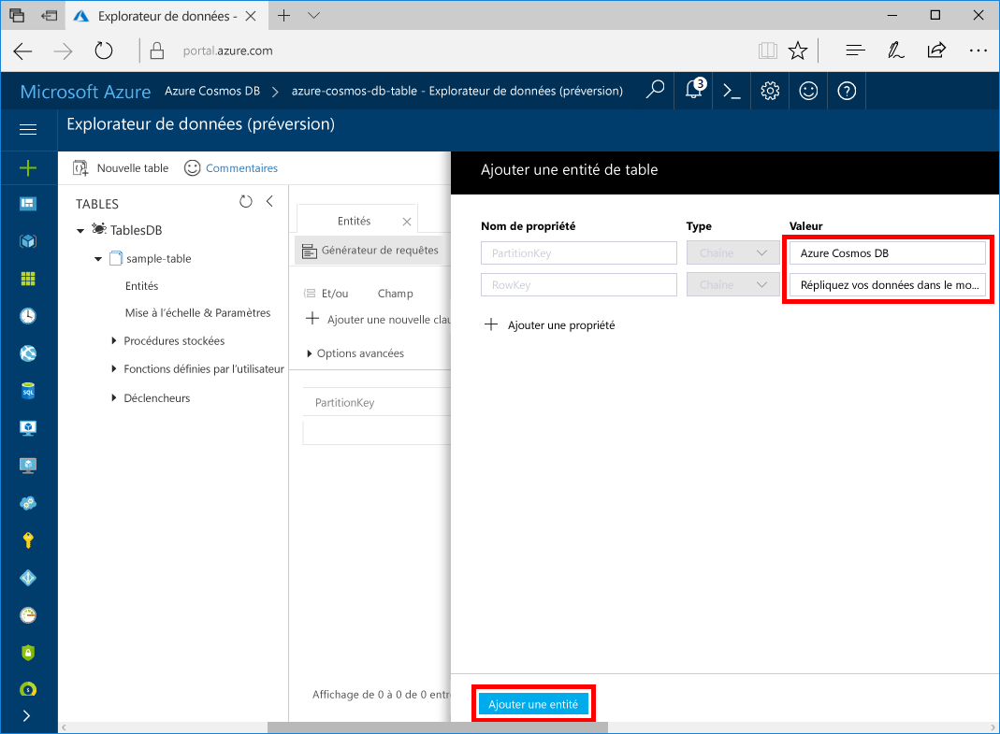
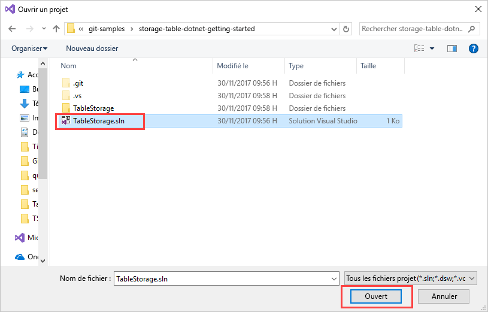
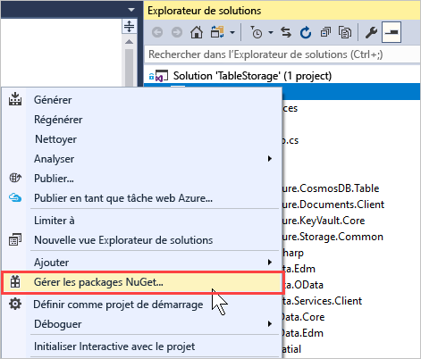
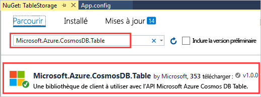
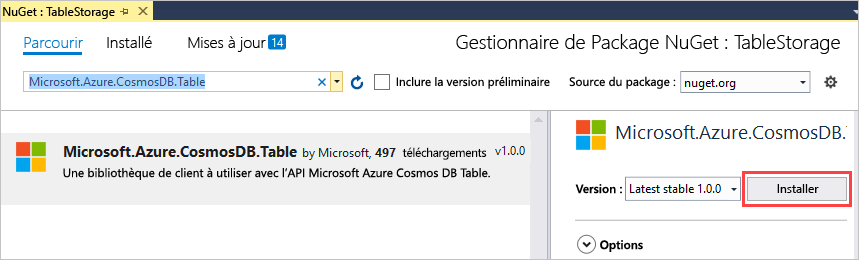
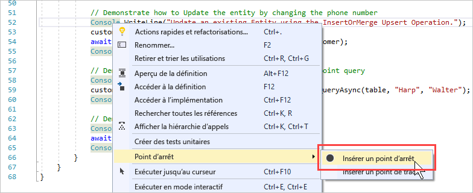
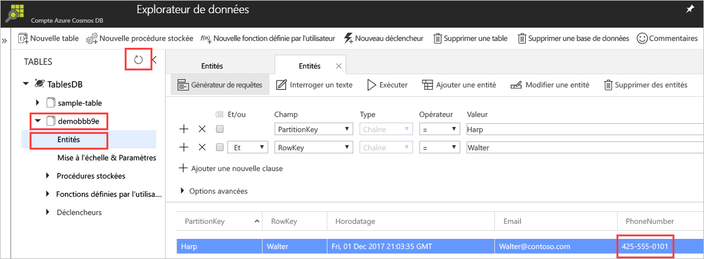

# <a name="quickstart-build-a-table-api-app-with-net-and-azure-cosmos-db"></a>Démarrage rapide : Créer une application d’API Table avec .NET et Azure Cosmos DB 

Ce guide de démarrage rapide montre comment utiliser .NET et [l’API Table](table-introduction.md) d’Azure Cosmos DB pour créer une application en clonant un exemple à partir de GitHub. Ce guide de démarrage rapide vous montre également comment créer un compte Azure Cosmos DB et comment utiliser l’Explorateur de données pour créer des tables et des entités dans le portail web Azure.

Azure Cosmos DB est le service de base de données multi-modèle de Microsoft distribué à l’échelle mondiale. Rapidement, vous avez la possibilité de créer et d’interroger des documents, des paires clé/valeur, et des bases de données orientées graphe, profitant tous de la distribution à l’échelle mondiale et des capacités de mise à l’échelle horizontale au cœur d’Azure Cosmos DB. 

## <a name="prerequisites"></a>configuration requise

Si vous n’avez pas encore installé Visual Studio 2017, vous pouvez télécharger et utiliser la version **gratuite** [Visual Studio 2017 Community Edition](https://www.visualstudio.com/downloads/). Veillez à activer **le développement Azure** lors de l’installation de Visual Studio.

[!INCLUDE [quickstarts-free-trial-note](../../includes/quickstarts-free-trial-note.md)]

## <a name="create-a-database-account"></a>Création d'un compte de base de données

> [!IMPORTANT] 
> Vous devez créer un compte d’API Table pour utiliser les kits SDK d’API Table mis à la disposition générale. Les comptes d’API Table créés pendant la durée de la préversion ne sont pas pris en charge par les kits SDK mis à la disposition générale.
>

[!INCLUDE [cosmos-db-create-dbaccount-table](../../includes/cosmos-db-create-dbaccount-table.md)]

## <a name="add-a-table"></a>Ajouter une table

[!INCLUDE [cosmos-db-create-table](../../includes/cosmos-db-create-table.md)]

## <a name="add-sample-data"></a>Ajouter un exemple de données

Vous pouvez maintenant ajouter des données à votre nouvelle table grâce à l’Explorateur de données.

1. Dans l’Explorateur de données, développez **exemple de table**, cliquez sur **Entités**, puis cliquez sur **Ajouter une entité**.

   
2. À présent, ajoutez des données à la zone de valeur PartitionKey et à la zone de valeur RowKey, puis cliquez sur **Ajouter une entité**.

   
  
    Vous pouvez maintenant ajouter des entités supplémentaires à votre table, éditer vos entités, ou interroger vos données dans l’Explorateur de données. À partir de l’Explorateur de données, vous pouvez également faire évoluer votre débit et ajouter des procédures stockées, des fonctions définies par l’utilisateur, et ajouter à votre table des déclencheurs.

## <a name="clone-the-sample-application"></a>Clonage de l’exemple d’application

À présent, nous allons cloner une application Table à partir de GitHub, configurer la chaîne de connexion et l’exécuter. Vous verrez combien il est facile de travailler par programmation avec des données. 

1. Ouvrez une fenêtre de terminal Git comme Git Bash et utilisez la commande `cd` pour accéder à un dossier d’installation pour l’exemple d’application. 

    ```bash
    cd "C:\git-samples"
    ```

2. Exécutez la commande suivante pour cloner l’exemple de référentiel : Cette commande crée une copie de l’exemple d’application sur votre ordinateur. 

    ```bash
    git clone https://github.com/Azure-Samples/storage-table-dotnet-getting-started.git
    ```
## <a name="open-the-sample-application-in-visual-studio"></a>Ouvrir l’exemple d’application dans Visual Studio

1. Dans Visual Studio, à partir du menu **Fichier**, choisissez **Ouvrir**, puis **Projet/Solution**. 

    

2. Accédez au dossier où vous avez cloné l’exemple d’application et ouvrez le fichier TableStorage.sln.

    

## <a name="update-your-connection-string"></a>Mise à jour de votre chaîne de connexion

Maintenant, retournez dans le portail Azure afin d’obtenir les informations de votre chaîne de connexion et de les copier dans l’application. Cette opération permet à votre application de communiquer avec votre base de données hébergée. 

1. Dans le [portail Azure](http://portal.azure.com/), cliquez sur **Chaîne de connexion**. 

    Utilisez les boutons de copie sur le côté droit de la fenêtre pour copier la **CHAÎNE DE CONNEXION PRINCIPALE**.

    

2. Dans Visual Studio, ouvrez le fichier App.config. 

3. Supprimez les marques de commentaire de la chaîne StorageConnectionString à la ligne 8 et commentez la chaîne StorageConnectionString à la ligne 7, étant donné que ce didacticiel n’utilise pas l’émulateur de stockage du Kit de développement logiciel (SDK) Azure. Les lignes 7 et 8 doivent maintenant ressembler à ceci :

    ```
    <!--key="StorageConnectionString" value="UseDevelopmentStorage=true;" />-->
    <add key="StorageConnectionString" value="DefaultEndpointsProtocol=https;AccountName=[AccountName];AccountKey=[AccountKey]" />
    ```

4. Collez la **CHAÎNE DE CONNEXION PRINCIPALE** du portail dans la valeur StorageConnectionString à la ligne 8. Collez la chaîne entre les guillemets. 

    > [!IMPORTANT]
    > Si votre point de terminaison utilise documents.azure.com, cela signifie que vous disposez d’un compte de version préliminaire et que vous devez créer un [nouveau compte d’API Table](#create-a-database-account) à utiliser avec le Kit de développement logiciel (SDK) d’API Table généralement disponible. 
    > 

    La ligne 8 doit maintenant ressembler à :

    ```
    <add key="StorageConnectionString" value="DefaultEndpointsProtocol=https;AccountName=<account name>;AccountKey=txZACN9f...==;TableEndpoint=https://<account name>.table.cosmosdb.azure.com;" />
    ```

5. Appuyez sur Ctrl+S pour enregistrer le fichier App.config.

Vous venez de mettre à jour votre application avec toutes les informations nécessaires pour communiquer avec Azure Cosmos DB. 

## <a name="build-and-deploy-the-app"></a>Génération et déploiement de l’application

1. Dans Visual Studio, cliquez avec le bouton droit sur le projet **TableStorage**dans **l’Explorateur de solutions**, puis cliquez sur **Gérer les packages NuGet**. 

   
2. Dans la zone **Parcourir** de NuGet, tapez *Microsoft.Azure.CosmosDB.Table*. Cela permet de rechercher la bibliothèque cliente API de Table Cosmos DB.
   
   

3. Cliquez sur **Installer** pour installer la bibliothèque **Microsoft.Azure.CosmosDB.Table**. Cette opération installe le package API Table d’Azure Cosmos DB et toutes les dépendances.

    

4. Ouvrez BasicSamples.cs. Cliquez avec le bouton droit sur la ligne 52, sélectionnez **Point d’arrêt**, puis **Insérer un point d’arrêt**. Insérez un autre point d’arrêt sur la ligne 55.

    

5. Appuyez sur F5 pour exécuter l'application.

    La fenêtre de console affiche le nom de la nouvelle base de données de tables (dans ce cas demo91ab4) dans Azure Cosmos DB. 
    
    

    En cas d’erreur relative aux dépendances, consultez [Résolution des problèmes](table-sdk-dotnet.md#troubleshooting).

    Lorsque vous atteignez le premier point d’arrêt, revenez à l’Explorateur de données dans le portail Azure. Cliquez sur le **Actualiser** bouton, développez la table demo*, puis cliquez sur **Entités**. L’onglet **Entités** situé à droite affiche la nouvelle entité qui a été ajoutée pour Walter Harp. Notez que le numéro de téléphone de la nouvelle entité est 425-555-0101.

    
    
6. Fermez l’onglet **Entités** dans l’Explorateur de données.
    
7. Appuyez sur F5 pour exécuter l’application jusqu’au point d’arrêt suivant. 

    Lorsque vous atteignez le point d’arrêt, revenez au portail, cliquez à nouveau sur **Entités** pour ouvrir l’onglet **Entités**, et notez que le numéro de téléphone a été remplacé par 425-555-0105.

8. Appuyez sur F5 pour exécuter l’application. 
 
   L’application ajoute des entités à utiliser dans un exemple d’application avancée que l’API Table ne prend pas en charge actuellement. L’application supprime ensuite la table créée par l’exemple d’application.

9. Dans la fenêtre de console, appuyez sur Entrée pour mettre fin à l’exécution de l’application. 
  

## <a name="review-slas-in-the-azure-portal"></a>Vérification des contrats SLA dans le portail Azure

[!INCLUDE [cosmosdb-tutorial-review-slas](../../includes/cosmos-db-tutorial-review-slas.md)]

## <a name="clean-up-resources"></a>Supprimer des ressources

[!INCLUDE [cosmosdb-delete-resource-group](../../includes/cosmos-db-delete-resource-group.md)]

## <a name="next-steps"></a>Étapes suivantes

Dans ce guide de démarrage rapide, vous avez appris à créer un compte Azure Cosmos DB, à créer une table à l’aide de l’Explorateur de données, et à exécuter une application.  Maintenant, vous pouvez interroger vos données à l’aide de l’API Table.  

> [!div class="nextstepaction"]
> [Importer des données de table dans l’API Table](table-import.md)

