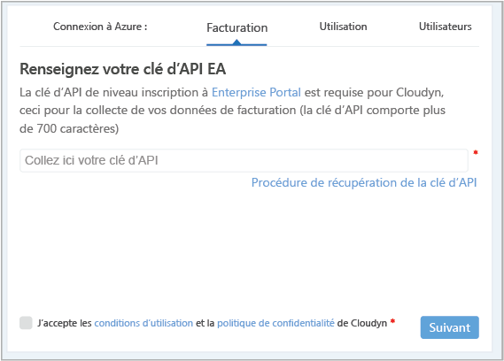
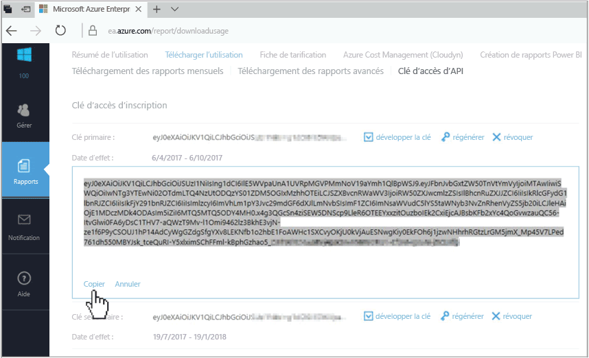
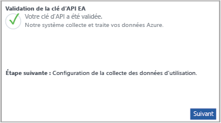

# Inscrire un Accord Entreprise Azure et afficher les données de coût

Vous utilisez votre Accord Entreprise Azure pour vous inscrire auprès du service Azure Cost Management. Votre inscription vous donne accès au portail Cloudyn. Ce guide de démarrage rapide décrit le processus d’inscription nécessaire pour créer un abonnement d’évaluation Cloudyn et vous connecter au portail Cloudyn. Il explique également comment afficher immédiatement des données de coût.

## Connexion à Azure

- Connectez-vous au Portail Azure à l’adresse http://portal.azure.com.

## Créer une inscription d’évaluation

1. Dans le portail Azure, cliquez sur **Gestion des coûts + Facturation** dans la liste des services.
2. Sous **Vue d’ensemble**, cliquez sur **Gestion des coûts**.  
    
3. Sur la page **Gestion des coûts**, cliquez sur le bouton d’**accès à la Gestion des coûts** pour ouvrir la page d’inscription de Cloudyn dans une nouvelle fenêtre.
4. Sur la page d’inscription à une évaluation du portail Cloudyn, tapez le nom de votre société, sélectionnez **Azure Individual Subscription Owner** (Propriétaire d’abonnement individuel Azure).  
    
5. Entrez votre clé d’API d’inscription au portail d’entreprise. Si vous n’avez pas votre clé, cliquez sur le [Enterprise Portal](https://ea.azure.com) lier et procédez comme suit :
  1. Connectez-vous au site web Azure Enterprise, cliquez sur **Rapports**, sur **Clé d’accès API**, puis copiez votre clé primaire.  
    
  3. Revenez à la page d’inscription et collez votre clé API.
6. Acceptez les conditions d’utilisation, puis validez votre clé. Cliquez sur **Next** (Suivant) pour autoriser Cloudyn à collecter des données de ressource Azure. Les données collectées incluent les données d’utilisation, de performances, de facturation et de balise de vos abonnements.  
    
7. L’option pour **inviter d’autres parties prenantes** permet d’ajouter des utilisateurs en tapant leurs adresses e-mail. Lorsque vous avez terminé, cliquez sur **Suivant**. Selon la taille de votre inscription Azure, jusqu’à 24 heures peuvent être nécessaires pour que toutes vos données de facturation soient ajoutées à Cloudyn.
8. Cliquez sur le bouton d’**accès à Cloudyn** pour ouvrir le portail Cloudyn. La page de **gestion des comptes cloud** devrait alors afficher les informations de votre compte EA inscrit.

Pour visionner un didacticiel vidéo sur l’inscription de votre Contrat Entreprise, consultez [Comment trouver l’ID d’inscription EA et la clé API à utiliser dans Azure Cost Management](https://youtu.be/u_phLs_udig).

[!INCLUDE [cost-management-create-account-view-data](../../includes/cost-management-create-account-view-data.md)]

## Étapes suivantes

Dans ce guide de démarrage rapide, vous avez utilisé les informations de votre Accord Entreprise Azure pour vous inscrire au service Gestion des coûts. Vous vous êtes également connecté au portail Cloudyn et avez affiché des données de coût. Pour en savoir plus sur Azure Cost Management, poursuivez avec le didacticiel sur Cost Management.

> [!div class="nextstepaction"]
> [Réviser l’utilisation et les coûts](./tutorial-review-usage.md)
