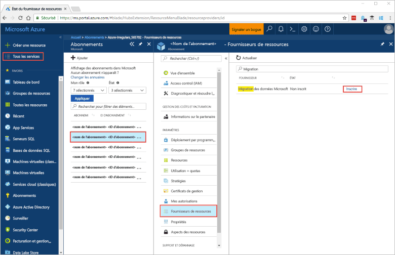
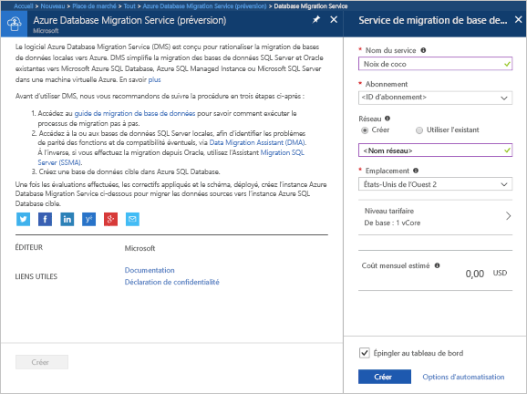
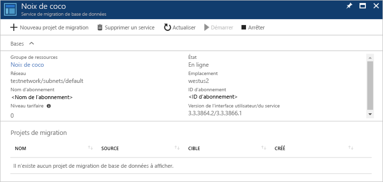

# Créer une instance d’Azure Database Migration Service à l’aide du portail Azure
Dans ce démarrage rapide, vous allez utiliser le portail Azure pour créer une instance d’Azure Database Migration Service.  Une fois le service créé, vous pouvez l’utiliser pour migrer des données entre une instance locale de SQL Server et une base de données SQL Azure.

Si vous n’avez pas d’abonnement Azure, créez un compte [gratuit](https://azure.microsoft.com/free/) avant de commencer.

## Connectez-vous au portail Azure.
Ouvrez votre navigateur web, accédez au [portail Microsoft Azure](https://portal.azure.com/), puis saisissez vos informations de connexion au portail.

Il s’ouvre par défaut sur le tableau de bord des services.

## Inscrire le fournisseur de ressources
Avant de créer votre première instance Database Migration Service, vous devez inscrire le fournisseur de ressources Microsoft.DataMigration.

1. Dans le portail Azure, sélectionnez **Tous les services**, puis **Abonnements**.

2. Sélectionnez l’abonnement dans lequel vous souhaitez créer l’instance Azure Database Migration Service, puis sélectionnez **Fournisseurs de ressources**.

3. Recherchez migration, puis à droite de Microsoft.DataMigration, sélectionnez **Inscrire**.

## Créer une instance du service
1. Cliquez sur **+ Créer une ressource** pour créer une instance de Azure Database Migration Service, qui est actuellement en préversion.

2. Recherchez « migration » sur la marketplace, sélectionnez **Azure Database Migration Service**, puis dans **Azure Database Migration Service (préversion)**, cliquez sur **Créer**.

3. Sur l’écran **Database Migration Service** : 

    - Choisissez un **Nom de service** unique et facile à mémoriser pour identifier votre instance d’Azure Database Migration Service.
    - Sélectionnez l’**abonnement** Azure dans lequel vous souhaitez créer l’instance.
    - Créez un **réseau** et attribuez-lui un nom unique.
    - Choisissez **l’emplacement** le plus proche de votre serveur source ou cible.
    - Pour le **niveau tarifaire**, sélectionnez « De base : 1 vCore ».

    
4. Sélectionnez **Créer**.

Votre instance d’Azure Database Migration Service est créée et prête à l’emploi au bout de quelques instants. Database Migration Service s’affiche alors comme indiqué dans l’image suivante :

## Supprimer des ressources
Vous pouvez nettoyer toutes les ressources créées au cours de ce démarrage rapide en supprimant le [Groupe de ressources Azure](../azure-resource-manager/resource-group-overview.md).  Pour supprimer le groupe de ressources, accédez à l’instance d’Azure Database Migration Service que vous avez créée. Sélectionnez le nom de **groupe de ressources**, puis sélectionnez **Supprimer le groupe de ressources**.  Cette action supprime toutes les ressources du groupe, ainsi que le groupe lui-même.

## Étapes suivantes
> [!div class="nextstepaction"]
> [Migrer une instance locale de SQL Server vers SQL Database](tutorial-sql-server-to-azure-sql.md)