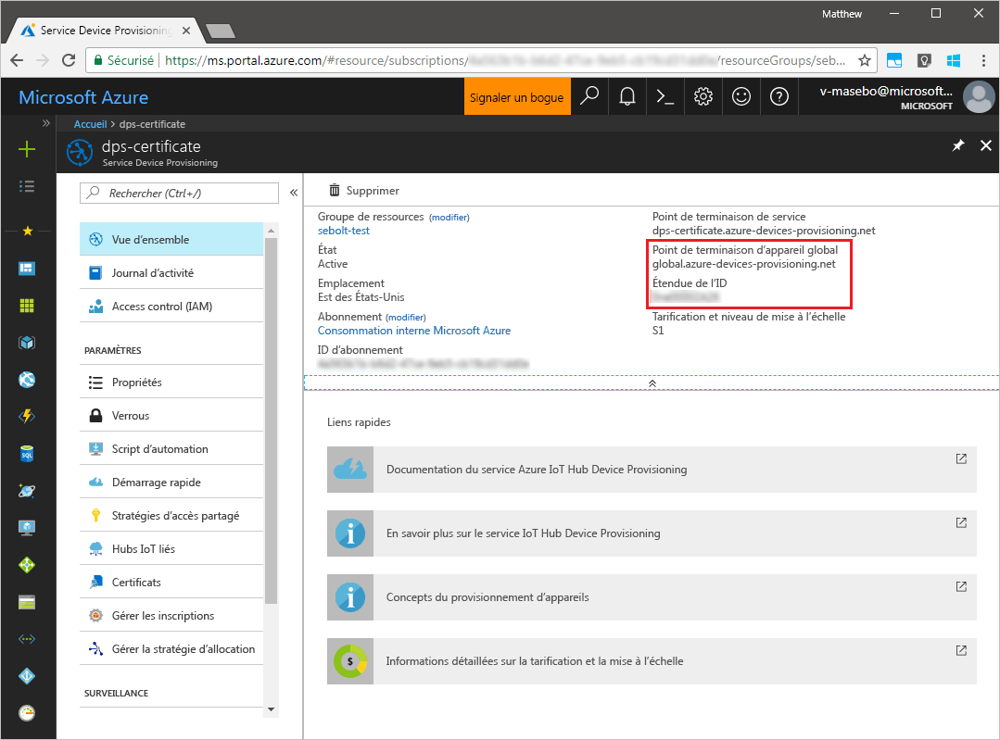
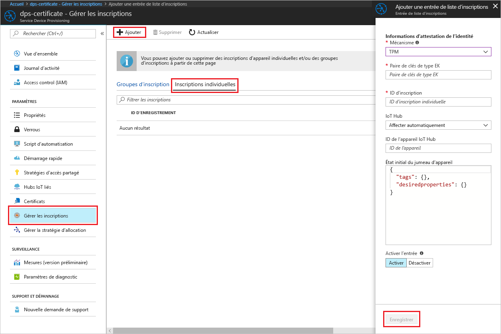
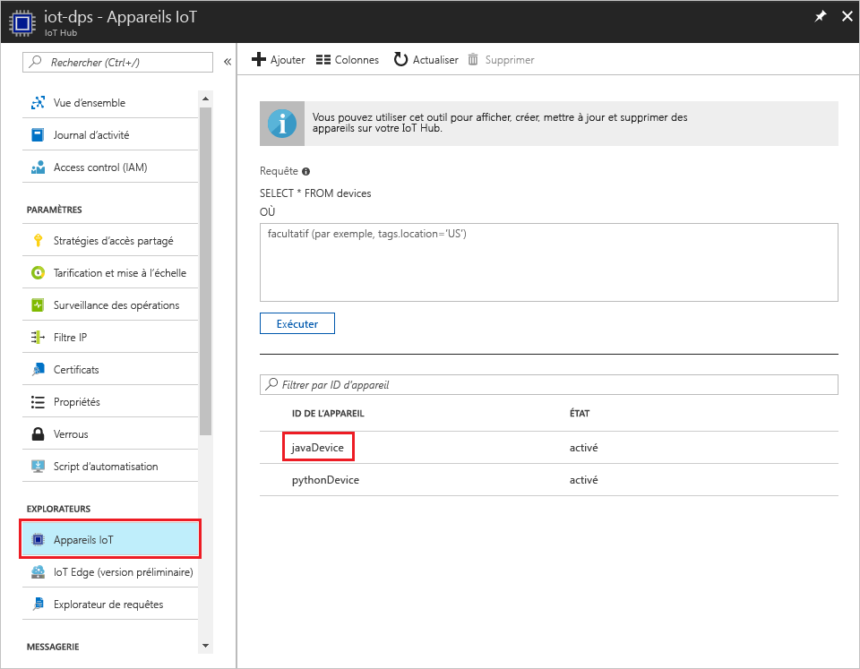

# <a name="create-and-provision-a-simulated-tpm-device-using-java-device-sdk-for-azure-iot-hub-device-provisioning-service"></a>Créer et approvisionner un appareil TPM simulé à l’aide du kit de développement logiciel (SDK) d’appareil Java pour le service d’approvisionnement d’appareil Azure IoT Hub

[!INCLUDE [iot-dps-selector-quick-create-simulated-device-tpm](../../includes/iot-dps-selector-quick-create-simulated-device-tpm.md)]

Ces étapes indiquent comment créer un appareil simulé sur votre ordinateur de développement exécutant le système d’exploitation Windows, comment exécuter le simulateur Windows TPM en tant que [Module de sécurité matériel (HSM)](https://azure.microsoft.com/blog/azure-iot-supports-new-security-hardware-to-strengthen-iot-security/) de l’appareil et comment utiliser l’exemple de code pour connecter cet appareil au service d’approvisionnement d’appareil et à votre IoT hub. 

Avant de continuer, veillez à réaliser les étapes décrites dans la section [Configuration du service IoT Hub Device Provisioning avec le portail Azure](./quick-setup-auto-provision.md).

[!INCLUDE [IoT DPS basic](../../includes/iot-dps-basic.md)]

## <a name="prepare-the-environment"></a>Préparer l’environnement 

1. Assurez-vous que le [Java SE Development Kit 8](http://www.oracle.com/technetwork/java/javase/downloads/jdk8-downloads-2133151.html) est bien installé sur votre ordinateur.

1. Téléchargez et installez [Maven](https://maven.apache.org/install.html).

1. Assurez-vous que l’élément `git` est installé sur votre machine et est ajouté aux variables d’environnement accessibles à la fenêtre de commande. Consultez la section relative aux [outils clients de Software Freedom Conservancy](https://git-scm.com/download/) pour accéder à la dernière version des outils `git` à installer, qui inclut **Git Bash**, l’application de ligne de commande que vous pouvez utiliser pour interagir avec votre référentiel Git local. 

1. Ouvrez une invite de commandes. Clonez le référentiel GitHub pour l’exemple de code de simulation d’appareil.
    
    ```cmd/sh
    git clone https://github.com/Azure/azure-iot-sdk-java.git --recursive
    ```

1. Exécutez le simulateur [TPM](https://docs.microsoft.com/windows/device-security/tpm/trusted-platform-module-overview). Cliquez sur **Autoriser l’accès** pour autoriser les modifications des paramètres de _pare-feu Windows_. Il écoute un socket sur les ports 2321 et 2322. Ne fermez pas cette fenêtre ; vous devez laisser ce simulateur s’exécuter jusqu’à la fin de ce guide de démarrage rapide. 

    ```cmd/sh
    .\azure-iot-sdk-java\provisioning\provisioning-tools\tpm-simulator\Simulator.exe
    ```

    

1. Dans une invite de commandes distincte, accédez au dossier racine et exécutez les exemples de dépendances.

    ```cmd/sh
    cd azure-iot-sdk-java
    mvn install -DskipTests=true
    ```

1. Accédez à l’exemple de dossier.

    ```cmd/sh
    cd provisioning/provisioning-samples/provisioning-tpm-sample
    ```

1. Connectez-vous au portail Azure, cliquez sur le bouton **Toutes les ressources** dans le menu de gauche et ouvrez votre service Device Provisioning. Notez votre _étendue de l’ID_ et _point de terminaison global de service d’approvisionnement_.

    

1. Modifiez `src/main/java/samples/com/microsoft/azure/sdk/iot/ProvisioningTpmSample.java` pour inclure les valeurs _ID scope_ (Étendue de l’ID) et _Provisioning Service Global Endpoint_ (Point de terminaison global du service d’approvisionnement) notées précédemment.  

    ```java
    private static final String idScope = "[Your ID scope here]";
    private static final String globalEndpoint = "[Your Provisioning Service Global Endpoint here]";
    private static final ProvisioningDeviceClientTransportProtocol PROVISIONING_DEVICE_CLIENT_TRANSPORT_PROTOCOL = ProvisioningDeviceClientTransportProtocol.HTTPS;
    ```

1. Créez le projet. Accédez au dossier cible et exécutez le fichier jar créé.

    ```cmd/sh
    mvn clean install
    cd target
    java -jar ./provisioning-tpm-sample-{version}-with-deps.jar
    ```

1. Le programme commence à s’exécuter. Notez la _paire de clés de type EK_ et _l’ID d’inscription_ pour la section suivante et laissez le programme s’exécuter.

    
    

## <a name="create-a-device-enrollment-entry"></a>Créer une entrée d’inscription d’appareil

1. Connectez-vous au portail Azure, cliquez sur le bouton **Toutes les ressources** dans le menu de gauche et ouvrez votre service Device Provisioning.

1. Dans le panneau de résumé du service d’approvisionnement d’appareil, sélectionnez **Gérer les inscriptions**. Sélectionnez l’onglet **Inscriptions individuelles** et cliquez sur le bouton **Ajouter** dans la partie supérieure. 

1. Sous l’**entrée Ajouter la liste d’inscription**, entrez les informations suivantes :
    - Sélectionnez **TPM** comme *mécanisme* d’attestation d’identité.
    - Entrez *l’ID d’inscription* et la *paire de clés de type EK (Endorsement Key)* pour votre appareil TPM notés plus tôt. 
    - Sélectionnez un hub IoT lié à votre service d’approvisionnement.
    - Entrez un ID d’appareil unique. Veillez à éviter les données sensibles lorsque vous affectez un nom à votre appareil.
    - Mettez à jour l’**état du jumeau d’appareil initial** à l’aide de la configuration initiale de votre choix pour l’appareil.
    - Cela fait, cliquez sur le bouton **Enregistrer**. 

      

   Lorsque l’inscription aboutit, *l’ID d’inscription* de votre appareil s’affiche dans la liste sous l’onglet *Inscriptions individuelles*. 


## <a name="simulate-the-device"></a>Simuler l’appareil

1. Dans la fenêtre de commande exécutant l’exemple de code Java sur votre machine, cliquez sur Entrée pour continuer à exécuter l’application. Notez les messages qui simulent le démarrage et la connexion de l’appareil au service d’approvisionnement d’appareil pour obtenir des informations concernant votre IoT Hub.  

    

1. En cas de réussite de l’approvisionnement de votre appareil simulé au IoT Hub lié à votre service d’approvisionnement, l’ID d’appareil s’affiche sur le panneau **Explorateur d’appareils** du concentrateur.

     

    Si vous avez modifié la valeur par défaut de l’*état du jumeau d’appareil initial* dans l’entrée d’inscription de votre appareil, l’état du jumeau souhaité peut être extrait du hub et agir en conséquence. Pour en savoir plus, consultez [Comprendre et utiliser les jumeaux d’appareil IoT Hub](../iot-hub/iot-hub-devguide-device-twins.md)


## <a name="clean-up-resources"></a>Supprimer des ressources

Si vous envisagez de continuer à manipuler et explorer l’exemple de client d’appareil, ne nettoyez pas les ressources créées lors de ce démarrage rapide. Sinon, procédez aux étapes suivantes pour supprimer toutes les ressources créées lors de ce démarrage rapide.

1. Fermez la fenêtre de sortie de l’exemple de client d’appareil sur votre machine.
1. Fermez la fenêtre du simulateur TPM sur votre machine.
1. Dans le menu de gauche du portail Azure, cliquez sur **Toutes les ressources**, puis sélectionnez votre service Device Provisioning. Ouvrez le panneau **Gérer les inscriptions** pour votre service, puis cliquez sur l’onglet **Inscriptions individuelles**. Sélectionnez l’*ID D’INSCRIPTION* de l’appareil inscrit dans ce démarrage rapide, puis cliquez sur le bouton **Supprimer** dans la partie supérieure. 
1. À partir du menu de gauche, dans le portail Azure, cliquez sur **Toutes les ressources**, puis sélectionnez votre IoT Hub. Ouvrez le panneau **IoT Devices** (Appareils IoT) pour votre hub, sélectionnez *l’ID D’APPAREIL* de l’appareil inscrit dans ce démarrage rapide, puis cliquez sur le bouton **Supprimer** dans la partie supérieure.

## <a name="next-steps"></a>Étapes suivantes

Dans ce démarrage rapide, vous avez créé un appareil simulé TPM sur votre machine et l’avez approvisionné vers votre hub IoT à l’aide du service IoT Hub Device Provisioning. Pour savoir comment inscrire un appareil TPM au moyen d’un programme, poursuivez avec le démarrage rapide correspondant. 

> [!div class="nextstepaction"]
> [Démarrage rapide : Inscrire l’appareil TPM auprès du service IoT Hub Device Provisioning](quick-enroll-device-tpm-java.md)
