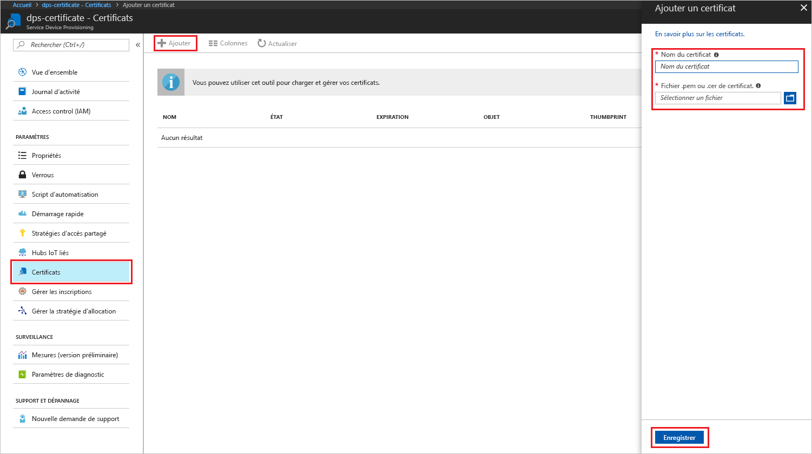
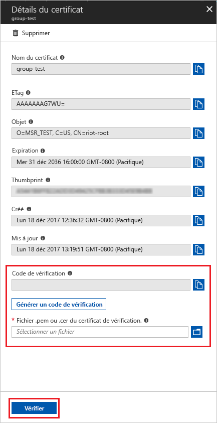

# <a name="create-and-provision-an-x509-simulated-device-using-nodejs-device-sdk-for-iot-hub-device-provisioning-service"></a>Créer et provisionner un appareil X.509 simulé à l’aide du Kit de développement logiciel Azure IoT device SDK pour Node.js pour le service IoT Hub Device Provisioning
[!INCLUDE [iot-dps-selector-quick-create-simulated-device-x509](../../includes/iot-dps-selector-quick-create-simulated-device-x509.md)]

Le service IoT Hub Device Provisioning est un service d’assistance pour IoT Hub qui propose le provisionnement sans contact des appareils dans le Hub IoT. Avec le service Device Provisioning, vous pouvez approvisionner des millions d’appareils de manière sécurisée et scalable.

Le provisionnement des appareils comporte deux étapes. La première étape consiste à créer l’entrée d’inscription appropriée dans le service Device Provisioning en fonction des besoins spécifiques de la solution.  La seconde étape consiste quant à elle à établir une connexion entre l’appareil et le service Device Provisioning et à inscrire l’appareil auprès du service IoT Hub. À l’issue de ces deux étapes, l’appareil est censé être complètement provisionné. Le service Device Provisioning automatise les deux étapes pour fournir une expérience d’approvisionnement fluide pour l’appareil. Pour plus d’informations, voir [Concepts du service IoT Hub Device Provisioning](https://docs.microsoft.com/en-us/azure/iot-dps/concepts-service).

Ces étapes montrent comment créer une entrée d’inscription dans le service Device Provisioning, simuler un appareil X.509 sur votre ordinateur de développement, connectez l’appareil simulé avec le service Device Provisioning et inscrire l’appareil auprès du service IoT Hub à l’aide du [Kit de développement logiciel (SDK) Azure IoT Hub Node.js Device SDK](https://github.com/Azure/azure-iot-sdk-node).

[!INCLUDE [IoT DPS basic](../../includes/iot-dps-basic.md)]

## <a name="prepare-the-environment"></a>Préparer l’environnement 

1. Avant de poursuivre, effectuez les étapes décrites dans la section [Configuration du service IoT Hub Device Provisioning avec le portail Azure](./quick-setup-auto-provision.md).

1. Vérifiez que la [version 4.0 ou supérieure de Node.js](https://nodejs.org) est installée sur votre machine.

1. Assurez-vous que l’élément [Git](https://git-scm.com/download/) est installé sur votre machine et ajouté aux variables d’environnement accessibles à la fenêtre de commande. 

1. Assurez-vous que le kit de ressources [OpenSSL](https://www.openssl.org/) est installé sur votre machine et ajouté aux variables d’environnement accessibles à la fenêtre de commande. Cette bibliothèque peut être générée et installée à partir d’une source ou téléchargée et installée à partir d’un [tiers](https://wiki.openssl.org/index.php/Binaries), par exemple [celui-ci](https://sourceforge.net/projects/openssl/). 

    > [!NOTE]
    > Si vous avez déjà créé vos certificats X.509 _racines_, _intermédiaires_ et/ou _feuilles_, vous pouvez ignorer cette étape et les étapes suivantes relatives à la génération de certificat.
    >


## <a name="create-an-enrollment-entry"></a>Créer une entrée d’inscription

L’inscription désigne l’enregistrement d’appareils ou de groupes d’appareils susceptibles d’être stockés à un moment donné dans le service Device Provisioning. L’enregistrement d’inscription contient des informations sur l’appareil ou le groupe d’appareils, notamment des détails sur les certificats X.509, ainsi que des informations d’inscription supplémentaires. Deux types d’inscription sont pris en charge par le service Device Provisioning : _l’inscription individuelle_ et le _groupe d’inscription_. Pour plus d’informations, voir la section relative aux [concepts de l’inscription](https://docs.microsoft.com/en-us/azure/iot-dps/concepts-service#enrollment).

Si vous créez vos propres certificats de test X.509, reportez-vous aux [concepts de sécurité](https://docs.microsoft.com/en-us/azure/iot-dps/concepts-security#x509-certificates) en fonction desquels des certificats sont nécessaires pour votre solution. Consultez également [Tools for the Azure IoT Device Provisioning Device SDK for Node.js](https://github.com/azure/azure-iot-sdk-node/tree/master/provisioning/tools) (Outils du Kit de développement logiciel (SDK) Azure IoT Device Provisioning Device SDK pour Node.js) pour connaître les détails d’implémentation.

1. Ouvrez une invite de commandes. Clonez le référentiel GitHub pour les exemples de code :
    
    ```cmd/sh
    git clone https://github.com/Azure/azure-iot-sdk-node.git --recursive
    ```

1. Accédez au script de générateur de certificats et générez le projet. 

    ```cmd/sh
    cd azure-iot-sdk-node/provisioning/tools
    npm install
    ```

1. Créez les informations d’inscription de l’une des façons suivantes, selon votre configuration :

    - **Inscription individuelle** :

        1. Créez le certificat _feuille_ en exécutant le script à l’aide de votre _nom-certificat_. Notez que le nom commun du certificat feuille devient alors [l’ID d’inscription](https://docs.microsoft.com/en-us/azure/iot-dps/concepts-device#registration-id). Veillez donc à utiliser uniquement des caractères alphanumériques minuscules et des traits d’union.

        ```cmd/sh
        node create_test_cert.js device {certificate-name}
        ```
         
        1. Dans le portail **Azure**, ouvrez le panneau de résumé **Service Device Provisioning**. Sélectionnez **Gérer les inscriptions**, puis l’onglet **Inscriptions individuelles**, et cliquez sur le bouton **Ajouter** dans la partie supérieure. 

        1. Sous l’**entrée Ajouter la liste d’inscription**, entrez les informations suivantes :
            - Sélectionnez **X.509** comme *mécanisme* d’attestation d’identité.
            - Dans *Fichier .pem ou .cer de certificat*, sélectionnez le fichier de certificat **_{nom-certificat}\_cert.pem_** créé au cours des étapes précédentes à l’aide du widget de *l’Explorateur de fichiers*.
            - Si vous le souhaitez, vous pouvez fournir les informations suivantes :
                - Sélectionnez un hub IoT lié à votre service d’approvisionnement.
                - Entrez un ID d’appareil unique. Veillez à éviter les données sensibles lorsque vous affectez un nom à votre appareil. 
                - Mettez à jour l’**état du jumeau d’appareil initial** à l’aide de la configuration initiale de votre choix pour l’appareil.
            - Cela fait, cliquez sur le bouton **Enregistrer**. 

          

    Lorsque l’inscription aboutit, votre appareil X.509 apparaît en tant que **{nom-certificat}** dans la colonne *ID d’inscription* de l’onglet *Inscriptions individuelles*. Notez cette valeur pour une utilisation ultérieure.

    - **Groupes d’inscription** : 

        1. Créez le certificat _racine_ en exécutant le script avec votre _nom-racine_.

        ```cmd/sh
        node create_test_cert.js root {root-name}
        ```

        1. Dans le portail **Azure**, ouvrez le panneau de résumé **Service Device Provisioning**. Sélectionnez **Certificats**, puis cliquez sur le bouton **Ajouter** dans la partie supérieure.

        1. Sous **Ajouter un certificat**, entrez les informations suivantes :
            - Entrez un nom de certificat unique.
            - Sélectionnez le fichier **_{nom-racine}\_cert.pem_** que vous avez créé précédemment.
            - Cela fait, cliquez sur le bouton **Enregistrer**.

        

        1. Sélectionnez le certificat que vous venez de créer :
            - Cliquez sur **Générer le code de vérification**. Copiez le code généré.
            - Créez le certificat de _vérification_. Entrez le _code de vérification_ ou cliquez avec le bouton droit et collez-le dans la fenêtre de script Node.js en cours d’exécution à l’aide de la commande suivante :

                ```cmd/sh
                node create_test_cert.js verification {rootname_cert} {verification code}
                ```

            - Dans *Fichier .pem ou .cer du certificat de vérification*, sélectionnez le fichier de certificat **_verification_cert.pem_** créé au cours des étapes précédentes à l’aide du widget de *l’Explorateur de fichiers*. Cliquez sur **Vérifier**.

            

        1. Sélectionnez **Gérer les inscriptions**. Sélectionnez l’onglet **Groupe d’inscriptions**, puis cliquez sur le bouton **Ajouter** dans la partie supérieure.
            - Entrez un nom de groupe unique.
            - Sélectionnez le nom de certificat unique créé précédemment
            - Si vous le souhaitez, vous pouvez fournir les informations suivantes :
                - Sélectionnez un hub IoT lié à votre service d’approvisionnement.
                - Mettez à jour l’**état du jumeau d’appareil initial** à l’aide de la configuration initiale de votre choix pour l’appareil.

        

        Une fois que l’inscription a abouti, votre groupe d’appareils X.509 apparaît sous la colonne *Nom de groupe*, dans l’onglet *Groupes d’inscription*. Notez cette valeur pour une utilisation ultérieure.

        1. Créez le certificat _feuille_ en exécutant le script à l’aide de votre _nom-certificat_ suivi du _nom-racine_ utilisé précédemment. Le nom commun du certificat feuille devient alors [l’ID d’inscription](https://docs.microsoft.com/en-us/azure/iot-dps/concepts-device#registration-id). Veillez donc à utiliser uniquement des caractères alphanumériques minuscules et des traits d’union.

            ```cmd/sh
            node create_test_cert.js device {certificate-name} {root-name}
            ```

        > [!NOTE]
        > Vous pouvez également créer des certificats _intermédiaires_ à l’aide de `node create_test_cert.js intermediate {certificate-name} {parent-name}`. Veillez simplement à créer le certificat _feuille_ en tant que dernière étape à l’aide du dernier certificat _intermédiaire_ utilisé comme son racine/parent. Pour plus d’informations, voir [Contrôle de l’accès des appareils](https://docs.microsoft.com/en-us/azure/iot-dps/concepts-security#controlling-device-access-to-the-provisioning-service-with-x509-certificates).
        >


## <a name="simulate-the-device"></a>Simuler l’appareil

Le [Kit de développement logiciel (SDK) Azure IoT Hub Node.js Device SDK](https://github.com/Azure/azure-iot-sdk-node) permet de simuler facilement un appareil. Pour plus d’informations, voir [Concepts de l’appareil](https://docs.microsoft.com/en-us/azure/iot-dps/concepts-device).

1. Dans le portail Azure, sélectionnez le panneau **Vue d’ensemble** du service Device Provisioning et notez les valeurs **_Point de terminaison d’appareil global_** et **_Étendue de l’ID_**.

     

1. Copiez votre _certificat_ et votre _clé_ dans le dossier d’exemples.

    ```cmd/sh
    copy .\{certificate-name}_cert.pem ..\device\samples\{certificate-name}_cert.pem
    copy .\{certificate-name}_key.pem ..\device\samples\{certificate-name}_key.pem
    ```

1. Accédez au script de test d’appareil et générez le projet. 

    ```cmd/sh
    cd ..\device\samples
    npm install
    ```

1. Modifiez le fichier **register\_x509.js**. Enregistrez le fichier après avoir apporté les modifications indiquées ci-dessous.
    - Remplacez `provisioning host` par la valeur **_Point de terminaison d’appareil global_** notée à **l’étape 1** ci-dessus.
    - Remplacez `id scope` par la valeur **_Étendue de l’ID_** notée à **l’étape 1** ci-dessus. 
    - Remplacez `reigstration id` par la valeur **_ID d’inscription_** ou **_Nom de groupe_** notée dans la section précédente.
    - Remplacez `cert filename` et `key filename` par les fichiers que vous avez copiés à **l’étape 2** ci-dessus. 

1. Exécutez le script et vérifiez que l’appareil a été provisionné correctement.

    ```cmd/sh
    node register_x509.js
    ```   

1. Dans le portail, accédez au IoT Hub lié à votre service d’approvisionnement et ouvrez le panneau **IoT Device**. En cas de réussite de l’approvisionnement de l’appareil X.509 simulé sur le Hub, son ID d’appareil s’affiche sur le panneau **IoT Device**, avec un *ÉTAT* **activé**. Notez que vous devrez peut-être cliquer sur le bouton **Actualiser** dans la partie supérieure si vous avez déjà ouvert le panneau avant d’exécuter l’exemple d’application de l’appareil. 

     

    Si vous avez modifié la valeur par défaut de l’*état du jumeau d’appareil initial* dans l’entrée d’inscription de votre appareil, l’état du jumeau souhaité peut être extrait du hub et agir en conséquence. Pour en savoir plus, consultez [Comprendre et utiliser les jumeaux d’appareil IoT Hub](../iot-hub/iot-hub-devguide-device-twins.md).


## <a name="clean-up-resources"></a>Supprimer des ressources

Si vous envisagez de continuer à manipuler et explorer l’exemple de client d’appareil, ne nettoyez pas les ressources créées lors de ce démarrage rapide. Sinon, procédez aux étapes suivantes pour supprimer toutes les ressources créées lors de ce démarrage rapide.

1. Fermez la fenêtre de sortie de l’exemple de client d’appareil sur votre machine.
1. Dans le menu de gauche du portail Azure, cliquez sur **Toutes les ressources**, puis sélectionnez votre service Device Provisioning. Ouvrez le panneau **Gérer les inscriptions** pour votre service, puis cliquez sur l’onglet **Inscriptions individuelles** ou **Groupes d’inscription**. Sélectionnez *l’ID D’INSCRIPTION* ou le *NOM DE GROUPE* de l’appareil inscrit dans ce démarrage rapide, puis cliquez sur le bouton **Supprimer** dans la partie supérieure. 
1. À partir du menu de gauche, dans le portail Azure, cliquez sur **Toutes les ressources**, puis sélectionnez votre IoT Hub. Ouvrez le panneau **IoT Devices** (Appareils IoT) pour votre hub, sélectionnez *l’ID D’APPAREIL* de l’appareil inscrit dans ce démarrage rapide, puis cliquez sur le bouton **Supprimer** dans la partie supérieure.


## <a name="next-steps"></a>Étapes suivantes

Dans ce démarrage rapide, vous avez créé un appareil X.509 simulé et l’avez provisionné auprès du service IoT Hub à l’aide du service Azure IoT Hub Device Provisioning Service sur le portail. Pour savoir comment inscrire un appareil X.509 au moyen d’un programme, poursuivez avec le démarrage rapide correspondant. 

> [!div class="nextstepaction"]
> [Démarrage rapide d’Azure : Inscrire des appareils X.509 auprès du service Azure IoT Hub Device Provisioning](quick-enroll-device-x509-node.md)
