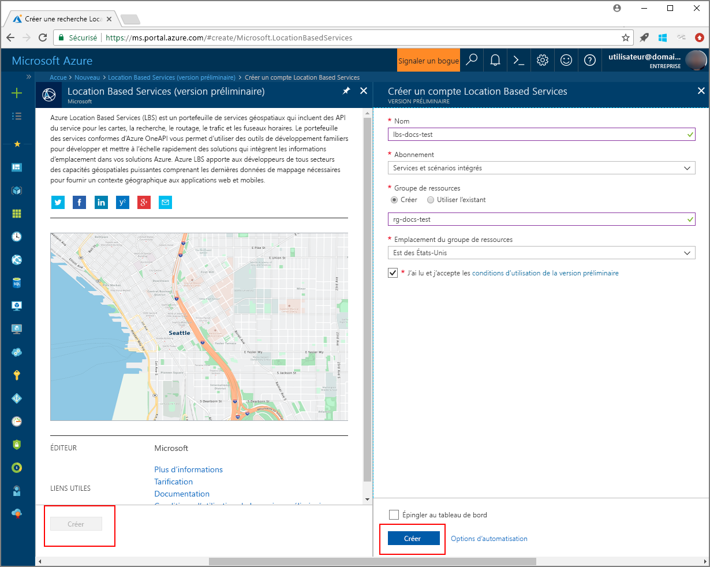
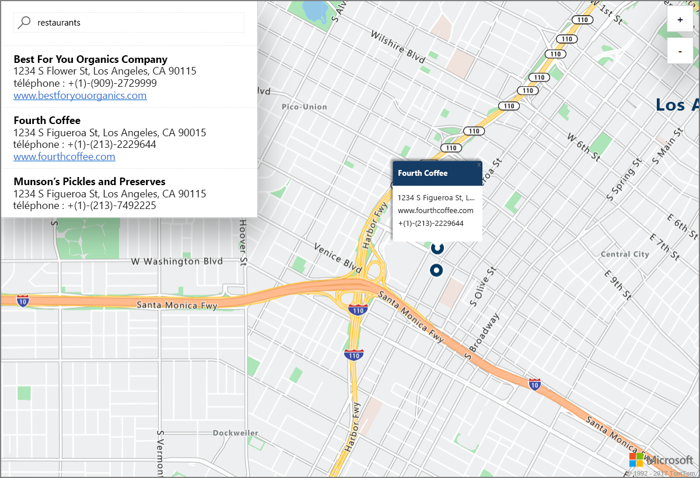

# Lancer une démonstration de recherche interactive sur une carte avec Azure Location Based Services (préversion)

Cet article illustre les fonctionnalités d’Azure Location Based Services (LBS), en prenant comme exemple une recherche interactive à l’aide d’Azure Maps. Il décrit également les étapes de base qui vous permettent de créer votre propre compte LBS et d’obtenir la clé de votre compte utilisable dans l’application web de démonstration. 

Si vous n’avez pas d’abonnement Azure, créez un [compte gratuit](https://azure.microsoft.com/free/?WT.mc_id=A261C142F) avant de commencer.

## Connectez-vous au portail Azure.

Connectez-vous au [portail Azure](https://portal.azure.com/).

## Créer un compte Location Based Services et obtenir la clé de compte

1. En haut à gauche du [portail Azure](https://portal.azure.com), cliquez sur **Créer une ressource**.
2. Dans la zone *Rechercher dans le marketplace*, tapez **location based services**.
3. Dans *Résultats*, cliquez sur **Location Based Services (préversion)**. Cliquez sur le bouton **Créer** qui s’affiche sous la carte. 
4. Dans la page **Créer un compte Location Based Services**, entrez le *Nom* de votre nouveau compte, sélectionnez *l’Abonnement* à utiliser, puis entrez le nom d’un *Groupe de ressources* nouveau ou existant. Sélectionnez l’emplacement de votre groupe de ressources, acceptez les *Conditions d’utilisation de la préversion*, puis cliquez sur **Créer**.

    

5. Une fois votre compte créé, ouvrez-le et accédez à ses **Paramètres**. Cliquez sur **Clés** pour obtenir les clés principale et secondaire de votre compte Azure Location Based Services. Copiez la valeur de la **Clé primaire** dans le Presse-papiers local afin de pouvoir l’utiliser dans la section suivante. 

## Télécharger l’application de démonstration pour Azure Maps

1. Téléchargez ou copiez le contenu du fichier [interactiveSearch.html](https://github.com/Azure-Samples/location-based-services-samples/blob/master/src/interactiveSearch.html).
2. Enregistrez le contenu de ce fichier localement en tant que **AzureMapDemo.html** et ouvrez-le dans un éditeur de texte.
3. Recherchez la chaîne `<insert-key>` et remplacez-la par la valeur de la **Clé primaire** obtenue dans la section précédente. 

## Lancer l’application de démonstration pour Azure Maps

1. Ouvrez le fichier **AzureMapDemo.html** dans le navigateur de votre choix.
2. Observez la carte de la ville de Los Angeles. La ville est déterminée par la valeur de la paire `[longitude, latitude]` affectée à la variable JavaScript nommée **center** dans le fichier *AzureMapDemo.html*. Vous pouvez changer ces coordonnées afin d’afficher la ville de votre choix. Par exemple, les coordonnées de la ville de New York sont *[-74.0060, 40.7128]*.
3. Dans la zone de recherche en haut à gauche de l’application web de démonstration, entrez n’importe quel type d’emplacement ou adresse que vous souhaitez rechercher. 
4. Déplacez votre souris sur la liste des adresses/emplacements qui s’affichent sous la zone de recherche, et notez comment la punaise correspondante sur la carte affiche des informations sur cet emplacement. Par exemple, si vous lancez cette application web et que vous recherchez *restaurants*, vous obtenez les résultats suivants. Notez que pour des raisons de confidentialité des entreprises privées, des adresses et des noms fictifs sont ici affichés. 

    

## Supprimer des ressources

Les didacticiels expliquent en détail comment utiliser et configurer Azure Location Based Services pour votre compte. Si vous prévoyez de continuer avec les didacticiels suivants, ne nettoyez pas les ressources créées dans ce guide de démarrage rapide. Sinon, procédez aux étapes suivantes pour supprimer toutes les ressources créées lors de ce démarrage rapide.

1. Fermez le navigateur qui exécute l’application web **AzureMapDemo.html**.
2. Dans le menu de gauche du portail Azure, cliquez sur **Toutes les ressources**, puis sélectionnez votre compte LBS. Dans la partie supérieure du panneau **Toutes les ressources**, cliquez sur **Supprimer**.

## Étapes suivantes

Dans ce guide de démarrage rapide, vous avez créé votre compte Azure LBS et vous avez lancé une application de démonstration à l’aide de votre compte. Pour découvrir comment créer votre propre application à l’aide des API Azure Location Based Services, passez au didacticiel suivant.

> [!div class="nextstepaction"]
> [Didacticiel expliquant comment effectuer des recherches dans des cartes Azure](./tutorial-search-location.md)
