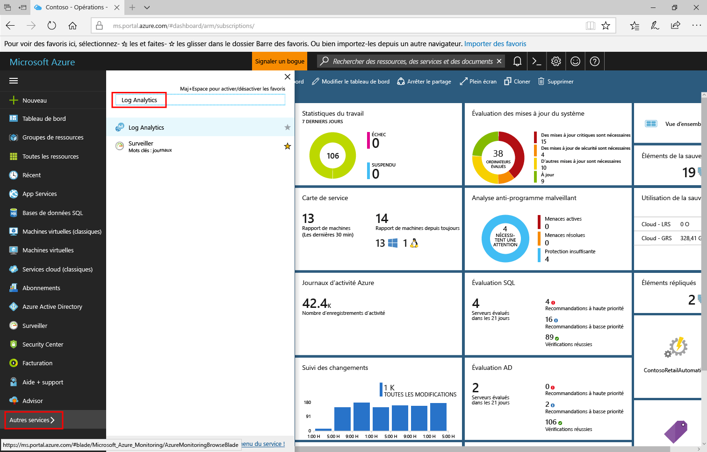

# Analyser l’utilisation des données dans Log Analytics
Log Analytics inclut des informations sur la quantité de données collectées, les systèmes qui envoient les données et les différents types de données envoyées.  Utilisez le tableau de bord **Utilisation de Log Analytics** pour voir la quantité de données envoyées au service Log Analytics. Le tableau de bord affiche la quantité de données collectées par chaque solution et la quantité de données que vos ordinateurs envoient.

## Comprendre le tableau de bord Utilisation
Le tableau de bord **Utilisation de Log Analytics** affiche les informations suivantes :

- Volume de données
    - Volume de données dans le temps (en fonction de la portée temporelle actuelle)
    - Volume de données par solution
    - Données non associées à un ordinateur
- Ordinateurs
    - Ordinateurs envoyant des données
    - Ordinateurs sans données dans les dernières 24 heures
- Offres
    - Nœuds Insight & Analytics
    - Nœuds d’automatisation et de contrôle
    - Nœuds de sécurité
- Liste de requêtes

### Utilisation des données d’utilisation
1. Connectez-vous au [Portail Azure](https://portal.azure.com).
2. Dans le portail Azure, cliquez sur **Plus de services** dans l’angle inférieur gauche. Dans la liste de ressources, saisissez **Log Analytics**. Au fur et à mesure de la saisie, la liste est filtrée. Sélectionnez **Log Analytics**.       
3. Dans votre liste d’espaces de travail Log Analytics, sélectionnez un espace de travail.
4. Sélectionnez **Utilisation de Log Analytics** à partir de la liste dans le volet gauche.
5. Dans le tableau de bord **Utilisation de Log Analytics**, cliquez sur **Heure : 24 dernières heures** pour modifier l’intervalle de temps.     
6. Affichez les panneaux de catégorie d’utilisation qui montrent les domaines qui vous intéressent. Choisissez un panneau, puis cliquez dessus pour afficher plus de détails dans [Recherche de journal](log-analytics-log-searches.md).     
7. Dans le tableau de bord Recherche de journal, passez en revue les résultats renvoyés par la recherche.   

## Créer une alerte lorsque la collection de données est plus volumineuse que prévu
Cette section décrit la création d’une alerte si :
- Le volume de données dépasse une quantité spécifiée.
- Le volume de données est censé dépasser une quantité spécifiée.

Les [alertes](log-analytics-alerts-creating.md) Log Analytics utilisent des requêtes de recherche. La requête suivante obtient un résultat quand plus de 100 Go de données sont collectés dans les dernières 24 heures :

`union withsource = $table Usage | where QuantityUnit == "MBytes" and iff(isnotnull(toint(IsBillable)), IsBillable == true, IsBillable == "true") == true | extend Type = $table | summarize DataGB = sum((Quantity / 1024)) by Type | where DataGB > 100`

La requête suivante utilise une formule simple pour prévoir le moment où plus de 100 Go de données seront envoyés en une journée : 

`union withsource = $table Usage | where QuantityUnit == "MBytes" and iff(isnotnull(toint(IsBillable)), IsBillable == true, IsBillable == "true") == true | extend Type = $table | summarize EstimatedGB = sum(((Quantity * 8) / 1024)) by Type | where EstimatedGB > 100`

Pour alerter sur un volume de données différent, remplacez la valeur de 100 dans les requêtes par le nombre de Go pour lequel vous souhaitez créer une alerte.

Utilisez les étapes décrites dans [Création d’une règle d’alerte](log-analytics-alerts-creating.md#create-an-alert-rule) pour être averti lorsque la collection de données est plus volumineuse que prévu.

Lors de la création de l’alerte pour la première requête, lorsque plus de 100 Go de données sont collectés en 24 heures, définissez :  
- **Nom** sur *Data volume greater than 100 GB in 24 hours* (Volume de données supérieur à 10 Go en 24 heures)  
- **Gravité** : *Avertissement*  
- **Requête de recherche** sur `union withsource = $table Usage | where QuantityUnit == "MBytes" and iff(isnotnull(toint(IsBillable)), IsBillable == true, IsBillable == "true") == true | extend Type = $table | summarize DataGB = sum((Quantity / 1024)) by Type | where DataGB > 100`   
- **Fenêtre de temps** sur *24 heures*
- **Fréquence de l’alerte** : une heure, car les données d’utilisation ne sont mises à jour qu’une fois par heure.
- **Générer l’alerte selon** sur *nombre de résultats*
- **Nombre de résultats** sur *Greater than 0* (Supérieur à 0)

Utilisez les étapes décrites dans [Ajouter des actions à des règles d’alerte dans Log Analytics](log-analytics-alerts-actions.md) pour configurer une action de messagerie, de webhook ou de runbook pour la règle d’alerte.

Lors de la création de l’alerte pour la seconde requête, lorsqu’il est prévu que plus de 100 Go de données seront collectés en 24 heures, définissez :
- **Nom** à *Data volume expected to greater than 100 GB in 24 hours* (Volume de données attendu supérieur à 10 Go en 24 heures)
- **Gravité** sur *Avertissement*
- **Requête de recherche** sur `union withsource = $table Usage | where QuantityUnit == "MBytes" and iff(isnotnull(toint(IsBillable)), IsBillable == true, IsBillable == "true") == true | extend Type = $table | summarize EstimatedGB = sum(((Quantity * 8) / 1024)) by Type | where EstimatedGB > 100`
- **Fenêtre de temps** sur *3 Hours* (3 heures)
- **Fréquence des alertes** sur une heure, car les données d’utilisation sont uniquement mises à jour une fois par heure.
- **Générer l’alerte selon** sur *nombre de résultats*
- **Nombre de résultats** sur *Greater than 0* (Supérieur à 0)

Lorsque vous recevez une alerte, utilisez les étapes de la section suivante pour résoudre les problèmes à l’origine d’une utilisation plus importante que prévu.

## Résolution des problèmes à l’origine d’une utilisation plus importante que prévu
Le tableau de bord Utilisation vous aide à identifier pourquoi l’utilisation (et donc les coûts) est plus importante que ce que vous attendez.

Une utilisation plus importante est due à l’un des éléments suivants, voire les deux :
- Plus de données que prévu sont envoyées à Log Analytics
- Plus de nœuds que prévu envoient des données à Log Analytics

### Vérifier s’il y a plus de données que prévu 
Deux sections clés de la page Utilisation vous permettent de déterminer ce qui est à l’origine du trop grand nombre de données collectées.

Le graphique *Volume de données dans le temps* représente le volume total de données envoyées et les ordinateurs envoyant le plus de données. Le graphique en haut vous permet de voir si votre utilisation des données globales augmente, reste stable ou diminue. La liste des ordinateurs montre les 10 ordinateurs envoyant le plus de données.

Le graphique *Volume de données par solution* représente le volume de données envoyé par chaque solution et les solutions envoyant le plus de données. Le graphique en haut montre affiche le volume total des données envoyées par chaque solution au fil du temps. Ces informations vous permettent de déterminer si une solution envoie plus de données, environ la même quantité de données, ou moins de données au fil du temps. La liste des solutions montre les 10 solutions envoyant le plus de données. 

Ces deux graphiques affichent toutes les données. Certaines données sont facturables, et les autres données sont libres. Pour vous concentrer uniquement sur les données facturables, modifiez la requête sur la page de recherche pour inclure `IsBillable=true`.  

Examinez le graphique *Volume de données dans le temps*. Pour voir les solutions et les types de données qui envoient le plus de données d’un ordinateur spécifique, cliquez sur le nom de l’ordinateur. Cliquez sur le nom du premier ordinateur dans la liste.

Dans la capture d’écran suivante, le type de données *Gestion des journaux/Performance* envoie le plus de données pour l’ordinateur.     

Ensuite, revenez au tableau de bord *Utilisation* et examinez le graphique *Volume de données par solution*. Pour voir les ordinateurs envoyant le plus de données pour une solution, cliquez sur le nom de la solution dans la liste. Cliquez sur le nom de la première solution dans la liste. 

La capture d’écran suivante confirme que l’ordinateur *acmetomcat* envoie le plus de données pour la solution de gestion des journaux.     

Si nécessaire, effectuez des analyses supplémentaires pour identifier des volumes importants au sein d’une solution ou d’un type de données. Les exemples de requêtes incluent :

+ une solution de **sécurité**
  - `SecurityEvent | summarize AggregatedValue = count() by EventID`
+ une solution de **gestion des journaux**
  - `Usage | where Solution == "LogManagement" and iff(isnotnull(toint(IsBillable)), IsBillable == true, IsBillable == "true") == true | summarize AggregatedValue = count() by DataType`
+ le type de données **Perf**
  - `Perf | summarize AggregatedValue = count() by CounterPath`
  - `Perf | summarize AggregatedValue = count() by CounterName`
+ le type de données **Event**
  - `Event | summarize AggregatedValue = count() by EventID`
  - `Event | summarize AggregatedValue = count() by EventLog, EventLevelName`
+ le type de données **Syslog**
  - `Syslog | summarize AggregatedValue = count() by Facility, SeverityLevel`
  - `Syslog | summarize AggregatedValue = count() by ProcessName`
+ le type de données **AzureDiagnostics**
  - `AzureDiagnostics | summarize AggregatedValue = count() by ResourceProvider, ResourceId`

Pour réduire le volume de journaux collectés, procédez comme suit :

| Source du volume de données important | Comment réduire le volume de données |
| -------------------------- | ------------------------- |
| Événements de sécurité            | Sélectionnez [les événements de sécurité courants ou minimaux](https://blogs.technet.microsoft.com/msoms/2016/11/08/filter-the-security-events-the-oms-security-collects/).   Modifier la stratégie d’audit de sécurité pour collecter les événements nécessaires uniquement. Plus particulièrement, examinez la nécessité de collecter des événements pour :   - [plateforme de filtrage de l’audit](https://technet.microsoft.com/library/dd772749(WS.10).aspx)   - [registre de l’audit](https://docs.microsoft.com/windows/device-security/auditing/audit-registry)  - [système de fichiers de l’audit](https://docs.microsoft.com/windows/device-security/auditing/audit-file-system)  - [objet de noyau d’audit](https://docs.microsoft.com/windows/device-security/auditing/audit-kernel-object)  - [manipulation du descripteur de l’audit](https://docs.microsoft.com/windows/device-security/auditing/audit-handle-manipulation)  - [stockage amovible de l’audit](https://docs.microsoft.com/windows/device-security/auditing/audit-removable-storage) |
| Compteurs de performances       | Modifiez la [configuration du compteur de performances](log-analytics-data-sources-performance-counters.md) de façon à :   - Réduire la fréquence de collecte   - Réduire le nombre de compteurs de performance |
| Journaux d’événements                 | Modifiez la [configuration du journal d’événements](log-analytics-data-sources-windows-events.md) de façon à :   - Réduire le nombre de journaux des événements collectés   - Collecter uniquement les niveaux d’événement requis Par exemple, ne collectez pas les événements de niveau *Informations*. |
| syslog                     | Modifiez la [configuration du syslog](log-analytics-data-sources-syslog.md) de façon à :   - Réduire le nombre d’installations collectées   - Collecter uniquement les niveaux d’événement requis Par exemple, ne collectez pas les événements de niveau *Informations* et *Débogage*. |
| AzureDiagnostics           | Modifiez la collection de journaux de ressources pour :   - Réduire le nombre de journaux d’envoi de ressources à Log Analytics   - Collecter uniquement les journaux nécessaires |
| Données de solution d’ordinateurs n’ayant pas besoin de la solution | Utilisez le [ciblage de solution](../operations-management-suite/operations-management-suite-solution-targeting.md) pour collecter des données des groupes d’ordinateurs requis uniquement. |

### Vérifier s’il y a plus de nœuds que prévu
Si vous utilisez le niveau tarifaire *Par nœud (OMS)*, vous êtes facturé en fonction du nombre de nœuds et de solutions que vous utilisez. Vous pouvez voir le nombre de nœuds utilisés par offre dans la section *Offres* du tableau de bord d’utilisation.     

Cliquez sur **Afficher tout...**  pour consulter la liste complète des ordinateurs envoyant des données pour l’offre sélectionnée.

Utilisez le [ciblage de solution](../operations-management-suite/operations-management-suite-solution-targeting.md) pour collecter des données des groupes d’ordinateurs requis uniquement.

## Vérifier s’il existe une latence d’ingestion
Avec Log Analytics, il existe une latence anticipée avec l’ingestion des données collectées.  Le temps absolu entre l’indexation des données et leur disponibilité pour une recherche peut être imprévisible. Précédemment, nous avions inclus un graphique des performances dans le tableau de bord, montrant le temps nécessaire pour la collecte et l’indexation des données, nous l’avons temporairement supprimé du fait de l’introduction du nouveau langage de requête.  La requête suivante peut être utilisée comme solution temporaire pour estimer la latence de chaque type de données, en attendant une mise à jour des métriques de latence d’ingestion des données.  

    search *
    | where TimeGenerated > ago(8h)
    | summarize max(TimeGenerated) by Type
    | extend LatencyInMinutes = round((now() - max_TimeGenerated)/1m,2)
    | project Type, LatencyInMinutes
    | sort by LatencyInMinutes desc

> [!NOTE]
> La requête de latence d’ingestion n’affiche pas de latences antérieures et elle retourne uniquement des résultats actuels.  La valeur de *TimeGenerated* est remplie au niveau de l’agent pour les journaux de schémas courants et elle est remplie au point de terminaison de collection pour les journaux personnalisés.  
>

## étapes suivantes
* Consultez [Recherche de données à l’aide de recherches de journal](log-analytics-log-searches.md) pour apprendre à utiliser le langage de recherche. Vous pouvez utiliser des requêtes de recherche pour effectuer des analyses supplémentaires sur les données d’utilisation.
* Utilisez les étapes décrites dans [Création d’une règle d’alerte](log-analytics-alerts-creating.md#create-an-alert-rule) pour être averti lorsqu’un critère de recherche est rempli.
* Utiliser le [ciblage de solution](../operations-management-suite/operations-management-suite-solution-targeting.md) pour collecter des données des groupes d’ordinateurs requis uniquement
* Pour configurer une règle efficace de collecte d’événements de sécurité, passez en revue [Stratégie de filtrage de Azure Security Center ](../security-center/security-center-enable-data-collection.md)
* Modifier la [configuration du compteur de performances](log-analytics-data-sources-performance-counters.md)
* Pour modifier vos paramètres de collecte d’événements, consultez [Configuration du journal des événements](log-analytics-data-sources-windows-events.md)
* Pour modifier vos paramètres de collecte de messages syslog, consultez [Configuration de syslog](log-analytics-data-sources-syslog.md)
