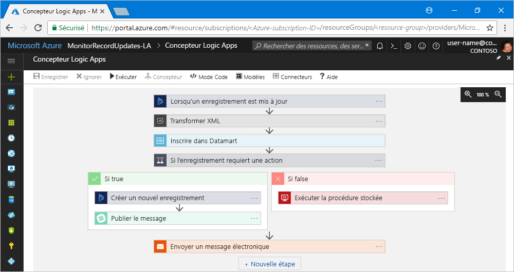

# Qu’est-ce qu’Azure Logic Apps ?

[Logic Apps](https://azure.microsoft.com/services/logic-apps) vous aide à générer, planifier et automatiser des processus en tant que [flux de travail](#logic-app-concepts) afin que vous puissiez intégrer des applications, des données, des systèmes et des services entre des entreprises ou des organisations. Logic Apps simplifie la création et la création de solutions évolutives pour l’intégration d’application, l’intégration de données, l’intégration de systèmes, l’intégration des applications de l’entreprise (EAI) et une communication entre entreprises (B2B), dans le cloud, sur site, ou les deux.

Par exemple, voici quelques charges de travail que vous pouvez automatiser avec les applications logiques :

* Traitement et routage de commandes sur différents systèmes locaux et services cloud.
* Déplacer des fichiers téléchargés depuis un serveur FTP vers Stockage Azure. 
* Surveiller des tweets sur un sujet spécifique, analyser l’opinion et créer des alertes ou des tâches pour les éléments à examiner.

Pour générer des solutions d’intégration avec des applications logiques, choisissez à partir d’une galerie croissante d’environ [200 connecteurs intégrés](../connectors/apis-list.md), tels que SQL Database, les services Azure, Office 365, Salesforce, Google et bien plus encore. Ces [connecteurs](#logic-app-concepts) fournissent des [déclencheurs](#logic-app-concepts), des [actions](#logic-app-concepts), ou les deux, pour la création d’applications logiques disposant d’un accès sécurisé aux données et les traitant en temps réel.

> [!VIDEO https://channel9.msdn.com/Blogs/Azure/Introducing-Azure-Logic-Apps/player]

## Comment fonctionne Logic Apps ? 

Chaque flux de travail d’application logique commence par un déclencheur, qui se déclenche lorsqu’un événement spécifique se produit, ou lorsque de nouvelles données disponibles répondent aux critères spécifiques. Plusieurs déclencheurs incluent des fonctionnalités de planification de base afin que vous puissiez choisir la régularité d’exécution des charges de travail. Pour des scénarios de planification plus personnalisés, démarrez vos flux de travail avec le déclencheur de planification. En savoir plus sur [la façon de générer des flux de travail basés sur une planification](../logic-apps/tutorial-build-schedule-recurring-logic-app-workflow.md).

Chaque fois que le déclencheur s’active, le moteur Logic Apps crée une instance d’application logique qui exécute les actions du flux de travail. Ces actions peuvent également inclure des conversions de données et des contrôles de flux, telles que des instructions conditionnelles, des instructions de basculement, des boucles et la création de branches. Par exemple, cette application logique démarre par un déclencheur Dynamics 365 avec le critère intégré « lorsqu’un enregistrement est mis à jour ». Si le déclencheur détecte un événement correspondant à ce critère, il est activé et exécute les actions du flux de travail. Ici, ces actions incluent la transformation XML, les mises à jour de données, la création de branches de décision et les notifications par e-mail.

Vous pouvez créer vos applications logiques visuellement avec le Concepteur d’applications logiques, disponible dans le portail Azure via votre navigateur et dans Visual Studio. Pour disposer d’applications logiques plus personnalisées, vous pouvez créer ou modifier des définitions d’application logique dans JavaScript Objet Notation (JSON) en travaillant en mode « code ». Vous pouvez également utiliser des commandes Azure PowerShell et des modèles Azure Resource Manager pour sélectionner des tâches. Les applications logiques se déploient et s’exécutent dans le cloud sur Azure. Pour une présentation plus détaillée, regardez cette vidéo : [Utiliser Azure Enterprise Integration Services pour exécuter des applications cloud à l’échelle](https://channel9.msdn.com/Events/Connect/2017/T119/)

## Pourquoi utiliser Logic Apps ?

Avec des entreprises de plus en plus portées sur la numérisation, les applications logiques vous permettent de connecter facilement et rapidement des systèmes hérités, modernes et innovants, en fournissant des API prédéfinies en tant que connecteurs gérés par Microsoft. De cette façon, vous pouvez vous concentrer sur la logique métier et les fonctionnalités de vos applications. Vous n’avez pas à vous soucier de la création, de l’hébergement, de la mise à l’échelle, de la gestion, de la maintenance et de la surveillance de vos applications. Logic Apps gère ces problèmes pour vous. De plus, vous payez uniquement ce que vous utilisez, avec un [modèle de tarification](../logic-apps/logic-apps-pricing.md) basé sur la consommation. 

Dans de nombreux cas, vous n’avez pas à écrire du code. Mais si vous devez en écrire, vous pouvez créer des extraits de code avec [Azure Functions](../azure-functions/functions-overview.md) et l’exécuter à la demande à partir d’applications logiques. En outre, si votre application logique a besoin d’interagir avec des événements à partir de services Azure, d’applications personnalisées ou de solutions tierces, vous pouvez utiliser [Azure Event Grid](../event-grid/overview.md) avec vos applications logiques pour la surveillance, le routage et la publication d’événements.

Logic Apps, Functions et Event Grid sont entièrement gérés par Microsoft Azure, vous évitant ainsi d’avoir à vous soucier de la compilation, de l’hébergement, de la mise à l’échelle, de la gestion, de la surveillance et du maintien de vos solutions. Avec la possibilité de créer des [applications et des solutions « sans serveur »](../logic-apps/logic-apps-serverless-overview.md), vous pouvez vous concentrer uniquement sur la logique métier. Ces services sont automatiquement redimensionnés pour répondre à vos besoins, rendre les intégrations plus rapides et vous aider à créer des applications cloud fiables avec un minimum de code. De plus, vous payez uniquement ce que vous utilisez, avec un [modèle de tarification](../logic-apps/logic-apps-pricing.md) basé sur la consommation. 

Pour savoir comment les sociétés ont amélioré leur flexibilité et la concentration sur leurs activités principales grâce à la combinaison de Logic Apps avec d’autres services Azure et des produits Microsoft, consultez ces [témoignages](https://aka.ms/logic-apps-customer-stories).

Voici de plus amples détails sur les fonctionnalités et les avantages de Logic Apps :

* **Concevoir visuellement des flux de travail avec des outils simples à utiliser**

  Gagnez du temps et simplifiez les processus complexes avec des outils de conception visuelle. 
  Créez des applications logiques complètes à l’aide du Concepteur d’applications logiques via votre navigateur dans le portail Azure ou dans Visual Studio. Démarrez votre flux de travail à l’aide d’un déclencheur, et ajoutez des actions à l’aide de la [galerie des connecteurs](../connectors/apis-list.md).

* **Prise en main plus rapide à l’aide des modèles d’application logique**

  Créez rapidement des solutions courantes plus rapidement lorsque vous choisissez des flux de travail prédéfinis à partir de la [galerie de modèles](../logic-apps/logic-apps-create-logic-apps-from-templates.md). 
  Les modèles vont de la connectivité simple pour les applications software-as-a-service (SaaS) aux solutions avancées B2B avec des modèles « pour vous amuser ». Apprenez comment [créer des applications logiques à partir de modèles prédéfinis](../logic-apps/logic-apps-create-logic-apps-from-templates.md).

* **Connecter des systèmes disparates au sein d’environnements différents**

  Certains modèles et flux de travail sont faciles à décrire, mais difficiles à implémenter dans le code. 
  Les applications logiques vous permettent de connecter en toute transparence différents systèmes entre des environnements cloud et locaux. Par exemple, vous pouvez connecter une solution marketing cloud à un système de facturation local, ou centraliser la messagerie entre les API et les systèmes avec un Service Bus d’entreprise. Les applications logiques offrent un moyen rapide, fiable et cohérent pour fournir des solutions réutilisables et reconfigurables pour ces scénarios.

* **Prise en charge de première classe pour l’intégration d’entreprise et les scénarios B2B**

  Les entreprises et les organisations communiquent électroniquement entre elles à l’aide des protocoles et de formats de message standards mais différents, tels que X12, AS2 et EDIFACT. 
  Avec les fonctionnalités du [Enterprise Library Integration Pack pour Microsoft Azure (EIP)](../logic-apps/logic-apps-enterprise-integration-overview.md), vous pouvez créer des applications logiques qui transforment les formats de message utilisés par vos partenaires en des formats interprétables et utilisables par les systèmes de votre organisation. Les applications logiques gèrent ces échanges sans heurts et de façon sécurisée grâce au chiffrement et aux signatures numériques.

  Commencez par vos systèmes et services actuels et augmentez de façon incrémentielle à votre propre rythme. Lorsque vous êtes prêt, Logic Apps et le EIP vous aident à mettre en œuvre et à monter en puissance vers des scénarios d’intégration plus matures, grâce à ces fonctionnalités et bien plus encore :

  * Profiter de ces produits et services : 
    * [Microsoft BizTalk Server](https://docs.microsoft.com/biztalk/core/introducing-biztalk-server) 
    * [Gestion des API](../api-management/api-management-key-concepts.md) 
    * [Azure Functions](../azure-functions/functions-overview.md) 
    * [Azure Service Bus](../service-bus-messaging/service-bus-messaging-overview.md)
  * Gérer les [messages XML](../logic-apps/logic-apps-enterprise-integration-xml.md)
  * Gérer les [fichiers plats](../logic-apps/logic-apps-enterprise-integration-flatfile.md)
  * Échanger des messages avec les protocoles [EDIFACT](../logic-apps/logic-apps-enterprise-integration-edifact.md), [AS2](../logic-apps/logic-apps-enterprise-integration-as2.md), et [X12](../logic-apps/logic-apps-enterprise-integration-x12.md)
  * Stocker et gérer ces artefacts B2B et plus encore, dans un emplacement avec les [comptes d’intégration](../logic-apps/logic-apps-enterprise-integration-accounts.md) :
    * [Partenaires](../logic-apps/logic-apps-enterprise-integration-partners.md)
    * [Accords](../logic-apps/logic-apps-enterprise-integration-agreements.md) 
    * [Mappages de transformation XML](../logic-apps/logic-apps-enterprise-integration-maps.md)
    * [Schémas de validation XML](../logic-apps/logic-apps-enterprise-integration-schemas.md)

* **Écrire une seule fois, réutiliser souvent**

  Créez vos applications logiques comme des modèles, pour pouvoir [déployer et reconfigurer vos applications](../logic-apps/logic-apps-create-deploy-template.md) dans plusieurs environnements et régions.

* **Extensibilité intégrée**

  Si vous ne trouvez pas le connecteur souhaité ou nécessaire pour exécuter du code personnalisé, vous pouvez étendre les applications logiques en créant et en appelant vos propres extraits de code à la demande via [Azure fonctions](../azure-functions/functions-overview.md). 
  Créez vos propres [API](../logic-apps/logic-apps-create-api-app.md) et [connecteurs personnalisés](../logic-apps/custom-connector-overview.md), que vous pouvez appeler à partir d’applications logiques.

* **Payez uniquement pour ce que vous utilisez**
  
  Logic Apps utilise un [contrôle et une tarification](../logic-apps/logic-apps-pricing.md) basés sur la consommation, à moins que vous ayez des applications logiques créées précédemment avec des plans App Service.

En savoir plus sur Logic Apps avec ces vidéos d’introduction :
* [Intégration avec Logic Apps - passer de zéro à héros](https://channel9.msdn.com/Events/Build/2017/C9R17)
* [Intégration d’entreprise avec Microsoft Azure Logic Apps](https://channel9.msdn.com/Events/Ignite/Microsoft-Ignite-Orlando-2017/BRK2188)
* [Concevoir des processus d’entreprise avancés avec Logic Apps](https://channel9.msdn.com/Events/Ignite/Microsoft-Ignite-Orlando-2017/BRK3179)

## Termes clés

* **Flux de travail**: visualiser, concevoir, générer, automatiser et déployer des processus d’entreprise en tant que série d’étapes.

* **Connecteurs gérés** : vos applications logiques ont besoin d’un accès aux données, services et systèmes. Vous pouvez utiliser des connecteurs gérés prégénérés par Microsoft et qui sont conçus pour se connecter, accéder et travailler avec vos données. Voir [Connecteurs pour Azure Logic Apps](../connectors/apis-list.md)

* **Déclencheurs**: beaucoup de connecteurs gérés par Microsoft fournissent des déclencheurs qui s’activent lorsque des événements ou de nouvelles données répondent aux conditions spécifiées. Par exemple, un événement peut être la réception d’un e-mail ou la détection de modifications dans votre compte de Stockage Azure. Chaque fois que le déclencheur s’active, le moteur Logic Apps crée une nouvelle instance d’application logique qui exécute le flux de travail.

* **Actions**: les actions sont toutes les étapes qui se produisent après le déclencheur. Chaque action correspond généralement à une opération définie par un connecteur géré, une API personnalisée ou un connecteur personnalisé.

* **Enterprise Integration Pack** : pour les scénarios d’intégration plus élaborés, Logic Apps intègre des fonctionnalités de BizTalk Server. Enterprise Integration Pack fournit des connecteurs permettant aux applications logiques d’effectuer facilement une validation, une transformation, et bien plus encore.

## Comment Logic Apps diffère de Functions, WebJobs et Flow ?

Tous ces services vous aident à « coller » et connecter des systèmes hétérogènes. Chaque service ayant des avantages, combiner leurs fonctionnalités est la meilleure façon de créer rapidement un système d’intégration évolutif et complet. Pour plus d’informations, voir [Choisir entre Flow, Logic Apps, Functions et WebJobs](../azure-functions/functions-compare-logic-apps-ms-flow-webjobs.md).

## Prise en main 

Logic Apps est l’un des nombreux services hébergés sur Microsoft Azure. Avant de commencer, vous avez besoin d’un abonnement Azure. Si vous n’avez pas encore d’abonnement, vous pouvez <a href="https://azure.microsoft.com/free/" target="_blank">vous inscrire pour obtenir un compte Azure gratuitement</a>. 

Si vous avez un abonnement Azure, essayez ce [guide de démarrage rapide pour créer votre première application logique](../logic-apps/quickstart-create-first-logic-app-workflow.md), qui analyse le nouveau contenu sur un site Web via un flux RSS et envoie un e-mail lorsqu’un nouveau contenu apparaît.

## Support et commentaires

* Si vous avez des questions, consultez le [forum Azure Logic Apps](https://social.msdn.microsoft.com/Forums/en-US/home?forum=azurelogicapps).
* Pour voter pour des idées de fonctionnalités ou pour en soumettre, visitez le [site de commentaires des utilisateurs Logic Apps](http://aka.ms/logicapps-wish).

## Étapes suivantes

* [Contrôlez le trafic à l’aide d’une application logique planifiée](../logic-apps/tutorial-build-schedule-recurring-logic-app-workflow.md)
* En savoir plus sur [les solutions sans serveur avec Azure](../logic-apps/logic-apps-serverless-overview.md)
* En savoir plus sur [l’intégration B2B avec Enterprise Integration Pack](../logic-apps/logic-apps-enterprise-integration-overview.md)