# <a name="quickstart-build-your-first-logic-app-workflow---azure-portal"></a>Démarrage rapide : créer votre premier flux de travail d’application logique (portail Azure)

Ce guide de démarrage rapide explique comment créer votre premier flux de travail automatisé avec [Azure Logic Apps](../logic-apps/logic-apps-overview.md). Dans cet article, vous créez une application logique qui vérifie régulièrement le flux RSS d’un site web et recherche de nouveaux éléments. Si de nouveaux éléments existent, l’application logique envoie un e-mail pour chacun d’eux. Lorsque vous avez terminé, votre application logique ressemble au flux de travail suivant à un niveau élevé :


Pour suivre ce guide de démarrage rapide, vous avez besoin d’un compte de messagerie d’un fournisseur pris en charge par Logic Apps, par exemple Office 365 Outlook, Outlook.com ou Gmail. Pour les autres fournisseurs, [passez en revue la liste des connecteurs ici](https://docs.microsoft.com/connectors/). Cette application logique utilise un compte Office 365 Outlook. Si vous utilisez un autre compte de messagerie, les étapes générales sont identiques, mais votre interface utilisateur peut-être légèrement différente. 

De même, si vous n’avez pas d’abonnement Azure, <a href="https://azure.microsoft.com/free/" target="_blank">inscrivez-vous pour bénéficier d’un compte Azure gratuit</a>.

## <a name="sign-in-to-the-azure-portal"></a>Connectez-vous au portail Azure.

Connectez-vous au <a href="https://portal.azure.com" target="_blank">portail Azure</a> avec les informations d’identification de votre compte Azure.

## <a name="create-your-logic-app"></a>Créer votre application logique 

1. Dans le menu principal Azure, choisissez **Créer une ressource** > **Enterprise Integration** > **Application logique**.

   

3. Sous **Créer une application logique**, indiquez les détails de votre application logique comme indiqué ici. Lorsque c’est fait, choisissez **Épingler au tableau de bord** > **Créer**.

   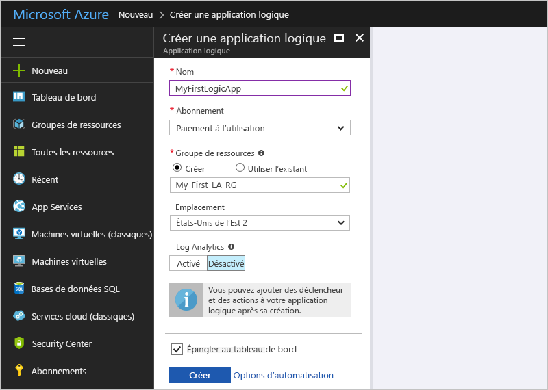

   | Paramètre | Valeur | Description | 
   | ------- | ----- | ----------- | 
   | **Name** | MyFirstLogicApp | Nom de l’application logique. | 
   | **Abonnement** | <*your-Azure-subscription-name*> | Nom de votre abonnement Azure. | 
   | **Groupe de ressources** | My-First-LA-RG | Nom du [groupe de ressources Azure](../azure-resource-manager/resource-group-overview.md) utilisé pour organiser les ressources connexes. | 
   | **Lieu** | Est des États-Unis 2 | Région dans laquelle stocker les informations sur votre application logique. | 
   | **Log Analytics** | Off | Maintenez le paramètre de journalisation des diagnostics **Désactivé**. | 
   |||| 

3. Une fois qu’Azure a déployé votre application, le Concepteur d’applications logiques s’ouvre et affiche une page contenant une vidéo de présentation et les déclencheurs couramment utilisés. Sous **Modèles**, choisissez **Application logique vide**.

   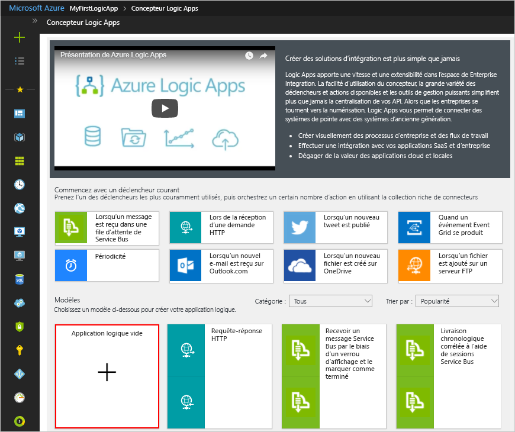

Ensuite, ajoutez un [déclencheur](../logic-apps/logic-apps-overview.md#logic-app-concepts) qui s’active lorsqu’un nouvel élément de flux RSS apparaît. Chaque application logique doit démarrer avec un déclencheur, qui s’active lorsqu’un événement spécifique se produit ou lorsqu’une condition particulière est remplie. Chaque fois que le déclencheur s’active, le moteur Logic Apps crée une instance d’application logique qui démarre et exécute votre flux de travail.

## <a name="check-rss-feed-with-a-trigger"></a>Vérifier le flux RSS avec un déclencheur

1. Dans le concepteur, entrez « rss » dans la zone de recherche. Sélectionnez le déclencheur suivant : **RSS - Lors de la publication d’un élément de flux**

   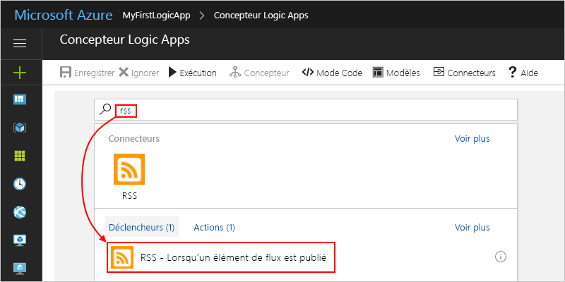

2. Fournissez ces informations pour votre déclencheur, comme illustré et décrit : 

   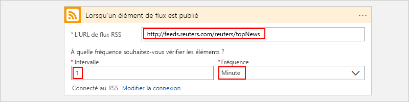

   | Paramètre | Valeur | Description | 
   | ------- | ----- | ----------- | 
   | **URL du flux RSS** | ```http://feeds.reuters.com/reuters/topNews``` | Lien du flux RSS que vous souhaitez surveiller. | 
   | **Intervalle** | 1 | Nombre d’intervalles d’attente entre les vérifications. | 
   | **Fréquence** | Minute | Unité de temps de chaque intervalle entre les vérifications.  | 
   |  |  |  | 

   Ensemble, l’intervalle et la fréquence définissent la planification du déclencheur de votre application logique. 
   Cette application logique vérifie le flux toutes les minutes.

3. Pour masquer les informations du déclencheur pour le moment, cliquez dans sa barre de titre.

   

4. Enregistrez votre application logique. Dans la barre d’outils du concepteur, choisissez **Enregistrer**. 

Votre application logique est à présent en ligne mais elle ne fait rien d’autre que vérifier le flux RSS. Par conséquent, ajoutez une action qui répond à l’activation du déclencheur.

## <a name="send-email-with-an-action"></a>Envoyer un e-mail à l’aide d’une action

Ajoutez une [action](../logic-apps/logic-apps-overview.md#logic-app-concepts) qui envoie un e-mail lorsqu’un nouvel élément apparaît dans le flux RSS. 

1. Sous le déclencheur **Lors de la publication d’un élément de flux**, choisissez **+ Nouvelle étape** > **Ajouter une action**.

   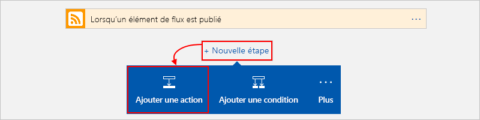

2. Sous **Choisir une action**, recherchez « envoyer un e-mail », puis sélectionnez l’action « envoyer un e-mail » pour le fournisseur de messagerie de votre choix. Pour filtrer la liste d’actions pour un service spécifique, vous pouvez sélectionner tout d’abord le connecteur sous **Connecteurs**.

   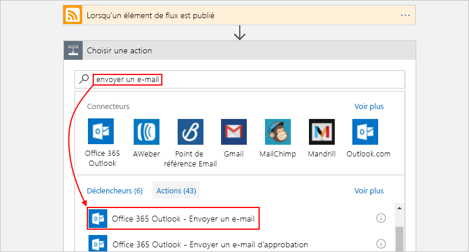

   * Pour les comptes Azure professionnels ou scolaires, sélectionnez Office 365 Outlook. 
   * Pour les comptes Microsoft personnels, sélectionnez Outlook.com.

3. Si vous êtes invité à entrer vos informations d’identification, connectez-vous à votre compte de messagerie afin que Logic Apps puisse établir une connexion avec votre compte de messagerie.

4. Dans l’action **Envoyer un e-mail**, spécifiez les données que vous souhaitez inclure dans l’e-mail. 

   1. Dans la zone **À**, entrez l’adresse e-mail du destinataire. 
   À des fins de test, vous pouvez utiliser votre propre adresse e-mail.

      Pour l’instant, ignorez la liste des paramètres ou la liste **Ajouter du contenu dynamique** qui s’affiche. 
      Lorsque vous cliquez dans certaines zones d’édition, cette liste apparaît et affiche les paramètres disponibles de l’étape précédente que vous pouvez inclure en tant qu’entrées dans votre flux de travail.
      La largeur de la fenêtre du navigateur détermine la liste qui s’affiche.

   2. Dans la zone **Objet**, entrez ce texte avec un espace vide de fin : ```New RSS item: ```.

      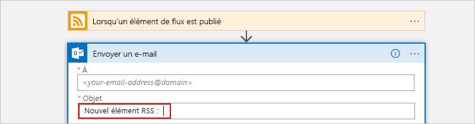
 
   3. Dans la liste des paramètres ou la liste **Ajouter du contenu dynamique**, sélectionnez **Titre du flux** pour inclure le titre de l’élément RSS.

      Par exemple, voici la liste des paramètres :

      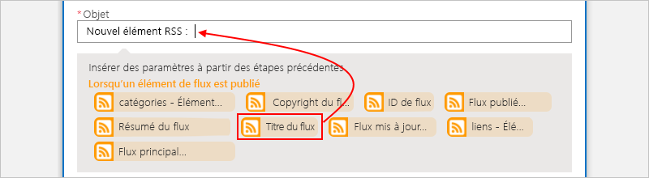

      Et voici la liste de contenu dynamique :

      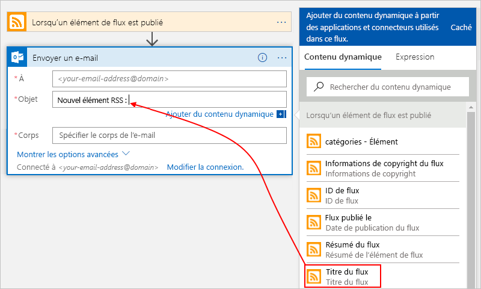

      Lorsque vous avez terminé, l’objet de l’e-mail ressemble à l’exemple suivant :

      

      Si une boucle « For Each » s’affiche dans le concepteur, c’est que vous avez sélectionné un champ qui contient un tableau, par exemple, le champ **categories-item**. 
      Pour ces types de champ, le concepteur ajoute automatiquement cette boucle autour de l’action qui référence ce champ. 
      De cette façon, votre application logique effectue la même action sur chaque élément du tableau. 
      Pour supprimer la boucle, choisissez le bouton **points de suspension** (**...**) sur la barre de titre de la boucle, puis **Supprimer**.

   4. Dans la zone **Corps**, entrez ce texte, puis sélectionnez ces champs pour le corps de l’e-mail. 
   Pour ajouter des lignes vides dans une zone d’édition, appuyez sur Maj + Entrée. 

      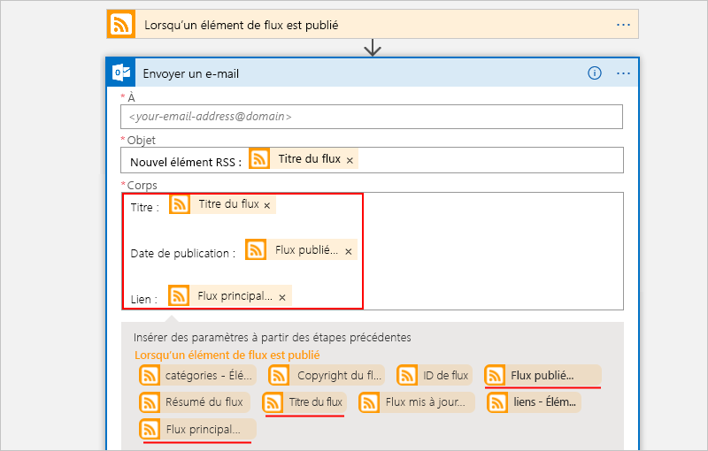

      | Paramètre | Description | 
      | ----- | ----------- | 
      | **Titre du flux** | Titre de l’élément. | 
      | **Flux publié le** | Date et heure de publication de l’élément. | 
      | **Lien du flux principal** | URL de l’élément. | 
      ||| 
   
5. Enregistrez votre application logique.

À présent, testez votre application logique.

## <a name="run-your-logic-app"></a>Exécuter votre application logique

Pour lancer manuellement votre application logique, sélectionnez **Exécuter** dans la barre d’outils du concepteur. Vous pouvez également attendre que votre application logique s’exécute selon la planification que vous avez spécifiée (toutes les minutes). Si le flux RSS a de nouveaux éléments, votre application logique envoie un e-mail pour chaque nouvel élément. Néanmoins si le flux ne comporte aucun nouvel élément, votre application logique ignore l’activation du déclencheur et attend le prochain intervalle avant de procéder à une nouvelle vérification. 

Par exemple, voici un exemple d’e-mail envoyé par cette application logique :

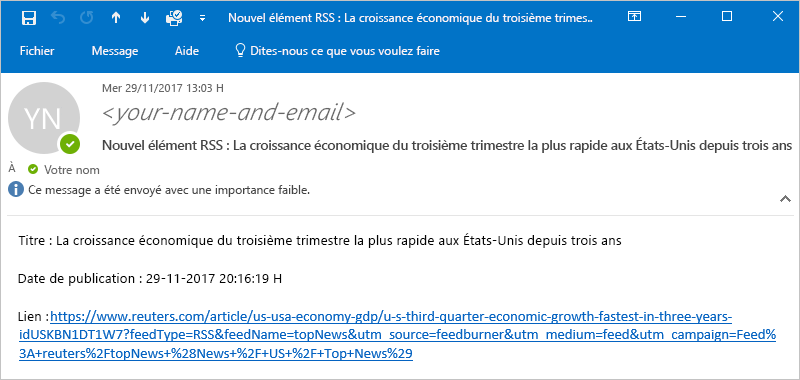

Si vous ne recevez pas d’e-mail, vérifiez le dossier Courrier indésirable de votre messagerie. Il se peut que le filtre de courrier indésirable redirige ces types de courrier. 

Félicitations ! Vous venez de créer et d’exécuter votre première application logique.

## <a name="clean-up-resources"></a>Supprimer des ressources

Quand vous n’en avez plus besoin, supprimez le groupe de ressources qui contient votre application logique et les ressources associées. Dans le menu Azure principal, accédez à **Groupes de ressources**, puis sélectionnez le groupe de ressources de votre application logique. Choisissez **Supprimer un groupe de ressources**. Confirmez le nom du groupe de ressources, puis choisissez **Supprimer**.

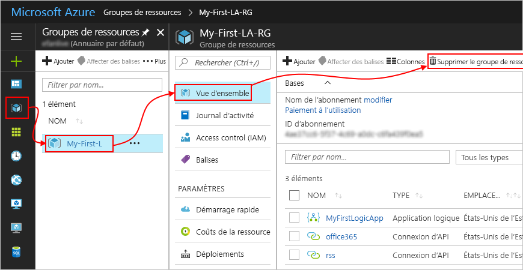

## <a name="get-support"></a>Obtenir de l’aide

* Si vous avez des questions, consultez le [forum Azure Logic Apps](https://social.msdn.microsoft.com/Forums/en-US/home?forum=azurelogicapps).
* Pour voter pour des idées de fonctionnalités ou pour en soumettre, visitez le [site de commentaires des utilisateurs Logic Apps](http://aka.ms/logicapps-wish).

## <a name="next-steps"></a>Étapes suivantes

Dans ce guide de démarrage rapide, vous avez créé votre première application logique qui vérifie les mises à jour RSS en fonction de la planification que vous avez spécifiée (toutes les minutes) et exécute une action (envoi d’un e-mail) lorsqu’il existe des mises à jour. Pour en savoir plus, poursuivez ce didacticiel qui crée des flux de travail planifiés plus avancés :

> [!div class="nextstepaction"]
> [Contrôler le trafic à l’aide d’une application logique planifiée](../logic-apps/tutorial-build-schedule-recurring-logic-app-workflow.md)