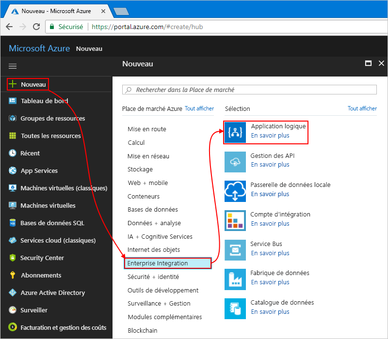

# <a name="check-traffic-with-a-scheduler-based-logic-app"></a>Contrôler le trafic à l’aide d’une application logique planifiée

Azure Logic Apps permet d’automatiser les flux de travail qui s’exécutent selon une planification. Ce didacticiel montre comment générer une [application logique](../logic-apps/logic-apps-overview.md) avec un déclencheur basé sur un planificateur qui s’exécute chaque matin et vérifie la durée du trajet, y compris le trafic, entre deux endroits. Si la durée dépasse une limite définie, l’application logique envoie un e-mail contenant la durée du trajet et le temps supplémentaire nécessaire pour atteindre votre destination.

Ce tutoriel vous montre comment effectuer les opérations suivantes :

> [!div class="checklist"]
> * Créez une application logique vide. 
> * Ajoutez un déclencheur qui fonctionne comme un planificateur pour votre application logique.
> * Ajoutez une action qui permet d’obtenir la durée du trajet pour effectuer un itinéraire.
> * Ajoutez une action qui crée une variable, convertit la durée du trajet de secondes en minutes, et enregistre le résultat dans la variable.
> * Ajoutez une condition qui compare la durée du trajet avec une limite définie.
> * Ajoutez une action qui envoie un e-mail si la durée du trajet dépasse la limite.

Lorsque vous avez terminé, votre application logique ressemble à ce flux de travail à un niveau élevé :


Si vous n’avez pas d’abonnement Azure, <a href="https://azure.microsoft.com/free/" target="_blank">créez un compte Azure gratuit</a> avant de commencer.

## <a name="prerequisites"></a>Prérequis

* Un compte de messagerie d’un fournisseur de messagerie pris en charge par Azure Logic Apps, par exemple Office 365 Outlook, Outlook.com ou Gmail. Pour les autres fournisseurs, [passez en revue la liste des connecteurs ici](https://docs.microsoft.com/connectors/). Ce guide de démarrage rapide utilise un compte Outlook.com. Si vous utilisez un autre compte de messagerie, les étapes générales sont identiques, mais l’affichage de l’interface utilisateur peut être légèrement différent.

* Pour obtenir la durée de trajet d’un itinéraire, vous avez besoin d’une clé d’accès pour l’API Bing Cartes. Pour obtenir cette clé, suivez les étapes décrites dans l’article indiquant <a href="https://msdn.microsoft.com/library/ff428642.aspx" target="_blank">comment obtenir une clé Bing Cartes</a>. 

## <a name="sign-in-to-the-azure-portal"></a>Connectez-vous au portail Azure.

Connectez-vous au <a href="https://portal.azure.com" target="_blank">portail Azure</a> avec les informations d’identification de votre compte Azure.

## <a name="create-your-logic-app"></a>Créer votre application logique

1. Dans le menu principal Azure, choisissez **Créer une ressource** > **Enterprise Integration** > **Application logique**.

   

2. Sous **Créer une application logique**, indiquez les informations suivantes sur votre application logique comme illustré et décrit. Lorsque c’est fait, cliquez sur **Épingler au tableau de bord** > **Créer**.

   

   | Paramètre | Valeur | Description | 
   | ------- | ----- | ----------- | 
   | **Name** | LA-TravelTime | Nom de l’application logique. | 
   | **Abonnement** | <*your-Azure-subscription-name*> | Nom de votre abonnement Azure. | 
   | **Groupe de ressources** | LA-TravelTime-RG | Nom du [groupe de ressources Azure](../azure-resource-manager/resource-group-overview.md) utilisé pour organiser les ressources connexes. | 
   | **Lieu** | Est des États-Unis 2 | Région dans laquelle stocker les informations sur votre application logique | 
   | **Log Analytics** | Off | Maintenez le paramètre de journalisation des diagnostics **Désactivé**. | 
   |||| 

3. Une fois qu’Azure a déployé votre application, le Concepteur d’applications logiques s’ouvre et affiche une page contenant une vidéo de présentation et des modèles d’applications logiques courantes. Sous **Modèles**, choisissez **Application logique vide**.

   

À présent, ajoutez le [déclencheur](../logic-apps/logic-apps-overview.md#logic-app-concepts) de périodicité qui s’active selon une planification spécifiée. Chaque application logique doit commencer par un déclencheur, qui est activé lorsqu’un événement spécifique se produit ou lorsque de nouvelles données respectent une condition particulière. Pour plus d’informations, voir [Créer votre première application logique](../logic-apps/quickstart-create-first-logic-app-workflow.md).

## <a name="add-scheduler-trigger"></a>Ajouter un déclencheur basé sur un planificateur

1. Dans le concepteur, entrez « périodicité » dans la zone de recherche. Sélectionnez le déclencheur **Planification - Récurrence**

   

2. Dans la forme **Périodicité**, choisissez le bouton **points de suspension** (**...**), puis **Renommer**. Renommez le déclencheur à l’aide de cette description : ```Check travel time every weekday morning```.

   

3. Dans le déclencheur, choisissez **Afficher les options avancées**.

4. Fournissez les détails de planification et de périodicité pour votre déclencheur, comme affiché et décrit :

   

   | Paramètre | Valeur | Description | 
   | ------- | ----- | ----------- | 
   | **Intervalle** | 1 | Nombre d’intervalles d’attente entre les vérifications. | 
   | **Fréquence** | Semaine | Unité de temps à utiliser pour la périodicité. | 
   | **Fuseau horaire** | Aucun | S’applique uniquement si vous spécifiez une heure de début. Utile pour la spécification d’un fuseau horaire non local. | 
   | **Heure de début** | Aucun | Retarde la périodicité jusqu’à une date et une heure spécifiques. Pour plus d’informations, voir [Planifier des tâches et flux de travail à exécuter régulièrement avec des applications logiques](../connectors/connectors-native-recurrence.md). | 
   | **Aux jours indiqués** | Lundi,mardi,mercredi,jeudi,vendredi | Disponible uniquement lorsque le paramètre **Fréquence** est défini sur « Semaine ». | 
   | **Aux heures indiquées** | 7,8,9 | Disponible uniquement lorsque le paramètre **Fréquence** est défini sur « Semaine » ou « Jour ». Sélectionnez les heures de la journée pour exécuter cette périodicité. Cet exemple s’exécute aux marques de 7, 8 et 9 heures. | 
   | **Aux minutes indiquées** | 0,15,30,45 | Disponible uniquement lorsque le paramètre **Fréquence** est défini sur « Semaine » ou « Jour ». Sélectionnez les minutes de la journée pour exécuter cette périodicité. Cet exemple s’exécute toutes les 15 minutes à partir de la marque zéro heure. | 
   ||||

   Ce déclencheur s’active tous les jours ouvrables, toutes les 15 minutes, de à 7 h 00 à 9 h 45. 
   La zone **Aperçu** indique la planification de la périodicité. 
   Pour plus d’informations, voir [Planifier des tâches et flux de travail à exécuter régulièrement avec des applications logiques](../connectors/connectors-native-recurrence.md) et [Actions et déclencheurs de flux de travail](../logic-apps/logic-apps-workflow-actions-triggers.md#recurrence-trigger).

5. Pour masquer les informations du déclencheur pour le moment, cliquez dans la barre de titre de la forme.

   

6. Enregistrez votre application logique. Dans la barre d’outils du concepteur, choisissez **Enregistrer**. 

Votre application logique est à présent active, mais elle s’exécute uniquement en fonction d’une périodicité. Par conséquent, ajoutez une action qui réagit à l’activation du déclencheur.

## <a name="get-the-travel-time-for-a-route"></a>Obtenir la durée du trajet d’un itinéraire

Maintenant que vous disposez d’un déclencheur, ajoutez une [action](../logic-apps/logic-apps-overview.md#logic-app-concepts) qui permet de récupérer la durée du trajet entre deux lieux. Logic Apps fournit un connecteur pour l’API Bing Cartes afin que vous puissiez accéder facilement à ces informations. Avant de commencer cette tâche, vérifiez que vous disposez d’une clé de l’API Bing Cartes comme décrit dans les conditions préalables requises de ce didacticiel.

1. Dans le concepteur d’application logique, sous votre déclencheur, sélectionnez **+ Nouvelle étape** > **Ajouter une action**.

2. Recherchez « cartes » et sélectionnez cette action : **Bing Cartes : obtenir l’itinéraire**.

3. Si vous ne disposez pas d’une connexion à Bing Cartes, vous êtes invité à en créer une. Fournissez ces informations de connexion, puis choisissez **Créer**.

   

   | Paramètre | Valeur | Description |
   | ------- | ----- | ----------- |
   | **Nom de connexion** | BingMapsConnection | Donnez un nom à votre connexion. | 
   | **Clé API** | <*your-Bing-Maps-key*> | Entrez la clé Bing Cartes que vous avez reçue précédemment. Si vous ne possédez pas une clé Bing Cartes, découvrez <a href="https://msdn.microsoft.com/library/ff428642.aspx" target="_blank">comment en obtenir une</a>. | 
   | | | |  

4. Renommez l’action à l’aide de cette description : ```Get route and travel time with traffic```.

5. Fournissez les détails de l’action **Obtenir l’itinéraire** comme indiqué et décrit ici, par exemple :

    

   | Paramètre | Valeur | Description |
   | ------- | ----- | ----------- |
   | **Étape 1** | <*start-location*> | Début de l’itinéraire. | 
   | **Étape 2** | <*end-location*> | Destination de l’itinéraire. | 
   | **Avoid** | Aucun | Tous les éléments à éviter sur votre itinéraire, par exemple les autoroutes, les péages, etc. | 
   | **Optimize** | timeWithTraffic | Paramètre permettant d’optimiser votre itinéraire, par exemple la distance, la durée du trajet avec le trafic en cours, etc. Sélectionnez ce paramètre : « timeWithTraffic ». | 
   | **Unité de distance** | <*your-preference*> | Unité de distance utilisé pour l’itinéraire. Cet article utilise l’unité suivante : « mile ».  | 
   | **Mode de déplacement** | Conduite | Mode de déplacement pour parcourir l’itinéraire. Sélectionnez ce mode : « Conduite ». | 
   | **Date et heure de transit** | Aucun | S’applique au mode transit uniquement. | 
   | **Type de date et d’heure** | Aucun | S’applique au mode transit uniquement. | 
   |||| 

   Pour plus d’informations sur ces paramètres, voir [Calculate a route (Calculer un itinéraire)](https://msdn.microsoft.com/library/ff701717.aspx).

6. Enregistrez votre application logique.

Créez une variable afin de pouvoir convertir et stocker la durée du trajet actuel en minutes plutôt qu’en secondes. De cette façon, vous pouvez éviter de répéter la conversion et utiliser la valeur plus facilement dans les étapes ultérieures. 

## <a name="create-variable-to-store-travel-time"></a>Créer une variable pour stocker la durée du trajet

Vous souhaiterez parfois effectuer des opérations sur les données de votre flux de travail et utiliser les résultats dans les actions ultérieures. Pour enregistrer ces résultats afin de pouvoir facilement les réutiliser ou y faire référence, vous pouvez créer des variables pour stocker ces résultats après les avoir traités. Vous ne pouvez créer des variables qu’au niveau supérieur de votre application logique.

Par défaut, l’action **Obtenir l’itinéraire** précédente retourne la durée du trajet actuel avec le trafic exprimé en secondes dans le champ **Travel Duration Traffic (Trafic correspondant à la durée du trajet)**. Si vous préférez convertir et stocker cette valeur en minutes, vous facilitez la réutilisation ultérieure de la valeur sans la reconvertir.

1. Sous l’action **Obtenir l’itinéraire**, choisissez **+ Nouvelle étape** > **Ajouter une action**.

2. Recherchez « variables » et sélectionnez cette action : **Variables : initialiser la variable**.

   

3. Renommez l’action à l’aide de cette description : ```Create variable to store travel time```.

4. Fournissez les détails de la variable, comme décrit ici :

   | Paramètre | Valeur | Description | 
   | ------- | ----- | ----------- | 
   | **Name** | travelTime | Nom de la variable. | 
   | **Type** | Entier  | Type de données de la variable. | 
   | **Valeur** | Expression qui convertit la durée du trajet actuel de secondes en minutes (voir les étapes décrites sous ce tableau). | Valeur initiale de votre variable. | 
   |||| 

   1. Pour créer l’expression pour le champ **Valeur**, cliquez dans le champ afin que la liste de contenu dynamique s’affiche. 
   Si nécessaire, élargissez la fenêtre du navigateur jusqu’à ce que la liste apparaisse. 
   Dans la liste de contenu dynamique, choisissez **Expression**. 

      

      Lorsque vous cliquez dans des zones d’édition, une liste de contenu dynamique ou une liste des paramètres inclus s’affiche. Cette liste affiche les paramètres des actions précédentes que vous pouvez utiliser en tant qu’entrées dans votre flux de travail. 
      La liste de contenu dynamique compte un éditeur d’expressions où vous pouvez sélectionner des fonctions permettant d’effectuer des opérations. 
      Cet éditeur d’expressions s’affiche uniquement dans la liste de contenu dynamique.

      La largeur de la fenêtre du navigateur détermine la liste qui s’affiche. 
      Si la fenêtre du navigateur est large, la liste de contenu dynamique s’affiche. 
      Si elle est étroite, une liste des paramètres s’affiche sous la zone d’édition qui possède actuellement le focus.

   2. Dans l’éditeur d’expressions, entrez cette expression : ```div(,60)```.

      

   3. Placez votre curseur à l’intérieur de l’expression entre la parenthèse gauche (**(**) et la virgule (**,**). 
   Choisissez **Contenu dynamique**.

      

   4. Dans la liste de contenu dynamique, sélectionnez **Travel Duration Traffic (Trafic correspondant à la durée du trajet)**.

      

   5. Une fois que le champ est résolu à l’intérieur de l’expression, choisissez **OK**.

      

      Le champ **Valeur** apparaît à présent comme indiqué ici :

      

5. Enregistrez votre application logique.

Ajoutez une condition qui vérifie si la durée du trajet actuel est supérieure à une limite définie.

## <a name="compare-travel-time-with-limit"></a>Comparer la durée du trajet à une limite

1. Sous l’action précédente, choisissez **+ Nouvelle étape** > **Ajouter une condition**. 

2. Renommez la condition à l’aide de cette description : ```If travel time exceeds limit```.

3. Générez une condition qui vérifie si la valeur **travelTime** dépasse la limite spécifiée comme décrit et indiqué ici :

   1. Dans la condition, cliquez à l’intérieur de la zone **Choisir une valeur**, qui se trouve dans la partie gauche (navigateur avec affichage large) ou dans la partie supérieure (navigateur avec affichage étroit).

   2. Dans la liste des paramètres ou la liste de contenu dynamique, sélectionnez le champ **travelTime** sous **Variables**.

   3. Dans la zone de comparaison, sélectionnez cet opérateur : **est supérieur à**.

   4. Dans la zone **Choisir une valeur** indiquée à droite (affichage large) ou en bas (affichage étroit), entrez cette limite : ```15```.

   Par exemple, si vous utilisez un affichage étroit, voici comment créer cette condition :

   

4. Enregistrez votre application logique.

Ajoutez l’action à effectuer lorsque la durée du trajet excède la limite que vous avez définie.

## <a name="send-email-when-limit-exceeded"></a>Envoyer un e-mail en cas de dépassement de la limite

Ajoutez une action qui vous avertit par e-mail lorsque la durée du trajet dépasse la limite que vous avez définie. Cet e-mail inclut la durée du trajet actuel et le temps supplémentaire nécessaire pour parcourir l’itinéraire spécifié. 

1. Dans la branche **Si true** de la condition, choisissez **Ajouter une action**.

2. Recherchez « envoyer un e-mail », puis sélectionnez le connecteur de messagerie et l’action « envoyer un e-mail » que vous souhaitez utiliser.

   

   * Pour les comptes Microsoft personnels, sélectionnez **Outlook.com**. 
   * Pour les comptes Azure professionnels ou scolaires, sélectionnez **Office 365 Outlook**.

3. Si vous ne disposez pas déjà d’une connexion, vous êtes invité à vous connecter à votre compte de messagerie.

   Logic Apps crée une connexion à votre compte de messagerie.

4. Renommez l’action à l’aide de cette description : ```Send email with travel time```.

5. Dans la zone **À**, entrez l’adresse e-mail du destinataire. À des fins de test, utilisez votre adresse e-mail.

6. Dans la zone **Objet**, spécifiez l’objet de l’e-mail, puis insérez la variable **travelTime**.

   1. Entrez le texte ```Current travel time (minutes): ``` avec un espace de fin. 
   
   2. Dans la liste des paramètres ou la liste de contenu dynamique, sélectionnez **travelTime** sous **Variables**. 
   
      Par exemple, si le navigateur est défini sur l’affichage étroit :

      

7. Dans la zone **Corps**, spécifiez le contenu du corps de l’e-mail. 

   1. Entrez le texte ```Add extra travel time (minutes): ``` avec un espace de fin. 
   
   2. Si nécessaire, élargissez la fenêtre du navigateur jusqu’à ce que la liste de contenu dynamique apparaisse. 
   Dans la liste de contenu dynamique, choisissez **Expression**.

      

   3. Dans l’éditeur d’expressions, entrez cette expression afin que vous puissiez calculer le nombre de minutes au-delà de la limite que vous avez définie : ```sub(,15)```.

      

   4. Placez votre curseur à l’intérieur de l’expression entre la parenthèse gauche (**(**) et la virgule (**,**). Choisissez **Contenu dynamique**.

      

   5. Sous **Variables**, sélectionnez **travelTime**.

      

   6. Une fois que le champ est résolu à l’intérieur de l’expression, choisissez **OK**.

      

      Le champ **Valeur** apparaît à présent comme indiqué ici :

      

8. Enregistrez votre application logique.

Ensuite, testez votre application logique, qui ressemble désormais à l’exemple suivant :


## <a name="run-your-logic-app"></a>Exécuter votre application logique

Pour lancer manuellement votre application logique, sélectionnez **Exécuter** dans la barre d’outils du concepteur. Si la durée du trajet actuel reste en deçà de la limite que vous avez définie, votre application logique ne fait rien d’autre et attend l’intervalle suivant avant de procéder à une nouvelle vérification.
Mais si la durée du trajet actuel dépasse la limite que vous avez définie, vous obtenez un e-mail indiquant la durée du trajet actuel et le nombre de minutes au-delà de la limite définie. Voici un exemple d’e-mail envoyé par votre application logique :


Si vous ne recevez aucun e-mail, vérifiez le dossier Courrier indésirable de votre messagerie. Il se peut que le filtre de courrier indésirable redirige ces types d’e-mails. Sinon, si vous ne savez pas si votre application logique s’est correctement exécutée, consultez [Dépanner votre application logique](../logic-apps/logic-apps-diagnosing-failures.md).

Félicitations ! Vous venez de créer et d’exécuter une application logique périodique basée sur une planification. 

Pour créer d’autres applications logiques utilisant le déclencheur **Planification - Récurrence**, découvrez ces modèles qui sont disponibles après que vous avez créé une application logique :

* Recevez des rappels quotidiens.
* Supprimez d’anciens objets blob Azure.
* Ajoutez un message à une file d’attente Stockage Azure.

## <a name="clean-up-resources"></a>Supprimer des ressources

Quand vous n’en avez plus besoin, supprimez le groupe de ressources qui contient votre application logique et les ressources associées. Dans le menu Azure principal, accédez à **Groupes de ressources**, puis sélectionnez le groupe de ressources de votre application logique. Choisissez **Supprimer un groupe de ressources**. Confirmez le nom du groupe de ressources, puis choisissez **Supprimer**.


## <a name="get-support"></a>Obtenir de l’aide

* Si vous avez des questions, consultez le [forum Azure Logic Apps](https://social.msdn.microsoft.com/Forums/en-US/home?forum=azurelogicapps).
* Pour voter pour des idées de fonctionnalités ou pour en soumettre, visitez le [site de commentaires des utilisateurs Logic Apps](http://aka.ms/logicapps-wish).

## <a name="next-steps"></a>Étapes suivantes

Dans ce didacticiel, vous avez créé une application logique qui vérifie le trafic selon une planification spécifiée (les matins des jours ouvrables), et effectue une action (envoi d’un e-mail) lorsque la durée du trajet excède une limite définie. À présent, découvrez comment créer une application logique qui envoie des demandes de liste de diffusion pour approbation en intégrant des services Azure et Microsoft et d’autres applications SaaS.

> [!div class="nextstepaction"]
> [Gérer les demandes de liste de diffusion](../logic-apps/tutorial-process-mailing-list-subscriptions-workflow.md)
