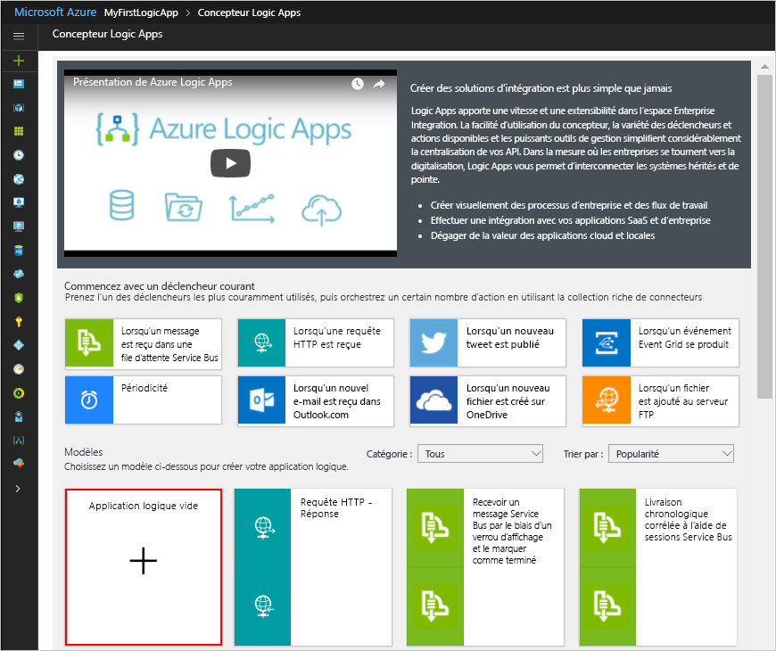

# <a name="manage-mailing-list-requests-with-a-logic-app"></a>Gérer les requêtes de liste de diffusion avec une application logique

Azure Logic Apps vous aide à automatiser les flux de travail et à intégrer des données dans les services Azure et Microsoft, d’autres applications SaaS (software-as-a-service) et des systèmes locaux. Ce didacticiel montre comment vous pouvez générer une [application logique](../logic-apps/logic-apps-overview.md) qui traite les requêtes d’abonnement à une liste de diffusion gérée par le service [MailChimp](https://mailchimp.com/).
Cette application logique surveille un compte de messagerie pour détecter ces requêtes, les envoie pour approbation et ajoute les membres approuvés à la liste de diffusion.

Ce tutoriel vous montre comment effectuer les opérations suivantes :

> [!div class="checklist"]
> * Créez une application logique vide.
> * Ajouter un déclencheur qui surveille les e-mails et détecte les requêtes d’abonnement.
> * Ajouter une action qui envoie des e-mails pour approuver ou rejeter ces requêtes.
> * Ajouter une condition qui vérifie la réponse d’approbation.
> * Ajouter une action qui ajoute les membres approuvés à la liste de diffusion.
> * Ajouter une condition qui vérifie si ces membres ont rejoint la liste.
> * Ajouter une action qui envoie des e-mails confirmant que ces membres ont rejoint la liste.

Lorsque vous avez terminé, votre application logique ressemble au flux de travail suivant à un niveau élevé :


Si vous n’avez pas d’abonnement Azure, <a href="https://azure.microsoft.com/free/" target="_blank">créez un compte Azure gratuit</a> avant de commencer.

## <a name="prerequisites"></a>Prérequis

* Un compte MailChimp. Créez une liste nommée « test-members-ML » dans laquelle votre application logique peut ajouter des adresses e-mail pour les membres approuvés. Si vous n’avez pas de compte, [ouvrez un compte gratuit](https://login.mailchimp.com/signup/) et découvrez [comment créer une liste](https://us17.admin.mailchimp.com/lists/#). 

* Un compte de messagerie avec Office 365 Outlook ou Outlook.com, qui prend en charge des flux de travail d’approbation. Office 365 Outlook est utilisé dans cet article. Si vous utilisez un autre compte de messagerie, les étapes générales sont identiques, mais l’affichage de l’interface utilisateur peut être légèrement différent.

## <a name="sign-in-to-the-azure-portal"></a>Connectez-vous au portail Azure.

Connectez-vous au <a href="https://portal.azure.com" target="_blank">portail Azure</a> avec les informations d’identification de votre compte Azure.

## <a name="create-your-logic-app"></a>Créer votre application logique

1. Dans le menu principal Azure, choisissez **Créer une ressource** > **Enterprise Integration** > **Application logique**.

   

2. Sous **Créer une application logique**, indiquez les informations suivantes sur votre application logique comme illustré et décrit. Lorsque c’est fait, cliquez sur **Épingler au tableau de bord** > **Créer**.

   

   | Paramètre | Valeur | Description | 
   | ------- | ----- | ----------- | 
   | **Name** | LA-MailingList | Nom de l’application logique. | 
   | **Abonnement** | <*your-Azure-subscription-name*> | Nom de votre abonnement Azure. | 
   | **Groupe de ressources** | LA-MailingList-RG | Nom du [groupe de ressources Azure](../azure-resource-manager/resource-group-overview.md) utilisé pour organiser les ressources connexes. | 
   | **Lieu** | Est des États-Unis 2 | Région dans laquelle stocker les informations sur votre application logique | 
   | **Log Analytics** | Off | Maintenez le paramètre de journalisation des diagnostics **Désactivé**. | 
   |||| 

3. Une fois qu’Azure a déployé votre application, le Concepteur d’applications logiques s’ouvre et affiche une page contenant une vidéo de présentation et des modèles d’applications logiques courantes. Sous **Modèles**, choisissez **Application logique vide**.

   

Ajoutez ensuite un [déclencheur](../logic-apps/logic-apps-overview.md#logic-app-concepts) qui écoute les e-mails entrants avec des requêtes d’abonnement.
Chaque application logique doit démarrer avec un déclencheur, qui s’active lorsqu’un événement spécifique se produit ou lorsque de nouvelles données respectent une condition particulière. Pour plus d’informations, consultez [Quickstart: Build your first logic app workflow - Azure portal](../logic-apps/quickstart-create-first-logic-app-workflow.md) (Démarrage rapide : Générer votre premier flux de travail d’application logique - portail Azure).

## <a name="add-trigger-to-monitor-emails"></a>Ajouter le déclencheur pour surveiller les e-mails

1. Dans le concepteur, entrez « à la réception d’un e-mail » dans la zone de recherche. Sélectionnez le déclencheur pour votre fournisseur de messagerie : **<*votre-fournisseur-de-messagerie*> - À la réception d’un e-mail**
   
   

   * Pour les comptes Azure professionnels ou scolaires, sélectionnez Office 365 Outlook.
   * Pour les comptes Microsoft personnels, sélectionnez Outlook.com.

2. Si vous êtes invité à entrer vos informations d’identification, connectez-vous à votre compte de messagerie afin que Logic Apps puisse établir une connexion avec votre compte de messagerie.

3. Spécifiez maintenant les critères que le déclencheur vérifie dans tous les nouveaux messages.

   1. Spécifiez le dossier, l’intervalle et la fréquence de vérification des e-mails.

      

      | Paramètre | Valeur | Description | 
      | ------- | ----- | ----------- | 
      | **Folder** | Inbox | Dossier de messagerie à surveiller | 
      | **Intervalle** | 1 | Nombre d’intervalles d’attente entre les vérifications. | 
      | **Fréquence** | Hour | Unité de temps de chaque intervalle entre les vérifications.  | 
      |  |  |  | 

   2. Choisissez **Afficher les options avancées**. Dans le champ **Filtre Objet**, entrez ce texte que le déclencheur recherchera dans l’objet de l’e-mail : ```subscribe-test-members-ML```

      

4. Pour masquer les informations du déclencheur pour le moment, cliquez sur sa barre de titre.

   

5. Enregistrez votre application logique. Dans la barre d’outils du concepteur, choisissez **Enregistrer**.

   Votre application logique est à présent en ligne, mais elle ne fait rien d’autre que de vérifier vos e-mails entrants. 
   Par conséquent, ajoutez une action qui répond à l’activation du déclencheur.

## <a name="send-approval-email"></a>Envoyer un message électronique d’approbation

Maintenant que vous disposez d’un déclencheur, ajoutez une [action](../logic-apps/logic-apps-overview.md#logic-app-concepts) qui envoie un e-mail pour approuver ou rejeter la requête. 

1. Sous le déclencheur, choisissez **+ Nouvelle étape** > **Ajouter une action**. Recherchez « approbation » et sélectionnez cette action : **<*votre-fournisseur-de-messagerie*> - Envoyer un e-mail d’approbation**

   

2. Fournissez des informations pour cette action comme illustré et décrit : 

   

   | Paramètre | Valeur | Description | 
   | ------- | ----- | ----------- | 
   | **To** | <*approver-email-address*> | Adresse e-mail de l’approbateur. À des fins de test, vous pouvez utiliser votre propre adresse. | 
   | **Options utilisateur** | Approuver, Rejeter | Les options de réponse que l’approbateur peut choisir. Par défaut, l’approbateur peut choisir « Approuver » ou « Rejeter » comme réponse. | 
   | **Objet** | Approve member request for test-members-ML (Approuver la requête d’abonnement pour test-members-ML) | Un objet d’e-mail descriptif | 
   |  |  |  | 

   Pour l’instant, ignorez la liste de contenu dynamique ou la liste de paramètres incluse qui s’affiche lorsque vous cliquez à l’intérieur de zones de modification spécifiques. 
   Cette liste vous permet de sélectionner des paramètres issus des actions précédentes que vous pouvez utiliser en tant qu’entrées dans votre flux de travail. 
   La largeur de la fenêtre du navigateur détermine la liste qui s’affiche. 
 
4. Enregistrez votre application logique.

Ensuite, ajoutez une condition pour vérifier la réponse choisie par l’approbateur.

## <a name="check-approval-response"></a>Vérifier la réponse d’approbation

1. Sous l’action **Envoyer un e-mail d’approbation**, choisissez **+ Nouvelle étape** > **Ajouter une condition**.

   La forme de condition s’affiche, ainsi que tous les paramètres disponibles que vous pouvez inclure comme entrée pour votre flux de travail. 

2. Renommez la condition en utilisant une meilleure description.

   1. Dans la barre de titre de la condition, choisissez le bouton représentant des **points de suspension** (**...**) > **Renommer**.

      Par exemple, si le navigateur est défini sur l’affichage étroit :

      

      Si votre navigateur est en affichage large et que la liste de contenu dynamique bloque l’accès au bouton représentant des points de suspension, fermez la liste en choisissant **Ajouter du contenu dynamique** dans la condition.

   2. Renommez votre condition à l’aide de cette description : ```If request approved```

3. Générez une condition qui vérifie si l’approbateur a sélectionné **Approuver** :

   1. Dans la condition, cliquez à l’intérieur de la zone **Choisissez une valeur**, qui se trouve dans la partie gauche (navigateur avec affichage large) ou dans la partie supérieure (navigateur avec affichage étroit).
   Dans la liste des paramètres ou la liste de contenu dynamique, sélectionnez le champ **SelectedOption** sous **Envoyer un e-mail d’approbation**.

      Par exemple, si vous travaillez avec un affichage large, votre condition ressemble à l’exemple suivant :

      

   2. Dans la zone d’opérateur de comparaison, sélectionnez cet opérateur : **est égal à**

   3. Dans la zone **Choisissez une valeur** à droite (affichage large) ou en bas (affichage étroit), entrez la valeur suivante : ```Approve```

      Une fois que vous avez terminé, votre condition ressemble à cet exemple :

      

4. Enregistrez votre application logique.

Ensuite, spécifiez l’action que votre application logique effectue lorsque le réviseur approuve la requête. 

## <a name="add-member-to-mailchimp-list"></a>Ajouter un membre à la liste MailChimp

Ajoutez maintenant une action qui ajoute le membre approuvé à votre liste de diffusion.

1. Dans la branche **Si true** de la condition, choisissez **Ajouter une action**.
Recherchez « mailchimp » et sélectionnez cette action : **MailChimp - Ajouter un membre à la liste**

   

3. Si vous êtes invité à vous connecter à votre compte MailChimp, connectez-vous avec vos informations d’identification MailChimp.

4. Fournissez des informations pour cette action comme illustré et décrit ici :

   

   | Paramètre | Valeur | Description | 
   | ------- | ----- | ----------- | 
   | **ID de liste** | test-members-ML | Nom de votre liste de diffusion MailChimp | 
   | **État** | subscribed | État de l’abonnement pour le nouveau membre. Pour plus d’informations, consultez <a href="https://developer.mailchimp.com/documentation/mailchimp/guides/manage-subscribers-with-the-mailchimp-api/" target="_blank">Manage Subscribers with the MailChimp API</a> (Gérer les abonnés avec l’API MailChimp). | 
   | **Adresse e-mail** | <*new-member-email-address*> | Dans la liste des paramètres ou la liste de contenu dynamique, sélectionnez le champ **De** sous **À la réception d’un e-mail**, qui transmet l’adresse e-mail du nouveau membre. 
   |  |  |  | 

5. Enregistrez votre application logique.

Ensuite, ajoutez une condition afin que vous puissiez vérifier si le nouveau membre a rejoint votre liste de diffusion. De cette façon, votre application logique vous avertit si cette opération réussit ou échoue.

## <a name="check-for-success-or-failure"></a>Vérifier la réussite ou l’échec

1. Dans la branche **Si true**, sous l’action **Ajouter un membre à la liste**, choisissez **Plus...** > **Ajouter une condition**.

2. Renommez la condition à l’aide de cette description : ```If add member succeeded```

3. Générez une condition qui vérifie si le membre approuvé parvient ou non à rejoindre votre liste de diffusion :

   1. Dans la condition, cliquez à l’intérieur de la zone **Choisissez une valeur**, qui se trouve dans la partie gauche (navigateur avec affichage large) ou dans la partie supérieure (navigateur avec affichage étroit).
   Dans la liste des paramètres ou la liste de contenu dynamique, sélectionnez le champ **État** sous **Ajouter un membre à la liste**.

      Par exemple, si vous travaillez avec un affichage large, votre condition ressemble à l’exemple suivant :

      

   2. Dans la zone d’opérateur de comparaison, sélectionnez cet opérateur : **est égal à**

   3. Dans la zone **Choisissez une valeur** à droite (affichage large) ou en bas (affichage étroit), entrez la valeur suivante : ```subscribed```

   Une fois que vous avez terminé, votre condition ressemble à cet exemple :

   

Ensuite, configurez les e-mails à envoyer lorsque le membre approuvé parvient ou non à rejoindre votre liste de diffusion.

## <a name="send-email-if-member-added"></a>Envoyer un e-mail si le membre est ajouté

1. Dans la branche **Si true** de la condition **If add member succeeded** (Si l’ajout du membre a réussi), choisissez **Ajouter une action**.

   

2. Recherchez « outlook send email » (envoi d’e-mail outlook) et sélectionnez cette action : **<*votre-fournisseur-de-messagerie*> - Envoyer un message électronique**

   

3. Renommez l’action avec cette description : ```Send email on success```

4. Fournissez des informations pour cette action comme illustré et décrit :

   

   | Paramètre | Valeur | Description | 
   | ------- | ----- | ----------- | 
   | **To** | <*your-email-address*> | Adresse e-mail à laquelle envoyer l’e-mail de réussite. À des fins de test, vous pouvez utiliser votre propre adresse e-mail. | 
   | **Objet** | <*subject-for-success-email*> | Objet de l’e-mail de réussite. Pour ce didacticiel, entrez ce texte, puis sélectionnez le champ spécifié sous **Ajouter un membre à la liste** à partir de la liste des paramètres ou de la liste de contenu dynamique : <p>« Success! Member added to ’test-members-ML’: **Email Address** » (Bravo ! Le membre a été ajouté à « test-members-ML » : Adresse e-mail) | 
   | **Corps** | <*body-for-success-email*> | Contenu du corps de l’e-mail de réussite. Pour ce didacticiel, entrez ce texte, puis sélectionnez les champs spécifiés sous **Ajouter un membre à la liste** à partir de la liste des paramètres ou de la liste de contenu dynamique :  <p>"New member has joined ’test-members-ML’: **Email Address**" (Un nouveau membre a rejoint « test-members-ML » : Adresse e-mail)</br>"Member opt-in status: **Status**" (État de l’abonnement du membre : État) | 
   | | | | 

5. Enregistrez votre application logique.

## <a name="send-email-if-member-not-added"></a>Envoyer un e-mail si le membre n’est pas ajouté

1. Dans la branche **Si false** de la condition **If add member succeeded** (Si l’ajout du membre a réussi), choisissez **Ajouter une action**.

   

2. Recherchez « outlook send email » (envoi d’e-mail outlook) et sélectionnez cette action : **<*votre-fournisseur-de-messagerie*> - Envoyer un message électronique**

   

3. Renommez l’action avec cette description : ```Send email on failure```

4. Fournissez des informations pour cette action comme illustré et décrit ici :

   

   | Paramètre | Valeur | Description | 
   | ------- | ----- | ----------- | 
   | **To** | <*your-email-address*> | Adresse e-mail à laquelle envoyer l’e-mail d’échec. À des fins de test, vous pouvez utiliser votre propre adresse e-mail. | 
   | **Objet** | <*subject-for-failure-email*> | Objet de l’e-mail d’échec. Pour ce didacticiel, entrez ce texte, puis sélectionnez le champ spécifié sous **Ajouter un membre à la liste** à partir de la liste des paramètres ou de la liste de contenu dynamique : <p>« Failed, member not added to ’test-members-ML’: **Email Address** » (Échec, le membre n’a pas été ajouté à « test-members-ML » : Adresse e-mail) | 
   | **Corps** | <*body-for-failure-email*> | Contenu du corps de l’e-mail d’échec. Pour ce didacticiel, entrez le texte suivant : <p>« Member might already exist. Check your MailChimp account. » (Le membre existe peut-être déjà. Vérifiez votre compte MailChimp.) | 
   | | | | 

5. Enregistrez votre application logique. 

Ensuite, testez votre application logique, qui ressemble désormais à l’exemple suivant :

 

## <a name="run-your-logic-app"></a>Exécuter votre application logique

1. Envoyez-vous un e-mail de requête pour rejoindre votre liste de diffusion.
Attendez que la requête s’affiche dans votre boîte de réception.

3. Pour lancer manuellement votre application logique, sélectionnez **Exécuter** dans la barre d’outils du concepteur. 

   Si l’objet de votre e-mail correspond au filtre d’objet du déclencheur, votre application logique vous envoie un e-mail pour approuver la requête d’abonnement.

4. Dans l’e-mail d’approbation, choisissez **Approuver**.

5. Si l’adresse e-mail de l’abonné n’existe pas dans votre liste de diffusion, votre application logique ajoute l’adresse e-mail de cette personne et vous envoie un e-mail similaire à l’exemple suivant :

   

   Si votre application logique ne peut pas ajouter l’abonné, vous obtenez un e-mail semblable à l’exemple suivant :

   

   Si vous ne recevez pas d’e-mail, vérifiez le dossier Courrier indésirable de votre messagerie. 
   Il se peut que le filtre de courrier indésirable redirige ces types d’e-mails. 
   Sinon, si vous ne savez pas si votre application logique s’est correctement exécutée, consultez [Dépanner votre application logique](../logic-apps/logic-apps-diagnosing-failures.md).

Félicitations, vous venez de créer et d’exécuter une application logique qui intègre des informations des services Azure et Microsoft et d’autres applications SaaS.

## <a name="clean-up-resources"></a>Supprimer des ressources

Quand vous n’en avez plus besoin, supprimez le groupe de ressources qui contient votre application logique et les ressources associées. Dans le menu Azure principal, accédez à **Groupes de ressources**, puis sélectionnez le groupe de ressources de votre application logique. Choisissez **Supprimer un groupe de ressources**. Confirmez le nom du groupe de ressources, puis choisissez **Supprimer**.


## <a name="get-support"></a>Obtenir de l’aide

* Si vous avez des questions, consultez le [forum Azure Logic Apps](https://social.msdn.microsoft.com/Forums/en-US/home?forum=azurelogicapps).
* Pour voter pour des idées de fonctionnalités ou pour en soumettre, visitez le [site de commentaires des utilisateurs Logic Apps](http://aka.ms/logicapps-wish).

## <a name="next-steps"></a>Étapes suivantes

Dans ce didacticiel, vous avez créé une application logique qui gère des approbations pour les requêtes de liste de diffusion. Maintenant, découvrez comment créer une application logique qui traite et stocke les pièces jointes des e-mails en intégrant des services Azure, tels que Stockage Azure et Azure Functions.

> [!div class="nextstepaction"]
> [Process emails and attachments with a logic app](../logic-apps/tutorial-process-email-attachments-workflow.md) (Traiter les e-mails et les pièces jointes avec une application logique)