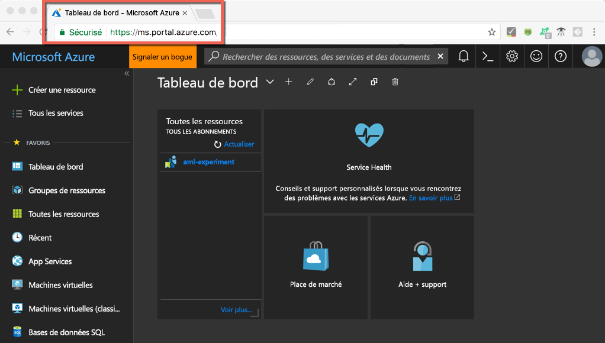
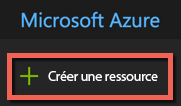
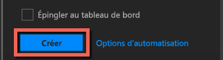

# <a name="quickstart-install-and-get-started-with-azure-machine-learning-services"></a>Démarrage rapide : Installer et prendre en main les services Azure Machine Learning
Les services Azure Machine Learning (préversion) forment une solution d’analytique avancée et de science des données de bout en bout intégrée. Cette solution permet aux scientifiques des données professionnels de préparer des données, de développer des expériences et de déployer des modèles à l’échelle du cloud.

Ce démarrage rapide vous montre comment :

* Créer des comptes de service pour les services Azure Machine Learning
* Installer Azure Machine Learning Workbench et s’y connecter
* Créer un projet dans Workbench
* Exécuter un script dans ce projet  
* Accéder à l’interface de ligne de commande


Dans le cadre du portefeuille Microsoft Azure, les services Azure Machine Learning requièrent un abonnement Azure. Si vous n’avez pas d’abonnement Azure, créez un [compte gratuit](https://azure.microsoft.com/free/?WT.mc_id=A261C142F) avant de commencer.

De plus, vous devez disposer des autorisations adéquates pour créer des ressources telles que des groupes de ressources, des machines virtuelles, et ainsi de suite. 

<a name="prerequisites"></a>Vous pouvez installer l’application Azure Machine Learning Workbench sur les systèmes d’exploitation suivants :
- Windows 10 ou Windows Server 2016
- macOS Sierra ou High Sierra

## <a name="create-azure-machine-learning-services-accounts"></a>Créer des comptes de service Azure Machine Learning
Utilisez le portail Azure pour approvisionner vos comptes Azure Machine Learning : 
1. Connectez-vous au [portail Azure](https://portal.azure.com/) à l’aide des informations d’identification de l’abonnement Azure que vous allez utiliser. Si vous n’avez pas d’abonnement Azure, créez un [compte gratuit](https://azure.microsoft.com/free/?WT.mc_id=A261C142F) maintenant. 

   

1. Cliquez sur le bouton **Créer une ressource** (+) dans le coin supérieur gauche du portail.

   

1. Tapez **Machine Learning** dans la barre de recherche. Sélectionnez le résultat de la recherche intitulé **Machine Learning - Expérimentation**. 

   

1. Dans le volet **Machine Learning - Expérimentation**, faites défiler vers le bas et sélectionnez **Créer** pour commencer à définir votre compte d’expérimentation.  

   

1. Dans le volet **Machine Learning - Expérimentation**, configurez votre compte Machine Learning - Expérimentation. 

   Paramètre|Valeur suggérée pour le didacticiel|Description
   ---|---|---
   Nom du compte Expérimentation | _Nom unique_ |Entrez un nom unique qui identifie votre compte. Vous pouvez utiliser votre propre nom, ou celui d’un service ou projet qui identifie le mieux l’expérimentation. Le nom doit inclure entre 2 et 32 caractères. Seuls des caractères alphanumériques et des tirets peuvent être utilisés. 
   Abonnement | _Votre abonnement_ |Choisissez l’abonnement Azure que vous souhaitez utiliser pour votre expérimentation. Si vous avez plusieurs abonnements, sélectionnez l’abonnement approprié dans lequel la ressource est facturée.
   Groupe de ressources | _Votre groupe de ressources_ | Utilisez un groupe de ressources existant dans votre abonnement, ou entrez un nom pour créer un groupe de ressources pour ce compte d’expérimentation. 
   Lieu | _La région la plus proche de vos utilisateurs_ | Choisissez l’emplacement le plus proche de vos utilisateurs et des ressources de données.
   Nombre d’utilisateurs | 2 | Entrez le nombre d’utilisateurs. Découvrez comment [le nombre de places a un impact sur la tarification](https://azure.microsoft.com/pricing/details/machine-learning/).<br/><br/>Pour ce démarrage rapide, vous avez besoin de deux sièges seulement. Des sièges peuvent être ajoutés ou supprimés en fonction des besoins dans le portail Azure.
   Compte de stockage | _Nom unique_ | Sélectionnez **Créer** et indiquez un nom pour créer un [compte de stockage Azure](https://docs.microsoft.com/en-us/azure/storage/common/storage-quickstart-create-account?tabs=portal). Vous pouvez également sélectionner **Utiliser l’existant** et choisir votre compte de stockage existant dans la liste déroulante. Le compte de stockage est obligatoire et sert à stocker les artefacts de projet et les données de l’historique des exécutions. 
   Espace de travail pour le compte Expérimentation | IrisGarden<br/>(nom utilisé dans les tutoriels) | Fournissez un nom pour un espace de travail de ce compte. Le nom doit inclure entre 2 et 32 caractères. Seuls des caractères alphanumériques et des tirets peuvent être utilisés. Cet espace de travail contient les outils dont vous avez besoin pour créer, gérer et publier des expériences.
   Affecter le propriétaire de l’espace de travail | _Votre compte_ | Sélectionnez votre propre compte comme propriétaire de l’espace de travail.
   Créer un compte Gestion des modèles | **check** |Créez maintenant un compte Gestion des modèles, afin que cette ressource soit disponible lorsque vous souhaitez déployer et gérer vos modèles en tant que services web en temps réel. <br/><br/>Même si cela est facultatif, nous vous recommandons de créer le compte Gestion des modèles en même temps que le compte Expérimentation.
   Nom du compte | _Nom unique_ | Choisissez un nom unique qui identifie votre compte Gestion des modèles. Vous pouvez utiliser votre propre nom, ou celui d’un service ou projet qui identifie le mieux l’expérimentation. Le nom doit inclure entre 2 et 32 caractères. Seuls des caractères alphanumériques et des tirets peuvent être utilisés. 
   Niveau tarifaire de Gestion des modèles | **DEVTEST** | Sélectionnez **Aucun niveau tarifaire sélectionné** pour spécifier le niveau tarifaire de votre nouveau compte Gestion des modèles. Pour réduire les coûts, sélectionnez le niveau tarifaire **DEVTEST** s’il est disponible sur votre abonnement (disponibilité limitée). Dans le cas contraire, sélectionnez le niveau tarifaire S1. Cliquez sur **Sélectionner** pour enregistrer la sélection du niveau tarifaire. 
   Épingler au tableau de bord | _check_ | Sélectionnez l’option **Épingler au tableau de bord** pour faciliter le suivi de votre compte Expérimentation Machine Learning sur la première page du tableau de bord du portail Azure.

   

5. Sélectionnez **Créer** pour commencer le processus de création du compte Expérimentation et du compte Gestion des modèles.

   

   La création du compte peut prendre quelques instants. Vous pouvez vérifier l’état du processus de déploiement en cliquant sur la cloche dans la barre d’outils du portail Azure.
   
   


## <a name="install-and-log-in-to-workbench"></a>Installer Workbench et s’y connecter

Azure Machine Learning Workbench est disponible pour Windows ou macOS. Consultez la liste des [plateformes prises en charge](#prerequisites).

>[!WARNING]
>Environ 30 minutes sont nécessaires pour l’installation. 

1. Téléchargez et lancez le programme d’installation de Workbench le plus récent. 
   >[!IMPORTANT]
   >Téléchargez le programme d’installation entièrement sur le disque, puis exécutez-le à partir de là. Ne l’exécutez pas directement à partir du widget de téléchargement de votre navigateur.

   **Sur Windows :** 

   &nbsp;&nbsp;&nbsp;&nbsp;A. Téléchargez [AmlWorkbenchSetup.msi](https://aka.ms/azureml-wb-msi).  <br/>
   &nbsp;&nbsp;&nbsp;&nbsp;B. Double-cliquez sur le programme d’installation téléchargé dans l’Explorateur de fichiers.

   **Sur macOS :** 

   &nbsp;&nbsp;&nbsp;&nbsp;A. Téléchargez [AmlWorkbench.dmg](https://aka.ms/azureml-wb-dmg). <br/>
   &nbsp;&nbsp;&nbsp;&nbsp;B. Double-cliquez sur le programme d’installation téléchargé dans Finder.<br/><br/>

1. Suivez les instructions à l’écran de votre programme d’installation. 

   **Environ 30 minutes sont nécessaires pour l’installation.**  
   
   | |Chemin d’accès d’installation d’Azure Machine Learning Workbench|
   |--------|------------------------------------------------|
   |Windows|C:\Users\<user>\AppData\Local\AmlWorkbench|
   |macOS|/Applications/Azure ML Workbench.app|

   Le programme d’installation a téléchargé et configuré toutes les dépendances nécessaires, telles que Python, Miniconda et d’autres bibliothèques associées.    Cette installation inclut également l’outil en ligne de commande multiplateforme Azure, également appelé Azure CLI.

  
1. Lancez Workbench en sélectionnant le bouton **Launch Workbench** (Lancer Workbench) du dernier écran du programme d’installation. 

   Si vous avez fermé le programme d’installation, cela n’est pas un problème. 
   + Sur Windows, vous pouvez le lancer via le raccourci du bureau **Machine Learning Workbench**. 
   + Sur macOS, sélectionnez **Azure Machine Learning Workbench** dans Launchpad.

1. Dans le premier écran, sélectionnez **Se connecter** pour vous authentifier auprès d’Azure Machine Learning Workbench. Utilisez les mêmes informations que celles du portail Azure pour créer les comptes Expérimentation et Gestion des modèles. 

   Une fois que vous êtes connecté, Workbench utilise le premier compte Expérimentation qu’il trouve dans vos abonnements Azure.  Workbench utilise le premier compte Expérimentation qu’il trouve et affiche tous les espaces de travail et projets associés à ce compte. 

   >[!TIP]
   > Vous pouvez basculer vers un autre compte Expérimentation à l’aide de l’icône dans le coin inférieur gauche de la fenêtre d’application Workbench.

## <a name="create-a-project-in-workbench"></a>Créer un projet dans Workbench

Dans Azure Machine Learning, un projet représente le conteneur logique pour tout le travail effectué en vue de résoudre un problème. Il est mappé à un seul dossier de fichiers sur votre disque local, et vous pouvez y ajouter des fichiers et des sous-dossiers. 

Ici, nous créons un projet Workbench à l’aide d’un modèle qui inclut le [jeu de données Iris de Fisher](https://en.wikipedia.org/wiki/iris_flower_data_set). Les didacticiels qui suivent ce démarrage rapide dépendent de ces données pour générer un modèle qui prédit le type d’iris en fonction de certaines de ses caractéristiques physiques.  

1. Avec Azure Machine Learning Workbench ouvert, sélectionnez le signe plus (+) dans le volet **PROJETS** et choisissez **Nouveau projet**.  

   

1. Renseignez les champs du formulaire et sélectionnez le bouton **Créer** permettant de créer un projet dans Workbench.

   Champ|Valeur suggérée pour le didacticiel|Description
   ---|---|---
   Nom du projet | myIris |Entrez un nom unique qui identifie votre compte. Vous pouvez utiliser votre propre nom, ou celui d’un service ou projet qui identifie le mieux l’expérimentation. Le nom doit inclure entre 2 et 32 caractères. Seuls des caractères alphanumériques et des tirets peuvent être utilisés. 
   Répertoire du projet | c:\Temp\ | Spécifiez le répertoire dans lequel le projet est créé.
   Description du projet | _Laisser vide_ | Champ facultatif utile pour décrire les projets.
   Visualstudio.com |_Laisser vide_ | Champ facultatif. Un projet peut éventuellement être associé à un répertoire Git sur Visual Studio Team Services pour le contrôle de code source et la collaboration. [Voici les étapes de configuration à suivre.](https://docs.microsoft.com/en-us/azure/machine-learning/preview/using-git-ml-project#step-3-set-up-a-machine-learning-project-and-git-repo). 
   Espace de travail | IrisGarden (s’il existe) | Choisissez un espace de travail que vous avez créé pour votre compte Expérimentation dans le portail Azure. <br/>Si vous avez suivi le démarrage rapide, vous devez disposer d’un espace de travail nommé IrisGarden. Si ce n’est pas le cas, sélectionnez celui que vous avez créé en même temps que votre compte Expérimentation ou tout autre compte que vous souhaitez utiliser.
   Modèle de projet | Classifying Iris | Les modèles contiennent des scripts et des données que vous pouvez utiliser pour découvrir le produit. Ce modèle contient les scripts et les données nécessaires pour ce démarrage rapide et les autres didacticiels de ce site de documentation. 

   
 
 Un projet est créé et le tableau de bord du projet s’ouvre avec ce projet. À ce stade, vous pouvez explorer la page d’accueil du projet, les sources de données, les blocs-notes et les fichiers de code source. 

>[!TIP]
>Vous pouvez configurer Workbench pour qu’il utilise un IDE Python pour une expérience de développement de science des données fluide. Ensuite, vous pouvez interagir avec votre projet dans l’IDE. [Découvrez comment](how-to-configure-your-IDE.md). 

## <a name="run-a-python-script"></a>Exécuter un script Python

Maintenant, vous pouvez exécuter le script **iris_sklearn.py** sur votre ordinateur local. Ce script est inclus par défaut avec le modèle de projet **Classifying Iris**. Le script génère un modèle avec l’algorithme de [régression logistique](https://en.wikipedia.org/wiki/logistic_regression) à partir de la populaire bibliothèque [scikit-learn](http://scikit-learn.org/stable/index.html) Python.

1. Dans la barre de commandes en haut de la page **Tableau de bord Projet**, sélectionnez **locale** comme cible d’exécution, puis sélectionnez **iris_sklearn.py** comme script à exécuter. Par défaut, ces valeurs sont présélectionnées. 

   Vous pourrez extraire d’autres fichiers inclus dans l’exemple plus tard, mais dans le cadre de ce démarrage rapide, seul le fichier **iris_sklearn.py** nous intéresse. 

   

1. Dans la zone de texte **Arguments**, entrez **0,01**. Ce nombre est utilisé dans le code du script pour définir le taux de régularisation. Cette valeur est utilisée pour configurer la façon dont le modèle de régression linéaire est formé. 

1. Sélectionnez **Exécuter** pour démarrer l’exécution du script sur votre ordinateur. Le travail **iris_sklearn** s’affiche immédiatement dans le volet **Travaux** sur la droite pour que vous puissiez contrôler l’exécution du script.

   Félicitations ! Vous avez exécuté un script Python dans Azure Machine Learning Workbench.

1. Répétez les étapes 2 à 3 plusieurs fois en utilisant diverses valeurs d’argument allant de **0,001** à **10**. Chaque travail d’exécution s’affiche dans le volet **Travaux**.

1. Examinez l’historique des exécutions en sélectionnant l’affichage **Exécutions**, puis **iris_sklearn.py** dans la liste Exécutions pour afficher l’historique des exécutions de ce script. 

   

   Il montre chaque exécution effectuée sur **iris_sklearn.py**. Le tableau de bord de l’historique des exécutions affiche également les principales métriques, un ensemble de graphes par défaut et une liste de métriques pour chaque exécution. 

1. Vous pouvez personnaliser cet affichage en triant, filtrant et ajustant les configurations à l’aide des icônes d’engrenage ou de filtre.

   

3. Sélectionnez une exécution terminée dans le volet Travaux pour obtenir des informations sur celle-ci. Vous obtiendrez notamment des métriques supplémentaires, les fichiers générés suite à l’exécution et d’autres journaux pouvant être utiles.

## <a name="start-the-cli"></a>Démarrer l’interface de ligne de commande

L’interface de ligne de commande Azure Machine Learning est également installée. Elle vous permet d’accéder à vos services Azure Machine Learning et d’interagir avec eux à l’aide des commandes `az` pour effectuer toutes les tâches requises pour un flux de travail de science des données de bout en bout. [En savoir plus.](tutorial-iris-azure-cli.md)

Vous pouvez lancer l’interface de commande azure-cli-ml depuis la barre d’outils de Workbench à l’aide de **Fichier --> Ouvrir l’invite de commandes**.

Vous pouvez obtenir de l’aide sur les commandes de l’interface de commande azure-cli-ml via l’argument --help.

```az ml --help```

## <a name="clean-up-resources"></a>Supprimer des ressources

[!INCLUDE [aml-delete-resource-group](../../../includes/aml-delete-resource-group.md)]

## <a name="next-steps"></a>étapes suivantes
Vous avez créé les comptes Azure Machine Learning nécessaires et installé l’application Azure Machine Learning Workbench. Dans cette application, vous avez créé un projet, exécuté un script et exploré l’historique des exécutions du script.

Pour obtenir une expérience plus approfondie de ce flux de travail, notamment la façon de déployer votre modèle Iris en tant que service web, suivez le didacticiel *Classifying Iris* (Classification d’iris) intégral. Ce dernier contient des étapes détaillées pour la [préparation des données](tutorial-classifying-iris-part-1.md), [l’expérimentation](tutorial-classifying-iris-part-2.md) et la [gestion des modèles](tutorial-classifying-iris-part-3.md). 

> [!div class="nextstepaction"]
> [Classification d’Iris, partie 1 : préparer les données](tutorial-classifying-iris-part-1.md)

>[!NOTE]
> Même si vous avez un compte Gestion des modèles, votre environnement n’est pas encore configuré pour le déploiement de services web.  Découvrez comment configurer votre [environnement de déploiement](deployment-setup-configuration.md).