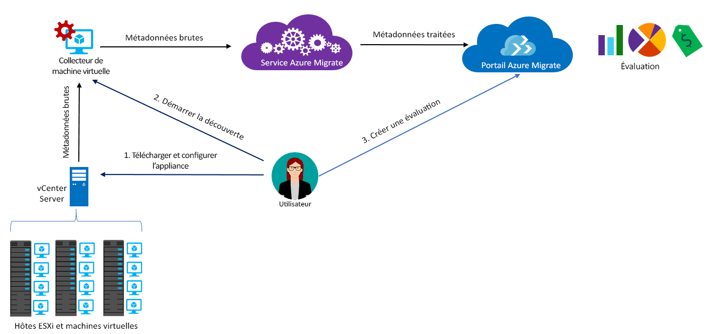

# À propos d’Azure Migrate

Le service Azure Migrate évalue les charges de travail locales pour la migration vers Azure. Le service évalue la pertinence de la migration et le dimensionnement en fonction des performances et fournit des estimations de coût pour l’exécution de vos ordinateurs locaux dans Azure. Si vous envisagez d’effectuer des migrations lift-and-shift ou si vous êtes dans les premières étapes de l’évaluation de la migration, ce service vous correspond. Après l’évaluation, vous pouvez utiliser des services tels qu’Azure Site Recovery et Azure Database Migration, pour migrer les ordinateurs vers Azure.

> [!NOTE]
> Azure Migrate est actuellement en préversion et prend en charge les charges de travail de production.

## Pourquoi utiliser Azure Migrate ?

Azure Migrate vous aide à :

- **Évaluer la préparation pour Azure** : évaluer si vos ordinateurs locaux sont appropriés pour l’exécution dans Azure. 
- **Obtenir des recommandations sur la taille** : obtenir des recommandations de taille pour des machines virtuelles Azure, en fonction de l’historique des performances des machines virtuelles locales. 
- **Estimer les coûts mensuels** : obtenir les coûts estimés pour l’exécution d’ordinateurs locaux dans Azure.  
- **Migrer en toute confiance** : visualiser les dépendances des machines locales pour créer des groupes d’ordinateurs que vous pourrez évaluer et migrer en même temps. Vous pouvez afficher précisément les dépendances pour un ordinateur spécifique, ou pour tous les ordinateurs d’un groupe.

## Limitations actuelles

- Actuellement, vous pouvez évaluer les machines virtuelles VMware locales pour la migration vers les machines virtuelles Azure.

> [!NOTE]
> La prise en charge pour Hyper-V fait partie de la feuille de route et sera activée prochainement. En attendant, nous vous recommandons d’utiliser le [Planificateur de déploiement Azure Site Recovery](http://aka.ms/asr-dp-hyperv-doc) pour planifier la migration des charges de travail Hyper-V. 

- Vous pouvez détecter jusqu’à 1 000 machines virtuelles par détection et jusqu’à 1 500 machines virtuelles par projet. En outre, vous pouvez évaluer jusqu’à 400 machines virtuelles par évaluation. Si vous avez besoin de détecter ou d’évaluer davantage de machines virtuelles, vous pouvez augmenter le nombre de détections ou d’évaluations. [Plus d’informations](how-to-scale-assessment.md)
- Les machines virtuelles que vous souhaitez évaluer doivent être gérées par un vCenter Server, version 5.5, 6.0 ou 6.5.
- Vous ne pouvez créer un projet Azure Migrate que dans la région Centre-Ouest des États-Unis. Toutefois, cela n’affecte pas votre capacité à planifier la migration pour un autre emplacement Azure cible. L’emplacement du projet de migration est utilisé uniquement pour stocker les métadonnées détectées à partir de l’environnement local.
- Azure Migrate prend uniquement en charge les disques managés pour l’évaluation de la migration.

## Pour quoi dois-je payer ?

En savoir plus sur la tarification Azure Migrate [ici](https://azure.microsoft.com/en-in/pricing/details/azure-migrate/).

## Que comprend une évaluation ?

Une évaluation vous permet de déterminer dans quelle mesure vos machines virtuelles locales sont adaptées à Azure et d’obtenir des recommandations de redimensionnement ainsi que des estimations du coût associé à l’exécution de machines virtuelles dans Azure. Les évaluations sont basées sur les propriétés répertoriées dans le tableau ci-dessous. Vous pouvez modifier ces propriétés dans le portail Azure Migrate. 

**Propriété** | **Détails**
--- | ---
**Emplacement cible** | Emplacement Azure vers lequel vous souhaitez migrer. Ouest des États-Unis 2 est l’emplacement cible par défaut. 
**Redondance du stockage** | Le type de stockage que les machines virtuelles Azure utiliseront après la migration. LRS est la valeur par défaut.
**Plans de tarification** | L’évaluation prend en compte le fait que vous soyez inscrit Software Assurance et que vous puissiez utiliser [Azure Hybrid Use Benefit](https://azure.microsoft.com/pricing/hybrid-use-benefit/). Elle prend également en compte les offres Azure qui doivent être appliquées et vous permet d’indiquer des réductions spécifiques aux abonnements (%), que vous obtenez en plus de l’offre. 
**Niveau tarifaire** | Vous pouvez spécifier le [niveau tarifaire (de base/standard)](../virtual-machines/windows/sizes-general.md) des machines virtuelles Azure. Cela vous aide à migrer vers une famille de machine virtuelle Azure appropriée, selon que vous soyez dans un environnement de production. Par défaut le niveau [standard](../virtual-machines/windows/sizes-general.md) est utilisé.
**Historique des performances** | Par défaut, Azure Migrate évalue les performances des ordinateurs locaux à l’aide d’un mois d’historique, avec une valeur de centile de 95 %. Vous pouvez modifier ce paramètre.
**Facteur de confort** | Azure Migrate considère une mémoire tampon (facteur de confort) au cours de l’évaluation. Cette mémoire tampon est appliquée sur des données d’utilisation de l’ordinateur pour les machines virtuelles (processeur, mémoire, disque et réseau). Le facteur de confort prend en compte les problèmes, tels que l’utilisation saisonnière, l’historique des performances de courte durée et l’augmentation probable de l’utilisation future.   Par exemple, une machine virtuelle de 10 cœurs avec 20 % d’utilisation correspond normalement à une machine virtuelle à 2 cœurs. Toutefois, avec un facteur de confort de 2.0x, le résultat est une machine virtuelle de 4 cœurs. Le paramètre de confort par défaut est 1.3x.

## Comment fonctionne Azure Migrate ?

1.  Lorsque vous créez un projet Azure Migrate.
2.  Azure Migrate utilise une machine virtuelle locale appelée l’appliance collecteur, pour détecter des informations sur vos machines locales. Pour créer l’appliance, vous devez télécharger un fichier d’installation au format Open Virtualization Appliance (.ova) et l’importer en tant que machine virtuelle sur votre vCenter Server local.
3.  Vous devez vous connecter à la machine virtuelle à l’aide de la connexion à la console dans vCenter Server, spécifier un nouveau mot de passe pour la machine virtuelle en cours de connexion, puis exécuter l’application de collecteur dans la machine virtuelle afin d’initier la découverte.
4.  Le collecteur collecte les métadonnées de machine virtuelle à l’aide des applets de commande VMware PowerCLI. La détection se fait sans agent et n’installe rien sur les ordinateurs hôtes VMware ou les machines virtuelles. Les métadonnées collectées incluent des informations sur les machines virtuelles (cœurs, mémoire, disques, tailles de disque et cartes réseau). Elle collecte également les données de performances des machines virtuelles, notamment concernant le processeur et la mémoire, les IOPS du disque, le débit de disque (Mbits/s) et la sortie du réseau (Mbits/s).
5.  Les métadonnées sont ajoutées au projet Azure Migrate. Vous pouvez les afficher dans le portail Azure.
6.  Dans le cadre de l’évaluation, vous pouvez regrouper les machines virtuelles découvertes. Par exemple, vous pouvez regrouper les machines virtuelles qui exécutent la même application. Pour un regroupement plus précis, vous pouvez utiliser la visualisation des dépendances pour afficher les dépendances d’une machine spécifique ou de toutes les machines d’un groupe et affiner le groupe.
7.  Une fois votre groupe formé, vous pouvez créer une évaluation pour ce groupe. 
8.  Une fois l’évaluation terminée, vous pouvez l’afficher dans le portail ou la télécharger au format Excel.

  

## Quelles sont les exigences de port ?

Le tableau récapitule les ports nécessaires pour les communications d’Azure Migrate.

|Composant          |Communication avec     |Port requis  |Motif   |
|-------------------|------------------------|---------------|---------|
|Collecteur          |Service Azure Migrate   |TCP 443        |Le collecteur se connecte au service via le port SSL 443|
|Collecteur          |Serveur vCenter          |Par défaut 9443   | Par défaut, le collecteur se connecte au serveur vCenter via le port 9443. Si le serveur écoute sur un port différent, il doit être configuré comme port sortant sur le collecteur de machine virtuelle. |
|Machine virtuelle locale     | Espace de travail Operations Management Suite (OMS)          |[TCP 443](../log-analytics/log-analytics-windows-agent.md) |L’agent MMA utilise le port TCP 443 pour se connecter à Log Analytics. Vous n’avez besoin de ce port que si vous utilisez la fonctionnalité de visualisation des dépendances et installez l’agent MMA (Microsoft Monitoring Agent). |

  
## Que se passe-t-il après l’évaluation ?

Une fois que vous avez évalué des machines locales pour la migration avec le service Azure Migrate, vous pouvez utiliser deux outils pour effectuer la migration :

- **Azure Site Recovery**: vous pouvez utiliser Azure Site Recovery pour migrer vers Azure, comme suit :
  - Préparez des ressources Azure, notamment un abonnement Azure, un réseau virtuel Azure et un compte de stockage.
  - Préparez vos serveurs VMware locaux pour la migration. Vérifiez les conditions de prise en charge de VMware pour Site Recovery, préparez les serveurs VMware pour la détection et préparez l’installation du service Mobilité de Site Recovery sur des machines virtuelles que vous souhaitez migrer. 
  - Configurez la migration. Configurez un coffre Recovery Services, configurez les paramètres de migration source et cible, définissez une stratégie de réplication et activez la réplication. Vous pouvez exécuter un exercice de récupération d’urgence pour vérifier que la migration d’une machine virtuelle dans Azure fonctionne correctement.
  - Exécutez un basculement pour migrer des machines locales vers Azure. 
  - [En savoir plus](../site-recovery/tutorial-migrate-on-premises-to-azure.md) dans le didacticiel de migration de Site Recovery.

- **Azure Database Migration**: si vos ordinateurs locaux sont en cours d’exécution sur une base de données telle que SQL Server, MySQL ou Oracle, vous pouvez utiliser Azure Database Migration Service pour les migrer vers Azure. [Plus d’informations](https://azure.microsoft.com/campaigns/database-migration/)

## étapes suivantes 
[Suivre un didacticiel](tutorial-assessment-vmware.md) pour créer une évaluation pour une machine virtuelle VMware locale.