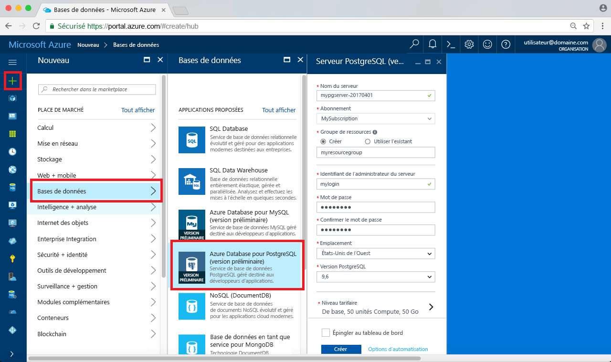
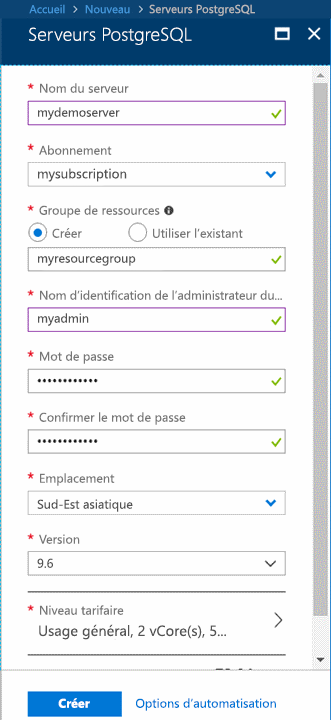
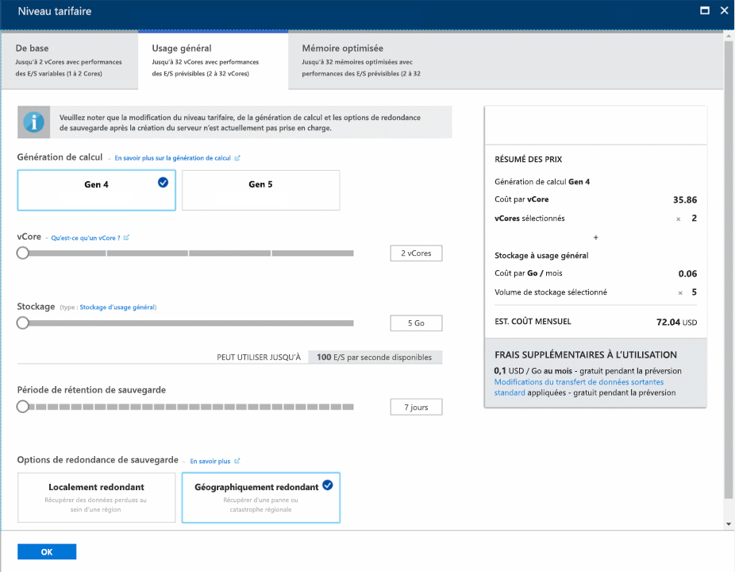
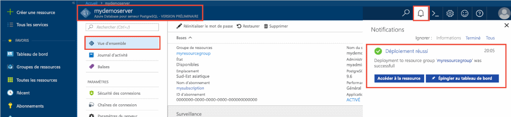
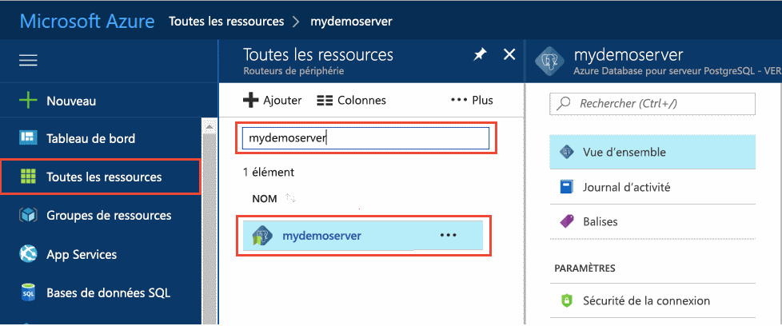
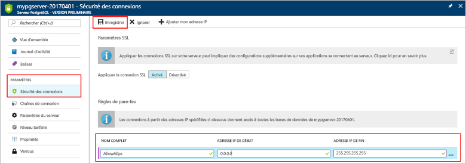
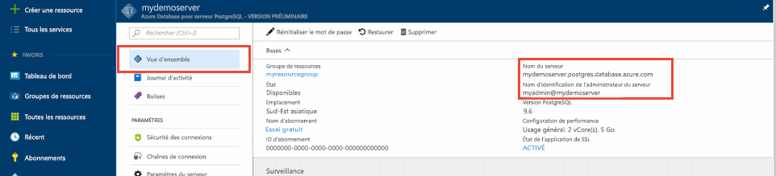
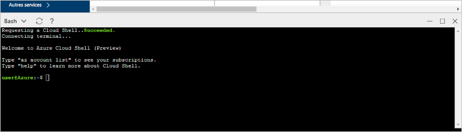

# <a name="quickstart-create-an-azure-database-for-postgresql-server-in-the-azure-portal"></a>Démarrage rapide : créer un serveur Azure Database pour PostgreSQL dans le portail Azure

Azure Database pour PostgreSQL est un service administré que vous utilisez pour exécuter, gérer et mettre à l’échelle des bases de données PostgreSQL hautement disponibles dans le cloud. Ce démarrage rapide vous montre comment créer en quelques minutes un serveur Azure Database pour PostgreSQL à l’aide du portail Azure.

Si vous n’avez pas d’abonnement Azure, créez un [compte Azure gratuit](https://azure.microsoft.com/free/) avant de commencer.

## <a name="sign-in-to-the-azure-portal"></a>Connectez-vous au portail Azure.
Ouvrez votre navigateur web et accédez au [portail](https://portal.azure.com/). Entrez vos informations d’identification pour vous connecter au portail. Il s’ouvre par défaut sur le tableau de bord des services.

## <a name="create-an-azure-database-for-postgresql-server"></a>Créer un serveur Azure Database pour PostgreSQL

Un serveur Azure Database pour PostgreSQL est créé. Il contient un ensemble configuré de [ressources de calcul et de stockage](./concepts-pricing-tiers.md). Ce serveur est créé dans un [groupe de ressources Azure](../azure-resource-manager/resource-group-overview.md).

Pour créer un serveur Azure Database pour PostgreSQL, suivez ces étapes :
1. Cliquez sur le bouton **Créer une ressource** (+) dans le coin supérieur gauche du portail.

2. Sélectionnez **Bases de données** > **Azure Database pour PostgreSQL**.

    

3. Remplissez le formulaire de détails du nouveau serveur avec les informations suivantes :

    

    Paramètre|Valeur suggérée|Description
    ---|---|---
    Nom du serveur |*mydemoserver*|Un nom unique qui identifie votre serveur Azure Database pour PostgreSQL. Le nom de domaine *postgres.database.azure.com* est ajouté au nom de serveur que vous fournissez. Le serveur ne peut contenir que des lettres minuscules, des chiffres et le caractère de trait d’union (-). Il doit contenir entre 3 et 63 caractères.
    Abonnement|Votre nom d’abonnement|L’abonnement Azure que vous souhaitez utiliser pour votre serveur. Si vous avez plusieurs abonnements, sélectionnez l’abonnement dans lequel la ressource est facturée.
    Groupe de ressources|*myresourcegroup*| Un nouveau nom de groupe de ressources ou un nom de groupe existant dans votre abonnement.
    Sélectionner une source | *Vide* | Sélectionnez *Vide* pour créer un nouveau serveur à partir de zéro. (Vous sélectionneriez *Sauvegarde* si vous créiez un serveur à partir d’une sauvegarde géographique d’un serveur Azure Database pour PostgreSQL existant).
    Connexion d’administrateur serveur |*myadmin*| Votre propre compte de connexion en tant que compte à utiliser lorsque vous vous connectez au serveur. Le nom de connexion de l’administrateur ne doit pas être **azure_superuser**, **azure_pg_admin**, **admin**, **administrator**, **root**, **guest** ou **public**. Il ne peut pas commencer par **pg_**.
    Mot de passe |Votre mot de passe| Un nouveau mot de passe pour le compte Administrateur du serveur. Il doit contenir entre 8 et 128 caractères. Votre mot de passe doit contenir des caractères appartenant à trois des catégories suivantes : lettres majuscules, lettres minuscules, chiffres (0 à 9) et caractères non alphanumériques (!, $, #, %, etc.).
    Lieu|La région la plus proche de vos utilisateurs| L’emplacement géographique le plus proche de vos utilisateurs.
    Version|La version la plus récente| La version PostgreSQL la plus récente, sauf si vous avez des exigences précises.
    Niveau tarifaire | **Usage général**, **Gen 4**, **2 vCores**, **5 Go**, **7 jours**, **géographiquement redondant** | Les configurations de calcul, de stockage et de sauvegarde pour votre nouveau serveur. Sélectionnez **Niveau tarifaire**. Ensuite, sélectionnez l’onglet **Usage général**. *Gen 4*, *2 vCores*, *5 Go*, et *7 jours* sont les valeurs par défaut pour la **Génération de calcul**, **vCore**, le **Stockage**, et la **période de rétention de sauvegarde**. Vous pouvez laisser ces curseurs en l’état. Pour activer les sauvegardes de votre serveur dans le stockage géo-redondant, sélectionnez **Géographiquement redondant** dans les **Options de redondance de sauvegarde**. Pour enregistrer cette sélection du niveau tarifaire, sélectionnez **OK**. La capture d’écran suivante capture ces sélections.

    > [!IMPORTANT]
    > La connexion d’administrateur de serveur et le mot de passe associé que vous précisez ici sont nécessaires plus loin dans ce guide de démarrage rapide pour se connecter au serveur et à ses bases de données. Retenez ou enregistrez ces informations pour une utilisation ultérieure.

    

4. Sélectionnez **Créer** pour approvisionner le serveur. Cette opération peut prendre quelques minutes.

5. Dans la barre d’outils, sélectionnez l’icône **Notifications** (en forme de cloche) pour surveiller le processus de déploiement. Une fois le déploiement terminé, vous pouvez sélectionner **Épingler au tableau de bord**, ce qui crée une vignette pour ce serveur dans votre tableau de bord du portail Azure, en tant que raccourci vers la page **Vue d’ensemble** du serveur. En sélectionnant **Accéder à la ressource**, ouvrez la page **Vue d’ensemble** du serveur.

    
   
  Par défaut, la création d’une base de données **postgres** s’effectue sous votre serveur. La base de données [postgres](https://www.postgresql.org/docs/9.6/static/app-initdb.html) est une base de données par défaut qui est destinée aux utilisateurs, aux utilitaires et aux applications tierces. 

## <a name="configure-a-server-level-firewall-rule"></a>Configurer une règle de pare-feu au niveau du serveur

Azure Database pour PostgreSQL crée un pare-feu au niveau du serveur. Il empêche les applications et les outils externes de se connecter au serveur et à toute base de données sur le serveur, sauf si vous créez une règle de pare-feu pour ouvrir le pare-feu à des adresses IP spécifiques. 

1. Après le déploiement, localisez votre serveur. Si nécessaire, vous pouvez le rechercher. Par exemple, dans le menu de gauche, sélectionnez **Toutes les ressources**. Tapez le nom de votre serveur, tel que l’exemple **mydemoserver**, pour rechercher le serveur que vous venez de créer. Sélectionnez le nom de votre serveur dans la liste des résultats. La page **Présentation** correspondant à votre serveur s’ouvre et propose des options pour poursuivre la configuration de la page.
 
    

2. Sur la page du serveur, sélectionnez **Sécurité de la connexion**.

3. Sous **Règles de pare-feu**, dans la colonne **Nom de la règle**, sélectionnez la zone de texte vide pour commencer à créer la règle de pare-feu. 

    Pour ce guide de démarrage rapide, autorisons toutes les adresses IP sur le serveur. Renseignez la zone de texte de chaque colonne avec les valeurs suivantes :

    Nom de la règle | Adresse IP de début | Adresse IP de fin 
    ---|---|---
    AllowAllIps | 0.0.0.0 | 255.255.255.255

     

4. Dans la barre d’outils supérieure de la page **Sécurité de la connexion**, sélectionnez **Enregistrer**. Avant de continuer, attendez la notification indiquant que la mise à jour de la sécurité de la connexion s’est correctement déroulée.

    > [!NOTE]
    > Les connexions à votre serveur de base de données Azure pour PostgreSQL communiquent via le port 5432. Quand vous essayez de vous connecter à partir d’un réseau d’entreprise, le trafic sortant sur le port 5432 peut être bloqué par le pare-feu de votre réseau. Si c’est le cas, vous ne pouvez pas vous connecter à votre serveur, sauf si votre service informatique ouvre le port 5432.
    >

## <a name="get-the-connection-information"></a>Obtenir les informations de connexion

Lorsque vous créez votre serveur Azure Database pour PostgreSQL, une base de données par défaut nommée **postgres** est créée. Pour vous connecter à votre serveur de base de données, vous avez besoin de son nom de serveur complet et des informations d’identification de connexion d’administrateur. Il est possible que vous ayez noté ces valeurs précédemment, dans l’article se rapportant au guide de démarrage rapide. Si vous ne l’avez pas fait, vous pouvez facilement localiser le nom du serveur et les informations de connexion dans la page **Vue d’ensemble** du serveur sur le portail Azure.

Ouvrez la page **Vue d’ensemble** de votre serveur. Prenez note du **Nom du serveur** et du **Nom de connexion de l’administrateur du serveur**. Placez le curseur sur chaque champ, afin de faire apparaître le symbole de copie à droite du texte. Sélectionnez ce symbole pour copier les valeurs qui vous intéressent.

 

## <a name="connect-to-the-postgresql-database-by-using-psql-in-cloud-shell"></a>Se connecter à la base de données PostgreSQL à l’aide de psql dans Cloud Shell

Vous pouvez utiliser différentes applications pour vous connecter à votre serveur de base de données Azure pour PostgreSQL. Commençons par utiliser l’utilitaire en ligne de commande psql pour illustrer la procédure de connexion au serveur. Vous pouvez utiliser un navigateur web et Azure Cloud Shell, comme décrit dans cet article, sans avoir besoin d’installer d’autres logiciels. Si vous avez installé l’utilitaire psql en local sur votre propre machine, vous pouvez également vous y connecter à cet emplacement.

1. Dans le volet de navigation supérieur, sélectionnez le symbole de terminal pour ouvrir Cloud Shell.

   

2. Cloud Shell s’ouvre dans votre navigateur pour vous permettre de taper des commandes de l’interpréteur de commandes Bash.

   

3. À l’invite Cloud Shell, connectez-vous à une base de données de votre serveur Azure Database pour PostgreSQL en tapant la ligne de commande psql.

    Pour vous connecter à un serveur Azure Database pour PostgreSQL avec l’utilitaire [psql](https://www.postgresql.org/docs/9.6/static/app-psql.html), utilisez le format suivant :
    ```bash
    psql --host=<yourserver> --port=<port> --username=<server admin login> --dbname=<database name>
    ```

    Par exemple, la commande ci-après permet de se connecter à un exemple de serveur :

    ```bash
    psql --host=mydemoserver.postgres.database.azure.com --port=5432 --username=myadmin@mydemoserver --dbname=postgres
    ```

    Paramètre psql |Valeur|Description
    ---|---|---
    --host | Nom du serveur | La valeur de nom de serveur utilisée lorsque vous avez créé le serveur Azure Database pour PostgreSQL. L’exemple de serveur dont vous vous servez ici est **mydemoserver.postgres.database.azure.com.** Utilisez le nom de domaine complet (**\*.postgres.database.azure.com**), comme indiqué dans l’exemple. Si vous ne vous souvenez pas du nom de votre serveur, suivez les instructions de la section précédente pour obtenir les informations de connexion. 
    --port | 5432 | Le port à utiliser lorsque vous vous connectez au serveur Azure Database pour PostgreSQL. 
    --username | Nom de connexion de l’administrateur du serveur |Le nom d’utilisateur servant à la connexion de l’administrateur du serveur que vous avez fourni lorsque vous avez créé le serveur Azure Database pour PostgreSQL. Si vous ne vous souvenez pas de votre nom d’utilisateur, suivez les instructions de la section précédente pour obtenir les informations de connexion. Le format correct est *username@servername*.
    --dbname | *postgres* | Utilisez le nom de base de données généré par défaut par le système et qui a été créé pour la première connexion. Par la suite, vous créerez votre propre base de données.

    Après avoir exécuté la commande psql avec vos propres valeurs de paramètre, vous êtes invité à entrer le mot de passe d’administrateur du serveur. Il s’agit du mot de passe que vous avez fourni lorsque vous avez créé le serveur. 

    Paramètre psql |Valeur suggérée|Description
    ---|---|---
    password | Votre mot de passe d’administrateur | Les caractères du mot de passe que vous tapez ne sont pas visibles au niveau de l’invite bash. Après avoir tapé tous les caractères, cliquez sur la touche Entrée pour vous authentifier et vous connecter.

    Une fois connecté, l’utilitaire psql affiche une invite postgres dans laquelle vous pouvez taper des commandes sql. Il est possible qu’un avertissement s’affiche au niveau de la sortie de connexion initiale, car la version de l’utilitaire psql dans Cloud Shell peut être différente de celle du serveur Azure Database pour PostgreSQL. 
    
    Exemple de sortie psql :
    ```bash
    psql (9.5.7, server 9.6.2)
    WARNING: psql major version 9.5, server major version 9.6.
        Some psql features might not work.
    SSL connection (protocol: TLSv1.2, cipher: ECDHE-RSA-AES256-SHA384, bits: 256, compression: off)
    Type "help" for help.
   
    postgres=> 
    ```

    > [!TIP]
    > Si le pare-feu n’est pas configuré pour autoriser l’adresse IP de Cloud Shell, l’erreur suivante se produit :
    > 
    > "psql: FATAL:  aucune entrée pg_hba.conf pour l’hôte "0.0.0.0", utilisateur "myadmin", base de données "postgres", SSL sur FATAL : Connexion SSL nécessaire. Spécifiez les options SSL puis réessayez.
    > 
    > Pour résoudre l’erreur, veillez à ce que la configuration du serveur corresponde à celle détaillée dans la section « Configurer une règle de pare-feu au niveau du serveur » de cet article.

4. Créez une base de données vide nommée « mypgsqldb » à l’invite en tapant la commande suivante :
    ```bash
    CREATE DATABASE mypgsqldb;
    ```
    La commande peut prendre quelques instants pour se terminer. 

5. À l’invite, exécutez la commande suivante pour basculer la connexion sur la base de données **mypgsqldb** nouvellement créée :
    ```bash
    \c mypgsqldb
    ```

6. Tapez `\q`, puis sélectionnez la touche Entrée pour quitter psql. Vous pouvez fermer Cloud Shell lorsque vous avez terminé.

Vous vous êtes connecté au serveur Azure Database pour PostgreSQL via psql dans Cloud Shell, et vous avez créé une base de données utilisateur vide. Pour vous connecter à l’aide de pgAdmin, un autre outil courant, passez à la section suivante.

## <a name="connect-to-the-postgresql-server-using-pgadmin"></a>Se connecter au serveur PostgreSQL à l’aide de pgAdmin

pgAdmin est un outil open source utilisé avec PostgreSQL. Vous pouvez installer pgAdmin à partir du [site web pgadmin](http://www.pgadmin.org/). La version pgAdmin que vous utilisez peut être différente de celle utilisée dans ce démarrage rapide. Lisez la documentation pgAdmin si vous souhaitez obtenir des conseils supplémentaires.

1. Ouvrez l’application pgAdmin sur votre ordinateur client.

2. Dans la barre d’outils, accédez à **Objet**, placez le curseur sur **Créer**, puis sélectionnez **Serveur**.

3. Dans l’onglet **Général** de la boîte de dialogue **Créer - Serveur**, entrez un nom convivial unique pour le serveur, par exemple **mydemoserver**.

    

4. Dans l’onglet **Connexion** de la boîte de dialogue **Créer - Serveur**, remplissez le tableau Paramètres.

   

    Paramètre pgAdmin |Valeur|Description
    ---|---|---
    Nom/adresse de l’hôte | Nom du serveur | La valeur de nom de serveur utilisée lorsque vous avez créé le serveur Azure Database pour PostgreSQL. L’exemple de serveur utilisé ici est **mydemoserver.postgres.database.azure.com.** Utilisez le nom de domaine complet (**\*.postgres.database.azure.com**), comme indiqué dans l’exemple. Si vous ne vous souvenez pas du nom de votre serveur, suivez les instructions de la section précédente pour obtenir les informations de connexion. 
    Port | 5432 | Le port à utiliser lorsque vous vous connectez au serveur Azure Database pour PostgreSQL. 
    Base de données de maintenance | *postgres* | Le nom de base de données par défaut généré par le système.
    Nom d’utilisateur | Nom de connexion de l’administrateur du serveur | Le nom d’utilisateur servant à la connexion de l’administrateur du serveur que vous avez fourni lorsque vous avez créé le serveur Azure Database pour PostgreSQL. Si vous ne vous souvenez pas du nom d’utilisateur, suivez les instructions de la section précédente pour obtenir les informations de connexion. Le format correct est *username@servername*.
    Mot de passe | Votre mot de passe d’administrateur | Le mot de passe que vous avez choisi lorsque vous avez créé le serveur précédemment dans ce guide de démarrage rapide.
    Rôle | Laisser vide | Il est inutile de fournir un nom de rôle à ce stade. Laissez le champ vide.
    Mode SSL | *Exiger* | Vous pouvez définir le mode SSL dans l’onglet SSL de pgAdmin. Par défaut, tous les serveurs Azure Database pour PostgreSQL sont créés avec l’application du protocole SSL activée. Pour désactiver l’application du SSL, consultez [Application du SSL](./concepts-ssl-connection-security.md).
    
5. Sélectionnez **Enregistrer**.

6. Dans la partie gauche du volet **Navigateur**, développez le nœud **Serveurs**. Sélectionnez votre serveur, par exemple, **mydemoserver**. Cliquez pour vous connecter à celui-ci.

7. Développez le nœud serveur, puis **Bases de données** situé en-dessous. La liste doit inclure votre base de données *postgres* existante ainsi que les autres bases de données que vous avez créé. Vous pouvez créer plusieurs bases de données par serveur avec Azure Database pour PostgreSQL.

8. Faites un clic droit sur **Bases de données**, choisissez le menu **Créer**, puis sélectionnez **Base de données**.

9. Tapez le nom de base de données de votre choix dans le champ **Base de données**, par exemple **mypgsqldb2**.

10. Sélectionnez le **Propriétaire** de la base de données dans la zone de liste. Choisissez le nom de connexion de l’administrateur du serveur, par exemple **myadmin**.

   

11. Sélectionnez **Enregistrer** pour créer une base de données vide.

12. Dans le volet **Navigateur**, vous pouvez remarquer la présence de la base de données que vous venez de créer dans la liste des bases de données qui se trouvent sous votre nom de serveur.


## <a name="clean-up-resources"></a>Supprimer des ressources
Vous disposez au choix de deux moyens de supprimer les ressources que vous avez créées dans ce guide de démarrage rapide. Vous pouvez supprimer le [groupe de ressources Azure](../azure-resource-manager/resource-group-overview.md) qui inclut toutes les ressources du groupe de ressources. Si vous souhaitez conserver les autres ressources intactes, ne supprimez que la ressource de serveur.

> [!TIP]
> Les autres guides de démarrage rapide de cette collection reposent sur ce guide. Si vous souhaitez continuer à utiliser d’autres guides de démarrage rapide, ne supprimez pas les ressources créées au cours de ce guide. Sinon, suivez ces étapes pour les supprimer dans le portail.

Pour supprimer l’intégralité du groupe de ressources, y compris le serveur nouvellement créé :
1. Localisez votre groupe de ressources dans le portail. Dans le menu de gauche, sélectionnez **Groupes de ressources**. Sélectionnez ensuite le nom de votre groupe de ressources, **myresourcegroup** dans l’exemple.

2. Dans la page de votre groupe de ressources, sélectionnez **Supprimer**. Pour confirmer la suppression, dans la zone de texte, tapez le nom de votre groupe de ressources, **myresourcegroup** dans l’exemple. Sélectionnez **Supprimer**.

Pour ne supprimer que le serveur nouvellement créé :
1. Localisez votre serveur dans le portail, s’il n’est pas ouvert. Dans le menu de gauche, sélectionnez **Toutes les ressources**. Recherchez ensuite le serveur que vous avez créé.

2. Dans la page **Vue d’ensemble**, sélectionnez **Supprimer**.

    

3. Vérifiez le nom du serveur à supprimer et affichez les bases de données affectées situées sous celui-ci. Tapez votre nom de serveur dans la zone de texte, par exemple **mydemoserver**. Sélectionnez **Supprimer**.

## <a name="next-steps"></a>Étapes suivantes
> [!div class="nextstepaction"]
> [Migration de votre base de données PostgreSQL par exportation et importation](./howto-migrate-using-export-and-import.md)
