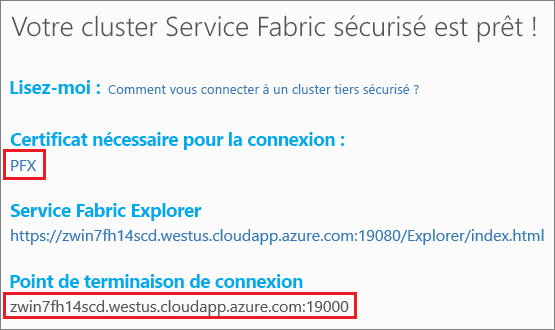
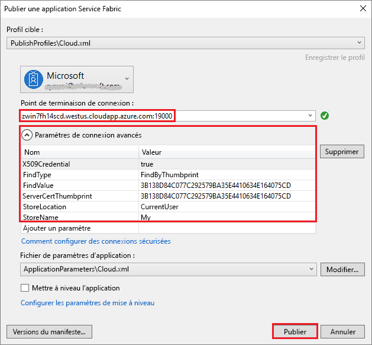

---
title: "Créer une application de conteneur Windows Azure Service Fabric | Microsoft Docs"
description: "Dans ce démarrage rapide, créez votre première application conteneur Windows sur Microsoft Azure Service Fabric."
services: service-fabric
documentationcenter: .net
author: rwike77
manager: timlt
editor: vturecek
ms.assetid: 
ms.service: service-fabric
ms.devlang: dotNet
ms.topic: quickstart
ms.tgt_pltfrm: NA
ms.workload: NA
ms.date: 02/27/18
ms.author: ryanwi
ms.custom: mvc
ms.openlocfilehash: 7a8d28ef842ba77355628c79c20fa7fd3c693380
ms.sourcegitcommit: c765cbd9c379ed00f1e2394374efa8e1915321b9
ms.translationtype: HT
ms.contentlocale: fr-FR
ms.lasthandoff: 02/28/2018
---
# <a name="quickstart-deploy-a-service-fabric-windows-container-application-on-azure"></a>Démarrage rapide : Déployer une application conteneur Windows Service Fabric sur Azure
Azure Service Fabric est une plateforme de systèmes distribués pour le déploiement et la gestion de microservices et conteneurs extensibles et fiables. 

L’exécution d’une application existante dans un conteneur Windows sur un cluster Service Fabric ne nécessite aucune modification de votre application. Ce guide de démarrage rapide montre comment déployer une image de conteneur Docker préconstruite dans une application Service Fabric. Une fois terminé, vous disposerez de Windows Server 2016 Nano Server et d’un conteneur IIS en fonction. Ce guide de démarrage rapide décrit la procédure de déploiement d’un conteneur Windows. Consultez [ce guide de démarrage rapide](service-fabric-quickstart-containers-linux.md) si vous souhaitez déployer un conteneur Linux.

![Page web IIS par défaut][iis-default]

Dans ce guide de démarrage rapide, vous apprenez à :
> [!div class="checklist"]
> * Placer un conteneur d’images Docker dans un package
> * Configurer la communication
> * Créer et placer l’application Service Fabric dans un package
> * Déployer l’application de conteneur dans Azure

## <a name="prerequisites"></a>Configuration requise
* Un abonnement Azure (vous pouvez créer un [ compte gratuit](https://azure.microsoft.com/free/?WT.mc_id=A261C142F)).
* Un ordinateur de développement exécutant :
  * Visual Studio 2015 ou Visual Studio 2017.
  * [Outils et SDK Service Fabric](service-fabric-get-started.md).

## <a name="package-a-docker-image-container-with-visual-studio"></a>Placer un conteneur d’images Docker avec Visual Studio dans un package
Le kit de développement logiciel Service Fabric fournit un modèle de service pour vous aider à déployer un conteneur sur un cluster Service Fabric.

Démarrez Visual Studio en tant qu’administrateur.  Sélectionnez **Fichier** > **Nouveau** > **Projet**.

Sélectionnez **Service Fabric application** (Application Service Fabric), nommez-la « MyFirstContainer », puis cliquez sur **OK**.

Sélectionnez **Conteneur** dans les modèles **Conteneurs et applications hébergés**.

Dans **Nom de l’image**, entrez « microsoft/iis:nanoserver », l’[image de base Windows Server Nano Server et IIS](https://hub.docker.com/r/microsoft/iis/). 

Nommez votre service « MyContainerService », puis cliquez sur **OK**.

## <a name="configure-communication-and-container-port-to-host-port-mapping"></a>Configurer la communication et le mappage des ports de conteneur aux ports hôtes
Le service a besoin d’un point de terminaison pour la communication.  Pour ce démarrage rapide, le service en conteneur écoute le port 80.  Dans l’Explorateur de solutions, ouvrez *MyFirstContainer/ApplicationPackageRoot/MyContainerServicePkg/ServiceManifest.xml*.  Mettez à jour le `Endpoint` existant dans le fichier ServiceManifest.xml, puis ajoutez le schéma de protocole, de port et d’URI : 

```xml
<Resources>
    <Endpoints>
        <Endpoint Name="MyContainerServiceTypeEndpoint" UriScheme="http" Port="80" Protocol="http"/>
   </Endpoints>
</Resources>
```
Fournir `UriScheme` enregistre automatiquement le point de terminaison du conteneur avec le service Service Fabric Naming pour la découverte. Un exemple de fichier ServiceManifest.xml complet est fourni à la fin de cet article. 

Configurez le mappage de ports de type port à hôte du conteneur afin que les requêtes entrantes envoyées vers le service sur le port 80 soient mappées au port 80 du conteneur.  Dans l’Explorateur de solutions, ouvrez *MyFirstContainer/ApplicationPackageRoot/ApplicationManifest.xml* et spécifiez une stratégie `PortBinding` dans `ContainerHostPolicies`.  Dans ce guide de démarrage rapide,la valeur `ContainerPort` est 80 et la valeur `EndpointRef` est « MyContainerServiceTypeEndpoint » (le point de terminaison renseigné dans le manifeste du service).    

```xml
<ServiceManifestImport>
...
  <ConfigOverrides />
  <Policies>
    <ContainerHostPolicies CodePackageRef="Code">
      <PortBinding ContainerPort="80" EndpointRef="MyContainerServiceTypeEndpoint"/>
    </ContainerHostPolicies>
  </Policies>
</ServiceManifestImport>
```

Un exemple de fichier ApplicationManifest.xml complet est fourni à la fin de cet article.

## <a name="create-a-cluster"></a>Créer un cluster
Pour déployer l’application sur un cluster dans Azure, vous pouvez choisir d’utiliser un cluster tiers. Les clusters tiers sont des clusters Service Fabric gratuits et limités dans le temps, hébergés sur Azure et gérés par l’équipe Service Fabric, où chacun peut déployer des applications et découvrir la plateforme. Le cluster utilise un seul certificat auto-signé pour la sécurité de nœud à nœud et de client à nœud. 

Connectez-vous et [rejoignez un cluster Windows](http://aka.ms/tryservicefabric). Téléchargez le certificat PFX sur votre ordinateur en cliquant sur le lien **PFX**. Le certificat et la valeur **Point de terminaison de connexion** sont utilisés dans les étapes suivantes.



Sur un ordinateur Windows, installez le certificat PFX dans le magasin de certificats *CurrentUser\My*.

```powershell
PS C:\mycertificates> Import-PfxCertificate -FilePath .\party-cluster-873689604-client-cert.pfx -CertStoreLocation Cert:
\CurrentUser\My


  PSParentPath: Microsoft.PowerShell.Security\Certificate::CurrentUser\My

Thumbprint                                Subject
----------                                -------
3B138D84C077C292579BA35E4410634E164075CD  CN=zwin7fh14scd.westus.cloudapp.azure.com
```

N’oubliez pas l’empreinte numérique pour l’étape suivante.  

## <a name="deploy-the-application-to-azure-using-visual-studio"></a>Déployer l’application dans Azure avec Visual Studio
À présent que l’application est prête, vous pouvez la déployer sur un cluster directement à partir de Visual Studio.

Faites un clic droit sur **MyFirstContainer** dans l’Explorateur de solutions et choisissez **Publier**. La boîte de dialogue Publier s’affiche.

Copiez le **Point de terminaison de connexion** depuis la page du cluster tiers dans le champ **Point de terminaison de connexion**. Par exemple : `zwin7fh14scd.westus.cloudapp.azure.com:19000`. Cliquez sur **Paramètres de connexion avancés** et vérifiez les informations des paramètres de connexion.  Les valeurs *FindValue* et *ServerCertThumbprint* doivent correspondre à l’empreinte numérique du certificat installé lors de l’étape précédente. 



Cliquez sur **Publier**.

Chaque application du cluster doit avoir un nom unique.  Toutefois, les clusters Party constituent un environnement public partagé et un conflit avec une application existante peut se présenter.  S’il existe un conflit de noms, renommez le projet Visual Studio et recommencez le déploiement.

Ouvrez un navigateur et accédez à http://zwin7fh14scd.westus.cloudapp.azure.com:80. La page web IIS par défaut s’affiche : ![Page web IIS par défaut][iis-default]

## <a name="complete-example-service-fabric-application-and-service-manifests"></a>Exemples complets de manifestes d’application et de service Service Fabric
Voici les manifestes d’application et de service complets utilisés dans ce guide de démarrage rapide.

### <a name="servicemanifestxml"></a>ServiceManifest.xml
```xml
<?xml version="1.0" encoding="utf-8"?>
<ServiceManifest Name="MyContainerServicePkg"
                 Version="1.0.0"
                 xmlns="http://schemas.microsoft.com/2011/01/fabric"
                 xmlns:xsd="http://www.w3.org/2001/XMLSchema"
                 xmlns:xsi="http://www.w3.org/2001/XMLSchema-instance">
  <ServiceTypes>
    <!-- This is the name of your ServiceType.
         The UseImplicitHost attribute indicates this is a guest service. -->
    <StatelessServiceType ServiceTypeName="MyContainerServiceType" UseImplicitHost="true" />
  </ServiceTypes>

  <!-- Code package is your service executable. -->
  <CodePackage Name="Code" Version="1.0.0">
    <EntryPoint>
      <!-- Follow this link for more information about deploying Windows containers to Service Fabric: https://aka.ms/sfguestcontainers -->
      <ContainerHost>
        <ImageName>microsoft/iis:nanoserver</ImageName>
      </ContainerHost>
    </EntryPoint>
    <!-- Pass environment variables to your container: -->
    <!--
    <EnvironmentVariables>
      <EnvironmentVariable Name="VariableName" Value="VariableValue"/>
    </EnvironmentVariables>
    -->
  </CodePackage>

  <!-- Config package is the contents of the Config directoy under PackageRoot that contains an 
       independently-updateable and versioned set of custom configuration settings for your service. -->
  <ConfigPackage Name="Config" Version="1.0.0" />

  <Resources>
    <Endpoints>
      <!-- This endpoint is used by the communication listener to obtain the port on which to 
           listen. Please note that if your service is partitioned, this port is shared with 
           replicas of different partitions that are placed in your code. -->
      <Endpoint Name="MyContainerServiceTypeEndpoint" UriScheme="http" Port="80" Protocol="http"/>
    </Endpoints>
  </Resources>
</ServiceManifest>
```
### <a name="applicationmanifestxml"></a>ApplicationManifest.xml
```xml
<?xml version="1.0" encoding="utf-8"?>
<ApplicationManifest ApplicationTypeName="MyFirstContainerType"
                     ApplicationTypeVersion="1.0.0"
                     xmlns="http://schemas.microsoft.com/2011/01/fabric"
                     xmlns:xsd="http://www.w3.org/2001/XMLSchema"
                     xmlns:xsi="http://www.w3.org/2001/XMLSchema-instance">
  <Parameters>
    <Parameter Name="MyContainerService_InstanceCount" DefaultValue="-1" />
  </Parameters>
  <!-- Import the ServiceManifest from the ServicePackage. The ServiceManifestName and ServiceManifestVersion 
       should match the Name and Version attributes of the ServiceManifest element defined in the 
       ServiceManifest.xml file. -->
  <ServiceManifestImport>
    <ServiceManifestRef ServiceManifestName="MyContainerServicePkg" ServiceManifestVersion="1.0.0" />
    <ConfigOverrides />
    <Policies>
      <ContainerHostPolicies CodePackageRef="Code">
        <PortBinding ContainerPort="80" EndpointRef="MyContainerServiceTypeEndpoint"/>
      </ContainerHostPolicies>
    </Policies>
  </ServiceManifestImport>
  <DefaultServices>
    <!-- The section below creates instances of service types, when an instance of this 
         application type is created. You can also create one or more instances of service type using the 
         ServiceFabric PowerShell module.
         
         The attribute ServiceTypeName below must match the name defined in the imported ServiceManifest.xml file. -->
    <Service Name="MyContainerService" ServicePackageActivationMode="ExclusiveProcess">
      <StatelessService ServiceTypeName="MyContainerServiceType" InstanceCount="[MyContainerService_InstanceCount]">
        <SingletonPartition />
      </StatelessService>
    </Service>
  </DefaultServices>
</ApplicationManifest>
```

## <a name="next-steps"></a>Étapes suivantes
Dans ce démarrage rapide, vous avez appris comment :
> [!div class="checklist"]
> * Placer un conteneur d’images Docker dans un package
> * Configurer la communication
> * Créer et placer l’application Service Fabric dans un package
> * Déployer l’application de conteneur dans Azure

* En savoir plus sur l’exécution des [conteneurs sur Service Fabric](service-fabric-containers-overview.md).
* Consultez le didacticiel [Déployer une application .NET dans un conteneur vers Azure Service Fabric](service-fabric-host-app-in-a-container.md).
* En savoir plus sur le [cycle de vie des applications](service-fabric-application-lifecycle.md) Service Fabric.
* Consulter les [exemples de code de conteneur Service Fabric](https://github.com/Azure-Samples/service-fabric-containers) sur GitHub.

[iis-default]: ./media/service-fabric-quickstart-containers/iis-default.png
[publish-dialog]: ./media/service-fabric-quickstart-containers/publish-dialog.png
