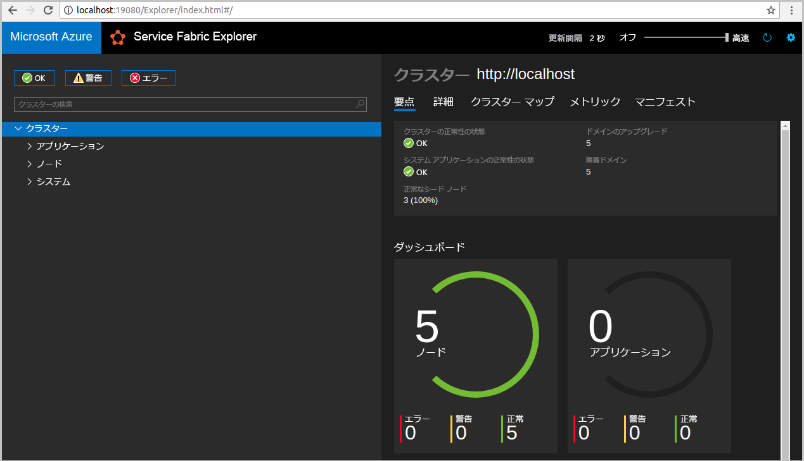

# <a name="deploy-a-spring-boot-application"></a>Déployer une application Spring Boot
Azure Service Fabric est une plateforme de systèmes distribués pour le déploiement et la gestion de microservices et de conteneurs. 

Ce guide de démarrage rapide montre comment déployer une application Spring Boot sur Service Fabric. Il utilise l’exemple [Getting Started](https://spring.io/guides/gs/spring-boot/) disponible sur le site web de Spring. Il explique comment déployer l’exemple Spring Boot en tant qu’application Service Fabric à l’aide d’outils en ligne de commande familiers. Une fois que vous aurez terminé, l’exemple Getting Started de Spring Boot sera opérationnel sur Service Fabric. 


Dans ce guide de démarrage rapide, vous apprenez à :

> [!div class="checklist"]
> * Déployer une application Spring Boot sur Service Fabric
> * Déployer l’application dans le cluster local 
> * Déployer l’application sur un cluster dans Azure
> * Mettre à l’échelle avec une montée en puissance parallèle sur plusieurs nœuds
> * Effectuer le basculement de votre service sans aucun impact sur la disponibilité

## <a name="prerequisites"></a>Composants requis
Pour effectuer ce démarrage rapide :
1. [Installez le SDK Service Fabric et l’interface CLI Service Fabric](https://docs.microsoft.com/azure/service-fabric/service-fabric-get-started-linux#installation-methods)
2. [Installez Git](https://git-scm.com/)
3. [Installez Yeoman](https://docs.microsoft.com/azure/service-fabric/service-fabric-get-started-linux#set-up-yeoman-generators-for-containers-and-guest-executables)
4. [Configurez l’environnement Java](https://docs.microsoft.com/azure/service-fabric/service-fabric-get-started-linux#set-up-java-development)

## <a name="download-the-sample"></a>Téléchargez l’exemple
Dans une fenêtre de commandes, exécutez la commande suivante pour cloner l’exemple Getting Started de Spring Boot sur votre ordinateur local.
```
git clone https://github.com/spring-guides/gs-spring-boot.git
```

## <a name="package-the-spring-boot-application"></a>Empaqueter l’application Spring Boot 
1. Dans le répertoire `gs-spring-boot` que vous venez de cloner, exécutez la commande `yo azuresfguest`. 

2. Entrez les informations suivantes à chaque invite. 

    

3. Dans le dossier `SpringServiceFabric/SpringServiceFabric/SpringGettingStartedPkg/code`, créez un fichier nommé `entryPoint.sh`. Ajoutez le code suivant au fichier. 

    ```bash
    #!/bin/bash
    BASEDIR=$(dirname $0)
    cd $BASEDIR
    java -jar gs-spring-boot-0.1.0.jar
    ```

À ce stade, vous avez créé une application Service Fabric pour l’exemple Getting Started de Spring Boot que vous pouvez déployer sur Service Fabric.

## <a name="run-the-application-locally"></a>Exécution locale de l'application
1. Démarrez le cluster local en exécutant la commande suivante :

    ```bash
    sudo /opt/microsoft/sdk/servicefabric/common/clustersetup/devclustersetup.sh
    ```
    Le démarrage du cluster local prend un certain temps. Pour vérifier que le cluster est entièrement opérationnel, accédez à Service Fabric Explorer ici : **http://localhost:19080**. Les cinq nœuds sains indiquent que le cluster local est opérationnel. 
    
    

2. Accédez au dossier `gs-spring-boot/SpringServiceFabric`.
3. Exécutez la commande suivante pour vous connecter à votre cluster local. 

    ```bash
    sfctl cluster select --endpoint http://localhost:19080
    ```
4. Exécutez le script `install.sh`. 

    ```bash
    ./install.sh
    ```

5. Ouvrez votre navigateur web par défaut, puis accédez à l’application ici : **http://localhost:8080**. 

    
    
Vous pouvez maintenant accéder à l’application Spring Boot qui a été déployée sur un cluster Service Fabric.  

## <a name="deploy-the-application-to-azure"></a>Déploiement de l'application dans Azure

### <a name="set-up-your-azure-service-fabric-cluster"></a>Configurer un cluster Azure Service Fabric
Pour déployer l’application sur un cluster dans Azure, créez votre propre cluster.

Les clusters tiers sont des clusters Service Fabric gratuits, limités dans le temps et hébergés sur Azure. Ils sont gérés par l’équipe Service Fabric, au sein de laquelle chacun peut déployer des applications et en savoir plus sur la plateforme. Pour obtenir l’accès à un cluster tiers, [suivez ces instructions](http://aka.ms/tryservicefabric). 

Pour plus d’informations sur la création de votre propre cluster, consultez [Créer un cluster Service Fabric dans Azure](service-fabric-tutorial-create-vnet-and-linux-cluster.md).

> [!Note]
> Le service Spring Boot est configuré pour écouter le trafic entrant sur le port 8080. Assurez-vous que ce port est ouvert dans votre cluster. Si vous utilisez le cluster tiers, ce port est ouvert.
>

### <a name="deploy-the-application-using-cli"></a>Déployer l’application à l’aide de l’interface CLI
Maintenant que l’application et votre cluster sont prêts, vous pouvez déployer l’application sur le cluster directement à partir de la ligne de commande.

1. Accédez au dossier `gs-spring-boot/SpringServiceFabric`.
2. Exécutez la commande suivante pour vous connecter à votre cluster Azure. 

    ```bash
    sfctl cluster select --endpoint http://<ConnectionIPOrURL>:19080
    ```
    
    Si le cluster est sécurisé avec un certificat auto-signé, vous devez exécuter la commande suivante : 

    ```bash
    sfctl cluster select --endpoint https://<ConnectionIPOrURL>:19080 --pem <path_to_certificate> --no-verify
    ```
3. Exécutez le script `install.sh`. 

    ```bash
    ./install.sh
    ```

4. Ouvrez votre navigateur web par défaut, puis accédez à l’application ici : **http://\<adresse_IP_ou_URL_de_connexion>:8080**. 

    
    
Vous pouvez maintenant accéder à l’application Spring Boot qui a été déployée sur un cluster Service Fabric.  
    
## <a name="scale-applications-and-services-in-a-cluster"></a>Mettre à l’échelle les applications et services dans un cluster
Les services peuvent facilement être mis à l’échelle dans un cluster pour prendre en compte une modification de la charge sur les services. Pour mettre à l’échelle un service, vous modifiez le nombre d’instances s’exécutant dans le cluster. Plusieurs méthodes sont disponibles pour mettre à l’échelle vos services. Vous pouvez utiliser des scripts ou des commandes de l’interface CLI de Service Fabric (sfctl). Dans cet exemple, nous utilisons Service Fabric Explorer.

Service Fabric Explorer s’exécute dans tous les clusters Service Fabric et est accessible à partir d’un navigateur, en accédant au port de gestion HTTP des clusters (19080), par exemple, `http://demolinuxsecure.westus.cloudapp.azure.com:19080`.

Pour mettre à l’échelle le service frontal web, procédez comme suit :

1. Ouvrez Service Fabric Explorer dans votre cluster. Par exemple, `http://demolinuxsecure.westus.cloudapp.azure.com:19080`.
2. Cliquez sur le bouton de sélection (points de suspension) à côté du nœud ****fabric:/SpringServiceFabric/SpringGettingStarted** dans l’arborescence, puis choisissez **Scale Service (Mettre à l’échelle le service)**.

    

    Vous pouvez maintenant choisir de mettre à l’échelle le nombre d’instances du service.

3. Définissez le nombre sur **5**, puis cliquez sur **Scale Service**.

    Une autre façon de mettre à l’échelle le service consiste à utiliser la ligne de commande :

    ```bash 
    sfctl service update --service-id 'SpringServiceFabric~SpringGettingStarted` --instance-count 5 --stateless 
    ``` 

4. Cliquez sur le nœud **fabric:/SpringServiceFabric/SpringGettingStarted** dans l’arborescence, puis développez le nœud de la partition (représenté par un GUID).

    

    Vous pouvez maintenant voir que le service a cinq instances et, dans l’arborescence, vous voyez les nœuds sur lesquels les instances s’exécutent.

Par cette tâche de gestion simple, nous avons augmenté les ressources disponibles pour permettre à notre service Spring de traiter la charge utilisateur. Il est important de comprendre que vous n’avez pas besoin de plusieurs instances d’un service pour que celui-ci s’exécute de manière fiable. En cas de défaillance d’un service, Service Fabric veille à ce qu'une nouvelle instance du service s’exécute dans le cluster.

## <a name="failover-services-in-a-cluster"></a>Services de basculement dans un cluster 
Pour illustrer le basculement du service, nous pouvons simuler un redémarrage du nœud à l’aide de Service Fabric Explorer. Vérifiez qu’une seule instance de votre service est en cours d’exécution. 

1. Ouvrez Service Fabric Explorer dans votre cluster. Par exemple, `http://demolinuxsecure.westus.cloudapp.azure.com:19080`.
2. Cliquez sur le bouton de sélection (points de suspension) en regard du nœud qui exécute l’instance de votre service, et redémarrez le nœud. 

    
3. L’instance de votre service sera alors déplacée vers un autre nœud, et votre application ne subira aucune interruption de service. 

    

## <a name="next-steps"></a>Étapes suivantes
Dans ce démarrage rapide, vous avez appris comment :

> [!div class="checklist"]
> * Déployer une application Spring Boot sur Service Fabric
> * Déployer l’application dans le cluster local 
> * Déployer l’application sur un cluster dans Azure
> * Mettre à l’échelle avec une montée en puissance parallèle sur plusieurs nœuds
> * Effectuer le basculement de votre service sans aucun impact sur la disponibilité

* En savoir plus sur la [génération de microservices Java à l’aide de modèles de programmation Service Fabric](service-fabric-quickstart-java-reliable-services.md)
* En savoir plus sur la [configuration de l’intégration et du déploiement continus à l’aide de Jenkins](service-fabric-cicd-your-linux-applications-with-jenkins.md)
* Consulter d’autres [exemples Java](https://github.com/Azure-Samples/service-fabric-java-getting-started)