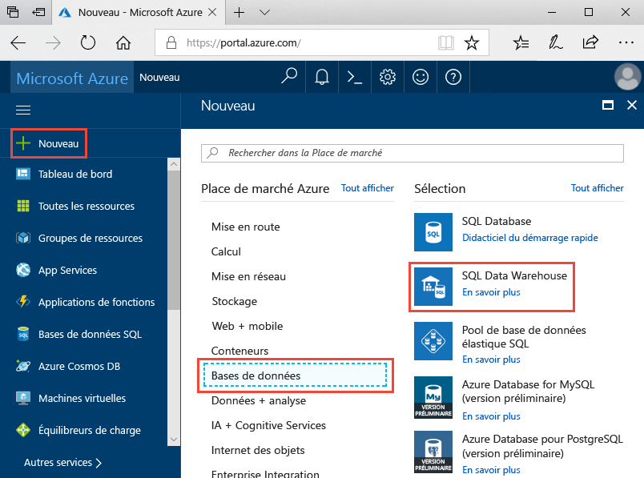
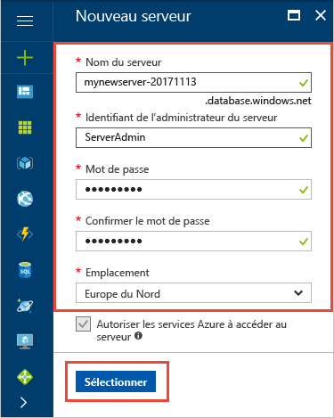
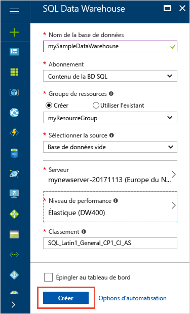
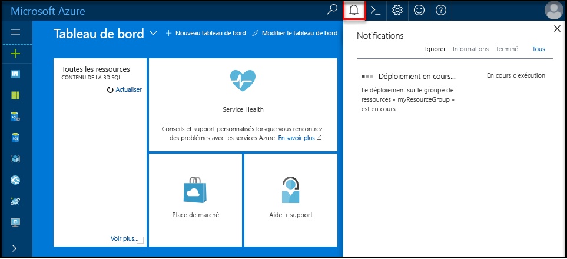
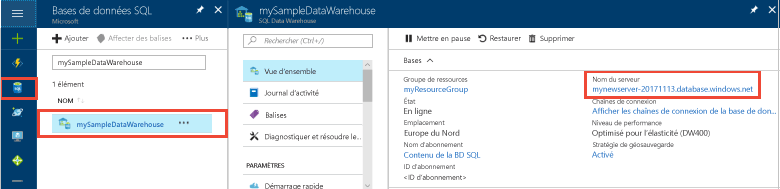
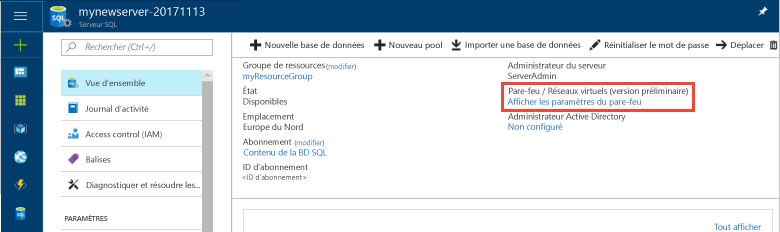
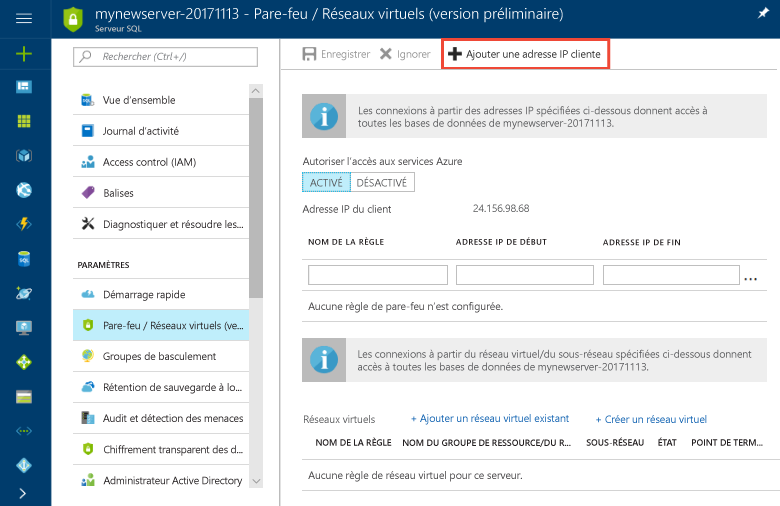

# <a name="tutorial-use-polybase-to-load-data-from-azure-blob-storage-to-azure-sql-data-warehouse"></a>Didacticiel : utiliser PolyBase pour charger des données du Stockage Blob Azure dans Azure SQL Data Warehouse

PolyBase est la technologie de chargement standard qui permet de charger des données dans SQL Data Warehouse. Dans ce didacticiel, vous utilisez PolyBase pour charger les données de New York Taxicab du Stockage Blob Azure dans Azure SQL Data Warehouse. Ce didacticiel utilise le [portail Azure](https://portal.azure.com) et [SQL Server Management Studio](/sql/ssms/download-sql-server-management-studio-ssms.md) (SSMS) pour : 

> [!div class="checklist"]
> * Créer un entrepôt de données dans le portail Azure
> * Configurer une règle de pare-feu au niveau du serveur dans le portail Azure
> * Se connecter à l’entrepôt de données avec SSMS
> * Créer un utilisateur désigné pour le chargement des données
> * Créer des tables externes pour les données dans le Stockage Blob Azure
> * Utiliser l’instruction T-SQL CTAS pour charger les données dans votre entrepôt de données
> * Afficher la progression des données à mesure du chargement
> * Créer des statistiques sur les données nouvellement chargées

Si vous ne disposez pas d’abonnement Azure, créez un [compte gratuit](https://azure.microsoft.com/free/) avant de commencer.

## <a name="before-you-begin"></a>Avant de commencer

Avant de commencer ce didacticiel, téléchargez et installez la dernière version de [SQL Server Management Studio](/sql/ssms/download-sql-server-management-studio-ssms.md) (SSMS).


## <a name="log-in-to-the-azure-portal"></a>Connectez-vous au portail Azure.

Connectez-vous au [portail Azure](https://portal.azure.com/).

## <a name="create-a-blank-sql-data-warehouse"></a>Créer un entrepôt de données SQL vide

Un entrepôt de données Azure SQL est créé avec un ensemble défini de [ressources de calcul](performance-tiers.md). La base de données est créée dans un [groupe de ressources Azure](../azure-resource-manager/resource-group-overview.md) et dans un [serveur logique Azure SQL](../sql-database/sql-database-features.md). 

Suivez ces étapes pour créer un entrepôt de données SQL vide. 

1. Cliquez sur **Créer une ressource** en haut à gauche du portail Azure.

2. Sélectionnez **Bases de données** dans la page **Nouveau** et sélectionnez **SQL Data Warehouse** sous **Sélection** dans la page **Nouveau**.

    

3. Remplissez le formulaire SQL Data Warehouse avec les informations suivantes :   

   | Paramètre | Valeur suggérée | Description | 
   | ------- | --------------- | ----------- | 
   | **Nom de la base de données** | mySampleDataWarehouse | Pour les noms de base de données valides, consultez [Database Identifiers](/sql/relational-databases/databases/database-identifiers) (Identificateurs de base de données). | 
   | **Abonnement** | Votre abonnement  | Pour plus d’informations sur vos abonnements, consultez [Abonnements](https://account.windowsazure.com/Subscriptions). |
   | **Groupe de ressources** | myResourceGroup | Pour les noms de groupe de ressources valides, consultez [Naming conventions](https://docs.microsoft.com/azure/architecture/best-practices/naming-conventions) (Conventions d’affectation de nom). |
   | **Sélectionner une source** | Base de données vide | Indique de créer une base de données vide. Notez qu’un entrepôt de données est un type de base de données.|

    

4. Cliquez sur **Serveur** pour créer et configurer un serveur pour votre nouvelle base de données. Remplissez le **formulaire de nouveau serveur** avec les informations suivantes : 

    | Paramètre | Valeur suggérée | Description | 
    | ------- | --------------- | ----------- |
    | **Nom du serveur** | Nom globalement unique | Pour les noms de serveur valides, consultez [Naming conventions](https://docs.microsoft.com/azure/architecture/best-practices/naming-conventions) (Conventions d’affectation de nom). | 
    | **Connexion d’administrateur du serveur** | Nom valide | Pour les noms de connexion valides, consultez [Database Identifiers](https://docs.microsoft.com/sql/relational-databases/databases/database-identifiers) (Identificateurs de base de données).|
    | **Mot de passe** | Mot de passe valide | Votre mot de passe doit comporter au moins 8 caractères et contenir des caractères appartenant à trois des catégories suivantes : majuscules, minuscules, chiffres et caractères non alphanumériques. |
    | **Lieu** | Emplacement valide | Pour plus d’informations sur les régions, consultez [Régions Azure](https://azure.microsoft.com/regions/). |

    

5. Cliquez sur **Sélectionner**.

6. Cliquez sur **Niveau de performance** pour spécifier si l’entrepôt de données est optimisé pour l’élasticité ou le calcul, et indiquer le nombre d’unités d’entrepôt de données. 

7. Pour ce didacticiel, sélectionnez le niveau de service **Optimisé pour l’élasticité**. Par défaut, le curseur est défini sur **DW400**.  Déplacez-le vers le haut et le bas pour voir son fonctionnement. 

    

8. Cliquez sur **Appliquer**.
9. Dans la page SQL Data Warehouse, sélectionnez un **classement** pour la base de données vide. Pour ce didacticiel, utilisez la valeur par défaut. Pour en savoir plus sur les classements, voir [Classements](/sql/t-sql/statements/collations.md)

11. Maintenant que vous avez rempli le formulaire SQL Database, cliquez sur **Créer** pour approvisionner la base de données. L’approvisionnement prend quelques minutes. 

    

12. Dans la barre d’outils, cliquez sur **Notifications** pour surveiller le processus de déploiement.
    
     

## <a name="create-a-server-level-firewall-rule"></a>Créer une règle de pare-feu au niveau du serveur

Le service SQL Data Warehouse crée un pare-feu au niveau du serveur qui empêche les applications et outils externes de se connecter au serveur ou à toute base de données sur le serveur. Pour activer la connectivité, vous pouvez ajouter des règles de pare-feu qui activent la connectivité pour des adresses IP spécifiques.  Suivez ces étapes pour créer une [règle de pare-feu au niveau du serveur](../sql-database/sql-database-firewall-configure.md) pour l’adresse IP de votre client. 

> [!NOTE]
> SQL Data Warehouse communique sur le port 1433. Si vous essayez de vous connecter à partir d’un réseau d’entreprise, le trafic sortant sur le port 1433 peut être bloqué par le pare-feu de votre réseau. Dans ce cas, vous ne pouvez pas vous connecter à votre serveur Azure SQL Database, sauf si votre service informatique ouvre le port 1433.
>

1. Une fois le déploiement terminé, cliquez sur **Bases de données SQL** dans le menu de gauche, puis cliquez sur **mySampleDatabase** sur la page **Bases de données SQL**. La page de vue d’ensemble de votre base de données s’ouvre. Elle affiche le nom de serveur complet (par exemple **mynewserver-20171113.database.windows.net**) et fournit des options pour poursuivre la configuration. 

2. Copiez le nom complet du serveur pour vous connecter à votre serveur et à ses bases de données dans les guides de démarrage rapide suivants. Ensuite, cliquez sur le nom du serveur pour ouvrir les paramètres du serveur.

     

3. Cliquez sur le nom du serveur pour ouvrir les paramètres du serveur.

     

5. Cliquez sur **Afficher les paramètres de pare-feu**. La page **Paramètres de pare-feu** du serveur de base de données SQL s’ouvre. 

     

4. Dans la barre d’outils, cliquez sur **Ajouter une adresse IP cliente** afin d’ajouter votre adresse IP actuelle à une nouvelle règle de pare-feu. Une règle de pare-feu peut ouvrir le port 1433 pour une seule adresse IP ou une plage d’adresses IP.

5. Cliquez sur **Enregistrer**. Une règle de pare-feu au niveau du serveur est créée pour votre adresse IP actuelle et ouvre le port 1433 sur le serveur logique.

6. Cliquez sur **OK**, puis fermez la page **Paramètres de pare-feu**.

Vous pouvez maintenant vous connecter au serveur SQL et à ses entrepôts de données à l’aide de cette adresse IP. La connexion fonctionne à partir de SQL Server Management Studio ou d’un autre outil de votre choix. Quand vous vous connectez, utilisez le compte ServerAdmin que vous avez créé précédemment.  

> [!IMPORTANT]
> Par défaut, l’accès via le pare-feu SQL Database est activé pour tous les services Azure. Cliquez sur **OFF** dans cette page, puis sur **Enregistrer** pour désactiver le pare-feu pour tous les services Azure.

## <a name="get-the-fully-qualified-server-name"></a>Obtenir le nom complet du serveur

Obtenez le nom complet de votre serveur SQL dans le portail Azure. Vous utilisez le nom complet du serveur par la suite pour vous connecter au serveur.

1. Connectez-vous au [portail Azure](https://portal.azure.com/).
2. Sélectionnez **Bases de données SQL** dans le menu de gauche, puis cliquez sur votre base de données dans la page **Bases de données SQL**. 
3. Dans le volet **Essentials** de la page du portail Azure pour votre base de données, recherchez et copiez le **nom du serveur**. Dans cet exemple, le nom complet est mynewserver-20171113.database.windows.net. 

      

## <a name="connect-to-the-server-as-server-admin"></a>Se connecter au serveur comme administrateur du serveur

Cette section utilise [SQL Server Management Studio](/sql/ssms/download-sql-server-management-studio-ssms.md) (SSMS) pour établir une connexion à votre serveur Azure SQL.

1. Ouvrez SQL Server Management Studio.

2. Dans la fenêtre **Se connecter au serveur**, entrez les valeurs suivantes :

    | Paramètre      | Valeur suggérée | Description | 
    | ------------ | --------------- | ----------- | 
    | Type de serveur | Moteur de base de données | Cette valeur est obligatoire |
    | Nom du serveur | Nom complet du serveur | Le nom doit ressembler à : **mynewserver-20171113.database.windows.net**. |
    | Authentification | l’authentification SQL Server | L’authentification SQL est le seul type d’authentification que nous avons configuré dans ce didacticiel. |
    | Connexion | Compte d’administrateur de serveur | Il s’agit du compte que vous avez spécifié lorsque vous avez créé le serveur. |
    | Mot de passe | Mot de passe de votre compte d’administrateur de serveur | Il s’agit du mot de passe que vous avez spécifié lorsque vous avez créé le serveur. |

    

4. Cliquez sur **Connecter**. La fenêtre Explorateur d’objets s’ouvre dans SSMS. 

5. Dans l’Explorateur d’objets, développez **Bases de données**. Ensuite, développez **Bases de données système** et **master** pour afficher les objets de la base de données master.  Développez **mySampleDatabase** pour afficher les objets dans votre nouvelle base de données.

     

## <a name="create-a-user-for-loading-data"></a>Créer un utilisateur pour le chargement des données

Le compte d’administrateur de serveur est destiné à effectuer des opérations de gestion et ne convient pas pour l’exécution de requêtes sur les données utilisateur. Le chargement des données est une opération utilisant beaucoup de mémoire. Les [valeurs maximales de mémoire](performance-tiers.md#memory-maximums) sont définies conformément au [niveau de performance](performance-tiers.md) et à la [classe de ressource](resource-classes-for-workload-management.md). 

Il est préférable de créer une connexion et un utilisateur dédiés au chargement des données. Ensuite, ajoutez l’utilisateur de chargement à une [classe de ressource](resource-classes-for-workload-management.md) qui permet une allocation de mémoire maximale appropriée.

Étant donné que vous êtes actuellement connecté comme administrateur du serveur, vous pouvez créer des connexions et des utilisateurs. Suivez ces étapes pour créer une connexion et un utilisateur appelé **LoaderRC20**. Ensuite, attribuez l’utilisateur à la classe de ressource **staticrc20**. 

1.  Dans SSMS, cliquez avec le bouton droit sur **master** pour afficher un menu déroulant et choisissez **Nouvelle requête**. Une nouvelle fenêtre de requête s’ouvre.

    

2. Dans la fenêtre de requête, entrez ces commandes T-SQL pour créer une connexion et un utilisateur nommé LoaderRC20, en remplaçant votre mot de passe par « a123STRONGpassword! ». 

    ```sql
    CREATE LOGIN LoaderRC20 WITH PASSWORD = 'a123STRONGpassword!';
    CREATE USER LoaderRC20 FOR LOGIN LoaderRC20;
    ```

3. Cliquez sur **Exécuter**.

4. Cliquez avec le bouton droit sur **mySampleDataWarehouse** et choisissez **Nouvelle requête**. Une nouvelle fenêtre de requête s’ouvre.  

    
 
5. Entrez les commandes T-SQL suivantes pour créer un utilisateur de base de données nommé LoaderRC20 pour la connexion LoaderRC20. La deuxième ligne accorde au nouvel utilisateur des autorisations de contrôle sur le nouvel entrepôt de données.  Ces autorisations reviennent à désigner l’utilisateur comme propriétaire de la base de données. La troisième ligne ajoute le nouvel utilisateur comme membre de la [classe de ressource](resource-classes-for-workload-management.md) staticrc20.

    ```sql
    CREATE USER LoaderRC20 FOR LOGIN LoaderRC20;
    GRANT CONTROL ON DATABASE::[mySampleDataWarehouse] to LoaderRC20;
    EXEC sp_addrolemember 'staticrc20', 'LoaderRC20';
    ```

6. Cliquez sur **Exécuter**.

## <a name="connect-to-the-server-as-the-loading-user"></a>Se connecter au serveur comme utilisateur de chargement

La première étape du chargement des données consiste à se connecter sous LoaderRC20.  

1. Dans l’Explorateur d’objets, cliquez sur le menu déroulant **Se connecter** et sélectionnez **Moteur de base de données**. La boîte de dialogue **Se connecter au serveur** s’affiche.

    

2. Entrez le nom complet du serveur, puis **LoaderRC20** comme connexion.  Entrez votre mot de passe pour LoaderRC20.

3. Cliquez sur **Connecter**.

4. Quand votre connexion est prête, vous voyez deux connexions de serveur dans l’Explorateur d’objets. Une connexion sous ServerAdmin et une connexion sous MedRCLogin.

    

## <a name="create-external-tables-for-the-sample-data"></a>Créer des tables externes pour les exemples de données

Vous êtes prêt à commencer le processus de chargement des données dans votre nouvel entrepôt de données. Ce didacticiel décrit comment utiliser [PolyBase](/sql/relational-databases/polybase/polybase-guide.md) pour charger les données de New York Taxicab à partir d’un objet blob de Stockage Azure. Pour vous y référer ultérieurement, pour savoir comment charger vos données vers le stockage d’objets blob Azure ou pour les charger directement à partir de votre source dans SQL Data Warehouse, consultez la [présentation du chargement](sql-data-warehouse-overview-load.md).

Exécutez les scripts SQL suivants en spécifiant les informations des données que vous voulez charger. Ces informations sont notamment l’emplacement des données, le format du contenu des données et la définition de table pour les données. 

1. Dans la section précédente, vous vous êtes connecté à votre entrepôt de données sous LoaderRC20. Dans SSMS, cliquez avec le bouton droit sur votre connexion LoaderRC20 et sélectionnez **Nouvelle requête**.  Une nouvelle fenêtre de requête s’affiche. 

    

2. Comparez votre fenêtre de requête à l’image précédente.  Vérifiez que votre fenêtre de nouvelle requête s’exécute sous LoaderRC20 et qu’elle exécute des requêtes sur votre base de données MySampleDataWarehouse. Utilisez cette fenêtre de requête pour effectuer toutes les étapes de chargement.

3. Créez une clé principale pour la base de données MySampleDataWarehouse. Vous ne devez créer qu’une clé principale par base de données. 

    ```sql
    CREATE MASTER KEY;
    ```

4. Exécutez l’instruction [CREATE EXTERNAL DATA SOURCE](/sql/t-sql/statements/create-external-data-source-transact-sql.md) suivante pour définir l’emplacement de l’objet blob Azure. Il s’agit de l’emplacement des données externes de taxi cab.  Pour exécuter une commande que vous avez ajoutée à la fenêtre de requête, mettez en surbrillance les commandes que vous voulez exécuter, puis cliquez sur **Exécuter**.

    ```sql
    CREATE EXTERNAL DATA SOURCE NYTPublic
    WITH
    (
        TYPE = Hadoop,
        LOCATION = 'wasbs://2013@nytaxiblob.blob.core.windows.net/'
    );
    ```

5. Exécutez l’instruction T-SQL [CREATE EXTERNAL FILE FORMAT](/sql/t-sql/statements/create-external-file-format-transact-sql.md) suivante pour spécifier les caractéristiques de mise en forme et les options pour le fichier de données externe. Cette instruction spécifie que les données externes sont stockées sous forme de texte et que les valeurs sont séparées par une barre verticale (« | »). Le fichier externe est compressé avec Gzip. 

    ```sql
    CREATE EXTERNAL FILE FORMAT uncompressedcsv
    WITH (
        FORMAT_TYPE = DELIMITEDTEXT,
        FORMAT_OPTIONS ( 
            FIELD_TERMINATOR = ',',
            STRING_DELIMITER = '',
            DATE_FORMAT = '',
            USE_TYPE_DEFAULT = False
        )
    );
    CREATE EXTERNAL FILE FORMAT compressedcsv
    WITH ( 
        FORMAT_TYPE = DELIMITEDTEXT,
        FORMAT_OPTIONS ( FIELD_TERMINATOR = '|',
            STRING_DELIMITER = '',
        DATE_FORMAT = '',
            USE_TYPE_DEFAULT = False
        ),
        DATA_COMPRESSION = 'org.apache.hadoop.io.compress.GzipCodec'
    );
    ```

6.  Exécutez l’instruction [CREATE SCHEMA](/sql/t-sql/statements/create-schema-transact-sql.md) suivante pour créer un schéma pour le format de votre fichier externe. Le schéma fournit un moyen d’organiser les tables externes que vous allez créer.

    ```sql
    CREATE SCHEMA ext;
    ```

7. Créez les tables externes. Les définitions de table sont stockées dans SQL Data Warehouse, mais les tables référencent les données stockées dans le Stockage Blob Azure. Exécutez les commandes T-SQL suivantes pour créer plusieurs tables externes pointant toutes vers l’objet blob Azure que nous avons défini précédemment dans notre source de données externe.

    ```sql
    CREATE EXTERNAL TABLE [ext].[Date] 
    (
        [DateID] int NOT NULL,
        [Date] datetime NULL,
        [DateBKey] char(10) COLLATE SQL_Latin1_General_CP1_CI_AS NULL,
        [DayOfMonth] varchar(2) COLLATE SQL_Latin1_General_CP1_CI_AS NULL,
        [DaySuffix] varchar(4) COLLATE SQL_Latin1_General_CP1_CI_AS NULL,
        [DayName] varchar(9) COLLATE SQL_Latin1_General_CP1_CI_AS NULL,
        [DayOfWeek] char(1) COLLATE SQL_Latin1_General_CP1_CI_AS NULL,
        [DayOfWeekInMonth] varchar(2) COLLATE SQL_Latin1_General_CP1_CI_AS NULL,
        [DayOfWeekInYear] varchar(2) COLLATE SQL_Latin1_General_CP1_CI_AS NULL,
        [DayOfQuarter] varchar(3) COLLATE SQL_Latin1_General_CP1_CI_AS NULL,
        [DayOfYear] varchar(3) COLLATE SQL_Latin1_General_CP1_CI_AS NULL,
        [WeekOfMonth] varchar(1) COLLATE SQL_Latin1_General_CP1_CI_AS NULL,
        [WeekOfQuarter] varchar(2) COLLATE SQL_Latin1_General_CP1_CI_AS NULL,
        [WeekOfYear] varchar(2) COLLATE SQL_Latin1_General_CP1_CI_AS NULL,
        [Month] varchar(2) COLLATE SQL_Latin1_General_CP1_CI_AS NULL,
        [MonthName] varchar(9) COLLATE SQL_Latin1_General_CP1_CI_AS NULL,
        [MonthOfQuarter] varchar(2) COLLATE SQL_Latin1_General_CP1_CI_AS NULL,
        [Quarter] char(1) COLLATE SQL_Latin1_General_CP1_CI_AS NULL,
        [QuarterName] varchar(9) COLLATE SQL_Latin1_General_CP1_CI_AS NULL,
        [Year] char(4) COLLATE SQL_Latin1_General_CP1_CI_AS NULL,
        [YearName] char(7) COLLATE SQL_Latin1_General_CP1_CI_AS NULL,
        [MonthYear] char(10) COLLATE SQL_Latin1_General_CP1_CI_AS NULL,
        [MMYYYY] char(6) COLLATE SQL_Latin1_General_CP1_CI_AS NULL,
        [FirstDayOfMonth] date NULL,
        [LastDayOfMonth] date NULL,
        [FirstDayOfQuarter] date NULL,
        [LastDayOfQuarter] date NULL,
        [FirstDayOfYear] date NULL,
        [LastDayOfYear] date NULL,
        [IsHolidayUSA] bit NULL,
        [IsWeekday] bit NULL,
        [HolidayUSA] varchar(50) COLLATE SQL_Latin1_General_CP1_CI_AS NULL
    )
    WITH
    (
        LOCATION = 'Date',
        DATA_SOURCE = NYTPublic,
        FILE_FORMAT = uncompressedcsv,
        REJECT_TYPE = value,
        REJECT_VALUE = 0
    ); 
    CREATE EXTERNAL TABLE [ext].[Geography]
    (
        [GeographyID] int NOT NULL,
        [ZipCodeBKey] varchar(10) COLLATE SQL_Latin1_General_CP1_CI_AS NOT NULL,
        [County] varchar(50) COLLATE SQL_Latin1_General_CP1_CI_AS NULL,
        [City] varchar(50) COLLATE SQL_Latin1_General_CP1_CI_AS NULL,
        [State] varchar(50) COLLATE SQL_Latin1_General_CP1_CI_AS NULL,
        [Country] varchar(50) COLLATE SQL_Latin1_General_CP1_CI_AS NULL,
        [ZipCode] varchar(50) COLLATE SQL_Latin1_General_CP1_CI_AS NULL
    )
    WITH
    (
        LOCATION = 'Geography',
        DATA_SOURCE = NYTPublic,
        FILE_FORMAT = uncompressedcsv,
        REJECT_TYPE = value,
        REJECT_VALUE = 0 
    );      
    CREATE EXTERNAL TABLE [ext].[HackneyLicense]
    (
        [HackneyLicenseID] int NOT NULL,
        [HackneyLicenseBKey] varchar(50) COLLATE SQL_Latin1_General_CP1_CI_AS NOT NULL,
        [HackneyLicenseCode] varchar(50) COLLATE SQL_Latin1_General_CP1_CI_AS NULL
    )
    WITH
    (
        LOCATION = 'HackneyLicense',
        DATA_SOURCE = NYTPublic,
        FILE_FORMAT = uncompressedcsv,
        REJECT_TYPE = value,
        REJECT_VALUE = 0
    );
    CREATE EXTERNAL TABLE [ext].[Medallion]
    (
        [MedallionID] int NOT NULL,
        [MedallionBKey] varchar(50) COLLATE SQL_Latin1_General_CP1_CI_AS NOT NULL,
        [MedallionCode] varchar(50) COLLATE SQL_Latin1_General_CP1_CI_AS NULL
    )
    WITH
    (
        LOCATION = 'Medallion',
        DATA_SOURCE = NYTPublic,
        FILE_FORMAT = uncompressedcsv,
        REJECT_TYPE = value,
        REJECT_VALUE = 0
    )
    ;  
    CREATE EXTERNAL TABLE [ext].[Time]
    (
        [TimeID] int NOT NULL,
        [TimeBKey] varchar(8) COLLATE SQL_Latin1_General_CP1_CI_AS NOT NULL,
        [HourNumber] tinyint NOT NULL,
        [MinuteNumber] tinyint NOT NULL,
        [SecondNumber] tinyint NOT NULL,
        [TimeInSecond] int NOT NULL,
        [HourlyBucket] varchar(15) COLLATE SQL_Latin1_General_CP1_CI_AS NOT NULL,
        [DayTimeBucketGroupKey] int NOT NULL,
        [DayTimeBucket] varchar(100) COLLATE SQL_Latin1_General_CP1_CI_AS NOT NULL
    )
    WITH
    (
        LOCATION = 'Time',
        DATA_SOURCE = NYTPublic,
        FILE_FORMAT = uncompressedcsv,
        REJECT_TYPE = value,
        REJECT_VALUE = 0
    );
    CREATE EXTERNAL TABLE [ext].[Trip]
    (
        [DateID] int NOT NULL,
        [MedallionID] int NOT NULL,
        [HackneyLicenseID] int NOT NULL,
        [PickupTimeID] int NOT NULL,
        [DropoffTimeID] int NOT NULL,
        [PickupGeographyID] int NULL,
        [DropoffGeographyID] int NULL,
        [PickupLatitude] float NULL,
        [PickupLongitude] float NULL,
        [PickupLatLong] varchar(50) COLLATE SQL_Latin1_General_CP1_CI_AS NULL,
        [DropoffLatitude] float NULL,
        [DropoffLongitude] float NULL,
        [DropoffLatLong] varchar(50) COLLATE SQL_Latin1_General_CP1_CI_AS NULL,
        [PassengerCount] int NULL,
        [TripDurationSeconds] int NULL,
        [TripDistanceMiles] float NULL,
        [PaymentType] varchar(50) COLLATE SQL_Latin1_General_CP1_CI_AS NULL,
        [FareAmount] money NULL,
        [SurchargeAmount] money NULL,
        [TaxAmount] money NULL,
        [TipAmount] money NULL,
        [TollsAmount] money NULL,
        [TotalAmount] money NULL
    )
    WITH
    (
        LOCATION = 'Trip2013',
        DATA_SOURCE = NYTPublic,
        FILE_FORMAT = compressedcsv,
        REJECT_TYPE = value,
        REJECT_VALUE = 0
    );
    CREATE EXTERNAL TABLE [ext].[Weather]
    (
        [DateID] int NOT NULL,
        [GeographyID] int NOT NULL,
        [PrecipitationInches] float NOT NULL,
        [AvgTemperatureFahrenheit] float NOT NULL
    )
    WITH
    (
        LOCATION = 'Weather',
        DATA_SOURCE = NYTPublic,
        FILE_FORMAT = uncompressedcsv,
        REJECT_TYPE = value,
        REJECT_VALUE = 0
    )
    ;
    ```

8. Dans l’Explorateur d’objets, développez mySampleDataWarehouse pour afficher la liste des tables externes que vous venez de créer.

    

## <a name="load-the-data-into-your-data-warehouse"></a>Charger les données dans votre entrepôt de données

Cette section utilise les tables externes que vous venez de définir pour charger les exemples de données d’Azure Storage Blob dans SQL Data Warehouse.  

> [!NOTE]
> Ce didacticiel charge directement les données dans la table finale. Dans un environnement de production, vous utilisez généralement l’instruction CREATE TABLE AS SELECT pour procéder au chargement dans une table de mise en lots. Lorsque les données se trouvent dans la table de mise en lots, vous pouvez effectuer toutes les transformations nécessaires. Pour ajouter les données de la table de mise en lots à une table de production, vous pouvez utiliser l’instruction INSERT...SELECT. Pour plus d’informations, voir [Insertion de données dans une table de production](guidance-for-loading-data.md#inserting-data-into-a-production-table).
> 

Le script utilise l’instruction T-SQL [CREATE TABLE AS SELECT (CTAS)](/sql/t-sql/statements/create-table-as-select-azure-sql-data-warehouse.md) pour charger les données d’Azure Storage Blob dans de nouvelles tables de votre entrepôt de données. CTAS crée une table en fonction des résultats d’une instruction select. La nouvelle table propose les mêmes colonnes et les mêmes types de données que les résultats de l’instruction select. Quand l’instruction select effectue une sélection dans une table externe, SQL Data Warehouse importe les données dans une table relationnelle de l’entrepôt de données. 

1. Exécutez le script suivant pour charger les données dans de nouvelles tables de votre entrepôt de données.

    ```sql
    CREATE TABLE [dbo].[Date]
    WITH
    ( 
        DISTRIBUTION = ROUND_ROBIN,
        CLUSTERED COLUMNSTORE INDEX
    )
    AS SELECT * FROM [ext].[Date]
    OPTION (LABEL = 'CTAS : Load [dbo].[Date]')
    ;
    CREATE TABLE [dbo].[Geography]
    WITH
    ( 
        DISTRIBUTION = ROUND_ROBIN,
        CLUSTERED COLUMNSTORE INDEX
    )
    AS
    SELECT * FROM [ext].[Geography]
    OPTION (LABEL = 'CTAS : Load [dbo].[Geography]')
    ;
    CREATE TABLE [dbo].[HackneyLicense]
    WITH
    ( 
        DISTRIBUTION = ROUND_ROBIN,
        CLUSTERED COLUMNSTORE INDEX
    )
    AS SELECT * FROM [ext].[HackneyLicense]
    OPTION (LABEL = 'CTAS : Load [dbo].[HackneyLicense]')
    ;
    CREATE TABLE [dbo].[Medallion]
    WITH
    (
        DISTRIBUTION = ROUND_ROBIN,
        CLUSTERED COLUMNSTORE INDEX
    )
    AS SELECT * FROM [ext].[Medallion]
    OPTION (LABEL = 'CTAS : Load [dbo].[Medallion]')
    ;
    CREATE TABLE [dbo].[Time]
    WITH
    (
        DISTRIBUTION = ROUND_ROBIN,
        CLUSTERED COLUMNSTORE INDEX
    )
    AS SELECT * FROM [ext].[Time]
    OPTION (LABEL = 'CTAS : Load [dbo].[Time]')
    ;
    CREATE TABLE [dbo].[Weather]
    WITH
    ( 
        DISTRIBUTION = ROUND_ROBIN,
        CLUSTERED COLUMNSTORE INDEX
    )
    AS SELECT * FROM [ext].[Weather]
    OPTION (LABEL = 'CTAS : Load [dbo].[Weather]')
    ;
    CREATE TABLE [dbo].[Trip]
    WITH
    (
        DISTRIBUTION = ROUND_ROBIN,
        CLUSTERED COLUMNSTORE INDEX
    )
    AS SELECT * FROM [ext].[Trip]
    OPTION (LABEL = 'CTAS : Load [dbo].[Trip]')
    ;
    ```

2. Affichez vos données à mesure qu’elles sont chargées. Vous chargez plusieurs gigaoctets de données et les compressez au sein d’index de cluster columnstore hautes performances. Exécutez la requête suivante qui fait appel à des vues de gestion dynamique pour afficher l’état de la charge. Une fois la requête démarrée, prenez un café et quelque chose à grignoter pendant que SQL Data Warehouse fait le gros du travail.

    ```sql
    SELECT
        r.command,
        s.request_id,
        r.status,
        count(distinct input_name) as nbr_files,
        sum(s.bytes_processed)/1024/1024/1024 as gb_processed
    FROM 
        sys.dm_pdw_exec_requests r
        INNER JOIN sys.dm_pdw_dms_external_work s
        ON r.request_id = s.request_id
    WHERE
        r.[label] = 'CTAS : Load [dbo].[Date]' OR
        r.[label] = 'CTAS : Load [dbo].[Geography]' OR
        r.[label] = 'CTAS : Load [dbo].[HackneyLicense]' OR
        r.[label] = 'CTAS : Load [dbo].[Medallion]' OR
        r.[label] = 'CTAS : Load [dbo].[Time]' OR
        r.[label] = 'CTAS : Load [dbo].[Weather]' OR
        r.[label] = 'CTAS : Load [dbo].[Trip]'
    GROUP BY
        r.command,
        s.request_id,
        r.status
    ORDER BY
        nbr_files desc, 
        gb_processed desc;
    ```

3. Affichez toutes les requêtes du système.

    ```sql
    SELECT * FROM sys.dm_pdw_exec_requests;
    ```

4. Vous pouvez constater que vos données sont efficacement chargées dans votre entrepôt de données.

    

## <a name="create-statistics-on-newly-loaded-data"></a>Créer des statistiques sur les données nouvellement chargées

SQL Data Warehouse ne prend pas en charge les statistiques de création ou de mise à jour automatiques. Par conséquent, pour obtenir des performances élevées pour les requêtes, il est important de créer des statistiques pour chaque colonne de chaque table après le premier chargement. Il est également important de mettre à jour les statistiques après des modifications importantes des données.

Exécutez ces commandes pour créer des statistiques sur les colonnes susceptibles d’être utilisées dans des jointures.

    ```sql
    CREATE STATISTICS [dbo.Date DateID stats] ON dbo.Date (DateID);
    CREATE STATISTICS [dbo.Trip DateID stats] ON dbo.Trip (DateID);
    ```

## <a name="clean-up-resources"></a>Supprimer des ressources

Vous êtes facturé en fonction des ressources de calcul et des données que vous avez chargées dans votre entrepôt de données. Les deux sont facturés séparément. 

- Si vous voulez conserver les données dans le stockage, vous pouvez suspendre le calcul quand vous n’utilisez pas l’entrepôt de données. Quand vous suspendez le calcul, vous êtes facturé uniquement pour le stockage des données et vous pouvez reprendre le calcul dès que vous voulez utiliser les données.
- Si vous voulez éviter des frais futurs, vous pouvez supprimer l’entrepôt de données. 

Suivez ces étapes pour nettoyer les ressources selon vos besoins.

1. Connectez-vous au [portail Azure](https://portal.azure.com), cliquez sur votre entrepôt de données.

    

2. Pour suspendre le calcul, cliquez sur le bouton **Suspendre**. Quand l’entrepôt de données est suspendu, un bouton **Démarrer** s’affiche.  Pour reprendre le calcul, cliquez sur **Démarrer**.

3. Pour supprimer l’entrepôt de données afin de ne pas être facturé pour le calcul ou le stockage, cliquez sur **Supprimer**.

4. Pour supprimer le serveur SQL que vous avez créé, cliquez sur **mynewserver-20171113.database.windows.net** dans l’image précédente, puis sur **Supprimer**.  N’oubliez pas que la suppression du serveur supprime toutes les bases de données attribuées au serveur.

5. Pour supprimer le groupe de ressources, cliquez sur **myResourceGroup**, puis sur **Supprimer le groupe de ressources**.

## <a name="next-steps"></a>Étapes suivantes 
Dans ce didacticiel, vous avez appris à créer un entrepôt de données et un utilisateur pour le chargement des données. Vous avez créé des tables externes pour définir la structure des données stockées dans Azure Storage Blob, puis avez utilisé l’instruction PolyBase CREATE TABLE AS SELECT pour charger des données dans votre entrepôt de données. 

Voici les étapes que vous avez effectuées :
> [!div class="checklist"]
> * Créer un entrepôt de données dans le portail Azure
> * Configurer une règle de pare-feu au niveau du serveur dans le portail Azure
> * Se connecter à l’entrepôt de données avec SSMS
> * Créer un utilisateur désigné pour le chargement des données
> * Créer des tables externes pour les données dans Azure Storage Blob
> * Utiliser l’instruction T-SQL CTAS pour charger les données dans votre entrepôt de données
> * Afficher la progression des données à mesure du chargement
> * Créer des statistiques sur les données nouvellement chargées

Passez à la vue d’ensemble de la migration pour savoir comment migrer une base de données existante vers SQL Data Warehouse.

> [!div class="nextstepaction"]
>[Découvrir comment migrer une base de données existante vers SQL Data Warehouse](sql-data-warehouse-overview-migrate.md)
