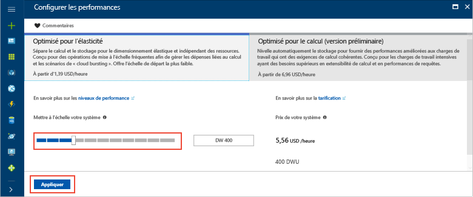

# <a name="tutorial-load-data-to-azure-sql-data-warehouse"></a>Didacticiel : Chargement de données dans Azure SQL Data Warehouse

Ce didacticiel charge l’entrepôt de données WideWorldImportersDW d’un Stockage Blob Azure dans Azure SQL Data Warehouse. Ce didacticiel utilise le [portail Azure](https://portal.azure.com) et [SQL Server Management Studio](/sql/ssms/download-sql-server-management-studio-ssms.md) (SSMS) pour : 

> [!div class="checklist"]
> * Créer un entrepôt de données dans le portail Azure
> * Configurer une règle de pare-feu au niveau du serveur dans le portail Azure
> * Se connecter à l’entrepôt de données avec SSMS
> * Créer un utilisateur désigné pour le chargement des données
> * Créer des tables externes qui utilisent Azure Blob comme source de données
> * Utiliser l’instruction T-SQL CTAS pour charger les données dans votre entrepôt de données
> * Afficher la progression des données à mesure du chargement
> * Générer une année de données dans des tables de faits de ventes et de dimension de date
> * Créer des statistiques sur les données nouvellement chargées

Si vous ne disposez pas d’abonnement Azure, créez un [compte gratuit](https://azure.microsoft.com/free/) avant de commencer.

## <a name="before-you-begin"></a>Avant de commencer

Avant de commencer ce didacticiel, téléchargez et installez la dernière version de [SQL Server Management Studio](/sql/ssms/download-sql-server-management-studio-ssms.md) (SSMS).


## <a name="log-in-to-the-azure-portal"></a>Connectez-vous au portail Azure.

Connectez-vous au [portail Azure](https://portal.azure.com/).

## <a name="create-a-blank-sql-data-warehouse"></a>Créer un entrepôt de données SQL vide

Un entrepôt de données Azure SQL est créé avec un ensemble défini de [ressources de calcul](performance-tiers.md). La base de données est créée dans un [groupe de ressources Azure](../azure-resource-manager/resource-group-overview.md) et dans un [serveur logique Azure SQL](../sql-database/sql-database-features.md). 

Suivez ces étapes pour créer un entrepôt de données SQL vide. 

1. Cliquez sur **Créer une ressource** en haut à gauche du portail Azure.

2. Sélectionnez **Bases de données** dans la page **Nouveau** et sélectionnez **SQL Data Warehouse** sous **Sélection** dans la page **Nouveau**.

    

3. Remplissez le formulaire SQL Data Warehouse avec les informations suivantes :   

   | Paramètre | Valeur suggérée | Description | 
   | ------- | --------------- | ----------- | 
   | **Nom de la base de données** | SampleDW | Pour les noms de base de données valides, consultez [Database Identifiers](/sql/relational-databases/databases/database-identifiers) (Identificateurs de base de données). | 
   | **Abonnement** | Votre abonnement  | Pour plus d’informations sur vos abonnements, consultez [Abonnements](https://account.windowsazure.com/Subscriptions). |
   | **Groupe de ressources** | SampleRG | Pour les noms de groupe de ressources valides, consultez [Naming conventions](https://docs.microsoft.com/azure/architecture/best-practices/naming-conventions) (Conventions d’affectation de nom). |
   | **Sélectionner une source** | Base de données vide | Indique de créer une base de données vide. Notez qu’un entrepôt de données est un type de base de données.|

    

4. Cliquez sur **Serveur** pour créer et configurer un serveur pour votre nouvelle base de données. Remplissez le **formulaire de nouveau serveur** avec les informations suivantes : 

    | Paramètre | Valeur suggérée | Description | 
    | ------- | --------------- | ----------- |
    | **Nom du serveur** | Nom globalement unique | Pour les noms de serveur valides, consultez [Naming conventions](https://docs.microsoft.com/azure/architecture/best-practices/naming-conventions) (Conventions d’affectation de nom). | 
    | **Connexion d’administrateur du serveur** | Nom valide | Pour les noms de connexion valides, consultez [Database Identifiers](https://docs.microsoft.com/sql/relational-databases/databases/database-identifiers) (Identificateurs de base de données).|
    | **Mot de passe** | Mot de passe valide | Votre mot de passe doit comporter au moins 8 caractères et contenir des caractères appartenant à trois des catégories suivantes : majuscules, minuscules, chiffres et caractères non alphanumériques. |
    | **Lieu** | Emplacement valide | Pour plus d’informations sur les régions, consultez [Régions Azure](https://azure.microsoft.com/regions/). |

    

5. Cliquez sur **Sélectionner**.

6. Cliquez sur **Niveau de performance** pour spécifier si l’entrepôt de données est optimisé pour l’élasticité ou le calcul, et indiquer le nombre d’unités d’entrepôt de données. 

7. Pour ce didacticiel, sélectionnez le niveau de service **Optimisé pour l’élasticité**. Par défaut, le curseur est défini sur **DW400**.  Déplacez-le vers le haut et le bas pour voir son fonctionnement. 

    

8. Cliquez sur **Appliquer**.
9. Dans la page SQL Data Warehouse, sélectionnez un **classement** pour la base de données vide. Pour ce didacticiel, utilisez la valeur par défaut. Pour en savoir plus sur les classements, voir [Classements](/sql/t-sql/statements/collations.md)

11. Maintenant que vous avez rempli le formulaire SQL Database, cliquez sur **Créer** pour approvisionner la base de données. L’approvisionnement prend quelques minutes. 

    

12. Dans la barre d’outils, cliquez sur **Notifications** pour surveiller le processus de déploiement.
    
     

## <a name="create-a-server-level-firewall-rule"></a>Créer une règle de pare-feu au niveau du serveur

Le service SQL Data Warehouse crée un pare-feu au niveau du serveur qui empêche les applications et outils externes de se connecter au serveur ou à toute base de données sur le serveur. Pour activer la connectivité, vous pouvez ajouter des règles de pare-feu qui activent la connectivité pour des adresses IP spécifiques.  Suivez ces étapes pour créer une [règle de pare-feu au niveau du serveur](../sql-database/sql-database-firewall-configure.md) pour l’adresse IP de votre client. 

> [!NOTE]
> SQL Data Warehouse communique sur le port 1433. Si vous essayez de vous connecter à partir d’un réseau d’entreprise, le trafic sortant sur le port 1433 peut être bloqué par le pare-feu de votre réseau. Dans ce cas, vous ne pouvez pas vous connecter à votre serveur Azure SQL Database, sauf si votre service informatique ouvre le port 1433.
>

1. Une fois le déploiement terminé, cliquez sur **Bases de données SQL** dans le menu de gauche, puis cliquez sur **SampleDW** sur la page **Bases de données SQL**. La page de vue d’ensemble de votre base de données s’ouvre. Elle affiche le nom complet du serveur (par exemple, **sample-svr.database.windows.net**) et fournit des options pour poursuivre la configuration. 

2. Copiez le nom complet du serveur pour vous connecter à votre serveur et à ses bases de données dans les guides de démarrage rapide suivants. Pour ouvrir les paramètres du serveur, cliquez sur le nom du serveur.

     

3. Pour ouvrir les paramètres du serveur, cliquez sur le nom du serveur.

     

5. Cliquez sur **Afficher les paramètres de pare-feu**. La page **Paramètres de pare-feu** du serveur de base de données SQL s’ouvre. 

     

4.  Pour ajouter votre adresse IP actuelle à une nouvelle règle de pare-feu, cliquez sur **Ajouter une adresse IP cliente** dans la barre d’outils. Une règle de pare-feu peut ouvrir le port 1433 pour une seule adresse IP ou une plage d’adresses IP.

5. Cliquez sur **Enregistrer**. Une règle de pare-feu au niveau du serveur est créée pour votre adresse IP actuelle et ouvre le port 1433 sur le serveur logique.

6. Cliquez sur **OK**, puis fermez la page **Paramètres de pare-feu**.

Vous pouvez maintenant vous connecter au serveur SQL et à ses entrepôts de données à l’aide de cette adresse IP. La connexion fonctionne à partir de SQL Server Management Studio ou d’un autre outil de votre choix. Quand vous vous connectez, utilisez le compte serveradmin que vous avez créé précédemment.  

> [!IMPORTANT]
> Par défaut, l’accès via le pare-feu SQL Database est activé pour tous les services Azure. Cliquez sur **OFF** dans cette page, puis sur **Enregistrer** pour désactiver le pare-feu pour tous les services Azure.

## <a name="get-the-fully-qualified-server-name"></a>Obtenir le nom complet du serveur

Obtenez le nom complet de votre serveur SQL dans le portail Azure. Vous utilisez le nom complet du serveur par la suite pour vous connecter au serveur.

1. Connectez-vous au [portail Azure](https://portal.azure.com/).
2. Sélectionnez **Bases de données SQL** dans le menu de gauche, puis cliquez sur votre base de données dans la page **Bases de données SQL**. 
3. Dans le volet **Essentials** de la page du portail Azure pour votre base de données, recherchez et copiez le **nom du serveur**. Dans cet exemple, le nom complet est mynewserver-20171113.database.windows.net. 

      

## <a name="connect-to-the-server-as-server-admin"></a>Se connecter au serveur comme administrateur du serveur

Cette section utilise [SQL Server Management Studio](/sql/ssms/download-sql-server-management-studio-ssms.md) (SSMS) pour établir une connexion à votre serveur Azure SQL.

1. Ouvrez SQL Server Management Studio.

2. Dans la fenêtre **Se connecter au serveur**, entrez les valeurs suivantes :

    | Paramètre      | Valeur suggérée | Description | 
    | ------------ | --------------- | ----------- | 
    | Type de serveur | Moteur de base de données | Cette valeur est obligatoire |
    | Nom du serveur | Nom complet du serveur | Par exemple, **sample-svr.database.windows.net** est un nom complet du serveur. |
    | Authentification | l’authentification SQL Server | L’authentification SQL est le seul type d’authentification configuré dans ce didacticiel. |
    | Connexion | Compte d’administrateur de serveur | Il s’agit du compte que vous avez spécifié lorsque vous avez créé le serveur. |
    | Mot de passe | Mot de passe de votre compte d’administrateur de serveur | Il s’agit du mot de passe que vous avez spécifié lorsque vous avez créé le serveur. |

    

4. Cliquez sur **Connecter**. La fenêtre Explorateur d’objets s’ouvre dans SSMS. 

5. Dans l’Explorateur d’objets, développez **Bases de données**. Ensuite, développez **Bases de données système** et **master** pour afficher les objets de la base de données master.  Développez **mySampleDatabase** pour afficher les objets dans votre nouvelle base de données.

     

## <a name="create-a-user-for-loading-data"></a>Créer un utilisateur pour le chargement des données

Le compte d’administrateur de serveur est destiné à effectuer des opérations de gestion et ne convient pas pour l’exécution de requêtes sur les données utilisateur. Le chargement des données est une opération utilisant beaucoup de mémoire. Les [valeurs maximales de mémoire](performance-tiers.md#memory-maximums) sont définies conformément au [niveau de performance](performance-tiers.md) et à la [classe de ressource](resource-classes-for-workload-management.md). 

Il est préférable de créer une connexion et un utilisateur dédiés au chargement des données. Ensuite, ajoutez l’utilisateur de chargement à une [classe de ressource](resource-classes-for-workload-management.md) qui permet une allocation de mémoire maximale appropriée.

Étant donné que vous êtes actuellement connecté comme administrateur du serveur, vous pouvez créer des connexions et des utilisateurs. Suivez ces étapes pour créer une connexion et un utilisateur appelé **LoaderRC60**. Ensuite, assignez l’utilisateur à la classe de ressource **staticrc60**. 

1.  Dans SSMS, cliquez avec le bouton droit sur **master** pour afficher un menu déroulant et choisissez **Nouvelle requête**. Une nouvelle fenêtre de requête s’ouvre.

    

2. Dans la fenêtre de requête, entrez ces commandes T-SQL pour créer une connexion et un utilisateur nommé LoaderRC60, en remplaçant votre mot de passe par « a123STRONGpassword! ». 

    ```sql
    CREATE LOGIN LoaderRC60 WITH PASSWORD = 'a123STRONGpassword!';
    CREATE USER LoaderRC60 FOR LOGIN LoaderRC60;
    ```

3. Cliquez sur **Exécuter**.

4. Cliquez avec le bouton droit sur **SampleDW**, puis choisissez **Nouvelle requête**. Une nouvelle fenêtre de requête s’ouvre.  

    
 
5. Entrez les commandes T-SQL suivantes pour créer un utilisateur de base de données nommé LoaderRC60 pour la connexion LoaderRC60. La deuxième ligne accorde au nouvel utilisateur des autorisations de contrôle sur le nouvel entrepôt de données.  Ces autorisations reviennent à désigner l’utilisateur comme propriétaire de la base de données. La troisième ligne ajoute le nouvel utilisateur comme membre de la [classe de ressource](resource-classes-for-workload-management.md) staticrc60.

    ```sql
    CREATE USER LoaderRC60 FOR LOGIN LoaderRC60;
    GRANT CONTROL ON DATABASE::[SampleDW] to LoaderRC60;
    EXEC sp_addrolemember 'staticrc60', 'LoaderRC60';
    ```

6. Cliquez sur **Exécuter**.

## <a name="connect-to-the-server-as-the-loading-user"></a>Se connecter au serveur comme utilisateur de chargement

La première étape du chargement des données consiste à se connecter en tant que LoaderRC60.  

1. Dans l’Explorateur d’objets, cliquez sur le menu déroulant **Se connecter** et sélectionnez **Moteur de base de données**. La boîte de dialogue **Se connecter au serveur** s’affiche.

    

2. Entrez le nom complet du serveur, puis **LoaderRC60** comme connexion.  Entrez votre mot de passe pour LoaderRC60.

3. Cliquez sur **Connecter**.

4. Quand votre connexion est prête, vous voyez deux connexions de serveur dans l’Explorateur d’objets. Une connexion en tant que ServerAdmin et une connexion en tant que LoaderRC60.

    

## <a name="create-external-tables-and-objects"></a>Créer des tables externes et des objets

Vous êtes prêt à commencer le processus de chargement des données dans votre nouvel entrepôt de données. Pour vous y référer ultérieurement, pour savoir comment charger vos données dans un Stockage Blob Azure ou pour les charger directement à partir de votre source dans SQL Data Warehouse, consultez la [présentation du chargement](sql-data-warehouse-overview-load.md).

Exécutez les scripts SQL suivants pour spécifier les informations sur les données que vous voulez charger. Ces informations sont notamment l’emplacement des données, le format du contenu des données et la définition de table pour les données. Les données se trouvent dans un objet blob Azure public.

1. Dans la section précédente, vous vous êtes connecté à votre entrepôt de données en tant que LoaderRC60. Dans SSMS, cliquez avec le bouton droit sur **SampleDW** sous votre connexion LoaderRC60 et sélectionnez **Nouvelle requête**.  Une nouvelle fenêtre de requête s’affiche. 

    

2. Comparez votre fenêtre de requête à l’image précédente.  Vérifiez que votre fenêtre de nouvelle requête s’exécute en tant que LoaderRC60 et qu’elle exécute des requêtes sur votre base de données SampleDW. Utilisez cette fenêtre de requête pour effectuer toutes les étapes de chargement.

3. Créez une clé principale pour la base de données SampleDW. Vous ne devez créer qu’une clé principale par base de données. 

    ```sql
    CREATE MASTER KEY;
    ```

4. Exécutez l’instruction [CREATE EXTERNAL DATA SOURCE](/sql/t-sql/statements/create-external-data-source-transact-sql.md) suivante pour définir l’emplacement de l’objet blob Azure. Il s’agit de l’emplacement des données externes de taxi cab.  Pour exécuter une commande que vous avez ajoutée à la fenêtre de requête, mettez en surbrillance les commandes que vous voulez exécuter, puis cliquez sur **Exécuter**.

    ```sql
    CREATE EXTERNAL DATA SOURCE WWIStorage
    WITH
    (
        TYPE = Hadoop,
        LOCATION = 'wasbs://wideworldimporters@sqldwholdata.blob.core.windows.net'
    );
    ```

5. Exécutez l’instruction T-SQL [CREATE EXTERNAL FILE FORMAT](/sql/t-sql/statements/create-external-file-format-transact-sql.md) suivante pour spécifier les caractéristiques de mise en forme et les options pour le fichier de données externe. Cette instruction spécifie que les données externes sont stockées sous forme de texte et que les valeurs sont séparées par une barre verticale (« | »).  

    ```sql
    CREATE EXTERNAL FILE FORMAT TextFileFormat 
    WITH 
    (   
        FORMAT_TYPE = DELIMITEDTEXT,
        FORMAT_OPTIONS
        (   
            FIELD_TERMINATOR = '|',
            USE_TYPE_DEFAULT = FALSE 
        )
    );
    ```

6.  Exécutez les instructions [CREATE SCHEMA](/sql/t-sql/statements/create-schema-transact-sql.md) suivantes pour créer un schéma pour le format de votre fichier externe. Le schéma ext fournit un moyen d’organiser les tables externes que vous allez créer. Le schéma wwi organise les tables standard qui contiendront les données. 

    ```sql
    CREATE SCHEMA ext;
    GO
    CREATE SCHEMA wwi;
    ```

7. Créez les tables externes. Les définitions de table sont stockées dans SQL Data Warehouse, mais les tables référencent les données stockées dans le Stockage Blob Azure. Exécutez les commandes T-SQL suivantes pour créer plusieurs tables externes pointant toutes vers l’objet blob Azure que vous avez défini précédemment dans la source de données externe.

    ```sql
    CREATE EXTERNAL TABLE [ext].[dimension_City](
        [City Key] [int] NOT NULL,
        [WWI City ID] [int] NOT NULL,
        [City] [nvarchar](50) NOT NULL,
        [State Province] [nvarchar](50) NOT NULL,
        [Country] [nvarchar](60) NOT NULL,
        [Continent] [nvarchar](30) NOT NULL,
        [Sales Territory] [nvarchar](50) NOT NULL,
        [Region] [nvarchar](30) NOT NULL,
        [Subregion] [nvarchar](30) NOT NULL,
        [Location] [nvarchar](76) NULL,
        [Latest Recorded Population] [bigint] NOT NULL,
        [Valid From] [datetime2](7) NOT NULL,
        [Valid To] [datetime2](7) NOT NULL,
        [Lineage Key] [int] NOT NULL
    )
    WITH (LOCATION='/v1/dimension_City/',   
        DATA_SOURCE = WWIStorage,  
        FILE_FORMAT = TextFileFormat,
        REJECT_TYPE = VALUE,
        REJECT_VALUE = 0
    );  
    CREATE EXTERNAL TABLE [ext].[dimension_Customer] (
        [Customer Key] [int] NOT NULL,
        [WWI Customer ID] [int] NOT NULL,
        [Customer] [nvarchar](100) NOT NULL,
        [Bill To Customer] [nvarchar](100) NOT NULL,
        [Category] [nvarchar](50) NOT NULL,
        [Buying Group] [nvarchar](50) NOT NULL,
        [Primary Contact] [nvarchar](50) NOT NULL,
        [Postal Code] [nvarchar](10) NOT NULL,
        [Valid From] [datetime2](7) NOT NULL,
        [Valid To] [datetime2](7) NOT NULL,
        [Lineage Key] [int] NOT NULL
    )
    WITH (LOCATION='/v1/dimension_Customer/',   
        DATA_SOURCE = WWIStorage,  
        FILE_FORMAT = TextFileFormat,
        REJECT_TYPE = VALUE,
        REJECT_VALUE = 0
    );  
    CREATE EXTERNAL TABLE [ext].[dimension_Employee] (
        [Employee Key] [int] NOT NULL,
        [WWI Employee ID] [int] NOT NULL,
        [Employee] [nvarchar](50) NOT NULL,
        [Preferred Name] [nvarchar](50) NOT NULL,
        [Is Salesperson] [bit] NOT NULL,
        [Photo] [varbinary](300) NULL,
        [Valid From] [datetime2](7) NOT NULL,
        [Valid To] [datetime2](7) NOT NULL,
        [Lineage Key] [int] NOT NULL
    )
    WITH ( LOCATION='/v1/dimension_Employee/',   
        DATA_SOURCE = WWIStorage,  
        FILE_FORMAT = TextFileFormat,
        REJECT_TYPE = VALUE,
        REJECT_VALUE = 0
    );
    CREATE EXTERNAL TABLE [ext].[dimension_PaymentMethod] (
        [Payment Method Key] [int] NOT NULL,
        [WWI Payment Method ID] [int] NOT NULL,
        [Payment Method] [nvarchar](50) NOT NULL,
        [Valid From] [datetime2](7) NOT NULL,
        [Valid To] [datetime2](7) NOT NULL,
        [Lineage Key] [int] NOT NULL
    )
    WITH ( LOCATION ='/v1/dimension_PaymentMethod/',   
        DATA_SOURCE = WWIStorage,  
        FILE_FORMAT = TextFileFormat,
        REJECT_TYPE = VALUE,
        REJECT_VALUE = 0
    );
    CREATE EXTERNAL TABLE [ext].[dimension_StockItem](
        [Stock Item Key] [int] NOT NULL,
        [WWI Stock Item ID] [int] NOT NULL,
        [Stock Item] [nvarchar](100) NOT NULL,
        [Color] [nvarchar](20) NOT NULL,
        [Selling Package] [nvarchar](50) NOT NULL,
        [Buying Package] [nvarchar](50) NOT NULL,
        [Brand] [nvarchar](50) NOT NULL,
        [Size] [nvarchar](20) NOT NULL,
        [Lead Time Days] [int] NOT NULL,
        [Quantity Per Outer] [int] NOT NULL,
        [Is Chiller Stock] [bit] NOT NULL,
        [Barcode] [nvarchar](50) NULL,
        [Tax Rate] [decimal](18, 3) NOT NULL,
        [Unit Price] [decimal](18, 2) NOT NULL,
        [Recommended Retail Price] [decimal](18, 2) NULL,
        [Typical Weight Per Unit] [decimal](18, 3) NOT NULL,
        [Photo] [varbinary](300) NULL,
        [Valid From] [datetime2](7) NOT NULL,
        [Valid To] [datetime2](7) NOT NULL,
        [Lineage Key] [int] NOT NULL
    )
    WITH ( LOCATION ='/v1/dimension_StockItem/',   
        DATA_SOURCE = WWIStorage,  
        FILE_FORMAT = TextFileFormat,
        REJECT_TYPE = VALUE,
        REJECT_VALUE = 0
    );
    CREATE EXTERNAL TABLE [ext].[dimension_Supplier](
        [Supplier Key] [int] NOT NULL,
        [WWI Supplier ID] [int] NOT NULL,
        [Supplier] [nvarchar](100) NOT NULL,
        [Category] [nvarchar](50) NOT NULL,
        [Primary Contact] [nvarchar](50) NOT NULL,
        [Supplier Reference] [nvarchar](20) NULL,
        [Payment Days] [int] NOT NULL,
        [Postal Code] [nvarchar](10) NOT NULL,
        [Valid From] [datetime2](7) NOT NULL,
        [Valid To] [datetime2](7) NOT NULL,
        [Lineage Key] [int] NOT NULL
    )
    WITH ( LOCATION ='/v1/dimension_Supplier/',   
        DATA_SOURCE = WWIStorage,  
        FILE_FORMAT = TextFileFormat,
        REJECT_TYPE = VALUE,
        REJECT_VALUE = 0
    );
    CREATE EXTERNAL TABLE [ext].[dimension_TransactionType](
        [Transaction Type Key] [int] NOT NULL,
        [WWI Transaction Type ID] [int] NOT NULL,
        [Transaction Type] [nvarchar](50) NOT NULL,
        [Valid From] [datetime2](7) NOT NULL,
        [Valid To] [datetime2](7) NOT NULL,
        [Lineage Key] [int] NOT NULL
    )    
    WITH ( LOCATION ='/v1/dimension_TransactionType/',   
        DATA_SOURCE = WWIStorage,  
        FILE_FORMAT = TextFileFormat,
        REJECT_TYPE = VALUE,
        REJECT_VALUE = 0
    );
    CREATE EXTERNAL TABLE [ext].[fact_Movement] (
        [Movement Key] [bigint] NOT NULL,
        [Date Key] [date] NOT NULL,
        [Stock Item Key] [int] NOT NULL,
        [Customer Key] [int] NULL,
        [Supplier Key] [int] NULL,
        [Transaction Type Key] [int] NOT NULL,
        [WWI Stock Item Transaction ID] [int] NOT NULL,
        [WWI Invoice ID] [int] NULL,
        [WWI Purchase Order ID] [int] NULL,
        [Quantity] [int] NOT NULL,
        [Lineage Key] [int] NOT NULL
    )
    WITH ( LOCATION ='/v1/fact_Movement/',   
        DATA_SOURCE = WWIStorage,  
        FILE_FORMAT = TextFileFormat,
        REJECT_TYPE = VALUE,
        REJECT_VALUE = 0
    );
    CREATE EXTERNAL TABLE [ext].[fact_Order] (
        [Order Key] [bigint] NOT NULL,
        [City Key] [int] NOT NULL,
        [Customer Key] [int] NOT NULL,
        [Stock Item Key] [int] NOT NULL,
        [Order Date Key] [date] NOT NULL,
        [Picked Date Key] [date] NULL,
        [Salesperson Key] [int] NOT NULL,
        [Picker Key] [int] NULL,
        [WWI Order ID] [int] NOT NULL,
        [WWI Backorder ID] [int] NULL,
        [Description] [nvarchar](100) NOT NULL,
        [Package] [nvarchar](50) NOT NULL,
        [Quantity] [int] NOT NULL,
        [Unit Price] [decimal](18, 2) NOT NULL,
        [Tax Rate] [decimal](18, 3) NOT NULL,
        [Total Excluding Tax] [decimal](18, 2) NOT NULL,
        [Tax Amount] [decimal](18, 2) NOT NULL,
        [Total Including Tax] [decimal](18, 2) NOT NULL,
        [Lineage Key] [int] NOT NULL
    )
    WITH ( LOCATION ='/v1/fact_Order/',   
        DATA_SOURCE = WWIStorage,  
        FILE_FORMAT = TextFileFormat,
        REJECT_TYPE = VALUE,
        REJECT_VALUE = 0
    );
    CREATE EXTERNAL TABLE [ext].[fact_Purchase] (
        [Purchase Key] [bigint] NOT NULL,
        [Date Key] [date] NOT NULL,
        [Supplier Key] [int] NOT NULL,
        [Stock Item Key] [int] NOT NULL,
        [WWI Purchase Order ID] [int] NULL,
        [Ordered Outers] [int] NOT NULL,
        [Ordered Quantity] [int] NOT NULL,
        [Received Outers] [int] NOT NULL,
        [Package] [nvarchar](50) NOT NULL,
        [Is Order Finalized] [bit] NOT NULL,
        [Lineage Key] [int] NOT NULL
    )
    WITH ( LOCATION ='/v1/fact_Purchase/',   
        DATA_SOURCE = WWIStorage,  
        FILE_FORMAT = TextFileFormat,
        REJECT_TYPE = VALUE,
        REJECT_VALUE = 0
    );
    CREATE EXTERNAL TABLE [ext].[fact_Sale] (
        [Sale Key] [bigint] NOT NULL,
        [City Key] [int] NOT NULL,
        [Customer Key] [int] NOT NULL,
        [Bill To Customer Key] [int] NOT NULL,
        [Stock Item Key] [int] NOT NULL,
        [Invoice Date Key] [date] NOT NULL,
        [Delivery Date Key] [date] NULL,
        [Salesperson Key] [int] NOT NULL,
        [WWI Invoice ID] [int] NOT NULL,
        [Description] [nvarchar](100) NOT NULL,
        [Package] [nvarchar](50) NOT NULL,
        [Quantity] [int] NOT NULL,
        [Unit Price] [decimal](18, 2) NOT NULL,
        [Tax Rate] [decimal](18, 3) NOT NULL,
        [Total Excluding Tax] [decimal](18, 2) NOT NULL,
        [Tax Amount] [decimal](18, 2) NOT NULL,
        [Profit] [decimal](18, 2) NOT NULL,
        [Total Including Tax] [decimal](18, 2) NOT NULL,
        [Total Dry Items] [int] NOT NULL,
        [Total Chiller Items] [int] NOT NULL,
        [Lineage Key] [int] NOT NULL
    )
    WITH ( LOCATION ='/v1/fact_Sale/',   
        DATA_SOURCE = WWIStorage,  
        FILE_FORMAT = TextFileFormat,
        REJECT_TYPE = VALUE,
        REJECT_VALUE = 0
    );
    CREATE EXTERNAL TABLE [ext].[fact_StockHolding] (
        [Stock Holding Key] [bigint] NOT NULL,
        [Stock Item Key] [int] NOT NULL,
        [Quantity On Hand] [int] NOT NULL,
        [Bin Location] [nvarchar](20) NOT NULL,
        [Last Stocktake Quantity] [int] NOT NULL,
        [Last Cost Price] [decimal](18, 2) NOT NULL,
        [Reorder Level] [int] NOT NULL,
        [Target Stock Level] [int] NOT NULL,
        [Lineage Key] [int] NOT NULL
    )
    WITH ( LOCATION ='/v1/fact_StockHolding/',   
        DATA_SOURCE = WWIStorage,  
        FILE_FORMAT = TextFileFormat,
        REJECT_TYPE = VALUE,
        REJECT_VALUE = 0
    );
    CREATE EXTERNAL TABLE [ext].[fact_Transaction] (
        [Transaction Key] [bigint] NOT NULL,
        [Date Key] [date] NOT NULL,
        [Customer Key] [int] NULL,
        [Bill To Customer Key] [int] NULL,
        [Supplier Key] [int] NULL,
        [Transaction Type Key] [int] NOT NULL,
        [Payment Method Key] [int] NULL,
        [WWI Customer Transaction ID] [int] NULL,
        [WWI Supplier Transaction ID] [int] NULL,
        [WWI Invoice ID] [int] NULL,
        [WWI Purchase Order ID] [int] NULL,
        [Supplier Invoice Number] [nvarchar](20) NULL,
        [Total Excluding Tax] [decimal](18, 2) NOT NULL,
        [Tax Amount] [decimal](18, 2) NOT NULL,
        [Total Including Tax] [decimal](18, 2) NOT NULL,
        [Outstanding Balance] [decimal](18, 2) NOT NULL,
        [Is Finalized] [bit] NOT NULL,
        [Lineage Key] [int] NOT NULL
    )
    WITH ( LOCATION ='/v1/fact_Transaction/',   
        DATA_SOURCE = WWIStorage,  
        FILE_FORMAT = TextFileFormat,
        REJECT_TYPE = VALUE,
        REJECT_VALUE = 0
    );
    ```

8. Dans l’Explorateur d’objets, développez SampleDW pour afficher la liste des tables externes que vous venez de créer.

    

## <a name="load-the-data-into-your-data-warehouse"></a>Charger les données dans votre entrepôt de données

Cette section utilise les tables externes que vous venez de définir pour charger les exemples de données d’Azure Blob dans SQL Data Warehouse.  

> [!NOTE]
> Ce didacticiel charge directement les données dans la table finale. Dans un environnement de production, vous utilisez généralement l’instruction CREATE TABLE AS SELECT pour procéder au chargement dans une table de mise en lots. Lorsque les données se trouvent dans la table de mise en lots, vous pouvez effectuer toutes les transformations nécessaires. Pour ajouter les données de la table de mise en lots à une table de production, vous pouvez utiliser l’instruction INSERT...SELECT. Pour plus d’informations, voir [Insertion de données dans une table de production](guidance-for-loading-data.md#inserting-data-into-a-production-table).
> 

Le script utilise l’instruction T-SQL [CREATE TABLE AS SELECT (CTAS)](/sql/t-sql/statements/create-table-as-select-azure-sql-data-warehouse.md) pour charger les données d’Azure Storage Blob dans de nouvelles tables de votre entrepôt de données. CTAS crée une table en fonction des résultats d’une instruction select. La nouvelle table propose les mêmes colonnes et les mêmes types de données que les résultats de l’instruction select. Quand l’instruction select effectue une sélection dans une table externe, SQL Data Warehouse importe les données dans une table relationnelle de l’entrepôt de données. 

Ce script ne charge pas les données dans les tables wwi.dimension_Date et wwi.fact_Sales. Ces tables sont générées lors d’une étape ultérieure pour que les tables aient un nombre de lignes important.

1. Exécutez le script suivant pour charger les données dans de nouvelles tables de votre entrepôt de données.

    ```sql
    CREATE TABLE [wwi].[dimension_City]
    WITH
    ( 
        DISTRIBUTION = REPLICATE,
        CLUSTERED COLUMNSTORE INDEX
    )
    AS
    SELECT * FROM [ext].[dimension_City]
    OPTION (LABEL = 'CTAS : Load [wwi].[dimension_City]')
    ;

    CREATE TABLE [wwi].[dimension_Customer]
    WITH
    ( 
        DISTRIBUTION = REPLICATE,
        CLUSTERED COLUMNSTORE INDEX
    )
    AS
    SELECT * FROM [ext].[dimension_Customer]
    OPTION (LABEL = 'CTAS : Load [wwi].[dimension_Customer]')
    ;

    CREATE TABLE [wwi].[dimension_Employee]
    WITH
    ( 
        DISTRIBUTION = REPLICATE,
        CLUSTERED COLUMNSTORE INDEX
    )
    AS
    SELECT * FROM [ext].[dimension_Employee]
    OPTION (LABEL = 'CTAS : Load [wwi].[dimension_Employee]')
    ;

    CREATE TABLE [wwi].[dimension_PaymentMethod]
    WITH
    ( 
        DISTRIBUTION = REPLICATE,
        CLUSTERED COLUMNSTORE INDEX
    )
    AS
    SELECT * FROM [ext].[dimension_PaymentMethod]
    OPTION (LABEL = 'CTAS : Load [wwi].[dimension_PaymentMethod]')
    ;

    CREATE TABLE [wwi].[dimension_StockItem]
    WITH
    ( 
        DISTRIBUTION = REPLICATE,
        CLUSTERED COLUMNSTORE INDEX
    )
    AS
    SELECT * FROM [ext].[dimension_StockItem]
    OPTION (LABEL = 'CTAS : Load [wwi].[dimension_StockItem]')
    ;

    CREATE TABLE [wwi].[dimension_Supplier]
    WITH
    ( 
        DISTRIBUTION = REPLICATE,
        CLUSTERED COLUMNSTORE INDEX
    )
    AS
    SELECT * FROM [ext].[dimension_Supplier]
    OPTION (LABEL = 'CTAS : Load [wwi].[dimension_Supplier]')
    ;

    CREATE TABLE [wwi].[dimension_TransactionType]
    WITH
    ( 
        DISTRIBUTION = REPLICATE,
        CLUSTERED COLUMNSTORE INDEX
    )
    AS
    SELECT * FROM [ext].[dimension_TransactionType]
    OPTION (LABEL = 'CTAS : Load [wwi].[dimension_TransactionType]')
    ;

    CREATE TABLE [wwi].[fact_Movement]
    WITH
    ( 
        DISTRIBUTION = HASH([Movement Key]),
        CLUSTERED COLUMNSTORE INDEX
    )
    AS
    SELECT * FROM [ext].[fact_Movement]
    OPTION (LABEL = 'CTAS : Load [wwi].[fact_Movement]')
    ;

    CREATE TABLE [wwi].[fact_Order]
    WITH
    ( 
        DISTRIBUTION = HASH([Order Key]),
        CLUSTERED COLUMNSTORE INDEX
    )
    AS
    SELECT * FROM [ext].[fact_Order]
    OPTION (LABEL = 'CTAS : Load [wwi].[fact_Order]')
    ;

    CREATE TABLE [wwi].[fact_Purchase]
    WITH
    ( 
        DISTRIBUTION = HASH([Purchase Key]),
        CLUSTERED COLUMNSTORE INDEX
    )
    AS
    SELECT * FROM [ext].[fact_Purchase]
    OPTION (LABEL = 'CTAS : Load [wwi].[fact_Purchase]')
    ;

    CREATE TABLE [wwi].[seed_Sale]
    WITH
    ( 
        DISTRIBUTION = HASH([WWI Invoice ID]),
        CLUSTERED COLUMNSTORE INDEX
    )
    AS
    SELECT * FROM [ext].[fact_Sale]
    OPTION (LABEL = 'CTAS : Load [wwi].[seed_Sale]')
    ;

    CREATE TABLE [wwi].[fact_StockHolding]
    WITH
    ( 
        DISTRIBUTION = HASH([Stock Holding Key]),
        CLUSTERED COLUMNSTORE INDEX
    )
    AS
    SELECT * FROM [ext].[fact_StockHolding]
    OPTION (LABEL = 'CTAS : Load [wwi].[fact_StockHolding]')
    ;

    CREATE TABLE [wwi].[fact_Transaction]
    WITH
    ( 
        DISTRIBUTION = HASH([Transaction Key]),
        CLUSTERED COLUMNSTORE INDEX
    )
    AS
    SELECT * FROM [ext].[fact_Transaction]
    OPTION (LABEL = 'CTAS : Load [wwi].[fact_Transaction]')
    ;
    ```

2. Affichez vos données à mesure qu’elles sont chargées. Vous chargez plusieurs gigaoctets de données et les compressez au sein d’index de cluster columnstore hautes performances. Ouvrez une nouvelle fenêtre de requête sur SampleDW et exécutez la requête suivante pour afficher l’état du chargement. Une fois la requête démarrée, prenez un café et quelque chose à grignoter pendant que SQL Data Warehouse fait le gros du travail.

    ```sql
    SELECT
        r.command,
        s.request_id,
        r.status,
        count(distinct input_name) as nbr_files,
        sum(s.bytes_processed)/1024/1024/1024 as gb_processed
    FROM 
        sys.dm_pdw_exec_requests r
        INNER JOIN sys.dm_pdw_dms_external_work s
        ON r.request_id = s.request_id
    WHERE
        r.[label] = 'CTAS : Load [wwi].[dimension_City]' OR
        r.[label] = 'CTAS : Load [wwi].[dimension_Customer]' OR
        r.[label] = 'CTAS : Load [wwi].[dimension_Employee]' OR
        r.[label] = 'CTAS : Load [wwi].[dimension_PaymentMethod]' OR
        r.[label] = 'CTAS : Load [wwi].[dimension_StockItem]' OR
        r.[label] = 'CTAS : Load [wwi].[dimension_Supplier]' OR
        r.[label] = 'CTAS : Load [wwi].[dimension_TransactionType]' OR
        r.[label] = 'CTAS : Load [wwi].[fact_Movement]' OR
        r.[label] = 'CTAS : Load [wwi].[fact_Order]' OR
        r.[label] = 'CTAS : Load [wwi].[fact_Purchase]' OR
        r.[label] = 'CTAS : Load [wwi].[fact_StockHolding]' OR
        r.[label] = 'CTAS : Load [wwi].[fact_Transaction]'
    GROUP BY
        r.command,
        s.request_id,
        r.status
    ORDER BY
        nbr_files desc, 
        gb_processed desc;
    ```

3. Affichez toutes les requêtes du système.

    ```sql
    SELECT * FROM sys.dm_pdw_exec_requests;
    ```

4. Vous pouvez constater que vos données sont efficacement chargées dans votre entrepôt de données.

    

## <a name="create-tables-and-procedures-to-generate-the-date-and-sales-tables"></a>Créer des tables et procédures pour générer les tables Sales et Date

Cette section crée les tables wwi.dimension_Date et wwi.fact_Sales. Elle crée également des procédures stockées qui peuvent générer des millions de lignes dans les tables wwi.dimension_Date et wwi.fact_Sales.

1. Créez les tables dimension_Date et fact_Sale.  

    ```sql
    CREATE TABLE [wwi].[dimension_Date]
    (
        [Date] [datetime] NOT NULL,
        [Day Number] [int] NOT NULL,
        [Day] [nvarchar](10) NOT NULL,
        [Month] [nvarchar](10) NOT NULL,
        [Short Month] [nvarchar](3) NOT NULL,
        [Calendar Month Number] [int] NOT NULL,
        [Calendar Month Label] [nvarchar](20) NOT NULL,
        [Calendar Year] [int] NOT NULL,
        [Calendar Year Label] [nvarchar](10) NOT NULL,
        [Fiscal Month Number] [int] NOT NULL,
        [Fiscal Month Label] [nvarchar](20) NOT NULL,
        [Fiscal Year] [int] NOT NULL,
        [Fiscal Year Label] [nvarchar](10) NOT NULL,
        [ISO Week Number] [int] NOT NULL
    )
    WITH 
    (
        DISTRIBUTION = REPLICATE,
        CLUSTERED INDEX ([Date])
    );
    CREATE TABLE [wwi].[fact_Sale]
    (
        [Sale Key] [bigint] IDENTITY(1,1) NOT NULL,
        [City Key] [int] NOT NULL,
        [Customer Key] [int] NOT NULL,
        [Bill To Customer Key] [int] NOT NULL,
        [Stock Item Key] [int] NOT NULL,
        [Invoice Date Key] [date] NOT NULL,
        [Delivery Date Key] [date] NULL,
        [Salesperson Key] [int] NOT NULL,
        [WWI Invoice ID] [int] NOT NULL,
        [Description] [nvarchar](100) NOT NULL,
        [Package] [nvarchar](50) NOT NULL,
        [Quantity] [int] NOT NULL,
        [Unit Price] [decimal](18, 2) NOT NULL,
        [Tax Rate] [decimal](18, 3) NOT NULL,
        [Total Excluding Tax] [decimal](18, 2) NOT NULL,
        [Tax Amount] [decimal](18, 2) NOT NULL,
        [Profit] [decimal](18, 2) NOT NULL,
        [Total Including Tax] [decimal](18, 2) NOT NULL,
        [Total Dry Items] [int] NOT NULL,
        [Total Chiller Items] [int] NOT NULL,
        [Lineage Key] [int] NOT NULL
    )
    WITH
    (
        DISTRIBUTION = HASH ( [WWI Invoice ID] ),
        CLUSTERED COLUMNSTORE INDEX
    )
    ```

2. Créez [wwi].[InitialSalesDataPopulation] pour augmenter le nombre de lignes dans [wwi].[seed_Sale] d’un facteur de huit. 

    ```sql
    CREATE PROCEDURE [wwi].[InitialSalesDataPopulation] AS
    BEGIN
        INSERT INTO [wwi].[seed_Sale] (
            [Sale Key], [City Key], [Customer Key], [Bill To Customer Key], [Stock Item Key], [Invoice Date Key], [Delivery Date Key], [Salesperson Key], [WWI Invoice ID], [Description], [Package], [Quantity], [Unit Price], [Tax Rate], [Total Excluding Tax], [Tax Amount], [Profit], [Total Including Tax], [Total Dry Items], [Total Chiller Items], [Lineage Key]
        )
        SELECT
            [Sale Key], [City Key], [Customer Key], [Bill To Customer Key], [Stock Item Key], [Invoice Date Key], [Delivery Date Key], [Salesperson Key], [WWI Invoice ID], [Description], [Package], [Quantity], [Unit Price], [Tax Rate], [Total Excluding Tax], [Tax Amount], [Profit], [Total Including Tax], [Total Dry Items], [Total Chiller Items], [Lineage Key]
        FROM [wwi].[seed_Sale]

        INSERT INTO [wwi].[seed_Sale] (
            [Sale Key], [City Key], [Customer Key], [Bill To Customer Key], [Stock Item Key], [Invoice Date Key], [Delivery Date Key], [Salesperson Key], [WWI Invoice ID], [Description], [Package], [Quantity], [Unit Price], [Tax Rate], [Total Excluding Tax], [Tax Amount], [Profit], [Total Including Tax], [Total Dry Items], [Total Chiller Items], [Lineage Key]
        )
        SELECT
            [Sale Key], [City Key], [Customer Key], [Bill To Customer Key], [Stock Item Key], [Invoice Date Key], [Delivery Date Key], [Salesperson Key], [WWI Invoice ID], [Description], [Package], [Quantity], [Unit Price], [Tax Rate], [Total Excluding Tax], [Tax Amount], [Profit], [Total Including Tax], [Total Dry Items], [Total Chiller Items], [Lineage Key]
        FROM [wwi].[seed_Sale]

        INSERT INTO [wwi].[seed_Sale] (
            [Sale Key], [City Key], [Customer Key], [Bill To Customer Key], [Stock Item Key], [Invoice Date Key], [Delivery Date Key], [Salesperson Key], [WWI Invoice ID], [Description], [Package], [Quantity], [Unit Price], [Tax Rate], [Total Excluding Tax], [Tax Amount], [Profit], [Total Including Tax], [Total Dry Items], [Total Chiller Items], [Lineage Key]
        )
        SELECT
            [Sale Key], [City Key], [Customer Key], [Bill To Customer Key], [Stock Item Key], [Invoice Date Key], [Delivery Date Key], [Salesperson Key], [WWI Invoice ID], [Description], [Package], [Quantity], [Unit Price], [Tax Rate], [Total Excluding Tax], [Tax Amount], [Profit], [Total Including Tax], [Total Dry Items], [Total Chiller Items], [Lineage Key]
        FROM [wwi].[seed_Sale]
    END
    ```

3. Créez cette procédure stockée qui remplit les lignes dans wwi.dimension_Date.

    ```sql
    CREATE PROCEDURE [wwi].[PopulateDateDimensionForYear] @Year [int] AS
    BEGIN
        IF OBJECT_ID('tempdb..#month', 'U') IS NOT NULL 
            DROP TABLE #month
        CREATE TABLE #month (
            monthnum int,
            numofdays int
        )
        WITH ( DISTRIBUTION = ROUND_ROBIN, heap )
        INSERT INTO #month
            SELECT 1, 31 UNION SELECT 2, CASE WHEN (@YEAR % 4 = 0 AND @YEAR % 100 <> 0) OR @YEAR % 400 = 0 THEN 29 ELSE 28 END UNION SELECT 3,31 UNION SELECT 4,30 UNION SELECT 5,31 UNION SELECT 6,30 UNION SELECT 7,31 UNION SELECT 8,31 UNION SELECT 9,30 UNION SELECT 10,31 UNION SELECT 11,30 UNION SELECT 12,31

        IF OBJECT_ID('tempdb..#days', 'U') IS NOT NULL 
            DROP TABLE #days
        CREATE TABLE #days (days int)
        WITH (DISTRIBUTION = ROUND_ROBIN, HEAP)

        INSERT INTO #days
            SELECT 1 UNION SELECT 2 UNION SELECT 3 UNION SELECT 4 UNION SELECT 5 UNION SELECT 6 UNION SELECT 7 UNION SELECT 8 UNION SELECT 9 UNION SELECT 10 UNION SELECT 11 UNION SELECT 12 UNION SELECT 13 UNION SELECT 14 UNION SELECT 15 UNION SELECT 16 UNION SELECT 17 UNION SELECT 18 UNION SELECT 19 UNION SELECT 20    UNION SELECT 21 UNION SELECT 22 UNION SELECT 23 UNION SELECT 24 UNION SELECT 25 UNION SELECT 26 UNION SELECT 27 UNION SELECT 28 UNION SELECT 29 UNION SELECT 30 UNION SELECT 31

        INSERT [wwi].[dimension_Date] (
            [Date], [Day Number], [Day], [Month], [Short Month], [Calendar Month Number], [Calendar Month Label], [Calendar Year], [Calendar Year Label], [Fiscal Month Number], [Fiscal Month Label], [Fiscal Year], [Fiscal Year Label], [ISO Week Number] 
        )
        SELECT
            CAST(CAST(monthnum AS VARCHAR(2)) + '/' + CAST([days] AS VARCHAR(3)) + '/' + CAST(@year AS CHAR(4)) AS DATE) AS [Date]
            ,DAY(CAST(CAST(monthnum AS VARCHAR(2)) + '/' + CAST([days] AS VARCHAR(3)) + '/' + CAST(@year AS CHAR(4)) AS DATE)) AS [Day Number]
            ,CAST(DATENAME(day, CAST(CAST(monthnum AS VARCHAR(2)) + '/' + CAST([days] AS VARCHAR(3)) + '/' + CAST(@year AS CHAR(4)) AS DATE)) AS NVARCHAR(10)) AS [Day]
            ,CAST(DATENAME(month, CAST(CAST(monthnum AS VARCHAR(2)) + '/' + CAST([days] AS VARCHAR(3)) + '/' + CAST(@year as char(4)) AS DATE)) AS nvarchar(10)) AS [Month]
            ,CAST(SUBSTRING(DATENAME(month, CAST(CAST(monthnum as varchar(2)) + '/' + CAST([days] as varchar(3)) + '/' + CAST(@year as char(4)) AS DATE)), 1, 3) AS nvarchar(3)) AS [Short Month]
            ,MONTH(CAST(CAST(monthnum as varchar(2)) + '/' + CAST([days] as varchar(3)) + '/' + CAST(@year as char(4)) AS DATE)) AS [Calendar Month Number]
            ,CAST(N'CY' + CAST(YEAR(CAST(CAST(monthnum as varchar(2)) + '/' + CAST([days] as varchar(3)) + '/' + CAST(@year as char(4)) AS DATE)) AS nvarchar(4)) + N'-' + SUBSTRING(DATENAME(month, CAST(CAST(monthnum as varchar(2)) + '/' + CAST([days] as varchar(3)) + '/' + CAST(@year as char(4)) AS DATE)), 1, 3) AS nvarchar(10)) AS [Calendar Month Label]
            ,YEAR(CAST(CAST(monthnum as varchar(2)) + '/' + CAST([days] as varchar(3)) + '/' + CAST(@year as char(4)) AS DATE)) AS [Calendar Year]
            ,CAST(N'CY' + CAST(YEAR(CAST(CAST(monthnum as varchar(2)) + '/' + CAST([days] as varchar(3)) + '/' + CAST(@year as char(4)) AS DATE)) AS nvarchar(4)) AS nvarchar(10)) AS [Calendar Year Label]
            ,CASE WHEN MONTH(CAST(CAST(monthnum as varchar(2)) + '/' + CAST([days] as varchar(3)) + '/' + CAST(@year as char(4)) AS DATE)) IN (11, 12)
            THEN MONTH(CAST(CAST(monthnum as varchar(2)) + '/' + CAST([days] as varchar(3)) + '/' + CAST(@year as char(4)) AS DATE)) - 10
            ELSE MONTH(CAST(CAST(monthnum as varchar(2)) + '/' + CAST([days] as varchar(3)) + '/' + CAST(@year as char(4)) AS DATE)) + 2 END AS [Fiscal Month Number]
            ,CAST(N'FY' + CAST(CASE WHEN MONTH(CAST(CAST(monthnum as varchar(2)) + '/' + CAST([days] as varchar(3)) + '/' + CAST(@year as char(4)) AS DATE)) IN (11, 12)
            THEN YEAR(CAST(CAST(monthnum as varchar(2)) + '/' + CAST([days] as varchar(3)) + '/' + CAST(@year as char(4)) AS DATE)) + 1
            ELSE YEAR(CAST(CAST(monthnum as varchar(2)) + '/' + CAST([days] as varchar(3)) + '/' + CAST(@year as char(4)) AS DATE)) END AS nvarchar(4)) + N'-' + SUBSTRING(DATENAME(month, CAST(CAST(monthnum as varchar(2)) + '/' + CAST([days] as varchar(3)) + '/' + CAST(@year as char(4)) AS DATE)), 1, 3) AS nvarchar(20)) AS [Fiscal Month Label]
            ,CASE WHEN MONTH(CAST(CAST(monthnum as varchar(2)) + '/' + CAST([days] as varchar(3)) + '/' + CAST(@year as char(4)) AS DATE)) IN (11, 12)
            THEN YEAR(CAST(CAST(monthnum as varchar(2)) + '/' + CAST([days] as varchar(3)) + '/' + CAST(@year as char(4)) AS DATE)) + 1
            ELSE YEAR(CAST(CAST(monthnum as varchar(2)) + '/' + CAST([days] as varchar(3)) + '/' + CAST(@year as char(4)) AS DATE)) END AS [Fiscal Year]
            ,CAST(N'FY' + CAST(CASE WHEN MONTH(CAST(CAST(monthnum as varchar(2)) + '/' + CAST([days] as varchar(3)) + '/' + CAST(@year as char(4)) AS DATE)) IN (11, 12)
            THEN YEAR(CAST(CAST(monthnum as varchar(2)) + '/' + CAST([days] as varchar(3)) + '/' + CAST(@year as char(4)) AS DATE)) + 1
            ELSE YEAR(CAST(CAST(monthnum as varchar(2)) + '/' + CAST([days] as varchar(3)) + '/' + CAST(@year as char(4)) AS DATE))END AS nvarchar(4)) AS nvarchar(10)) AS [Fiscal Year Label]
            , DATEPART(ISO_WEEK, CAST(CAST(monthnum as varchar(2)) + '/' + CAST([days] as varchar(3)) + '/' + CAST(@year as char(4)) AS DATE)) AS [ISO Week Number]
    FROM #month m
        CROSS JOIN #days d
    WHERE d.days <= m.numofdays

    DROP table #month;
    DROP table #days;
    END;
    ```
4. Créez cette procédure qui remplit les tables wwi.dimension_Date et wwi.fact_Sales. Elle appelle [wwi].[PopulateDateDimensionForYear] pour remplir wwi.dimension_Date.

    ```sql
    CREATE PROCEDURE [wwi].[Configuration_PopulateLargeSaleTable] @EstimatedRowsPerDay [bigint],@Year [int] AS
    BEGIN
        SET NOCOUNT ON;
        SET XACT_ABORT ON;

        EXEC [wwi].[PopulateDateDimensionForYear] @Year;

        DECLARE @OrderCounter bigint = 0;
        DECLARE @NumberOfSalesPerDay bigint = @EstimatedRowsPerDay;
        DECLARE @DateCounter date; 
        DECLARE @StartingSaleKey bigint;
        DECLARE @MaximumSaleKey bigint = (SELECT MAX([Sale Key]) FROM wwi.seed_Sale);
        DECLARE @MaxDate date;
        SET @MaxDate = (SELECT MAX([Invoice Date Key]) FROM wwi.fact_Sale)
        IF ( @MaxDate < CAST(@YEAR AS CHAR(4)) + '1231') AND (@MaxDate > CAST(@YEAR AS CHAR(4)) + '0101')
            SET @DateCounter = @MaxDate
        ELSE
            SET @DateCounter= CAST(@Year as char(4)) + '0101';

        PRINT 'Targeting ' + CAST(@NumberOfSalesPerDay AS varchar(20)) + ' sales per day.';

        DECLARE @OutputCounter varchar(20);
        DECLARE @variance DECIMAL(18,10);
        DECLARE @VariantNumberOfSalesPerDay BIGINT;

        WHILE @DateCounter < CAST(@YEAR AS CHAR(4)) + '1231'
        BEGIN
            SET @OutputCounter = CONVERT(varchar(20), @DateCounter, 112);
            RAISERROR(@OutputCounter, 0, 1);
            SET @variance = (SELECT RAND() * 10)*.01 + .95
            SET @VariantNumberOfSalesPerDay = FLOOR(@NumberOfSalesPerDay * @variance)

            SET @StartingSaleKey = @MaximumSaleKey - @VariantNumberOfSalesPerDay - FLOOR(RAND() * 20000);
            SET @OrderCounter = 0;

            INSERT [wwi].[fact_Sale] (
                [City Key], [Customer Key], [Bill To Customer Key], [Stock Item Key], [Invoice Date Key], [Delivery Date Key], [Salesperson Key], [WWI Invoice ID], [Description], Package, Quantity, [Unit Price], [Tax Rate], [Total Excluding Tax], [Tax Amount], Profit, [Total Including Tax], [Total Dry Items], [Total Chiller Items], [Lineage Key]
            )
            SELECT TOP(@VariantNumberOfSalesPerDay)
                [City Key], [Customer Key], [Bill To Customer Key], [Stock Item Key], @DateCounter, DATEADD(day, 1, @DateCounter), [Salesperson Key], [WWI Invoice ID], [Description], Package, Quantity, [Unit Price], [Tax Rate], [Total Excluding Tax], [Tax Amount], Profit, [Total Including Tax], [Total Dry Items], [Total Chiller Items], [Lineage Key]
            FROM [wwi].[seed_Sale]
            WHERE 
                 --[Sale Key] > @StartingSaleKey and /* IDENTITY DOES NOT WORK THE SAME IN SQLDW AND CAN'T USE THIS METHOD FOR VARIANT */
                [Invoice Date Key] >=cast(@YEAR AS CHAR(4)) + '-01-01'
            ORDER BY [Sale Key];

            SET @DateCounter = DATEADD(day, 1, @DateCounter);
        END;

    END;

## Generate millions of rows
Use the stored procedures you created to generate millions of rows in the wwi.fact_Sales table, and corresponding data in the wwi.dimension_Date table. 


1. Run this procedure to seed the [wwi].[seed_Sale] with more rows.

    ```sql    
    EXEC [wwi].[InitialSalesDataPopulation]
    ```

2. Exécutez cette procédure pour remplir wwi.fact_Sales avec 100 000 lignes par jour pour chaque jour de l’année 2000.

    ```sql
    EXEC [wwi].[Configuration_PopulateLargeSaleTable] 100000, 2000
    ```
3. La génération de données à l’étape précédente peut prendre un certain temps, car elle concerne toute une année.  Pour voir à quel jour en est le processus actuel, ouvrez une nouvelle requête et exécutez cette commande SQL :

    ```sql
    SELECT MAX([Invoice Date Key]) FROM wwi.fact_Sale;
    ```

4. Exécutez la commande suivante pour afficher l’espace utilisé.

    ```sql
    EXEC sp_spaceused N'wwi.fact_Sale';
    ```

## <a name="populate-the-replicated-table-cache"></a>Remplir le cache de la table répliquée
SQL Data Warehouse réplique une table en mettant en cache les données sur chaque nœud Compute. Le cache est rempli lorsqu’une requête s’exécute sur la table. Par conséquent, la première requête d’une table répliquée peut nécessiter plus de temps pour remplir le cache. Une fois le cache rempli, les requêtes sur les tables répliquées s’exécutent plus rapidement.

Exécutez ces requêtes SQL pour remplir le cache de la table répliquée sur les nœuds Compute. 

    ```sql
    SELECT TOP 1 * FROM [wwi].[dimension_City];
    SELECT TOP 1 * FROM [wwi].[dimension_Customer];
    SELECT TOP 1 * FROM [wwi].[dimension_Date];
    SELECT TOP 1 * FROM [wwi].[dimension_Employee];
    SELECT TOP 1 * FROM [wwi].[dimension_PaymentMethod];
    SELECT TOP 1 * FROM [wwi].[dimension_StockItem];
    SELECT TOP 1 * FROM [wwi].[dimension_Supplier];
    SELECT TOP 1 * FROM [wwi].[dimension_TransactionType];
    ```

## <a name="create-statistics-on-newly-loaded-data"></a>Créer des statistiques sur les données nouvellement chargées

Pour obtenir des performances élevées pour les requêtes, il est important de créer des statistiques pour chaque colonne de chaque table après le premier chargement. Il est également important de mettre à jour les statistiques après des modifications importantes des données. 

1. Créez cette procédure stockée qui met à jour des statistiques sur toutes les colonnes de toutes les tables.

    ```sql
    CREATE PROCEDURE    [dbo].[prc_sqldw_create_stats]
    (   @create_type    tinyint -- 1 default 2 Fullscan 3 Sample
    ,   @sample_pct     tinyint
    )
    AS

    IF @create_type IS NULL
    BEGIN
        SET @create_type = 1;
    END;

    IF @create_type NOT IN (1,2,3)
    BEGIN
        THROW 151000,'Invalid value for @stats_type parameter. Valid range 1 (default), 2 (fullscan) or 3 (sample).',1;
    END;

    IF @sample_pct IS NULL
    BEGIN;
        SET @sample_pct = 20;
    END;

    IF OBJECT_ID('tempdb..#stats_ddl') IS NOT NULL
    BEGIN;
        DROP TABLE #stats_ddl;
    END;
    
    CREATE TABLE #stats_ddl
    WITH    (   DISTRIBUTION    = HASH([seq_nmbr])
            ,   LOCATION        = USER_DB
            )
    AS
    WITH T
    AS
    (
    SELECT      t.[name]                        AS [table_name]
    ,           s.[name]                        AS [table_schema_name]
    ,           c.[name]                        AS [column_name]
    ,           c.[column_id]                   AS [column_id]
    ,           t.[object_id]                   AS [object_id]
    ,           ROW_NUMBER()
                OVER(ORDER BY (SELECT NULL))    AS [seq_nmbr]
    FROM        sys.[tables] t
    JOIN        sys.[schemas] s         ON  t.[schema_id]       = s.[schema_id]
    JOIN        sys.[columns] c         ON  t.[object_id]       = c.[object_id]
    LEFT JOIN   sys.[stats_columns] l   ON  l.[object_id]       = c.[object_id]
                                        AND l.[column_id]       = c.[column_id]
                                        AND l.[stats_column_id] = 1
    LEFT JOIN    sys.[external_tables] e    ON    e.[object_id]        = t.[object_id]
    WHERE       l.[object_id] IS NULL
    AND            e.[object_id] IS NULL -- not an external table
    )
    SELECT  [table_schema_name]
    ,       [table_name]
    ,       [column_name]
    ,       [column_id]
    ,       [object_id]
    ,       [seq_nmbr]
    ,       CASE @create_type
            WHEN 1
            THEN    CAST('CREATE STATISTICS '+QUOTENAME('stat_'+table_schema_name+ '_' + table_name + '_'+column_name)+' ON '+QUOTENAME(table_schema_name)+'.'+QUOTENAME(table_name)+'('+QUOTENAME(column_name)+')' AS VARCHAR(8000))
            WHEN 2
            THEN    CAST('CREATE STATISTICS '+QUOTENAME('stat_'+table_schema_name+ '_' + table_name + '_'+column_name)+' ON '+QUOTENAME(table_schema_name)+'.'+QUOTENAME(table_name)+'('+QUOTENAME(column_name)+') WITH FULLSCAN' AS VARCHAR(8000))
            WHEN 3
            THEN    CAST('CREATE STATISTICS '+QUOTENAME('stat_'+table_schema_name+ '_' + table_name + '_'+column_name)+' ON '+QUOTENAME(table_schema_name)+'.'+QUOTENAME(table_name)+'('+QUOTENAME(column_name)+') WITH SAMPLE '+CONVERT(varchar(4),@sample_pct)+' PERCENT' AS VARCHAR(8000))
            END AS create_stat_ddl
    FROM T
    ;

    DECLARE @i INT              = 1
    ,       @t INT              = (SELECT COUNT(*) FROM #stats_ddl)
    ,       @s NVARCHAR(4000)   = N''
    ;

    WHILE @i <= @t
    BEGIN
        SET @s=(SELECT create_stat_ddl FROM #stats_ddl WHERE seq_nmbr = @i);
        PRINT @s
        EXEC sp_executesql @s
        SET @i+=1;
    END

    DROP TABLE #stats_ddl;
    ```

2. Exécutez cette commande pour créer des statistiques sur toutes les colonnes de toutes les tables dans l’entrepôt de données.

    ```sql
    EXEC [dbo].[prc_sqldw_create_stats] 1, NULL;
    ```

## <a name="clean-up-resources"></a>Supprimer des ressources

Vous êtes facturé en fonction des ressources de calcul et des données que vous avez chargées dans votre entrepôt de données. Les deux sont facturés séparément.  

Suivez ces étapes pour nettoyer les ressources selon vos besoins.

1. Connectez-vous au [portail Azure](https://portal.azure.com), cliquez sur votre entrepôt de données.

    

2. Si vous voulez conserver les données dans le stockage, vous pouvez suspendre le calcul quand vous n’utilisez pas l’entrepôt de données. Quand vous suspendez le calcul, vous êtes facturé uniquement pour le stockage des données et vous pouvez reprendre le calcul dès que vous voulez utiliser les données. Pour suspendre le calcul, cliquez sur le bouton **Suspendre**. Quand l’entrepôt de données est suspendu, un bouton **Démarrer** s’affiche.  Pour reprendre le calcul, cliquez sur **Démarrer**.

3. Si vous voulez éviter des frais ultérieurs, vous pouvez supprimer l’entrepôt de données. Pour supprimer l’entrepôt de données afin de ne pas être facturé pour le calcul ou le stockage, cliquez sur **Supprimer**.

4. Pour supprimer le serveur SQL que vous avez créé, cliquez sur **sample-svr.database.windows.net** dans l’image précédente, puis sur **Supprimer**.  N’oubliez pas que la suppression du serveur supprime toutes les bases de données attribuées au serveur.

5. Pour supprimer le groupe de ressources, cliquez sur **SampleRG**, puis sur **Supprimer le groupe de ressources**.

## <a name="next-steps"></a>Étapes suivantes 
Dans ce didacticiel, vous avez appris à créer un entrepôt de données et un utilisateur pour le chargement des données. Vous avez créé des tables externes pour définir la structure des données stockées dans Azure Storage Blob, puis avez utilisé l’instruction PolyBase CREATE TABLE AS SELECT pour charger des données dans votre entrepôt de données. 

Voici les étapes que vous avez effectuées :
> [!div class="checklist"]
> * Créer un entrepôt de données dans le portail Azure
> * Configurer une règle de pare-feu au niveau du serveur dans le portail Azure
> * Se connecter à l’entrepôt de données avec SSMS
> * Créer un utilisateur désigné pour le chargement des données
> * Créer des tables externes pour les données dans Azure Storage Blob
> * Utiliser l’instruction T-SQL CTAS pour charger les données dans votre entrepôt de données
> * Afficher la progression des données à mesure du chargement
> * Créer des statistiques sur les données nouvellement chargées

Passez à la vue d’ensemble de la migration pour savoir comment migrer une base de données existante vers SQL Data Warehouse.

> [!div class="nextstepaction"]
>[Découvrir comment migrer une base de données existante vers SQL Data Warehouse](sql-data-warehouse-overview-migrate.md)
