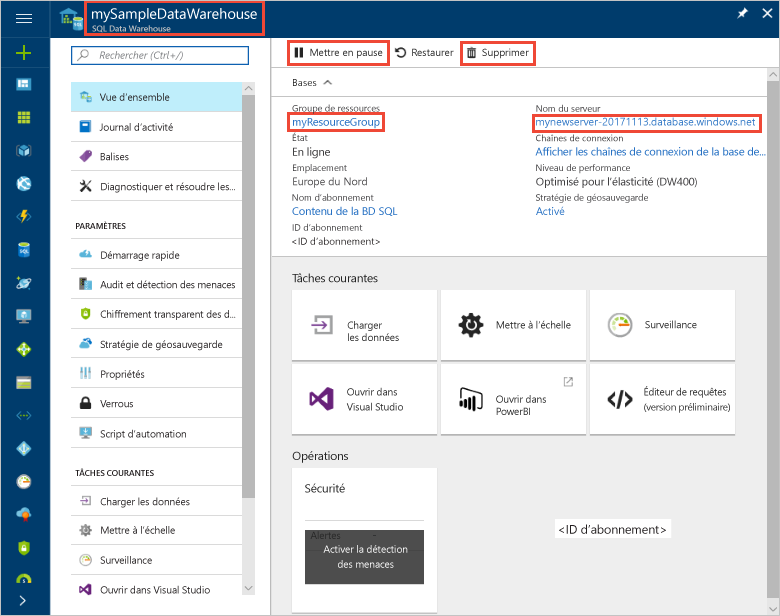

# Démarrage rapide : Suspendre et reprendre le calcul pour un entrepôt Azure SQL Data Warehouse sur le Portail Azure
Suspendez le calcul dans un entrepôt Azure SQL Data Warehouse afin de réduire les coûts. [Reprenez le calcul](sql-data-warehouse-manage-compute-overview.md) quand vous êtes prêt à utiliser l’entrepôt de données.

Si vous n’avez pas d’abonnement Azure, créez un compte [gratuit](https://azure.microsoft.com/free/) avant de commencer.

## Connectez-vous au portail Azure.

Connectez-vous au [Portail Azure](https://portal.azure.com/).

## Avant de commencer

Utilisez la section [Créer et connecter – Portail](create-data-warehouse-portal.md) pour créer un entrepôt de données nommé **mySampleDataWarehouse**. 

## Suspension du calcul
Pour réduire les coûts, vous pouvez interrompre et reprendre des ressources de calcul à la demande. Par exemple, si vous n’utilisez pas la base de données pendant la nuit et les week-ends, vous pouvez la suspendre à ces moments et la reprendre pendant la journée. Aucune ressource de calcul ne vous sera facturée tant que la base de données restera suspendue. Le stockage, en revanche, continuera à occasionner des frais. 

Suivez les étapes ci-dessous pour suspendre un entrepôt de données SQL.

1. Cliquez sur **Bases de données SQL** sur la page de gauche du Portail Azure.
2. Sélectionnez **mySampleDataWarehouse** dans la page **Bases de données SQL**. L’entrepôt de données s’ouvre. 
3. Sur la page **mySampleDataWarehouse**, **l’État** est **En ligne**.

    

4. Pour suspendre l’entrepôt de données, cliquez sur le bouton **Suspendre**. 
5. Une question de confirmation apparaît, vous demandant si vous souhaitez continuer. Cliquez sur **Oui**.
6. Après quelques instants, **l’État** passe à **Suspension en cours**.

    

7. Une fois l’opération de suspension terminée, l’état passe à **Suspendu** et la case d’option devient **Démarrer**.
8. Les ressources de calcul de l’entrepôt de données sont maintenant hors ligne. Le calcul ne vous sera pas facturé tant que le service n’aura pas repris.

    

## Reprise du calcul
Suivez les étapes ci-dessous pour reprendre un entrepôt de données SQL.

1. Cliquez sur **Bases de données SQL** sur la page de gauche du Portail Azure.
2. Sélectionnez **mySampleDataWarehouse** dans la page **Bases de données SQL**. L’entrepôt de données s’ouvre. 
3. Sur la page **mySampleDataWarehouse**, **l’État** est **Suspendu**.

    

4. Pour reprendre l’entrepôt de données, cliquez sur **Démarrer**. 
5. Une question de confirmation apparaît, vous demandant si vous souhaitez le démarrer. Cliquez sur **Oui**.
6. **L’État** passe à **Reprise en cours**.

    

7. Une fois l’entrepôt de données de nouveau en ligne, l’état passe à **En ligne** et la case d’option devient **Suspendre**.
8. Les ressources de calcul de l’entrepôt de données sont à présent en ligne ; vous pouvez utiliser le service. Les frais de calcul ont repris.

    

## Supprimer des ressources

Les unités Data Warehouse Unit et les données stockées dans votre entrepôt de données vous sont facturées. Ces ressources de calcul et de stockage sont facturées séparément. 

- Si vous souhaitez conserver les données dans le stockage, suspendez le calcul.
- Si vous voulez éviter des frais ultérieurs, vous pouvez supprimer l’entrepôt de données. 

Suivez ces étapes pour nettoyer les ressources selon vos besoins.

1. Connectez-vous au [portail Azure](https://portal.azure.com) et cliquez sur votre entrepôt de données.

    

1. Pour suspendre le calcul, cliquez sur le bouton **Suspendre**. Quand l’entrepôt de données est suspendu, un bouton **Démarrer** est visible.  Pour reprendre le calcul, cliquez sur **Démarrer**.

2. Pour supprimer l’entrepôt de données afin de ne pas être facturé pour le calcul ou le stockage, cliquez sur **Supprimer**.

3. Pour supprimer le serveur SQL que vous avez créé, cliquez sur **mynewserver-20171113.database.windows.net**, puis sur **Supprimer**.  N’oubliez pas que la suppression du serveur supprime également toutes les bases de données qui lui sont attribuées.

4. Pour supprimer le groupe de ressources, cliquez sur **myResourceGroup**, puis sur **Supprimer le groupe de ressources**.

## Étapes suivantes
Vous venez de suspendre et de reprendre le calcul pour votre entrepôt de données. Pour en savoir plus sur Azure SQL Data Warehouse, continuez avec le didacticiel de chargement des données.

> [!div class="nextstepaction"]
>[Charger des données dans un entrepôt SQL Data Warehouse](load-data-from-azure-blob-storage-using-polybase.md)
