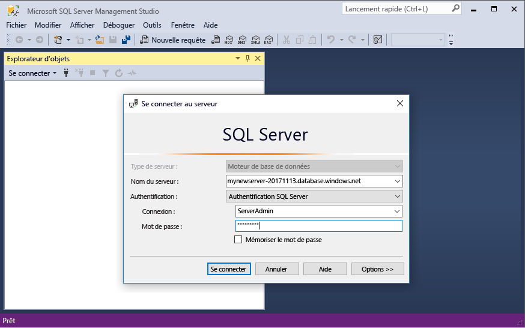
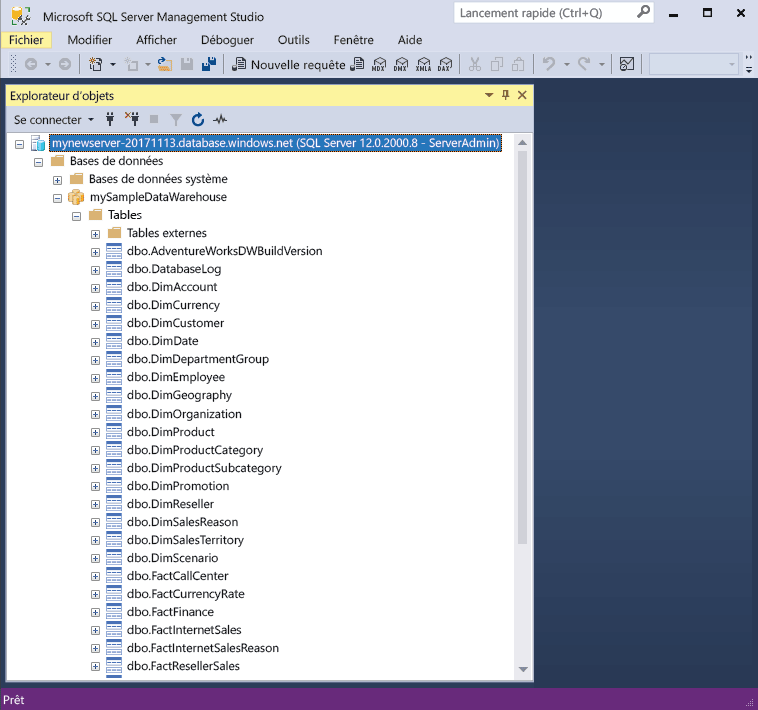

# <a name="quickstart-scale-compute-in-azure-sql-data-warehouse-using-t-sql"></a>Démarrage rapide : Mettre à l’échelle le calcul dans Azure SQL Data Warehouse avec T-SQL

Mettez à l’échelle le calcul dans Azure SQL Data Warehouse à l’aide de T-SQL et de SQL Server Management Studio (SSMS). [Augmentez le calcul](sql-data-warehouse-manage-compute-overview.md) pour améliorer les performances, ou réduisez-le pour diminuer les coûts. 

Si vous n’avez pas d’abonnement Azure, créez un compte [gratuit](https://azure.microsoft.com/free/) avant de commencer.

## <a name="before-you-begin"></a>Avant de commencer

Téléchargez et installez la dernière version de [SQL Server Management Studio](/sql/ssms/download-sql-server-management-studio-ssms.md) (SSMS).

Cela suppose que vous avez terminé la section [Démarrage rapide : Créer et connecter - portail](create-data-warehouse-portal.md). Comme vous avez terminé la section Démarrage rapide ; Créer et connecter, vous savez comment vous connecter et créer un entrepôt de données nommé **mySampleDataWarehouse**, à l’aide d’une règle de pare-feu permettant à notre client d’accéder au serveur.
 
## <a name="create-a-data-warehouse"></a>Créer un entrepôt de données

Utilisez la section [Démarrage rapide : Créer et connecter – Portail](create-data-warehouse-portal.md) pour créer un entrepôt de données nommé **mySampleDataWarehouse**. Terminez le démarrage rapide pour vérifier que vous disposez d’une règle de pare-feu et que vous pouvez vous connecter à votre entrepôt de données à partir de SQL Server Management Studio.

## <a name="connect-to-the-server-as-server-admin"></a>Se connecter au serveur comme administrateur du serveur

Cette section utilise [SQL Server Management Studio](/sql/ssms/download-sql-server-management-studio-ssms.md) (SSMS) pour établir une connexion à votre serveur Azure SQL.

1. Ouvrez SQL Server Management Studio.

2. Dans la fenêtre **Se connecter au serveur**, entrez les valeurs suivantes :

   | Paramètre       | Valeur suggérée | Description | 
   | ------------ | ------------------ | ------------------------------------------------- | 
   | Type de serveur | Moteur de base de données | Cette valeur est obligatoire |
   | Nom du serveur | Nom complet du serveur | Voici un exemple : **mynewserver-20171113.database.windows.net**. |
   | Authentification | l’authentification SQL Server | L’authentification SQL est le seul type d’authentification configuré dans ce didacticiel. |
   | Connexion | Compte d’administrateur de serveur | Il s’agit du compte que vous avez spécifié lorsque vous avez créé le serveur. |
   | Mot de passe | Mot de passe de votre compte d’administrateur de serveur | Il s’agit du mot de passe que vous avez spécifié lorsque vous avez créé le serveur. |

    

4. Cliquez sur **Connecter**. La fenêtre Explorateur d’objets s’ouvre dans SSMS. 

5. Dans l’Explorateur d’objets, développez **Bases de données**. Ensuite, développez **mySampleDatabase** pour afficher les objets dans votre nouvelle base de données.

     

## <a name="view-service-objective"></a>Afficher l’objectif du service
Le paramètre d’objectif du service indique le nombre d’unités DWU pour l’entrepôt de données. 

Pour afficher les unités DWU actuelles de votre entrepôt de données :

1. Sous la connexion à **mynewserver-20171113.database.windows.net**, développez **Bases de données système**.
2. Cliquez avec le bouton droit sur **Master**, puis sélectionnez **Nouvelle requête**. Une nouvelle fenêtre de requête s’ouvre.
3. Exécutez la requête suivante pour sélectionner dans la vue de gestion dynamique sys.database_service_objectives. 

    ```sql
    SELECT
        db.name [Database]
    ,   ds.edition [Edition]
    ,   ds.service_objective [Service Objective]
    FROM
        sys.database_service_objectives ds
    JOIN
        sys.databases db ON ds.database_id = db.database_id
    WHERE 
        db.name = 'mySampleDataWarehouse'
    ```

4. Les résultats suivants montrent que **mySampleDataWarehouse** a un objectif de service de DW400. 

    


## <a name="scale-compute"></a>Mise à l’échelle des ressources de calcul
Dans SQL Data Warehouse, vous pouvez augmenter ou réduire les ressources de calcul en ajustant les unités Data Warehouse Unit. Le guide [Créer et connecter – Portail](create-data-warehouse-portal.md) a permis de créer **mySampleDataWarehouse** et de l’initialiser avec 400 DWU. Les étapes suivantes ajustent les DWU de **mySampleDataWarehouse**.

Pour modifier les DWU :

1. Cliquez avec le bouton droit sur **Master**, puis sélectionnez **Nouvelle requête**.
2. Utilisez l’instruction T-SQL [ALTER DATABASE](/sql/t-sql/statements/alter-database-azure-sql-database) pour modifier l’objectif du service. Exécutez la requête suivante pour définir l’objectif du service sur DW300. 

```Sql
ALTER DATABASE mySampleDataWarehouse
MODIFY (SERVICE_OBJECTIVE = 'DW300')
;
```

## <a name="check-data-warehouse-state"></a>Vérifiez l’état de l’entrepôt de données

Si un entrepôt de données est suspendu, vous ne pouvez pas vous y connecter avec T-SQL. Pour afficher l’état actuel de l’entrepôt de données, vous pouvez utiliser une cmdlet PowerShell. Pour un exemple, voir [Vérifier l’état de l’entrepôt de données - Powershell](quickstart-scale-compute-powershell.md#check-data-warehouse-state). 

## <a name="check-operation-status"></a>Vérifier l’état de l’opération

Pour retourner des informations sur les diverses opérations de gestion dans votre base de données SQL Data Warehouse, exécutez la requête suivante dans la vue de gestion dynamique [sys.dm_operation_status](/sql/relational-databases/system-dynamic-management-views/sys-dm-operation-status-azure-sql-database). Par exemple, elle retourne l’opération et l’état de l’opération, soit IN_PROGRESS ou COMPLETED.

```sql
SELECT *
FROM
    sys.dm_operation_status
WHERE
    resource_type_desc = 'Database'
AND 
    major_resource_id = 'MySQLDW'
```


## <a name="next-steps"></a>Étapes suivantes
Vous savez maintenant mettre à l’échelle le calcul pour votre entrepôt de données. Pour en savoir plus sur Azure SQL Data Warehouse, continuez avec le didacticiel de chargement des données.

> [!div class="nextstepaction"]
>[Charger des données dans un entrepôt SQL Data Warehouse](load-data-from-azure-blob-storage-using-polybase.md)
