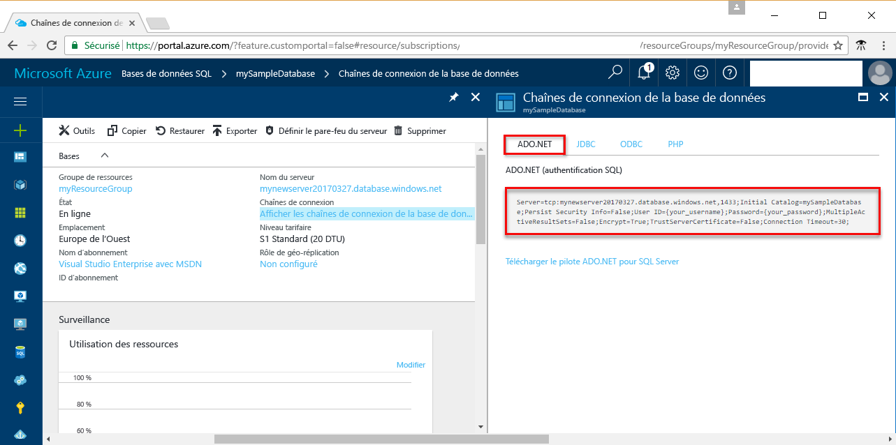

# <a name="use-net-c-with-visual-studio-to-connect-and-query-an-azure-sql-database"></a>Utilisation de NET (C#) avec Visual Studio pour se connecter à une base de données SQL Azure et l’interroger

Ce didacticiel de démarrage rapide indique comment utiliser le [.NET Framework](https://www.microsoft.com/net/) pour créer un programme C# avec Visual Studio qui se connecte à une base de données SQL Azure et utiliser des instructions Transact-SQL pour interroger des données.

## <a name="prerequisites"></a>Prérequis


Pour suivre ce didacticiel de démarrage rapide, vérifiez que vous avez :

[!INCLUDE [prerequisites-create-db](../../includes/sql-database-connect-query-prerequisites-create-db-includes.md)]

- Une [règle de pare-feu au niveau du serveur](sql-database-get-started-portal.md#create-a-server-level-firewall-rule) pour l’adresse IP publique de l’ordinateur que vous utilisez pour ce didacticiel de démarrage rapide.

- Une installation de [Visual Studio Community 2017, Visual Studio Professional 2017 ou Visual Studio Enterprise 2017](https://www.visualstudio.com/downloads/).

## <a name="sql-server-connection-information"></a>Informations de connexion SQL Server

[!INCLUDE [prerequisites-server-connection-info](../../includes/sql-database-connect-query-prerequisites-server-connection-info-includes.md)]

#### <a name="for-adonet"></a>Pour ADO.NET

1. Continuez en cliquant sur **Afficher les chaînes de connexion de la base de données**.

2. Passez en revue la chaîne de connexion **ADO.NET** complète.

    

> [!IMPORTANT]
> Une règle de pare-feu doit être en place pour l’adresse IP publique de l’ordinateur sur lequel vous effectuez ce didacticiel. Si vous êtes sur un autre ordinateur ou si vous avez une autre adresse IP publique, créez une [règle de pare-feu au niveau du serveur à l’aide du portail Azure](sql-database-get-started-portal.md#create-a-server-level-firewall-rule). 
>
  
## <a name="create-a-new-visual-studio-project"></a>Création d’un nouveau projet Visual Studio

1. Dans Visual Studio, sélectionnez **Fichier**, **Nouveau**, **Projet**. 
2. Dans la boîte de dialogue **Nouveau projet**, développez **Visual C#**.
3. Sélectionnez **Application console** et entrez *sqltest* pour le nom du projet.
4. Cliquez sur **OK** pour créer et ouvrir le nouveau projet dans Visual Studio
4. Dans l’Explorateur de solutions, cliquez avec le bouton droit sur **sqltest**, puis cliquez sur **Gérer les packages NuGet**. 
5. Dans **Parcourir**, recherchez l’élément ```System.Data.SqlClient``` et, une fois trouvé, sélectionnez-le.
6. Sur la page **System.Data.SqlClient**, cliquez sur **Installer**.
7. Une fois l’installation terminée, passez en revue les modifications, puis cliquez sur **OK** pour fermer la fenêtre **Aperçu**. 
8. Si une fenêtre **Acceptation de la licence**, cliquez sur **J’accepte**.

## <a name="insert-code-to-query-sql-database"></a>Insertion du code pour interroger la base de données SQL
1. Basculez vers (ou ouvrez le cas échéant) **Program.cs**

2. Remplacez le contenu de **Program.cs** par le code suivant et ajoutez les valeurs appropriées pour votre serveur, base de données, utilisateur et mot de passe.

```csharp
using System;
using System.Data.SqlClient;
using System.Text;

namespace sqltest
{
    class Program
    {
        static void Main(string[] args)
        {
            try 
            { 
                SqlConnectionStringBuilder builder = new SqlConnectionStringBuilder();
                builder.DataSource = "your_server.database.windows.net"; 
                builder.UserID = "your_user";            
                builder.Password = "your_password";     
                builder.InitialCatalog = "your_database";

                using (SqlConnection connection = new SqlConnection(builder.ConnectionString))
                {
                    Console.WriteLine("\nQuery data example:");
                    Console.WriteLine("=========================================\n");
                    
                    connection.Open();       
                    StringBuilder sb = new StringBuilder();
                    sb.Append("SELECT TOP 20 pc.Name as CategoryName, p.name as ProductName ");
                    sb.Append("FROM [SalesLT].[ProductCategory] pc ");
                    sb.Append("JOIN [SalesLT].[Product] p ");
                    sb.Append("ON pc.productcategoryid = p.productcategoryid;");
                    String sql = sb.ToString();

                    using (SqlCommand command = new SqlCommand(sql, connection))
                    {
                        using (SqlDataReader reader = command.ExecuteReader())
                        {
                            while (reader.Read())
                            {
                                Console.WriteLine("{0} {1}", reader.GetString(0), reader.GetString(1));
                            }
                        }
                    }                    
                }
            }
            catch (SqlException e)
            {
                Console.WriteLine(e.ToString());
            }
            Console.ReadLine();
        }
    }
}
```

## <a name="run-the-code"></a>Exécuter le code

1. Appuyez sur **F5** pour exécuter l'application.
2. Vérifiez que les 20 premières lignes sont renvoyées, puis fermez la fenêtre d’application.

## <a name="next-steps"></a>Étapes suivantes

- Découvrez comment [connecter et interroger une base de données SQL Azure à l’aide de .NET Core](sql-database-connect-query-dotnet-core.md) sur Windows/Linux/macOS.  
- En savoir plus sur la [prise en main de .NET Core sur Windows/Linux/macOS à l’aide de la ligne de commande](/dotnet/core/tutorials/using-with-xplat-cli).
- Découvrez comment [concevoir votre première base de données SQL Azure à l’aide de SSMS](sql-database-design-first-database.md) ou [concevoir votre première base de données SQL Azure à l’aide de .NET](sql-database-design-first-database-csharp.md).
- Pour plus d’informations sur .NET, consultez la [documentation .NET](https://docs.microsoft.com/dotnet/).
- [Exemple de logique de nouvelle tentative : Connexion résiliente à SQL avec ADO.NET][step-4-connect-resiliently-to-sql-with-ado-net-a78n]


<!-- Link references. -->

[step-4-connect-resiliently-to-sql-with-ado-net-a78n]: https://docs.microsoft.com/sql/connect/ado-net/step-4-connect-resiliently-to-sql-with-ado-net

