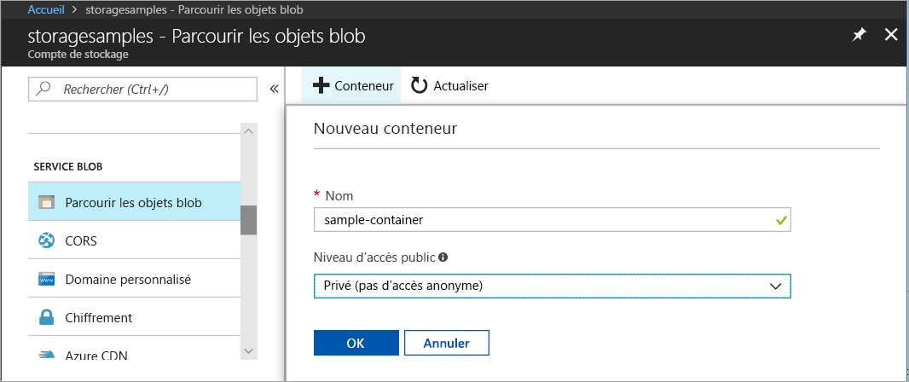
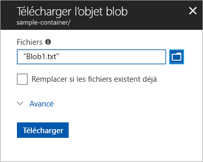
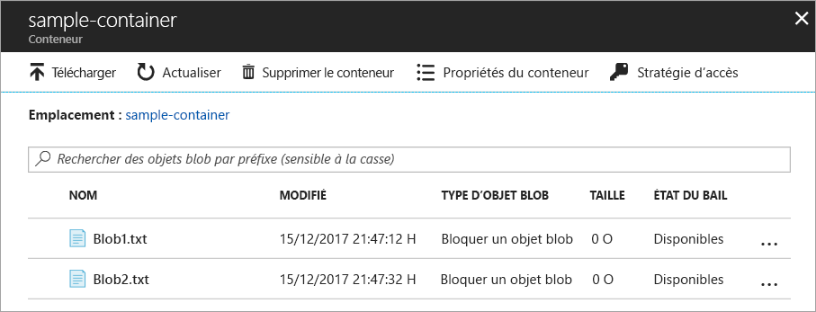
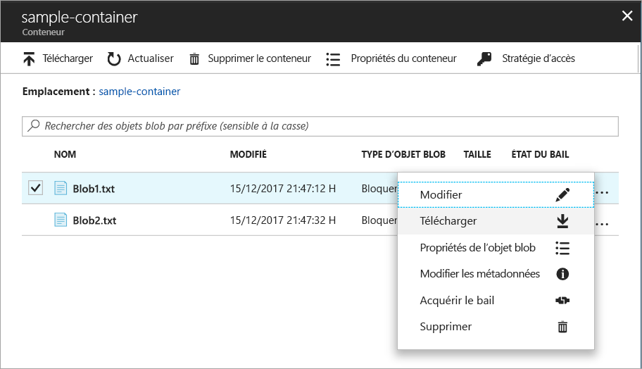
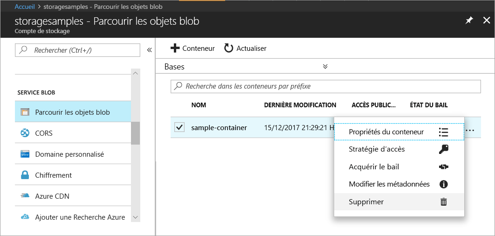

# Démarrage rapide : Charger, télécharger et répertorier des objets blob à l’aide du portail Azure

Dans ce démarrage rapide, vous apprenez à utiliser le [portail Azure](https://portal.azure.com/) pour créer un conteneur dans le stockage Azure, ainsi que pour charger et télécharger des objets blob de blocs dans ce conteneur.

## Prérequis

Si vous n’avez pas d’abonnement Azure, créez un [compte gratuit](https://azure.microsoft.com/free/?WT.mc_id=A261C142F) avant de commencer.

[!INCLUDE [storage-quickstart-tutorial-create-account-portal](../../../includes/storage-quickstart-tutorial-create-account-portal.md)]

## Créez un conteneur.

Pour créer un conteneur dans le portail Azure, procédez comme suit :

1. Accédez à votre nouveau compte de stockage dans le portail Azure.
2. Dans le menu de gauche du compte de stockage, faites défiler jusqu’à la section **Service BLOB**, puis sélectionnez **Parcourir les objets blob**.
3. Cliquez sur le bouton **Ajouter un conteneur**.
4. Entrez un nom pour votre nouveau conteneur. Le nom du conteneur doit être en minuscules, commencer par une lettre ou un chiffre, et peut comporter uniquement des lettres, des chiffres et des tirets (-). Pour plus d’informations sur les noms des conteneurs et des objets blob, consultez [Affectation de noms et références aux conteneurs, objets blob et métadonnées](https://docs.microsoft.com/rest/api/storageservices/naming-and-referencing-containers--blobs--and-metadata).
5. Définissez le niveau d’accès public sur le conteneur. Le niveau par défaut est **Private (no anonymous access)** (Privé (aucun accès anonyme)).
6. Cliquez sur **OK** pour créer le conteneur.

    

## Charger un objet blob de blocs

Les objets blob de blocs sont constitués de blocs de données assemblés pour former un objet blob. La plupart des scénarios utilisant le stockage Blob se servent d’objets blob de blocs. Les objets blob de blocs sont idéaux pour le stockage des données texte et binaires dans le cloud, telles que des fichiers, des images et des vidéos. Ce démarrage rapide montre comment utiliser des objets blob de blocs. 

Pour charger un objet blob de blocs dans votre nouveau conteneur dans le portail Azure, procédez comme suit :

1. Dans le portail Azure, accédez au conteneur que vous avez créé dans la section précédente.
2. Sélectionnez le conteneur pour afficher une liste des objets blob qu’il contient. Dans ce cas, étant donné que vous avez créé un conteneur, il ne contient pas encore d’objets blob.
3. Cliquez sur le bouton **Télécharger** pour charger un objet blob dans le conteneur.
4. Naviguez dans votre système de fichiers local pour rechercher un fichier à charger en tant qu’objet blob de blocs, puis cliquez sur **Télécharger**.
     
    

5. Chargez autant d’objets blob que vous le souhaitez en suivant cette méthode. Vous verrez que les nouveaux objets blob sont maintenant répertoriés dans le conteneur.

    

## Télécharger un objet blob de blocs

Vous pouvez télécharger un objet blob de blocs à afficher dans le navigateur ou à enregistrer dans votre système de fichiers local. Pour télécharger un objet blob de blocs, procédez comme suit :

1. Accédez à la liste d’objets blob que vous avez chargée dans la section précédente. 
2. Sélectionnez l’objet blob à télécharger.
3. Faites un clic droit sur le bouton **Plus** (**...**), puis sélectionnez **Télécharger**. 

## Supprimer des ressources

Pour supprimer les ressources que vous avez créées dans ce démarrage rapide, vous pouvez simplement supprimer le conteneur. Tous les objets blob dans le conteneur seront également supprimés.

Pour supprimer le conteneur :

1. Dans le portail Azure, accédez à la liste des conteneurs dans votre compte de stockage.
2. Sélectionnez le conteneur à supprimer.
3. Faites un clic droit sur le bouton **Plus** (**...**), puis sélectionnez **Supprimer**.
4. Confirmez que vous souhaitez supprimer le conteneur.

       

## Étapes suivantes

Dans ce guide de démarrage rapide, vous avez appris à transférer des fichiers entre un disque local et Stockage Blob Azure avec .NET. Pour en savoir plus sur l’utilisation de Stockage Blob, consultez le Guide pratique de Stockage Blob.

> [!div class="nextstepaction"]
> [Guide pratique des opérations Stockage Blob](storage-dotnet-how-to-use-blobs.md)

