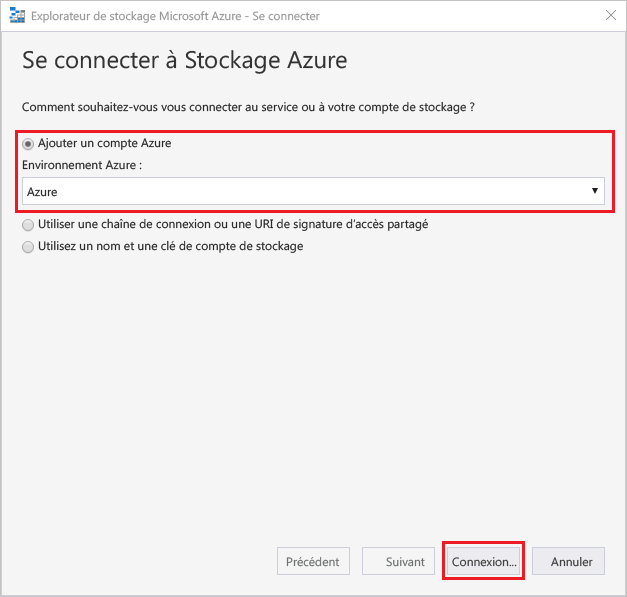
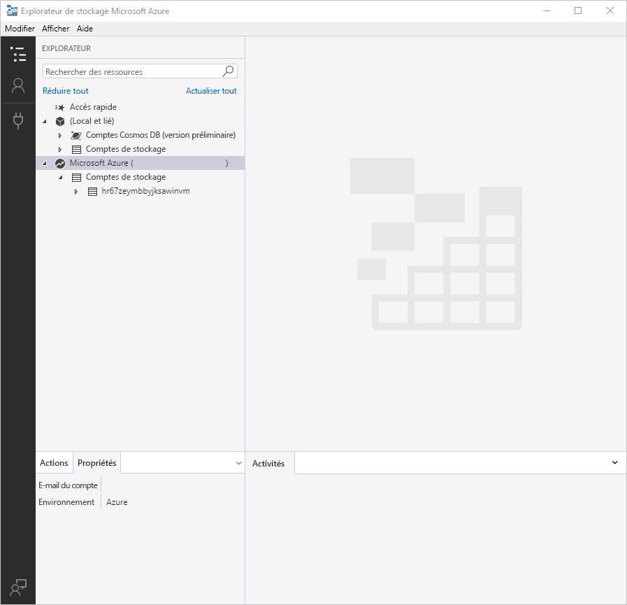
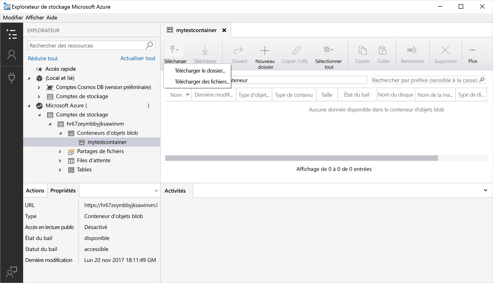
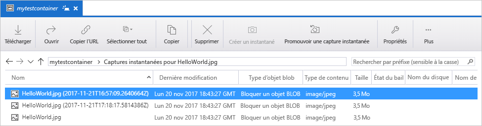
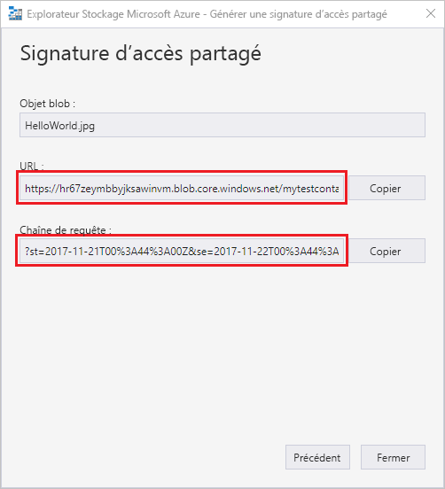

# Démarrage rapide : Charger, télécharger et répertorier des objets blob à l’aide de Storage Explorer

L’[Explorateur Stockage Azure](https://azure.microsoft.com/features/storage-explorer/) est une interface utilisateur multiplateforme dédiée à la gestion du contenu de vos comptes de stockage. Ce guide décrit en détail l’utilisation de l’Explorateur Stockage Azure pour transférer des fichiers entre un disque local et le stockage Blob Azure.

Si vous n’avez pas d’abonnement Azure, créez un [compte gratuit](https://azure.microsoft.com/free/?WT.mc_id=A261C142F) avant de commencer.

Pour exécuter ce guide de démarrage rapide, vous devez posséder une instance installée de l’Explorateur Stockage Azure. Si vous devez l’installer, accédez à [Explorateur Stockage Azure](https://azure.microsoft.com/features/storage-explorer/) afin de le télécharger pour Windows, Macintosh ou Linux.

[!INCLUDE [storage-quickstart-tutorial-create-account-portal](../../../includes/storage-quickstart-tutorial-create-account-portal.md)]

## Se connecter à l’Explorateur Stockage

Au premier lancement, la fenêtre **Explorateur Stockage Microsoft Azure - Se connecter** s’affiche. L’Explorateur Stockage offre de nombreuses façons de se connecter à des comptes de stockage. Le tableau suivant répertorie les différentes méthodes de connexion :

|Tâche|Objectif|
|---|---|
|Ajouter un compte Azure | Vous redirige vers votre page de connexion aux organisations afin de vous authentifier sur Azure. |
|Utiliser un URI de chaîne de connexion ou de signature d’accès partagé | Peut être utilisé pour accéder directement à un conteneur ou un compte de stockage avec un jeton SAP ou une chaîne de connexion partagée. |
|Utiliser le nom et la clé d’un compte de stockage| Utilisez le nom et la clé et de votre compte de stockage pour vous connecter à Stockage Azure.|

Sélectionnez **Ajouter un compte Azure**, puis cliquez sur **Connexion..**. Suivez les instructions de connexion à votre compte Azure qui s’affichent à l’écran.

Une fois que la connexion est établie, l’Explorateur Stockage Azure se charge avec l’onglet **Explorateur** affiché. Cette vue vous donne accès à l’ensemble de vos comptes Stockage Azure, ainsi qu’au stockage local configuré via les comptes de l’[émulateur de stockage Azure](../common/storage-use-emulator.md?toc=%2fazure%2fstorage%2fblobs%2ftoc.json), [Cosmos DB](../../cosmos-db/storage-explorer.md?toc=%2fazure%2fstorage%2fblobs%2ftoc.json) ou les environnements [Azure Stack](../../azure-stack/user/azure-stack-storage-connect-se.md?toc=%2fazure%2fstorage%2fblobs%2ftoc.json).

## Créez un conteneur.

Les objets blob sont toujours chargés dans un conteneur. Cela vous permet d’organiser des groupes d’objets blob comme vous organisez vos fichiers dans des dossiers sur votre ordinateur.

Pour créer un conteneur, développez le compte de stockage créé lors de l’étape précédente. Sélectionnez **Conteneurs d’objets blob**, cliquez avec le bouton droit, puis sélectionnez **Créer un conteneur d’objets blob**. Entrez le nom de votre conteneur d’objets blob. Consultez la section [Créer le conteneur et définir les autorisations](storage-quickstart-blobs-dotnet.md#create-the-container-and-set-permissions) pour obtenir la liste des règles et restrictions applicables aux noms de conteneurs d’objets blob. Lorsque vous avez terminé, appuyez sur **Entrée** pour créer le conteneur d’objets blob. Une fois le conteneur créé, il apparaît sous le dossier **Conteneurs d’objets blob** correspondant au compte de stockage sélectionné.

## Charger des objets blob dans le conteneur

Le Stockage Blob prend en charge les objets blob de blocs, d’ajout et de pages. Les fichiers de disque dur virtuel utilisés pour appuyer les machines virtuelles IaaS sont des objets blob de pages. Les objets blob d’ajout sont utilisés pour la journalisation, par exemple, quand vous voulez écrire dans un fichier et continuer à ajouter d’autres informations. La plupart des fichiers stockés dans Stockage Blob sont des objets blob de blocs.

Dans le ruban du conteneur, sélectionnez **Télécharger**. Ce faisant, vous avez la possibilité de télécharger un dossier ou un fichier.

Choisissez les fichiers ou le dossier à télécharger. Sélectionnez le **type d’objet blob**. Les choix acceptables sont **Ajout**, **Page** ou **Bloc**.

Si vous téléchargez un fichier .vhd or .vhdx, sélectionnez **Charger les fichiers .vhd/.vhdx en tant qu'objets blob de pages (recommandé)**.

Dans le champ **Charger dans le dossier** (facultatif), sélectionnez un nom de dossier dans lequel stocker les fichiers ou de sous-dossiers, sous le conteneur. Si aucun dossier n’est sélectionné, les fichiers sont chargés automatiquement dans le conteneur.

Lorsque vous sélectionnez **OK**, les fichiers sélectionnés sont mis en file d’attente de téléchargement ; ils sont traités un à un. Une fois le téléchargement terminé, les résultats s’affichent dans la fenêtre **Activités**.

## Afficher les objets blob d’un conteneur

Dans l’application **Explorateur Stockage Azure**, sélectionnez un conteneur sous un compte de stockage. Le volet principal affiche une liste des objets blobs hébergés dans le conteneur sélectionné.

## Télécharger des objets blob

Pour télécharger les objets blob à l’aide de l’**Explorateur Stockage Azure**, avec un objet blob sélectionné, sélectionnez **Télécharger** dans le ruban. La boîte de dialogue qui s’ouvre vous permet de saisir un nom de fichier. Sélectionnez **Enregistrer** pour démarrer le téléchargement d’un objet blob sur l’emplacement local.

## Gérer les instantanés

L’Explorateur Stockage Azure vous permet de prendre et de gérer des [instantanés](storage-blob-snapshots.md) de vos objets blob. Pour prendre un instantané d’un objet blob, cliquez avec le bouton droit sur l’objet blob, puis sélectionnez **Make Snapshot** (Prendre un instantané). Pour afficher les instantanés d’un objet blob, cliquez avec le bouton droit sur l’objet blob, puis sélectionnez **Manage Snapshots** (Gérer les instantanés). Une liste des instantanés associés à l’objet blob s’affiche dans l’onglet actuel.

## Gérer les stratégies d’accès

L’Explorateur de stockage vous permet de gérer les stratégies d’accès pour les conteneurs au sein de cette interface utilisateur. Il existe 2 types de stratégies d’accès sécurisées, au niveau du service et au niveau du compte. Une stratégie d’accès de niveau compte cible le compte de stockage ; elle peut s’appliquer à plusieurs services et ressources. Une stratégie d’accès de niveau service est définie sur une ressource hébergée sous un service spécifique. Pour générer une stratégie d’accès de niveau service, cliquez avec le bouton droit sur un conteneur, puis sélectionnez **Gérer les stratégies d’accès...**. Pour générer une stratégie d’accès de niveau compte, cliquez avec le bouton droit sur le compte de stockage.

Sélectionnez **Ajouter** pour ajouter une stratégie d’accès et définir les autorisations associées. Lorsque vous avez terminé, sélectionnez **Enregistrer** pour enregistrer la stratégie d’accès. La stratégie est désormais disponible pour la configuration des signatures d’accès partagé.

## Utiliser les signatures d’accès partagé

Les signatures d’accès partagé sont à récupérer via l’Explorateur Stockage. Cliquez sur un compte de stockage, sur un conteneur ou sur un objet blob, puis sélectionnez **Obtenir une signature d’accès partagé...**. Sélectionnez l’heure de départ et d’expiration, ainsi que les autorisations pour l’URL de la stratégie d’accès partagé, puis sélectionnez **Créer**. L’URL complète avec la chaîne de requête, ainsi que la chaîne de requête individuellement sont fournies ; ces valeurs peuvent être copiées à partir de l’écran suivant.

## Étapes suivantes

Dans ce guide de démarrage rapide, vous avez appris à transférer des fichiers entre un disque local et le stockage Blob Azure à l’aide de l’**Explorateur Stockage Azure**. Pour en savoir plus sur l’utilisation de Stockage Blob, consultez le Guide pratique de Stockage Blob.

> [!div class="nextstepaction"]
> [Guide pratique des opérations Stockage Blob](storage-how-to-use-blobs-powershell.md)
