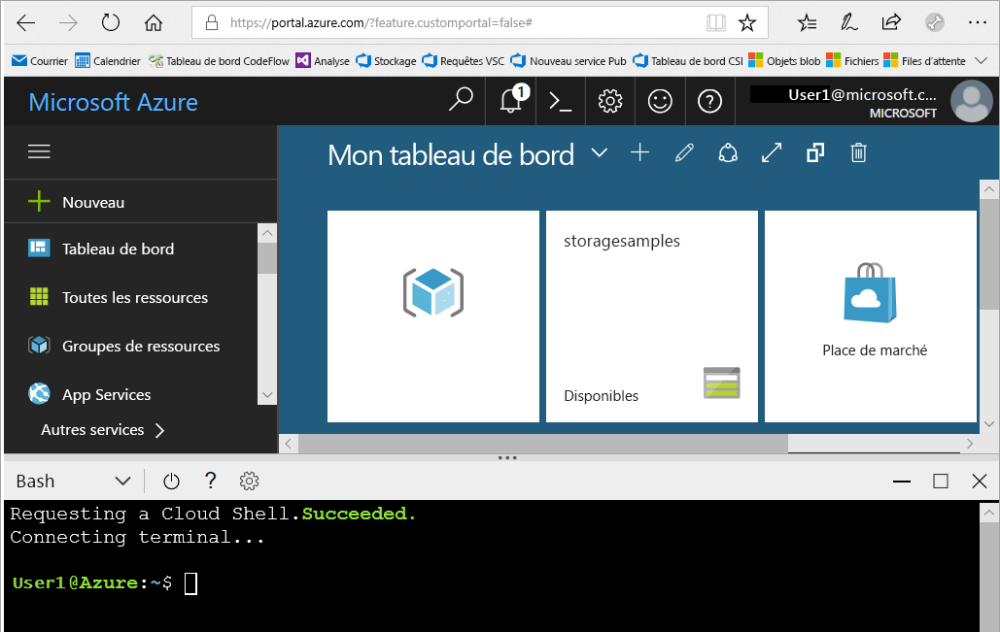
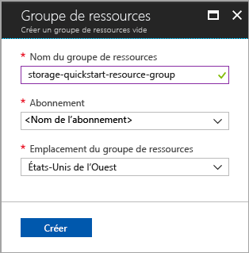

# <a name="create-a-storage-account"></a>Créez un compte de stockage.

Un compte de stockage Azure fournit un espace de noms unique dans le cloud pour stocker vos objets de données dans le stockage Azure et y accéder. Un compte de stockage contient des objets blob, des fichiers, des files d’attente, des tables et des disques que vous créez sous ce compte. 

Pour démarrer avec le stockage Azure, vous devez d’abord créer un compte de stockage. Vous pouvez créer un compte de stockage Azure avec le [portail Azure](https://portal.azure.com/), [Azure PowerShell](https://docs.microsoft.com/powershell/azure/overview) ou [Azure CLI](https://docs.microsoft.com/cli/azure/overview?view=azure-cli-latest). Ce démarrage rapide montre comment utiliser chacune de ces options pour créer votre compte de stockage. 


## <a name="prerequisites"></a>Prérequis

Si vous n’avez pas d’abonnement Azure, créez un [compte gratuit](https://azure.microsoft.com/free/) avant de commencer.

# <a name="portaltabportal"></a>[Portail](#tab/portal)

Aucune.

# <a name="powershelltabpowershell"></a>[PowerShell](#tab/powershell)

Ce démarrage rapide requiert le module Azure PowerShell version 3.6 ou ultérieure. Exécutez `Get-Module -ListAvailable AzureRM` pour rechercher votre version actuelle. Si vous devez installer ou mettre à niveau, consultez [Installer le module Azure PowerShell](/powershell/azure/install-azurerm-ps).

# <a name="azure-clitabazure-cli"></a>[interface de ligne de commande Azure](#tab/azure-cli)

Vous pouvez vous connecter à Azure et exécuter des commandes Azure CLI de l’une des deux façons :

- Vous pouvez exécuter des commandes CLI à partir du portail Azure, dans Azure Cloud Shell. 
- Vous pouvez installer la CLI et exécuter des commandes CLI localement.  

### <a name="use-azure-cloud-shell"></a>Utiliser Azure Cloud Shell

Azure Cloud Shell est un interpréteur de commandes Bash gratuit, que vous pouvez exécuter directement dans le portail Azure. L’interface Azure CLI est préinstallée et configurée pour être utilisée avec votre compte. Cliquez sur le bouton **Cloud Shell** du menu situé dans l’angle supérieur droit de la fenêtre du portail Azure :

[](https://portal.azure.com)

Ce bouton lance un interpréteur de commandes interactif que vous pouvez utiliser pour exécuter les étapes de ce démarrage rapide :

[](https://portal.azure.com)

### <a name="install-the-cli-locally"></a>Installer la CLI localement

Vous pouvez également installer et utiliser Azure CLI localement. Ce guide de démarrage rapide nécessite que vous exécutiez Azure CLI version 2.0.4 ou ultérieure. Exécutez `az --version` pour trouver la version. Si vous devez installer ou mettre à niveau, consultez [Installation d’Azure CLI 2.0](/cli/azure/install-azure-cli). 

---

## <a name="log-in-to-azure"></a>Connexion à Azure

# <a name="portaltabportal"></a>[Portail](#tab/portal)

Connectez-vous au [portail Azure](https://portal.azure.com).

# <a name="powershelltabpowershell"></a>[PowerShell](#tab/powershell)

Connectez-vous à votre abonnement Azure avec la commande `Login-AzureRmAccount` et suivez les instructions à l’écran pour l’authentification.

```powershell
Login-AzureRmAccount
```

# <a name="azure-clitabazure-cli"></a>[interface de ligne de commande Azure](#tab/azure-cli)

Pour lancer Azure Cloud Shell, connectez-vous au [portail Azure](https://portal.azure.com).

Pour vous connecter à votre installation locale de la CLI, exécutez la commande de connexion :

```cli
az login
```

---

## <a name="create-a-resource-group"></a>Créer un groupe de ressources

Un groupe de ressources Azure est un conteneur logique dans lequel les ressources Azure sont déployées et gérées. Pour plus d’informations sur les groupes de ressources, consultez [Vue d’ensemble d’Azure Resource Manager](../../azure-resource-manager/resource-group-overview.md).

# <a name="portaltabportal"></a>[Portail](#tab/portal)

Pour créer un groupe de ressources dans le portail Azure, procédez comme suit :

1. Sur le portail Azure, développez le menu de gauche pour ouvrir le menu des services, et sélectionnez **Groupes de ressources**.
2. Cliquez sur le bouton **Ajouter** pour ajouter un nouveau groupe de ressources.
3. Entrez un nom pour le nouveau groupe de ressources.
4. Sélectionnez l’abonnement dans lequel vous créez le nouveau groupe de ressources.
5. Choisissez l’emplacement du groupe de ressources.
6. Cliquez sur le bouton **Créer** .  



# <a name="powershelltabpowershell"></a>[PowerShell](#tab/powershell)

Pour créer un groupe de ressources avec PowerShell, utilisez la commande [New-AzureRmResourceGroup](/powershell/module/azurerm.resources/new-azurermresourcegroup) : 

```powershell
# put resource group in a variable so you can use the same group name going forward,
# without hardcoding it repeatedly
$resourceGroup = "storage-quickstart-resource-group"
New-AzureRmResourceGroup -Name $resourceGroup -Location $location 
```

Si vous ne savez pas quelle région spécifier pour le paramètre `-Location`, vous pouvez récupérer la liste des régions prises en charge pour votre abonnement avec la commande [Get-AzureRmLocation](/powershell/module/azurerm.resources/get-azurermlocation) :

```powershell
Get-AzureRmLocation | select Location 
$location = "westus"
```

# <a name="azure-clitabazure-cli"></a>[interface de ligne de commande Azure](#tab/azure-cli)

Pour créer un groupe de ressources avec Azure CLI, utilisez la commande [az group create](/cli/azure/group#az_group_create). 

```azurecli-interactive
az group create \
    --name storage-quickstart-resource-group \
    --location westus
```

Si vous ne savez pas quelle région spécifier pour le paramètre `--location`, vous pouvez récupérer la liste des régions prises en charge pour votre abonnement avec la commande [az account list-locations](/cli/azure/account#az_account_list).

```azurecli-interactive
az account list-locations \
    --query "[].{Region:name}" \
    --out table
```

---

## <a name="create-a-general-purpose-storage-account"></a>Créer un compte de stockage à usage général

Un compte de stockage à usage général fournit un accès à tous les services de Stockage Azure : objets blob, fichiers, files d’attente et tables. Un compte de stockage à usage général peut être créé dans un niveau premium ou standard. Les exemples de cet article montrent comment créer un compte de stockage à usage général dans le niveau standard (valeur par défaut).

Le stockage Azure propose deux types de compte de stockage à usage général :

- Les comptes de stockage à usage général v2 
- Les comptes de stockage à usage général v1 

> [!NOTE]
> Il est recommandé de créer des comptes de stockage en tant que **comptes à usage général v2** afin de tirer parti des nouvelles fonctionnalités disponibles pour ces comptes.  

Pour plus d’informations sur les types de compte de stockage, consultez l’article [Options de compte de stockage Azure](storage-account-options.md).

Gardez les règles suivantes à l’esprit lorsque vous nommez votre compte de stockage :

- Les noms des comptes de stockage doivent comporter entre 3 et 24 caractères, uniquement des lettres minuscules et des chiffres.
- Le nom de votre compte de stockage doit être unique dans Azure. Deux comptes de stockage ne peuvent avoir le même nom.

# <a name="portaltabportal"></a>[Portail](#tab/portal)

Pour créer un compte de stockage à usage général v2 dans le portail Azure, procédez comme suit :

1. Sur le portail Azure, développez le menu de gauche pour ouvrir le menu des services, et sélectionnez **Tous les services**. Faites défiler jusqu’à **Stockage**, puis sélectionnez **Comptes de stockage**. Sur la fenêtre **Comptes de stockage**, sélectionnez **Ajouter**.
2. Entrez un nom pour votre compte de stockage.
3. Définissez le champ **Type de compte** sur **StorageV2 (usage général v2)**.
4. Laissez le champ **Réplication** défini sur **Stockage localement redondant (LRS)**. Vous pouvez également sélectionner **Stockage redondant dans une zone (préversion ZRS)**, **Stockage géo-redondant (GRS)** ou **Stockage géo-redondant avec accès en lecture (RA-GRS)**.
5. Laissez ces champs définis sur leurs valeurs par défaut : **Modèle de déploiement**, **Performances** et **Transfert sécurisé requis**.
6. Choisissez l’abonnement dans lequel vous souhaitez créer le compte de stockage.
7. Dans la section **Groupe de ressources**, sélectionnez **Use existing** (Utiliser l’existant), puis choisissez le groupe de ressources que vous avez créé dans la section précédente.
8. Choisissez l’emplacement de votre nouveau compte de stockage.
9. Cliquez sur **Créer** pour créer le compte de stockage.      


# <a name="powershelltabpowershell"></a>[PowerShell](#tab/powershell)

Pour créer un compte de stockage à usage général v2 à partir de PowerShell avec l’option Stockage localement redondant (LRS), utilisez la commande [New-AzureRmStorageAccount](/powershell/module/azurerm.storage/New-AzureRmStorageAccount) : 

```powershell
New-AzureRmStorageAccount -ResourceGroupName $resourceGroup `
  -Name "storagequickstart" `
  -Location $location `
  -SkuName Standard_LRS `
  -Kind StorageV2 
```

Pour créer un compte de stockage à usage général v2 avec l’option Stockage redondant dans une zone (préversion ZRS), Stockage géo-redondant (GRS) ou Stockage géo-redondant avec accès en lecture (RA-GRS), remplacez la valeur souhaitée dans le tableau ci-dessous pour le paramètre **SkuName**. 

|Option de réplication  |Paramètre SkuName  |
|---------|---------|
|Stockage localement redondant (LRS)     |Standard_LRS         |
|Stockage redondant dans une zone (ZRS)     |Standard_ZRS         |
|Stockage géo-redondant (GRS)     |Standard_GRS         |
|Stockage géo-redondant avec accès en lecture (RA-GRS)     |Standard_RAGRS         |

# <a name="azure-clitabazure-cli"></a>[interface de ligne de commande Azure](#tab/azure-cli)

Pour créer un compte de stockage à usage général v2 à partir d’Azure CLI avec l’option Stockage localement redondant, utilisez la commande [az storage account create](/cli/azure/storage/account#az_storage_account_create).

```azurecli-interactive
az storage account create \
    --name storagequickstart \
    --resource-group storage-quickstart-resource-group \
    --location westus \
    --sku Standard_LRS \
    --kind StorageV2
```

Pour créer un compte de stockage à usage général v2 avec l’option Stockage redondant dans une zone (préversion ZRS), Stockage géo-redondant (GRS) ou Stockage géo-redondant avec accès en lecture (RA-GRS), remplacez la valeur souhaitée dans le tableau ci-dessous pour le paramètre **sku**. 

|Option de réplication  |Paramètre sku  |
|---------|---------|
|Stockage localement redondant (LRS)     |Standard_LRS         |
|Stockage redondant dans une zone (ZRS)     |Standard_ZRS         |
|Stockage géo-redondant (GRS)     |Standard_GRS         |
|Stockage géo-redondant avec accès en lecture (RA-GRS)     |Standard_RAGRS         |

---

> [!NOTE]
> L’option [Stockage redondant dans une zone](https://azure.microsoft.com/blog/announcing-public-preview-of-azure-zone-redundant-storage/preview/) est actuellement en préversion et disponible uniquement dans les zones suivantes :
>    - Est des États-Unis 2
>    - Centre des États-Unis
>    - France-Centre (cette zone est actuellement en préversion. Consultez [Préversion de Microsoft Azure avec des zones de disponibilité Azure désormais ouvertes en France](https://azure.microsoft.com/blog/microsoft-azure-preview-with-azure-availability-zones-now-open-in-france) pour demander l’accès.)
    
Pour plus d’informations sur les différentes options de réplication disponibles, consultez l’article [Storage replication options](storage-redundancy.md) (Options de réplication de stockage).

## <a name="clean-up-resources"></a>Supprimer des ressources

Si vous souhaitez supprimer les ressources créées par ce démarrage rapide, vous pouvez simplement supprimer le groupe de ressources. La suppression du groupe de ressources efface également le compte de stockage associé et d’autres ressources liées au groupe de ressources.

# <a name="portaltabportal"></a>[Portail](#tab/portal)

Pour supprimer un groupe de ressources dans le portail Azure :

1. Sur le portail Azure, développez le menu de gauche pour ouvrir le menu des services, et sélectionnez **Groupes de ressources** pour afficher la liste de vos groupes de ressources.
2. Recherchez le groupe de ressources à supprimer, puis faites un clic droit sur le bouton **Plus** (**...**) se trouvant à droite de la liste.
3. Sélectionnez **Supprimer le groupe de ressources** et confirmez.

# <a name="powershelltabpowershell"></a>[PowerShell](#tab/powershell)

Pour supprimer le groupe de ressources et les ressources associées, y compris le nouveau compte de stockage, utilisez la commande [Remove-AzureRmResourceGroup](/powershell/module/azurerm.resources/remove-azurermresourcegroup) : 

```powershell
Remove-AzureRmResourceGroup -Name $resourceGroup
```

# <a name="azure-clitabazure-cli"></a>[interface de ligne de commande Azure](#tab/azure-cli)

Pour supprimer le groupe de ressources et les ressources associées, y compris le nouveau compte de stockage, utilisez la commande [az group delete](/cli/azure/group#az_group_delete).

```azurecli-interactive
az group delete --name myResourceGroup
```

---

## <a name="next-steps"></a>Étapes suivantes

Dans ce guide de démarrage rapide, vous avez créé un compte de stockage standard à usage général. Pour savoir comment charger et télécharger des objets blob vers/à partir de votre compte de stockage, passez au démarrage rapide du stockage Blob.

# <a name="portaltabportal"></a>[Portail](#tab/portal)

> [!div class="nextstepaction"]
> [Transférer des objets vers/à partir du stockage Blob Azure à l’aide du portail Azure](../blobs/storage-quickstart-blobs-portal.md)

# <a name="powershelltabpowershell"></a>[PowerShell](#tab/powershell)

> [!div class="nextstepaction"]
> [Transférer des objets à destination/à partir du stockage Blob Azure à l’aide de PowerShell](../blobs/storage-quickstart-blobs-powershell.md)

# <a name="azure-clitabazure-cli"></a>[interface de ligne de commande Azure](#tab/azure-cli)

> [!div class="nextstepaction"]
> [Transférer des objets à destination/à partir du stockage Blob Azure à l’aide d’Azure CLI](../blobs/storage-quickstart-blobs-cli.md)

---
