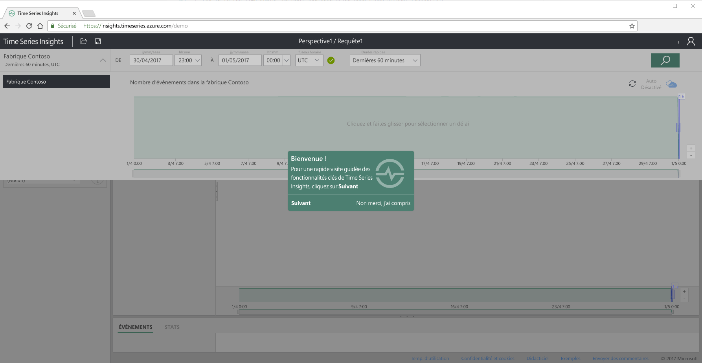
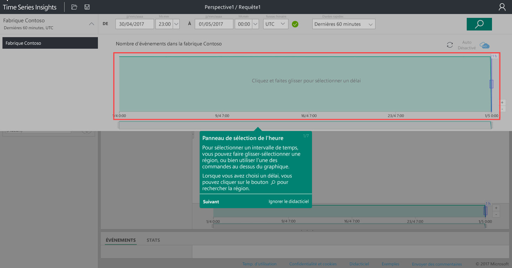
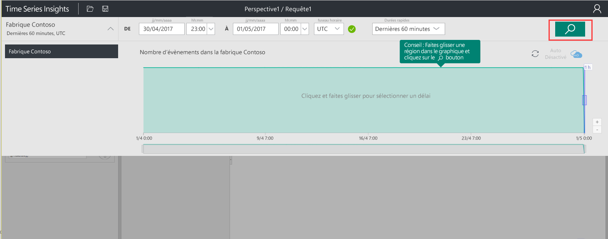
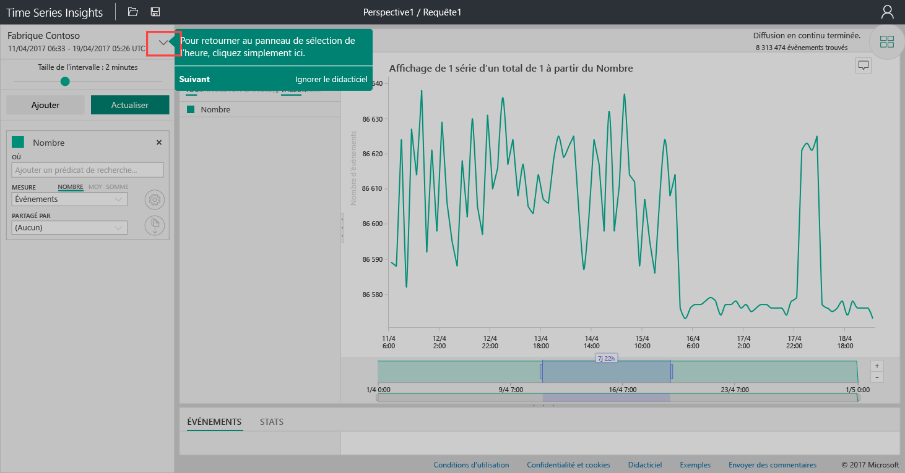
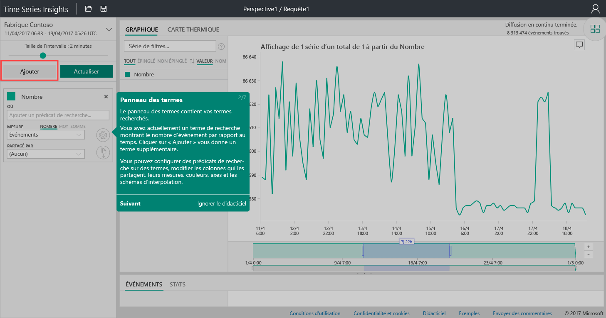
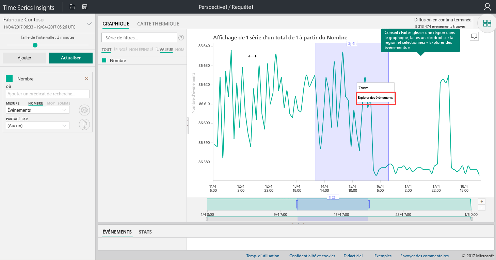
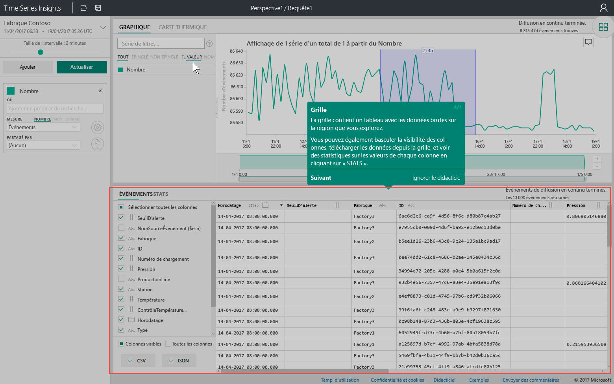
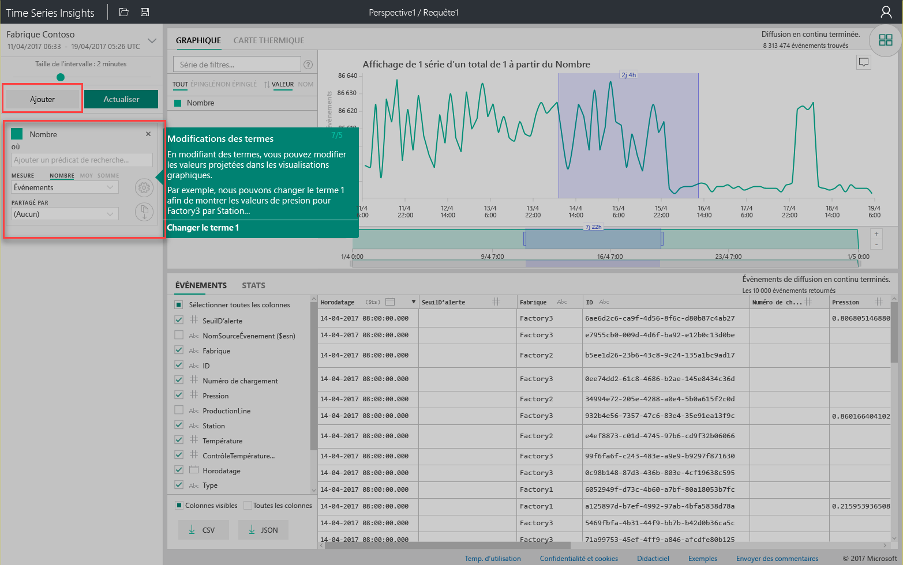
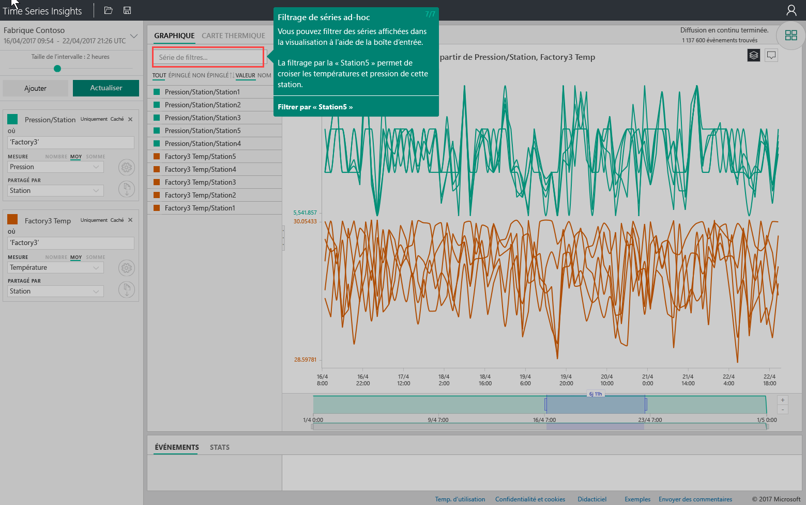

# Démarrage rapide : Explorer Azure Time Series Insights
Ce démarrage rapide montre comment démarrer avec l’Explorateur Time Series Insights dans un environnement de démonstration gratuit. Vous allez découvrir comment utiliser votre navigateur web pour visualiser de grands volumes de données IoT avant de faire le tour des fonctionnalités clés de l’Explorateur Time Series Insights. 

Azure Time Series Insights est un service entièrement managé d’analyse, de stockage et de visualisation qui simplifie la découverte et l’analyse simultanées de milliards d’événements IoT. Il vous offre une vue globale de vos données, ce qui vous permet de valider rapidement votre solution IoT et d’éviter les temps d’arrêt coûteux sur les appareils stratégiques en vous aidant à découvrir les tendances cachées, à identifier les anomalies et à effectuer des analyses de la cause première en temps presque réel.  Si vous générez une application qui nécessite de stocker ou d’interroger des données de série chronologique, vous pouvez développer à l’aide des API REST Time Series Insights.

Si vous n’avez pas d’abonnement Azure, créez un [compte Azure gratuit](https://azure.microsoft.com/free/?ref=microsoft.com&utm_source=microsoft.com&utm_medium=docs&utm_campaign=visualstudio) avant de commencer.

## Découvrir l’Explorateur Time Series Insights dans un environnement de démonstration

1. Dans votre navigateur, accédez à [https://insights.timeseries.azure.com/demo](https://insights.timeseries.azure.com/demo). 

2. Si vous y êtes invité, connectez-vous à l’Explorateur Time Series Insights à l’aide de vos informations d’identification de compte Azure. 
 
3. La page de présentation Time Series Insights s’affiche. Cliquez sur **Suivant** pour commencer la visite guidée.

   

4. Le **Volet de sélection de temps** s’affiche. Utilisez ce volet pour sélectionner un intervalle de temps à visualiser.

   

5. Cliquez et faites glisser dans la région, puis cliquez sur le bouton **Rechercher**.
 
    

   Time Series Insights affiche une visualisation de graphique pour l’intervalle de temps spécifié. Vous pouvez effectuer diverses actions dans le graphique en courbes, comme le filtrage, l’épinglage, le tri et l’empilement. 

   Pour revenir au **volet de sélection de temps**, cliquez sur la flèche vers le bas, comme illustré :

   

6. Cliquez sur **Ajouter** dans le **Volet de temps** pour ajouter un nouveau terme de recherche.

   

7. Dans le graphique, vous pouvez sélectionner une région en cliquant avec le bouton droit de la région et en sélectionnant **Explorer les événements**.
 
   

   Une grille de vos données brutes s’affiche à partir de la région que vous explorez :

   

8. Modifiez vos termes pour modifier les valeurs dans le graphique et ajoutez un autre terme pour effectuer une corrélation croisée des différents types de valeurs :

   

9. Entrez une condition de filtre dans la zone **Filtrer les séries...**  pour le filtrage de séries ad hoc. Pour le démarrage rapide, saisissez **Station5** pour avoir une corrélation croisée de la température et de la pression pour cette station.
 
   

Après avoir terminé le démarrage rapide, vous pouvez tester l’exemple de jeu de données pour créer différentes visualisations. 

### Étapes suivantes
Vous êtes prêt à créer votre propre environnement Time Series Insights :
> [!div class="nextstepaction"]
> [Planifier votre environnement Time Series Insights](time-series-insights-environment-planning.md)
