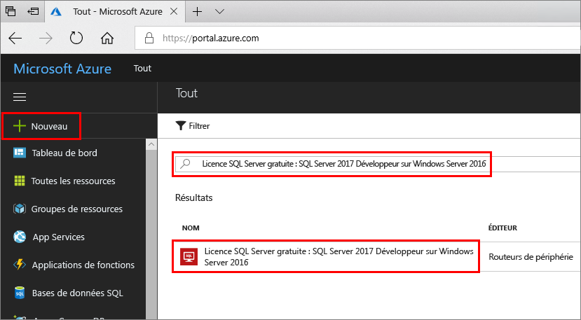
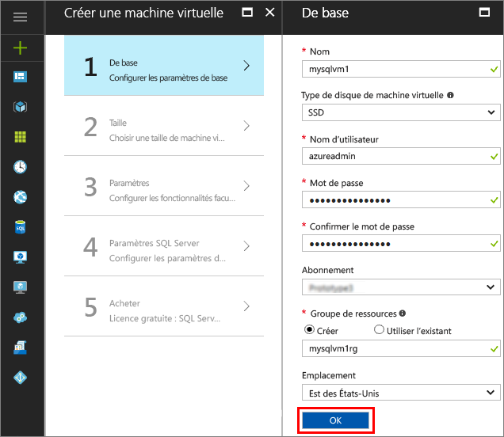
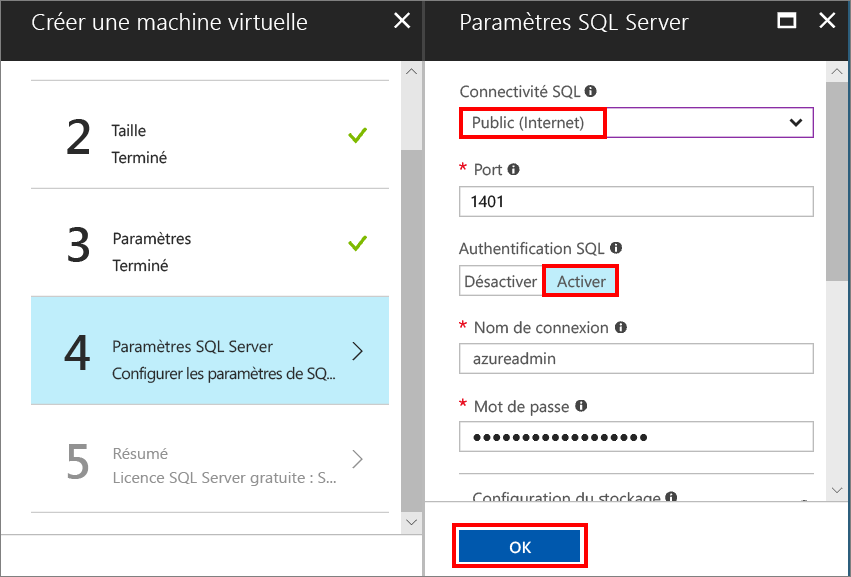
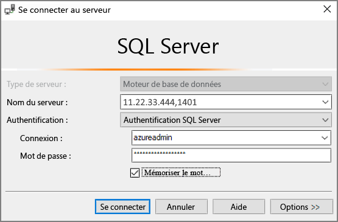

# Démarrage rapide : créer une machine virtuelle Windows SQL Server 2017 dans le portail Azure

> [!div class="op_single_selector"]
> * [Windows](quickstart-sql-vm-create-portal.md)
> * [Linux](../../linux/sql/provision-sql-server-linux-virtual-machine.md)

Ce démarrage rapide décrit les étapes de base de création d’une machine virtuelle SQL Server dans le portail Azure.

> [!TIP]
> Ce démarrage rapide vous présente les étapes de mise en service et de connexion rapide d’une machine virtuelle SQL. Pour plus d’informations sur les autres options de mise en service des machines virtuelles SQL, consultez le [guide de mise en service des machines virtuelles Windows SQL Server dans le portail Azure](virtual-machines-windows-portal-sql-server-provision.md).

> [!TIP]
> Si vous avez des questions sur les machines virtuelles SQL Server, consultez le [Forum aux Questions](virtual-machines-windows-sql-server-iaas-faq.md).

##  Obtenir un abonnement Azure

Si vous n’avez pas d’abonnement Azure, créez un [compte gratuit](https://azure.microsoft.com/free/?WT.mc_id=A261C142F) avant de commencer.

##  Sélectionner une image de machine virtuelle SQL Server

1. Connectez-vous au [portail Azure](https://portal.azure.com) avec votre compte.

1. Dans le portail Azure, cliquez sur **Créer une ressource**. 

1. Dans le champ de recherche, tapez **SQL Server 2017 Developer on Windows Server 2016**, puis appuyez sur ENTRÉE.

1. Sélectionnez l’image **Free SQL Server License : SQL Server 2017 Developer on Windows Server 2016** (Licence gratuite SQL Server : SQL Server 2017 Developer sur Windows Server 2016).

   

   > [!TIP]
   > L’édition Developer est utilisée dans ce didacticiel, car il s’agit d’une version complète de SQL Server qui est gratuite à des fins de test de développement. Vous payez uniquement pour le coût d’exécution de la machine virtuelle. Pour des informations détaillées sur la tarification, consultez [Tarification des machines virtuelles SQL Server Azure](virtual-machines-windows-sql-server-pricing-guidance.md).

1. Cliquez sur **Créer**.

##  Fournir des informations de base

Dans la fenêtre **Informations de base** , fournissez les informations suivantes :

1. Dans le champ **Nom**, entrez un nom de machine virtuelle unique. 

1. Dans le champ **Nom d’utilisateur**, entrez un nom pour le compte administrateur local de la machine virtuelle.

1. Utilisez un **mot de passe**fort.

1. Entrez un nouveau nom pour **Groupe de ressources**. Ce groupe permet de gérer toutes les ressources associées à la machine virtuelle.

1. Vérifiez les autres paramètres par défaut, puis cliquez sur **OK** pour continuer.

   

## Choisir la taille de machine virtuelle

Lors de l’étape de **Dimensionnement**, choisissez une taille de machine virtuelle dans la fenêtre **Choisir une taille**. La fenêtre affiche d’abord les tailles de machine virtuelle recommandées en fonction de l’image que vous avez sélectionnée. 

1. Cliquez sur **Afficher tout** pour voir toutes les tailles de machine disponibles.

1. Pour ce guide de démarrage rapide, sélectionnez **D2S_V3**. Le portail affiche le coût mensuel estimé de la machine pour une utilisation continue (les frais de licence SQL Server ne sont pas inclus). Notez que pour l’édition Developer, aucun frais de licence SQL Server supplémentaire ne vous sera demandé. Pour plus d’informations concernant la tarification, consultez la [page relative aux prix appliqués](https://azure.microsoft.com/pricing/details/virtual-machines/windows/).

   > [!TIP]
   > La taille de machine **D2S_V3** permet de faire des économies tout en effectuant des tests. En revanche, pour les charges de travail de production, consultez les tailles de machine et la configuration recommandées dans l’article [Meilleures pratiques relatives aux performances de SQL Server dans les machines virtuelles Azure](virtual-machines-windows-sql-performance.md).

1. Cliquez sur **Sélectionner** pour continuer.

## Configurer des fonctionnalités facultatives

Dans la fenêtre **Paramètres**, cliquez sur **OK** pour sélectionner les valeurs par défaut.

## Paramètres de SQL Server

Dans la fenêtre **Paramètres SQL Server**, configurez les options suivantes.

1. Dans la liste déroulante **Connectivité SQL**, sélectionnez **Public (Internet)**. Cela autorise les connexions SQL Server sur Internet.

1. Modifiez la valeur du **port** sur **1401** pour éviter d’utiliser un nom de port connu dans le scénario public.

1. Sous **Authentification SQL**, cliquez sur **Activer**. La connexion SQL est définie sur les mêmes nom d’utilisateur et mot de passe que vous avez configurés pour la machine virtuelle.

1. Modifiez tous les autres paramètres si nécessaire, puis cliquez sur **OK** pour terminer la configuration de la machine virtuelle SQL Server.

   

## Créer la machine virtuelle SQL Server

Dans la fenêtre **Résumé**, examinez le résumé correspondant, puis cliquez sur **Acheter** pour créer l’instance SQL Server, le groupe de ressources et les ressources spécifiées pour cette machine virtuelle.

Vous pouvez surveiller le déploiement à partir du portail Azure. Le bouton **Notifications** en haut de l’écran affiche l’état de base du déploiement.

> [!TIP]
> Le déploiement d’une machine virtuelle Windows SQL Server peut prendre plusieurs minutes.

## Se connecter à SQL Server

1. Dans le portail, recherchez **l’adresse IP publique** de votre machine virtuelle dans la section **Vue d’ensemble** des propriétés de votre machine virtuelle.

1. Sur un autre ordinateur connecté à Internet, ouvrez SQL Server Management Studio (SSMS).

   > [!TIP]
   > Si vous n’avez pas SQL Server Management Studio, vous pouvez le télécharger [ici](https://docs.microsoft.com/sql/ssms/download-sql-server-management-studio-ssms).

1. Dans la boîte de dialogue **Se connecter au serveur** ou **Se connecter au moteur de base de données**, modifiez la valeur **Nom du serveur**. Entrez l’adresse IP publique de votre machine virtuelle. Ajoutez ensuite une virgule, puis ajoutez le port personnalisé, **1401**, que nous avons spécifié lors de la configuration de la nouvelle machine virtuelle. Par exemple : `11.22.33.444,1401`.

1. Dans la zone **Authentification**, sélectionnez **Authentification SQL Server**.

1. Dans la zone **Connexion** , saisissez le nom d’une connexion SQL valide.

1. Dans la zone **Mot de passe** , saisissez le mot de passe de la connexion.

1. Cliquez sur **Connecter**.

    

##  Se connecter à la machine virtuelle à distance

Pour vous connecter à la machine virtuelle SQL Server à l’aide du Bureau à distance, procédez comme suit.

[!INCLUDE [Connect to SQL Server VM with remote desktop](../../../../includes/virtual-machines-sql-server-remote-desktop-connect.md)]

Une fois que vous vous connectez à la machine virtuelle SQL Server, vous pouvez lancer SQL Server Management Studio et vous connecter avec l’authentification Windows à l’aide de vos informations d’identification d’administrateur local. Si vous avez activé l’authentification SQL Server, vous pouvez également vous connecter avec l’authentification SQL à l’aide de la connexion SQL et du mot de passe configuré lors de l’approvisionnement.

L’accès à la machine permet de modifier directement les paramètres SQL Server et ceux de la machine en fonction de vos besoins. Par exemple, vous pourriez configurer les paramètres du pare-feu ou modifier les paramètres de configuration SQL Server.

## Supprimer des ressources

Si vous n’avez pas besoin que votre machine virtuelle SQL s’exécute en permanence, vous pouvez éviter les frais inutiles en l’arrêtant lorsque vous ne vous en servez pas. Vous pouvez également supprimer définitivement toutes les ressources associées à la machine virtuelle en effaçant son groupe de ressources dans le portail. Cette opération supprime aussi la machine virtuelle de façon définitive ; il convient donc d’utiliser cette commande avec précaution. Pour plus d’informations, consultez [Gérer les ressources Azure sur le portail](../../../azure-resource-manager/resource-group-portal.md).

## Étapes suivantes

Dans ce guide de démarrage rapide, vous avez créé une machine virtuelle SQL Server 2017 dans le portail Azure. Pour en savoir plus sur la façon de migrer vos données vers le nouveau SQL Server, consultez l’article suivant.

> [!div class="nextstepaction"]
> [Migrer une base de données SQL Server vers SQL Server dans une machine virtuelle Azure](virtual-machines-windows-migrate-sql.md)
